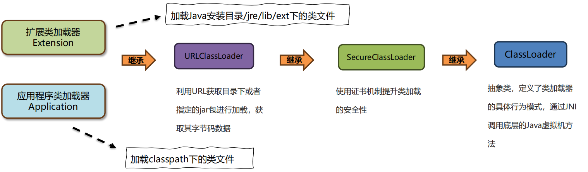
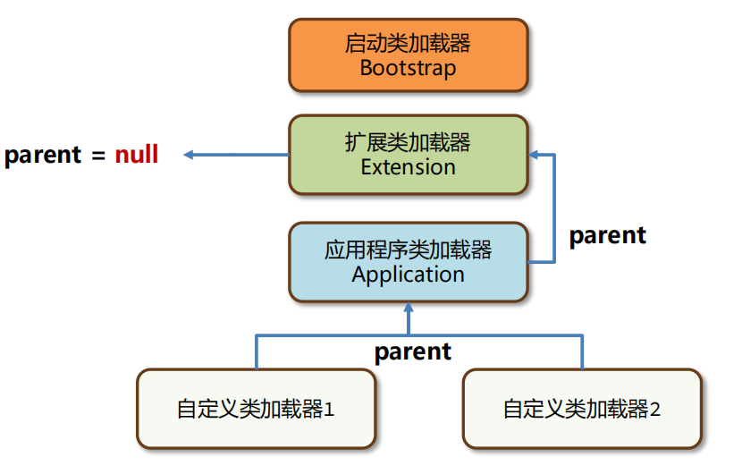
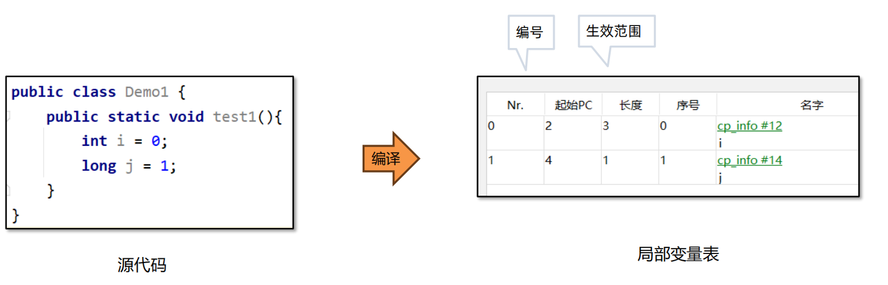
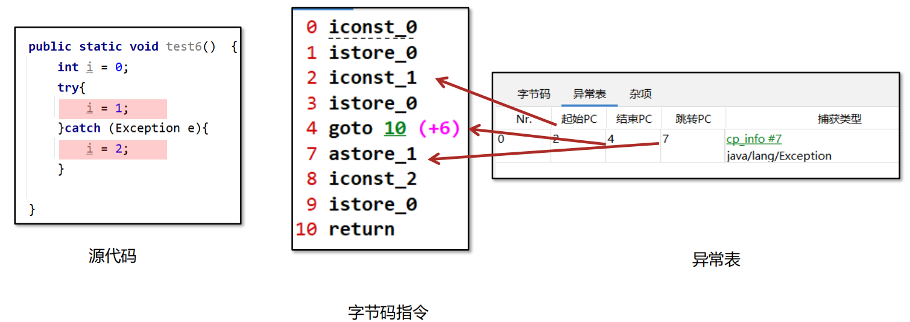
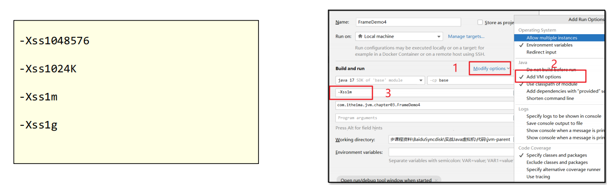
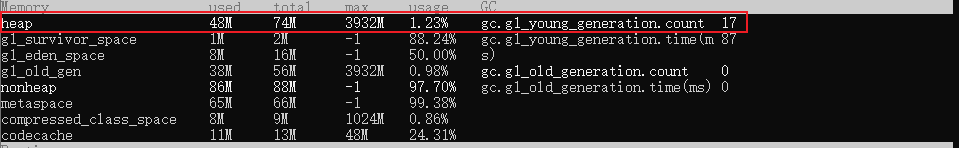
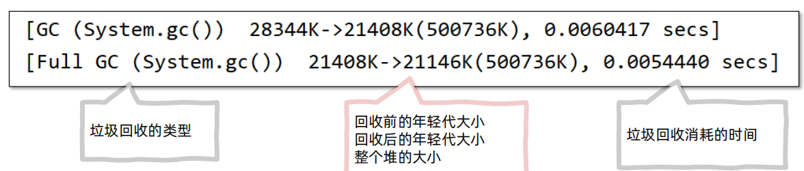
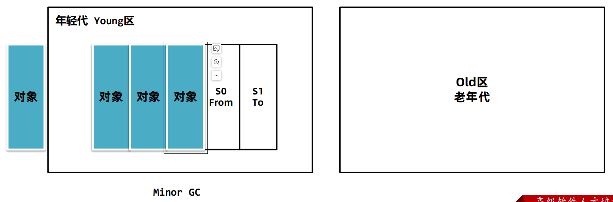
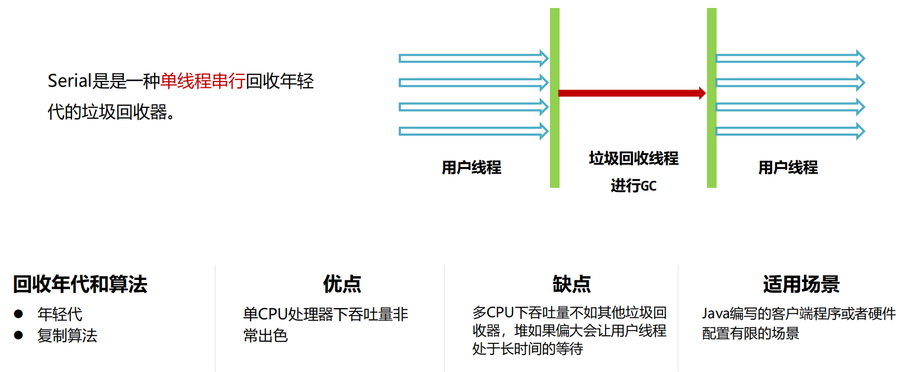
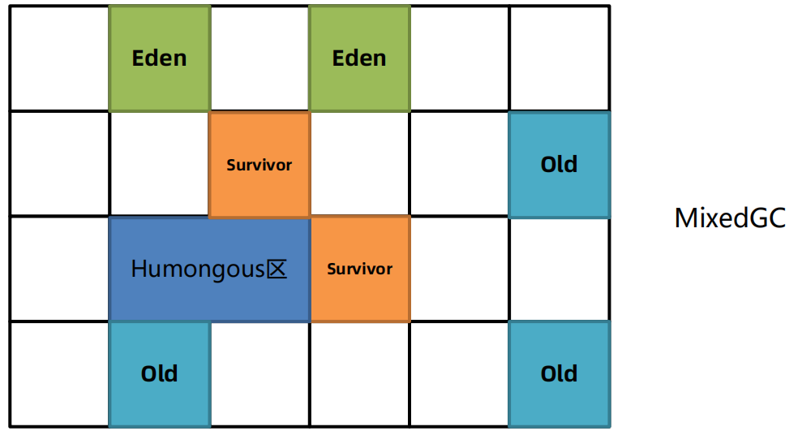

# JVM 自我学习总结

## 一. 基础篇

### 1.1 什么是 JVM ?

<span style="color:red">JVM</span> 全程是 Java Virtual Machine, 中文译名 <span style="color:red">JAVA虚拟机</span>

### 1.2 JVM 本质 是什么？

<span style="color:red">JVM </span> 本质是一个运行在计算机上的程序，职责是运行 <span style="color:red">Java字节码文件</span>。并且将字节码解释为机器码，这样实现了跨平台的优势。


### 1.3 JVM 的三大功能是什么？

**一张图片告诉你：**


其中 <span style="color:red">即时编译</span> 功能重要且强大。

- 如果不做任何的优化，java性能，不如直接运行<span style="color:red">机器码</span>的C，C++。此类语言不需要实时编译，同时跨平台性就不如java。
  
  
  
- <span style="color:red">即时编译（JIT）就是解决运行速度慢的问题</span>
  将热点代码进行**解释**并且**优化**，并且**存入内存**中，下次执行的时候直接进行调用。
  
  

### 1.4 常见的 JVM 


- 《Java虚拟机规范》是对虚拟机设计的要求，而不是对Java设计的要求，也就是说虚拟机可以运行在其他的语言比如Groovy、Scala生成的class字节码文件之上。
- 官网地址：https://docs.oracle.com/javase/specs/index.html

### 1.5  JVM 的组成


**运行时数据区域：**

- **方法区（Method Area）**：存储类的结构信息、**类的静态变量(static修饰的)**、**常量池**等。
- **堆（Heap）**：存放**对象实例**。
- **Java栈（Java Stack）**：每个**线程私有**，**存放方法调用**、**局部变量**, **方法参数**，**对象引用**(指向堆中实际对象的引用而不是对象本身)。
- **程序计数器（Program Counter Register，PC Register）**：每个线程私有，存放当前线程正在执行的字节码指令地址。

**类加载子系统：**

- **类加载器（Class Loader）：**
  - 类加载器负责加载类文件（`.class`文件），将类的字节码数据加载到内存中，并转换成运行时的Java类。
  - JVM提供了三种内建的类加载器：启动类加载器（Bootstrap Class Loader）、扩展类加载器（Extension Class Loader）、应用程序类加载器（Application Class Loader）。
    

**执行引擎：**

- **即时编译器（Just-In-Time Compiler，JIT Compiler）**：
  - JIT编译器将**热点代码**（经常执行的部分代码）**从字节码编译成本地机器码**，以提高执行效率（存储在内存中）。
  - JIT编译器不仅仅是将热点代码进行编译，还包括优化阶段，如方法内联、循环展开、死代码消除等。显著提高代码执行效率，减少内存分配和垃圾回收负担。
- **垃圾回收器（Garbage Collector，GC）**：
  - 垃圾回收器负责管理和回收堆内存中不再使用的对象，防止内存泄漏。
  - JVM中的垃圾回收器有多种实现，如串行回收器、并行回收器、并发回收器等，各自适用于不同的应用场景和性能需求。
    

**本地接口（Native Interface，JNI）**

JNI(Java Nvative Interface)是Java平台的一部分，它允许Java代码**调用**使用**其他编程语言（如C、C++）编写**的**本地方法**。在Java中，通常情况下，所有的代码都是运行在虚拟机中的，**但有时候需要与底层系统进行交互**，比如访问硬件、操作系统特定功能或调用已有的本机库。()

- **主要的用途包括：**
  - 提供Java代码访问底层资源和操作系统API的能力。
  - 与现有的本地库进行集成，以便在Java中使用底层的功能和性能。

在实现时，JNI使用了一些标准的C接口和约定，例如`JNIEnv`结构体，该结构体包含了一系列函数指针，允许Java代码调用本地C或C++函数。开发人员需要编写JNI本地方法实现，并在Java代码中使用`native`关键字声明本地方法，然后通过JNI机制将Java中的调用映射到本地实现。

说白了此接口就是调用**本地方法**的。
例子：

``` java
import java.io.*
FileInputStream()
FileOutputStream()
    
import java.lang.Thred
Thread.start()
Thread.sleep()
Thread.interrupt()
    
System.getCurrentTimeMillis()
底层：public static native long currentTimeMillis();
```


**本地方法库（Native Method Library）**

本地方法库是一组动态链接库（DLL或SO文件），它包含了由C、C++或其他本地语言编写的函数。这些库通常提供了对操作系统或硬件的底层访问，例如文件操作、网络通信、图形界面等。Java程序通过JNI接口调用这些本地方法库来实现与本地系统的交互。
在Java类中，本地方法（native methods）是用 `native` 关键字声明的方法，这些方法的实现不在Java虚拟机（JVM）中，而是由本地代码提供。

在Java中，本地方法库的加载和使用可以通过系统属性（如`java.library.path`）来指定其路径，或者在运行时通过`System.loadLibrary()`方法加载特定的本地库。


### 1.6 字节码文件详解(常见字节码工具)

1. **安装打开字节码文件的软件** 
   **① 字节码插件 Jclasslib** 

   [Jclasslib]: https://github.com/ingokegel/jclasslib	"字节码插件下载地址"

   打开后如下图所示：
   

   **ideal下载jclasslib插件**
   
   使用方法：
   
   
   **② 适合在服务器上查看字节码为文件内容 指令 <span style="color:red"> javap -v</span> **
   指令：javap -v document.class
   
   ``` linux
   // 将内容保存在指令的文件夹目录中
   javap -v ConstantPoolTest.class > ./ConstantPollTest
   ```
   
   **③ Arthus** 
   **官网：<a href =  "https://arthas.aliyun.com/">点击跳转官网</a>**
   
   启动代码：<span style="color:pink">java -jar arthas-boot.jar</span>
   基本操作：
   
   - Dashborad：查看当前进程信息
     
   - Thread 查看线程指令
     \|
   - jad：将当前正在运行的进程进行反编译
     
   - dump：获取正在运行进程的字节码文件
     
     最终生成的文件：
     
   
   **<a href="https://arthas.aliyun.com/doc/commands.html">获取指令更多请点击</a>**
   
2. <span style="color:red">四大基本属性</span>

   - **基础信息**
     
     
     对应关系：
     
     
     
     **魔数**相关解释：
     
     **版本号**计算方法：
     
   - **常量池**
     
     常量池作用：
     
   -  **字段**
     
   - **方法**
     
     转变后的字节码指令
     
   - **属性**
     

3. 通过上面所学解决一个面试题
   

   解决方法：通过方法的字节码指令进行查看
   

   

   **注意**：计算提供的值是从**操作数栈**中提取，计算的结果也会保存到**操作数栈**中，然后再加载到**局部变量表**中。++操作是自加所以是在**局部变量表**上进行的。
   
   所以上述的执行过程可以分为：
   
   - int i = 0
     - 第一步：先将0加入到**操作数栈**
     - 第二步：将**操作数栈**中结果0存入到**局部变量表**1号位置(0号位置存储了args,此时局部变量表中i=0)
   - i = i++
     - 第三步：先将先从**局部变量表**中取出i的值0存入到**操作数栈**中(局部变量表中i=0)
     - 第四步：将**局部变量表**上对i进行++操作(此时局部变量表中i=1)
     - 第五步：将操作数栈中的结果0存入到局部变量表中(此时局部变量表中i=0)
   
   **注意：如果 i++ 变成 ++i 则第三步和第四步交换，所以结果为1**(<span style="color:red">因为++操作是在局部变量表上进行操作的</span>)
   
   最终结果：
   
   
   

### 1.7 类的生命周期

类的四个生命周期


#### 1.7.1 生命周期一：加载阶段

- 加载(Loading)阶段第一步是**类加载器**根据类的全限定名通过不同的渠道以二进制流的方式获取字节码信息。**程序员可以使用Java代码拓展的不同的渠道**。
  

- 类加载器在加载完类之后，Java虚拟机会将字节码中的信息保存到**内存的方法区**中。

  <span style="color:red">其中有两个重点:</span>

  **① 加载完成后会生成一个 InstanceKclass 对象，保存所有类的信息, 里面还包含实现特定功能比如多态的信息。**
  

  **② 同时，Java虚拟机还会在堆中生成一份与方法区中数据类似的<span style="color:red">java.lang.Class</span>对象。**

  **作用是在Java代码中去获取类的信息以及存储静态字段的数据（JDK8及之后）。**

  

  <span style="color:red">好处：</span>对于开发者来说，只需要**访问堆**中的Class对象而**不需要访问方法区**中所有信息。

  这样Java虚拟机就能很好地控制开发者访问数据的范围。

- 进行验证推荐使用 JDK自带的hsdb工具查看Java虚拟机内存信息。工具位于JDK安装目录下lib文件夹中的sa-jdi.jar中。启动命令：java -cp sa-jdi.jar sun.jvm.hotspot.HSDB
  **使用方法：**

  1. **jps** 查询当前进程的 ID 号，启动后输入当前进程的 ID 号进行连接。
  2. 进入 Tool 里面的 Object Historam 进行查看 推内存。

  查询结果：
  

#### 1.7.2 生命周期二：连接阶段

**主要分为三个阶段：**

- <span style="color:pink">**连接验证阶段**</span>

  1. 文件格式验证，比如文件是否以0xCAFEBABE(魔术)开头，主次**版本号**是否满足当前Java虚拟机版本要求。
  2. 元信息验证，例如类必须有父类(super不能为空)。
  3. 验证程序执行指令的语句，比如方法内的指令执行到一半强行跳转到其他方法中去。
  4. 符号引用验证，例如是否访问了其他类中private的方法等。

  **实例之进行版本的验证：**
  

- <span style="color:pink">连接准备阶段</span>
  <span style="color:red">注意：本章涉及到的内存结构只讨论JDK8及之后的版本，8之前的版本后续章节详述。</span>

  1. 准备阶段为静态变量(static)**分配内存**并设置**初始值**（jdk8之前为方法区域)
     
     **常见的初始值类型：**
     
  2. **final修饰**的基本数据类型的静态变量，准备阶段直接会将代码中的值进行赋值。

- <span style="color:pink">连接解析阶段
  </span>

  1. 解析阶段主要是将常量池中的符号引用替换为直接引用。
  2. 直接引用不在使用编号，而是使用内存中地址进行访问具体的数据。
     

#### 1.7.3 生命周期三：初始化阶段

- <span style="color:pink">执行静态代码块中的代码</span>，并且<span style="color:pink">为静态变量赋值</span>
  **前提须知：非Final修饰的静态变量是存在堆区，并且有默认值**
  
  那么如何将其赋值为 1 呢？

  **EX:**
  
  <span style="color:red">执行流程：</span>

  1. 静态变量执行流程
     第一步：将常量1放入操作数栈
     
     第二步：将操作数栈中的值放入静态变量Value中
     
  2. 静态代码块的执行流程是一样的
  3. **将上面的顺序进行调换，相应的字节码执行顺序也会进行调换**
     

- <span style="color:pink">初始化阶段会执行字节码文件中**clinit**部分的字节码指令。</span>
  

- <span style="color:pink">导致类生命周期初始化的几种情况</span>
  **可以添加JVM参数：-XX:+TraceClassLoading：打印出架子啊并初始化的类，并验证下面结论**

  1. 访问一个类的**静态变量**或者**静态方法**，注意变量是final修饰的并且等号右边是常量不会触发初始化。

     第一种情况：**使用final修饰，不会进行初始化**

     代码：
     
     运行结果：**不进行初始化，即不运行 static 代码匡中的代码**
     

     第二种情况：**静态变量不使用final进行修饰，会进行初始化**

     代码：省略，就是将 static final -> static
     

  2. 调用Class.forName(String className)。注意：forName 可以设置 initiate = false 参数

     代码：
     
     结果：
     

  3. new一个该类的对象时。(注意这里的执行顺序)
     代码：
     

     结果：
     

  4. 执行当前类的main方法。
     例子3已经进行演示了

  5. **初始化子类**会触发**父类初始化**
  
- <span style="color:pink">类声明周期不初始化的几种情况</span>

  1. 无静态代码块且无静态变量赋值语句。
  2. 有静态变量的声明，但是没有赋值语句。
  3. 静态变量的定义使用final关键字，这类变量会在准备阶段直接进行初始化。
     
  4. 直接访问父类静态变量，不初始化子类

- <span style="color:pink">相关习题</span>

  1. 面试题一
     
     
     **静态代码块是初始化执行最先执行，非静态代码块和构造器是实例化执行且非静态代码块限制性**
     
     **总结**：静态代码块 > 非静态代码块 > 构造器
     
  2. 面试题二
  
     父类静态代码先执行，子类静态代码块后执行。
     
     如果把new B02去掉，直接访问父类静态变量，不初始化子类
     

  3.  案例一：数组创建不会导致数组元素类进行初始化
     
  
  4. final修饰的静态变量如果赋值的内容需要执行指令才能得出结果，会执行clinit方法进行初始化。
     

1. <span style="color:yellow">总结</span>
   

### 1.8 类加载器

1. <span style="color:yellow">什么是类加载器？</span>
   **类加载器(ClassLoader)是JAVA虚拟机提供给应用程序去实现获取 "类" 和 "接口字节码数据" 的技术**
   **类加载器只参与加载过程中的 字节码获取 并加载到内存 这一部分**

2. <span style="color:yellow">能干什么？</span>
   

3. <span style="color:yellow">类加载器的分类</span>

   - 虚拟机底层实现(C++)

     1. **BootstrapClassLoader(启动类加载器)**：加载Java中最核心的类

   - Java代码中实现

     1. **Extension(扩展类加载器)**：允许扩展Java中比较通用的类
     2. **Application(应用类加载器)**：加载应用使用的类

     <span style="color:red">注意</span>:

     1. **扩展类加载器**和**应用类加载器**都是**JDK**中提供的、使用Java编写的类加载器。

        - 扩展类加载器（Extension Class Loader）是JDK中提供的、使用Java编写的类加载器。

        - 默认加载Java安装目录/jre/lib/ext下的类文件。

        - 通过扩展类加载器去加载用户jar包的两种方式：
          ① 放入/jre/lib/ext下进行扩展
          ② **使用参数进行扩展(推荐使用)**

          使用-Djava.ext.dirs=jar包目录 进行扩展,这种方式会覆盖掉原始目录，可以用;(windows):(macos/linux)追加上原始目录。

     2. 扩展类加载器和应用类加载器的源码都位于sun.misc.Launcher中，是一个静态内部类。继承自URLClassLoader。具备通过目录或者指定jar包将字节码文件加载到内存中。

     

   **Arthus查看类的加载器：**
   

4. <span style="color:yellow">类加载器的双亲委派机制</span>

   **前提须知：**

   - 每个Java实现的类加载器中保存了一个成员变量叫“父”（Parent）类加载器，可以理解为它的上级，并不是继承关系。
     

   - 应用程序类加载器 的parent父类加载器是 扩展类加载器，而扩展类加载器的parent是空。

   -  启动类加载器使用C++编写，没有上级类加载器。

   - Arthus: clasLoader -t 查看继承关系
     

     

   <span style="color:red">**是什么？** ========================== 重点 ==============================</span>

   <span style="color:red">双亲委派机制指的是：自底向上查找是否加载过，再由顶向下进行加载。</span>

   

   **EX:**

   - 第一步：自底向上查找是否加载过
     
   - 第二步：找到顶端都没加载过：
     
   - 第三步：逐步向下加载
     
   - 第四步：重新自顶向上查找
     

   <span style="color:red">**解决什么问题？** ========================== 重点 ==============================</span>
   解决的三个问题：
   |

   <span style="color:red">**有什么用？** ========================== 重点 ==============================</span>

   1. **保证类加载的安全性**：
      通过双亲委派机制，让顶层的类加载器去加载核心类，避免恶意代码替换JDK中的核心类库，比如java.lang.String，确保核心类库的完整性和安全性。

   2. **避免重复加载**：

      双亲委派机制可以避免同一个类被多次加载，上层的类加载器如果加载过类，就会直接返回该类，避免重复加载。

5. <span style="color:yellow">打破双亲委派机制的三种方法
   </span>
   

   - <span style="color:red">方法一：自定义类加载器
     </span>

     **TOMCAT实例：**
     ①  一个Tomcat程序中是可以运行多个Web应用的，如果这两个应用中出现了相同限定名的类，比如Servlet类，

     Tomcat要保证这两个类都能加载并且它们应该是不同的类。

     ② 如果不打破双亲委派机制，当应用类加载器加载Web应用1中的MyServlet之后，Web应用2中相同限定名的

     MyServlet类就无法被加载了。
     

     <span style="color:red">解决方案：
     </span>

     Tomcat使用了自定义类加载器来实现应用之间类的隔离。

     每一个应用会有一个独立的类加载器加载对应的类。
     
     
      **源码分析：**
     
      ① 先来分析ClassLoader的原理，ClassLoader中包含了4个核心方法。
     
      ② 双亲委派机制的核心代码就位于loadClass方法中。
      
      ③ 阅读核心代码分析通过自定义类加载器打破双亲委派机制，打破双亲委派机制的核心就是将下边这一段代码重新实现。
     
      ``` java
      //parent等于null说明父类加载器是启动类加载器，直接调用findBootstrapClassOrNull
      //否则调用父类加载器的加载方法
      if (parent != null) {
       c = parent.loadClass(name, false);
       } else {
       c = findBootstrapClassOrNull(name);
       }
      //父类加载器爱莫能助，我来加载！
      if (c == null) 
       c = findClass(name);
      ```
     
      **自定义类加载器的父类：**
      自定义类加载器的父类是 "Application(应用程序类加载器)"
      
     
     **两个疑问：**
     
      - ① 自定义类加载器的父类为什么是AppClassLoader呢？
        
     
      - ② 两个自定义类加载器加载相同限定名的类，不会冲突么？
     
        **不会冲突**，在同一个Java虚拟机中，只有**相同类加载器+相同的类限定名**才会被认为是同一个类。
     
         在Arthas中使用sc –d 类名的方式查看具体的情况。
     
      **怎么实现一个自定义类加载**
      正确的去实现一个自定义类加载器的方式是重写**findClass**方法，这样**不会破坏双亲委派机制**。
      

   - <span style="color:red">方法二：JDBC案例
     </span>

     **为什么说JDBC打破了双亲委派机制？**

     ① JDBC中使用了DriverManager来管理项目中引入的不同数据库的驱动，比如mysql驱动、oracle驱动。

     ② DriverManager类位于rt.jar包中，由启动类加载器加载。

     
     ③ 依赖中的mysql驱动对应的类，由应用程序类加载器来加载。
     

     ④ DriverManager属于rt.jar是启动类加载器加载的。而用户jar包中的驱动需要由应用类加载器加载，这就违反

     了双亲委派机制。(**即DriverManager委派了Application(应用程序类加载器进行masql等驱动加载**)
     

 **DriverManager怎么直到jar包中要加载的的驱动在哪儿？** 

 DriverManage使用SPI机制，最终加载jar包中对应的驱动类
 

 **那么SPI中是如何获取到应用程序类加载器的?**
 SPI中使用了线程上下文中保存的类加载器进行类的加载，这个类加载器一般是应用程序类加载器。
 

 **总结：**
 

 **JDBC真的打破了双亲委派机制了么？**
 

   - <span style="color:red">方法三：OSGi模块化</span>
     ① 历史上，OSGi模块化框架。它存在同级之间的类加载器的委托加载。OSGi还使用类加载器实现了热部署的

     功能。
     ② 热部署指的是在服务不停止的情况下，动态地更新字节码文件到内存中。
     

     **案例：**
     

     注意事项：

     1. 程序重启之后，字节码文件会恢复，除非将class文件放入jar包中进行更新。
     2. 使用retransform不能添加方法或者字段，也不能更新正在执行中的方法。

6. <span style="color:yellow">jdk9及其之后的类加载器变化
   </span>
   由于JDK9引入了module的概念，类加载器在设计上发生了很多变化。

   1. 启动类加载器使用Java编写，位于jdk.internal.loader.ClassLoaders类中。

      Java中的BootClassLoader继承自BuiltinClassLoader实现从模块中找到要加载的字节码资源文件。

      **启动类加载器依然无法通过java代码获取到，返回的仍然是null，保持了统一。**
      

   2. 扩展类加载器被替换成了**平台类加载器**（Platform Class Loader）。
      平台类加载器遵循**模块化加载方式加载字节码文件**，所以继承关系从URLClassLoader变成了BuiltinClassLoader,BuiltinClassLoader**实现了从模块中加载字节码文件**。
      **平台类加载器的存在更多的是为了与老版本的设计方案兼容，自身没有特殊的逻辑。**
      

7. <span style="color:yellow">最后总结：</span>

   1、类加载器的作用是什么？

   类加载器（ClassLoader）负责在类加载过程中的**字节码获取并加载到内存**这

   一部分。通过加载字节码数据放入内存转换成byte[]，接下来调用虚拟机底层

   方法将byte[]转换成方法区和堆中的数据。
   

2、有几种常见的类加载器？
   1.启动类加载器（Bootstrap ClassLoader）加载核心类

2.扩展类加载器（Extension ClassLoader）加载扩展类

3.应用程序类加载器（Application ClassLoader）加载应用classpath中的类

4.自定义类加载器，重写findClass方法。

JDK9及之后扩展类加载器（Extension ClassLoader）变成了平台类加载器（Platform 

ClassLoader）
   

3、什么是双亲委派机制？

每个Java实现的类加载器中保存了一个成员变量叫“父”（Parent）类加载器。

**自底向上查找是否加载过，再由顶向下进行加载。避免了核心类被应用程序重**

**写并覆盖的问题，提升了安全性。**
   

4、怎么打破双亲委派机制？
   1、自定义类加载器，重写loadClass方法，不再实现双亲委派机制。

2、JNDI、JDBC、JCE、JAXB和JBI等框架使用了SPI机制+线程上下文类加载器。

3、OSGi实现了一整套类加载机制，允许同级类加载器之间互相调用。

### 1.9 java内存区域(运行数据区域)


**java内存区域是什么？**

Java虚拟机（JVM）的内存区域是Java程序在运行过程中所使用的内存空间的逻辑划分，主要包括以下几个部分：

1. **程序计数器（Program Counter Register）：** 是一块较小的内存空间，是线程**私有**的，用于指示当前线程执行的字节码指令的地址。在多线程环境下，每个线程都有一个独立的程序计数器，以保证线程切换时能够恢复到正确的执行位置。
2. **Java虚拟机栈（Java Virtual Machine Stack）：** 也是线程**私有**的，每个线程在创建时都会分配一个Java虚拟机栈。每个方法的执行都会对应一个栈帧（Stack Frame），栈帧中保存了方法的**局部变量表**、**操作数栈**、动态链接、方法出口等信息。栈帧在方法调用和返回时入栈和出栈。
3. **本地方法栈（Native Method Stack）：** 类似于Java虚拟机栈，但是用于执行本地（Native）方法的部分。
4. **Java堆（Java Heap）：** 是Java虚拟机管理的最大的一块内存空间，用于存放对象实例。在Java程序运行时，所有的对象实例都在堆上分配内存。堆是所有**线程共享**的一块内存区域，在堆中分配的内存可以由垃圾回收器进行管理。
5. **方法区（Method Area）：** 也叫永久代（Permanent Generation），用于**存储类信息**、**常量**、**静态变量**、**即时编译器编译后的代码等数据**。在Java 8之后，永久代被元空间（Metaspace）取代，元空间不再属于堆的一部分，而是直接在本地内存中分配。
6. **运行时常量池（Runtime Constant Pool）：** 是方法区的一部分，用于存放编译期生成的字面量和符号引用，在运行期间可以动态添加新的常量。
7. **直接内存（Direct Memory）：** 不是Java虚拟机内部的一部分，但是与Java NIO相关的一部分，通过ByteBuffer进行操作。直接内存使用的是操作系统的本地内存，通过堆外内存来操作，可以提高IO效率。|

简要结构：


**我们要掌握什么？**


#### 1.9.1 程序计数器

**是什么？**

程序计数器（**Program Counter Register**）也叫**PC**寄存器，每个线程会通过程序计数器记录当前要执行的的字

节码指令的地址。

**有什么用？**


- ① 在代码执行过程中，程序计数器会记录下一行字节码指令的地址。执行完当前指令之后，虚拟机的执行引擎根据程序计数器执行下一行指令。
- ② 程序计数器可以控制程序指令的进行，实现分支、跳转、异常等逻辑。
- ③ 在多线程执行情况下，**Java**虚拟机需要通过程序计数器记录**CPU**切换前解释执行到那一句指令并继续解释运行。
  

**具体实例：程序计数器实现分支跳转**


- 流程一：声明局部变量的时候，**当前位置为0，程序计数器记录了下一次位置为1**

  

- 流程二：最终结果
  


**问题：程序计数器在运行过程中会出现内存溢出么？**

⚫ 内存溢出指的是程序在使用某一块内存区域时，存放的数据需要占用的内存

大小超过了虚拟机能提供的内存上限。

⚫ 因为每个线程只存储一个固定长度的内存地址，程序计数器是不会发生内存

溢出的。

⚫ 程序员无需对程序计数器做任何处理。

#### 1.9.2 java虚拟机栈

**是什么？**

**Java**虚拟机栈（**Java Virtual Machine Stack**）采用栈的数据结构来管理方法调用中的基本数据，先

进后出（**First In Last Out**）**,**每一个方法的调用使用一个栈帧（**Stack Frame**）来保存。


**通过IdealDebug查看虚拟机栈里面的内容：**结果会按照栈的结构顺序执行 sleep -> study -> main

**Java虚拟机栈随着线程的创建而创建，而回收则会在线程的销毁时进行。由于方法可能会在不同线**

**程中执行，每个线程都会包含一个自己的虚拟机栈。**


**java虚拟机栈帧的组成**


- **① 局部变量表**：局部变量表的作用是在方法执行过程中存放所有的局部变量。编译成字节码文件时就可以确定局部变

  量表的内容。

  通过Jclasslib进行查看：
  

  例子：

  1. 局部变量表的作用是在方法执行过程中存放所有的局部变量。编译成字节码文件时就可以确定局部变

     量表的内容。
     

  2. 局部变量表的作用是在方法执行过程中存放所有的局部变量。编译成字节码文件时就可以确定局部变

     量表的内容。
     

  3. 栈帧中的局部变量表是一个数组，数组中每一个位置称之为槽(slot) ，long和double类型占用两个槽，其

     他类型占用一个槽。
     

  4. 方法参数也会保存在局部变量表中，其顺序与方法中参数定义的顺序一致。

     局部变量表保存的内容有：实例方法的this对象，方法的参数，方法体中声明的局部变量。

     

  5. **局部变量保重的槽可以重复用，一旦某个局部变量不在生效，当前槽就可以被猜词使用。**

     例子：请问下面局部变量表的最大槽深度？
     
     执行过程：
     ① 实例先加入this、k、m
     
     ② 执行第一个代码块，加入 a、b

     
     ③ 执行第二个代码块，**此时第一个代码块中的a、b已经失效**，重新利用失效的槽
     

     ④ 同理，**第二个代码块失效可被覆盖**
     

     ⑤ 最终结果：加入 i(占一个位置), j(占两个位置)
     

- **② 操作数栈**

  ⚫ 操作数栈是栈帧中虚拟机在执行指令过程中用来存放中间数据的一块区域。他是一种栈式的数据结构，如

  果一条指令将一个值压入操作数栈，则后面的指令可以弹出并使用该值。

  ⚫ 在**编译期**就可以确定操作数栈的最大深度，从而在执行时正确的分配内存大小。

  例子：

  

  

- **帧数据**

  1. 动态连接

     **当前类的字节码指令引用了其他类的属性或者方法时，需要将符号引用（编号）转换成对应的运行时常量池**

     **中的内存地址。动态链接就保存了编号到运行时常量池的内存地址的映射关系。**
     

  2. 方法出口
     **异常表存放的是代码中异常的处理信息，包含了异常捕获的生效范围以及异常发生后跳转到的字节码指令位置。**
     

  3. 异常表的引用
     **异常表存放的是代码中异常的处理信息，包含了异常捕获的生效范围以及异常发生后跳转到的字节码指令位置。**
     

**虚拟机栈的大小**

⚫ **要修改Java虚拟机栈的大小，可以使用虚拟机参数 -Xss** 。

⚫ 语法：-Xss栈大小

⚫ 单位：字节（默认，必须是 1024 的倍数）、k或者K(KB)、m或者M(MB)、g或者G(GB)



**与-Xss类似，也可以使用 -XX:ThreadStackSize 调整标志来配置堆栈大小。**

**格式为： -XX:ThreadStackSize=1024**

**一般情况下，工作中即便使用了递归进行操作，栈的深度最多也只能到几百,不会出现栈的溢出。所以此参数**

**可以手动指定为-Xss256k节省内存。**


#### 1.9.3 本地方法栈

- **java虚拟机栈**存储了Java方法调用时的栈帧，而本地方法栈存储的是**native本地方法**的栈帧。

- 在Hotspot虚拟机中，<span style="color:red">Java虚拟机栈和本地方法栈实现上使用了同一个栈空间</span>。本地方法栈会在栈内

  存上生成一个栈帧，临时保存方法的参数同时方便出现异常时也把本地方法的栈信息打印出来。


#### 1.9.4 堆(线程共享的)

- 一般Java程序中 **堆内存**是空间最大的一块内存区域。**创建(new)出来的对象** 都存在于堆上。
- 栈上的 **局部变量表** 中，可以存放堆上对象的引用。**静态变量** 也可以存放堆对象的引用，通过静态变量就可以实现对象在 **线程之间共享**。


**模拟堆内存溢出**
因为创建出来的对象都存在堆上，所以当一直new对象并保存就会堆溢出。

**arthas查看堆内存相关功能**

dashboard -i 刷新频率(毫秒)：查看堆内存大小以及当前堆内存占用情况


**JAVA堆**

- 随着堆中对象增多，当total可以使用的内存即将不足是，java虚拟机会继续分配内存给堆。
  

- 如果堆内存不足，java虚拟机就会不断的分配内存，total值会变大。total最多只能与max相等。
  

- 如果不设置任何的虚拟机参数，max默认是系统内存的1/4，total默认是系统内存的1/64。<span style="color:red">在实际生产过程中一般都需要设置total和max的值</span>

  Oracal官方文档：https://docs.oracle.com/javase/8/docs/technotes/tools/unix/java.html

**设置堆内存大小**

- **要修改堆的大小，可以使用虚拟机参数 –Xmx（max最大值）和-Xms (初始的total)**。
- 语法：-Xmx值 -Xms值
- 单位：字节（默认，必须是 1024 的倍数）、k或者K(KB)、m或者M(MB)、g或者G(GB)
- 限制：Xmx必须大于 2 MB，Xms必须大于1MB

问题：为什么arthas中显示的heap堆大小与设置的值不一样呢？

回答：arthas中的heap堆内存使用了JMX技术中内存获取方式，这种方式与垃圾回收器有关，计算的是**可以分配对象的内存**，而不是整个内存。


**怎么设置最优？**

-  Java服务端程序开发时，<span style="color:red">建议将-Xmx和-Xms设置为相同的值</span>，这样在程序启动之后可使用的总内存就是最大内存，而无需向java虚拟机再次申请，减少了申请并分配内存时间上的开销，同时也不会出现内存过剩之后堆收缩的情况。
- -Xmx具体设置的值与实际的应用程序运行环境有关，在《实战篇》中会给出设置方案。


#### 1.9.5 方法区(线程共享)

**方法区是存放基础信息的位置、线程共享、主要包含三部分内容：**


- **方法区是用来存储每个类的基本信息（元信息），一般称之为**InstanceKlass对象。**在类的加载阶段完成。**
  

- **方法区除了存储类的元信息之外，还存放了运行时常量池。常量池中存放的是字节码中的常量池内容。**

  字节码文件中通过编号查表的方式找到常量，这种常量池称为**静态常量池**。当常量池加载到内存中之后，可以通

  过内存地址快速的定位到常量池中的内容，这种常量池称为**运行时常量池**。
  

- **方法区（Method Area）字符串常量池**
  字符串常量池存储在代码中定义的常量字符串内容。比如“123” 这个123就会被放入字符串常量池。

  **对象放在堆中，字符串常量放在字符串常量池中**

  **字符串常量池和运行时常量池有什么关系？**

  早期设计时，字符串常量池是属于运行时常量池的一部分，他们存储的位置也是一致的。后续做出了调整，

  将字符串常量池和运行时常量池做了拆分。
  

  例子：
  

  **练习：**

  1. **变量相加使用的是StringBuilder**
     

  2. **字符串相加使用的是直接连接**
     

  3. **Inter的使用**
     

     

  4. **运行时数据区都学完了，静态变量存储在哪里呢？**
     

     

- **方法区是《Java虚拟机规范》中设计的虚拟概念，每款Java虚拟机在实现上都各不相同。Hotspot设计如下:**

  1. **JDK7及之前的版本**将方法区存放在**堆区域中的永久代空间**，堆的大小由虚拟机参数来控制。

  2. **JDK8及之后的版本**将方法区存放在**元空间中**，元空间位于操作系统维护的**直接内存中**，默认情况下只要不

     超过操作系统承受的上限，**可以一直分配**。

  

- **arthus查看方法区**

  1. 使用memory打印出内存情况，JDK7及之前的版本查看ps_perm_gen属性。
  2. JDK8及之后的版本查看metaspace属性

  

- **实验-模拟方法区的溢出**

  通过ByteBuddy框架，动态生成字节码数据，加载到内存中。通过死循环不停地加载到方法区，观察方法区是

  否会出现内存溢出的情况。分别在JDK7和JDK8上运行上述代码。ByteBuddy框架的基本使用方法

  ByteBuddy是一个基于Java的开源库，用于生成和操作Java字节码。
  

  1. 引入依赖

  **<dependency>**

  **<groupId>net.bytebuddy</groupId>**

  **<artifactId>byte-buddy</artifactId>**

  **<version>1.12.23</version>**

  **</dependency>**

  

  2.创建ClassWriter对象

  **ClassWriter classWriter = new ClassWriter(0);**

  

  3.调用visit方法，创建字节码数据。

  **classWriter.visit(Opcodes.V1_7,Opcodes.ACC_PUBLIC,name,null ,"java/lang/Object",null);**

  **byte[] bytes = classWriter.toByteArray();**

  **结果：**
  实验发现，JDK7上运行大概十几万次，就出现了错误。在JDK8上运行百万次，程序都没有出现任何错误，但是内

  存会直线升高。这说明JDK7和JDK8在方法区的存放上，采用了不同的设计。

  **调试：**

  JDK7将方法区存放在堆区域中的**永久代空间**，堆的大小由虚拟机参数**-XX:MaxPermSize=值**来控制。

  JDK8将方法区存放在**元空间中**，元空间位于操作系统维护的直接内存中，默认情况下只要不超过操作系统承受

  的上限，可以一直分配。可以使用**-XX:MaxMetaspaceSize=值**将元空间最大大小进行限制。

#### 1.9.6 直接内存

⚫ **要创建直接内存上的数据，可以使用ByteBuffer。**

⚫ 语法： ByteBuffer directBuffer = ByteBuffer.allocateDirect(size);

⚫ 注意事项： arthas的memory命令可以查看直接内存大小，属性名direct。

​	arthas memory命令(JDK8)


⚫ 如果需要手动调整直接内存的大小，可以使用-**XX:MaxDirectMemorySize=大小**单位k或K表示千字节，m或M表示兆字节，g或G表示千兆字节。默认不设置该参数情况下，JVM 自动选择 最大分配的大小。

​	以下示例以不同的单位说明如何将 直接内存大小设置为 1024 KB：

​	-XX:MaxDirectMemorySize=1m 

​	-XX:MaxDirectMemorySize=1024k 

​	-XX:MaxDirectMemorySize=1048576

#### 1.9.7 总结

运行是数据区分为几部分，每一部分作用？

前6个小节

不同版本之间运行是数据区域区别是什么？


此时的方法区存储在**直接内存**中，默认无大小限制。


### 1.10 垃圾回收

**参考JVM组成部分**

**为什么要学习java自动垃圾回收？**


**具体垃圾回收分为以下两个部分：**

**方法区 和 堆区**


#### 1.10.1 方法区的回收

**方法区的回收机制：**
方法区回收的内容主要就是 **不再使用的类。**
判定一个类可以被 **卸载**。需要同时满足下面三个条件：

1. <span style="color:red">此类所有实例对象都已经被回收，在堆中不存在任何该类的实例对象以及子类对象。</span>
2. 加载该类的类加载器已经被回收。
3. 该类对应的 java.lang.Class 对象没有在任何地方被引用。

**手动触发回收：**

- **如果需要手动触发垃圾回收，可以调用 System.gc()方法**

- 语法：**System.gc()**

- 注意事项：

  调用System.gc()方法并不一定会立即回收垃圾，仅仅是向Java虚拟机发送一个垃圾回收的请求，具体是否需要

  执行垃圾回收Java虚拟机会自行判断。

#### 1.10.2 堆回收

##### 1. 引用计数法和可达性分析法

<span style="color:red">**如何判断堆上的对象可以回收？**</span>

**如何判断java中的对象是否能被回收，是根据对象是否被 <span style="color:red">引用</span> 来决定的。如果对象被引用了，说明该对象还在是哟个，不允许被回收。**

EX1：


EX2：


**问题1：如果要回收 A的实例对象 怎么办？**
如果要回收A的实例对象就要取出掉 **两条引用：栈上的局部变量表引用了A的实例；一个是B引用A对象的实例**

具体操作：

1. **a1 = null**
2. **b1.a = null**


**问题2：如果将a1 = null 和 b1 = null 能否进行回收呢？**
可以回收，局部变量表已经断开了，方法中已经没有办法使用引用区访问A和B对象了。


**<span style="color:red">判断对象是否被引用的两种算法：</span>**

1. **<span style="color:yellow">引用计数法</span>**

   **引用计数法会为每个对象维护一个引用计数器，当对象被引用时加1，取消引用时减1。**

   优点：实现简单，C++中的智能指针就采用了引用计数法。

   缺点：

   - 每次引用和取消引用都需要维护计数器，对系统性能会有一定的影响

   - **存在循环引用问题，所谓循环引用就是当A引用B，B同时引用A时会出现对象无法回收的问题。**

     针对下图： CounA = 1 CountB = 1 结果还是无法进行回收。

     

   **补充ideal查看垃圾回收日志：**

   语法：**-verbose:gc**
   

2. **<span style="color:yellow">可达性分析分析法(java使用的算法)</span>**

   **Java使用的是可达性分析算法**来判断对象是否可以被回收。

   可达性分析将对象分为两类：

   - 垃圾回收的根对象（GC Root）
   - 普通对象

   对象与对象之间存在引用关系，下图中A到B再到C和D，形成了一个引用链，可达性分析算法指的是**如果从某个到GC Root对象是可达的，对象就不可被回收**。
   


   **哪些对象可以被称作为 <span style="color:red">GC Root对象呢？</span>**

   1. <span style="color:red">线程Thread对象，引用线程栈帧中的方法参数、局部变量等。</span>

      EX：虚拟机栈中的局部变量表
      

      **断开以后：任何一个对象都到不了GC Root对象即 A实例对象 和 B实例对象 都可以被回收**

   2. 系统类加载器加载的java.lang.Class对象。
      

   3. 监视器对象，用来保存同步锁synchronized关键字持有的对象。
      

   4. 本地方法调用时使用的全局对象。

   **查看GC Root**
   

   **<span style="color:Red">是不是只有满足了可达性分析算法对象才能被回收呢？</span>**
   答案是否定的，可达性算法中描述的对象引用，一般指的是**强引用**，即是**GCRoot对象对普通对象有引用关系**，只要这层关系存在，普通对象就不会被回收。除了强引用之外，Java中还设计了**几种其他引用方式**，在下一小节讨论。

##### 2. 五种对象的引用

**几种常见的对象引用：**可达性算法中描述的对象引用，一般指的是强引用，即是GCRoot对象对普通对象有引用关系，只要这层关系存在，

普通对象就不会被回收。除了**强引用**之外，Java中还设计了几种其他引用方式，总共五种：

- 强引用
- 软引用
- 弱引用
- 虚引用
- 终结器引用

**① 强引用：**
上面 **可达性分析算法使用的就是强引用** 当 对象可达到 **GC-ROOT(强引用对象)**  对象就不会被回收

**② 软引用：**
软引用相对于强引用是一种比较弱的引用关系，如果一个对象只有软引用关联到它，当程序内存不足时，**无论是否可达就会将软引用中的数据进行回收**。

在JDK 1.2版之后提供了**SoftReference**类来实现软引用，软引用常用于缓存中。


软引用执行过程：

1. 将对象使用软引用包装起来，**new SoftReference<对象类型>(对象)**。
2. 内存不足时，虚拟机尝试进行垃圾回收。
3. 如果垃圾回收仍不能解决内存不足的问题，回收软引用中的对象。
4. 如果依然内存不足，抛出OutOfMemory异常。

内存不足时，软引用对象被回收那么 SoftReference包装对象 怎么被回收呢？

SoftReference提供了一套队列机制：

1、软引用创建时，通过构造器传入引用队列

2、在软引用中包含的对象被回收时，该软引用对象会被放入引用队列

3、通过代码遍历引用队列，将SoftReference的强引用删除


案例：看代码


``` java
import java.lang.ref.SoftReference;

public class SoftReferenceExample {
    public static void main(String[] args) {
        // 创建一个对象
        String str = new String("Hello, Soft Reference!");

        // 创建一个软引用，并指向该对象
        SoftReference<String> softRef = new SoftReference<>(str);

        // 将强引用置为null
        str = null;

        // 在没有内存压力的情况下，软引用仍然可以获取对象
        System.out.println("Before GC: " + softRef.get());

        // 触发垃圾回收
        System.gc();

        // 由于内存足够，软引用仍然可以获取对象
        System.out.println("After GC: " + softRef.get());

        // 模拟内存不足的情况，可能会回收软引用指向的对象
        try {
            byte[] largeArray = new byte[1024 * 1024 * 10]; // 10MB数组
        } catch (OutOfMemoryError e) {
            // 捕获内存不足错误
        }

        // 再次尝试获取对象，可能为null
        System.out.println("After memory pressure: " + softRef.get());
    }
}
```


**③ 弱引用**

弱引用的整体机制和软引用基本一致，区别在于弱引用包含的对象在垃圾回收时，**不管内存够不够都会直接被回收**。

在JDK 1.2版之后提供了**WeakReference**类来实现弱引用，弱引用主要在**ThreadLocal**中使用。

**弱引用对象本身也可以使用引用队列进行回收**。


``` java
import java.lang.ref.WeakReference;

public class WeakReferenceExample {
    public static void main(String[] args) {
        // 创建一个对象
        String str = new String("Hello, Weak Reference!");

        // 创建一个弱引用，并指向该对象
        WeakReference<String> weakRef = new WeakReference<>(str);

        // 输出弱引用所指向的对象（此时对象还未被回收）
        System.out.println("Before GC: " + weakRef.get());

        // 将强引用置为null
        str = null;

        // 触发垃圾回收
        System.gc();

        // 输出弱引用所指向的对象（在GC后，可能会被回收）
        System.out.println("After GC: " + weakRef.get());
    }
}
```

**④ 虚引用**
**⑤ 终结器引用**虚引用和终结器引用

-  这两种引用在常规开发中是不会使用的。
-  虚引用也叫幽灵引用/幻影引用，不能通过虚引用对象获取到包含的对象。虚引用唯一的用途是当对象被垃圾回收器回收时可以接收到对应的通知。Java中使用PhantomReference实现了虚引用，直接内存中为了及时知道直接内存对象不再使用，从而回收内存，使用了虚引用来实现。
- 终结器引用指的是在对象需要被回收时，终结器引用会关联对象并放置在Finalizer类中的引用队列中，在稍后由一条由FinalizerThread线程从队列中获取对象，然后执行对象的finalize方法，在对象第二次被回收时，该
- 对象才真正的被回收。在这个过程中可以在finalize方法中再将自身对象使用强引用关联上，但是不建议这样做。

#### 1.10.3 垃圾回收算法

**垃圾回收算法的分类：**


**垃圾回收算法的历史和分类：**

- 1960年John McCarthy发布了第一个GC算法：标记-清除算法。

- 1963年Marvin L. Minsky 发布了复制算法。

  本质上后续所有的垃圾回收算法，都是在上述两种算法的基础上优化而来。
  

**垃圾分类算法评判标准：**

**STW(暂停时间)：**

Java垃圾回收过程会通过**单独的GC线程**来完成，但是不管使用哪一种GC算法，都会有部分阶段**需要停止所**

**有的用户线程**。这个过程被称之为Stop The World简称STW，如果STW时间过长则会影响用户的使用。

- **最大暂停时间：**

  最大暂停时间指的是所有在垃圾回收过程中的STW时间最大值。比如如下的图中，黄色部分的STW就是最

  大暂停时间，显而易见上面的图比下面的图拥有更少的最大暂停时间。最大暂停时间越短，用户使用系统时

  受到的影响就越短。
  

- **吞吐量**

  吞吐量指的是 CPU 用于执行用户代码的时间与 CPU 总执行时间的比值，即**吞吐量 = 执行用户代码时间 /**

  **（执行用户代码时间 + GC时间）**。吞吐量数值越高，垃圾回收的效率就越高。

- **堆使用效率**

  不同垃圾回收算法，对堆内存的使用方式是不同的。比如**标记清除算法，可以使用完整的堆内存**。而**复制算**

  **法会将堆内存一分为二**，每次只能使用一半内存。从堆使用效率上来说，标记清除算法要优于复制算法。

##### 1. 标记清除算法

执行流程(总体遍历两次)：

- **标记阶段：**

  将所有存活的对象进行标记。Java中使用可达性分析算法，从**GC Root开始通过引用链遍历出**

  **所有存活对象**。

- **清除阶段：**
  清除阶段，从内存中删除没有被标记也就是非存活对象。


标记清除算法优缺点：

1. 优点：实现简单
   实现简单，只需要在第一阶段给每个对象维护标志位，第二阶段删除对象即可。

2. 缺点：碎片化问题和分配速度慢问题

   ① 碎片化问题：由于内存是连续的，所以在对象被删除之后，内存中会出现很多细小的可用内存单元。如果我们需要的是一个比较大的空间，很有可能这些内存单元的大小过小无法进行分配。
   

   ② 分配速度慢问题：由于内存碎片的存在，需要维护一个空闲链表，极有可能发生每次需要遍历到链表的最后才

   能获得合适的内存空间，同时算法实现得遍历两遍对象变量。
   

##### 2. 复制算法

执行流程：

1. 准备两块空间From空间和To空间，每次在对象分配阶段，只能使用其中一块空间（From空间）。
2. 在垃圾回收GC阶段，将From中存活对象复制到To空间。
3. 将两块空间的From和To名字互换。


复制算法的优缺点：


##### 3. 标记整理算法

标记整理算法也叫标记压缩算法，**是对标记清理算法中容易产生内存碎片问题的一种解决方案**。

核心思想分为两个阶段：

1. 标记阶段，将所有存活的对象进行标记。Java中使用可达性分析算法，从GC Root开始通过引用链遍历出

   所有存活对象。

2. 整理阶段，将存活对象移动到堆的一端。清理掉存活对象的内存空间。


表即整理算法优缺点：


##### 4. 分代GC算法(最优秀)

现代优秀的垃圾回收算法，会将上述描述的垃圾回收算法组合进行使用，其中应用最广的就是分代垃圾回收

算法(Generational GC)。

分代垃圾回收将整个内存区域划分为年轻代和老年代：


相关参数的设置：查看对应的JVM文档

**执行流程：**

分代回收时，创建出来的对象，首先会被放入**Eden伊甸园区**。

随着对象在Eden区越来越多，如果**Eden区满**，新创建的对象已经无法放入，就会触发**年轻代的GC**，称为**Minor GC**或者**Young GC**。

Minor GC会把需要eden中和From需要回收的对象回收，把没有回收的对象放入To区。

**Minor GC相当于复制算法**


接下来，S0会变成To区，S1变成From区。当eden区满时再往里放入对象，依然会发生Minor GC。

此时会回收eden区和S1(from)中的对象，并把eden和from区中剩余的对象放入S0。

注意：每次Minor GC中都会为对象记录他的年龄，初始值为0，每次GC完加1。


如果Minor GC后对象的年龄达到阈值（最大15，默认值和垃圾回收器有关），对象就会被晋升至老年代。

当老年代中空间不足，无法放入新的对象时，先尝试minor gc如果还是不足，就会触发**Full GC**，Full GC会对整个堆进行垃圾回收。

如果Full GC依然无法回收掉老年代的对象，那么当对象继续放入老年代时，就会抛出Out Of Memory异常。


答案：
**前提了解：**

- 系统中的大部分对象，都是创建出来之后很快就不再使用可以被回收，比如用户获取订单数据，订单数据返回给用户之后就可以释放了。
- 老年代中会存放长期存活的对象，比如Spring的大部分bean对象，在程序启动之后就不会被回收了。
- 在虚拟机的默认设置中，新生代大小要远小于老年代的大小。

**主要原因有：**

1. 可以通过调整年轻代和老年代的比例来适应不同类型的应用程序，提高内存的利用率和性能。
2. **新生代和老年代使用不同的垃圾回收算法**，新生代一般选择复制算法，老年代可以选择标记-清除和标记-整理算法，由程序员来选择灵活度较高。
   
3. **分代的设计中优先只回收新生代（minor gc），如果能满足对象分配的要求就不需要对整个堆进行回收(full gc),STW时间就会减少。**

<span style="color:yellow">注意:
</span>  **Java回收器：不仅会回收新生代(主要), 而且还设置了老年代对应的回收器械。**

#### 1.10.4 垃圾回收器

**什么是垃圾回器？**
垃圾回收器，是垃圾回收算法的具体是实现。

由于垃圾回收器分为年轻代和老年代，除了**G1**之外其他垃圾回收器必须成对组合进行使用。

具体的关系图如下：


##### 1. 组合一：Serial 垃圾回收器

- <span style="color:yellow">**Serrial年轻代垃圾回收器**</span>
  Serial垃圾回收器是 **一种单线程串行** 回收**年轻代**的垃圾回收器。

  

- <span style="color:yellow">**老年代-SerialOld垃圾回收器**</span>
  Serial垃圾回收器是 **一种单线程串行** 回收**年轻代**的垃圾回收器。

  

##### 2. 组合二：ParNew年轻代 + CMS老年代

- <span style="color:yellow">**ParNew年轻代**</span>
  

- **<span style="color:yellow">老年代- CMS(Concurrent Mark Sweep)垃圾回收器</span>"**

  CMS垃圾回收器关注的是系统的<span style="color:red">**暂停时间**</span>，允许用户线程和垃圾回收线程在某些步骤中同时执行，减少了用户线程的等待时间.
  

  **执行步骤：**

  1. 初始标记，用极短的时间标记出GC Roots能直接关联到的对象。
  2. 并发标记, 标记所有的对象，用户线程不需要暂停。
  3. 重新标记，由于并发标记阶段有些对象会发生了变化，存在错标、漏标等情况，需要重新标记。
  4. 并发清理，清理死亡的对象，用户线程不需要暂停。

  

  

  **CMS老年代垃圾回收器存在的问题：**

  1. CMS使用了标记-清除算法，在垃圾收集结束之后会出现大量的内存碎片，CMS会在Full GC时进行碎片的整理。

     这样会导致用户线程暂停，可以使用-XX:CMSFullGCsBeforeCompaction=N 参数（默认0）调整N次Full GC之

     后再整理。

  2. 无法处理在并发清理过程中产生的“浮动垃圾”，不能做到完全的垃圾回收。(并发清理时候，用户线程和并发清理线程同时执行，但此时用户线程可能有对象死亡，但要等到下次才能进行清理。如果老年代内存不足无法分配对象，CMS就会退化成Serial Old单线程回收老年代。)

  3. 如果老年代内存不足无法分配对象，CMS就会退化成Serial Old单线程回收老年代(如上浮动垃圾过多下一次清理时候可能就会造成老年代内存不够的情况，此时就编程单线程清理)。

  4. 并发清理和用户线程存在线程争抢问题

     ① 在CMS中并发阶段运行时的线程数可以通过**-XX:ConcGCThreads**参数设置，默认值为0，由系统计算得出。

     ② 计算公式为(**-XX:ParallelGCThreads**定义的线程数 + 3) / 4， ParallelGCThreads是STW停顿之后的

     并行线程数

     ③ ParallelGCThreads是由处理器核数决定的：

     - 当cpu核数小于8时，ParallelGCThreads = CPU核数
     - 否则 ParallelGCThreads = 8 + (CPU核数 – 8 )*5/8 

     由于CPU的核心数有限，就会影响用户线程执行的性能。
     

##### 3. 组合三：Parallel Scavenge 年轻代 + Parallel Old老年代


- <span style="color:yellow">Parallel Scavenge年轻代
  </span>

  JDK8默认的年轻代垃圾回收器，<span style="color:red">**关注的是系统的吞吐量**</span>。**具备自动调整堆内存大小**。

  Parallel Scavenge允许**手动设置最大暂停时间和吞吐量**。Oracle官方建议在使用这个组合时，不要设置堆内存

  的最大值，垃圾回收器会根据最大暂停时间和吞吐量自动调整内存大小

  

- <span style="color:yellow">Parallel Old老年代
  </span>

​	

##### 4. G1 垃圾回收器(最优秀JDK9之后)


JDK9之后默认的垃圾回收器是G1（Garbage First）垃圾回收器。

Parallel Scavenge关注吞吐量，允许用户设置最大暂停时间 ，但是会减少年轻代可用空间的大小(清理线程和用户线程分开执行)。

CMS关注暂停时间，但是吞吐量方面会下降(清理线程和用户线程一起执行)。

而G1设计目标就是将上述两种垃圾回收器的优点融合：

1.支持巨大的堆空间回收，并有较高的吞吐量。

2.支持多CPU并行垃圾回收。

3.允许用户设置最大暂停时间。

<span style="color:red">**JDK9之后强烈建议使用G1垃圾回收器。**</span>

**G1垃圾回收器的内存结构：**

G1出现之前的垃圾回收器，内存结构一般是连续的，如下图：


G1垃圾回收器 – 内存结构:

G1的整个堆会被划分成多个大小相等的区域，称之为区**Region**，区域不要求是连续的。分为**Eden**、**Survivor**、**Old**区。Region的大小通过堆空间大小/2048计算得到，也可以通过参数-XX:G1HeapRegionSize=32m指定(其中32m指定region大小为32M)，Region size必须是2的指数幂，取值范围从1M到32M。

**G1垃圾回收器的两种回收方式：**

1. 年轻代回收（Young GC）

   回收Eden区和Survivor区中不用的对象。会导致STW，G1中可以通过参数

   -XX:MaxGCPauseMillis=n（默认200） 设置每次垃圾回收时的最大暂停时间毫秒数，G1垃圾回收器会尽可能地

   保证暂停时间。

   **执行流程：**

   1. 新创建的对象会存放在Eden区。当G1判断年轻代区不足（max默认60%），无法分配对象时需要回收时会执Young GC。
   2. 标记出Eden和Survivor区域中的存活对象，
   3. 根据配置的最大暂停时间选择某些区域将存活对象复制到一个新的**Survivor**区中（年龄+1），清空这些区域(清除之前的Eden区域和Suvivor区域)。
      
   4. 后续Young GC时与之前相同，只不过Survivor区中存活对象会被搬运到另一个Survivor区。
   5. 当某个存活对象的年龄到达阈值（默认15），将被放入老年代。
      
   6. 部分对象如果大小超过Region的一半，会直接放入老年代，这类老年代被称为Humongous区。比如堆内存是4G，每个Region是2M，只要一个大对象超过了1M就被放入Humongous区，如果对象过大会横跨多个Region。
      
   7. 多次回收之后，会出现很多Old老年代区，此时总堆占有率达到阈值时（-XX:InitiatingHeapOccupancyPercent默认45%）会触发混合回收MixedGC。回收所有年轻代和部分老年代的对象以及大对象区。采用**复制算法**来完成
      

   **G1垃圾后收器是如何保证最大暂停时间呢？**

   G1在进行Young GC的过程中会去**记录每次垃圾回收时每个Eden区和Survivor区的平均耗时**，以作为下次回收时的

   参考依据。这样就可以根据配置的最大暂停时间计算出本次回收时最多能回收多少个Region区域了。

   比如 -XX:MaxGCPauseMillis=n（默认200），每个Region回收耗时40ms，那么这次回收最多只能回收4个Region。
   

2. 混合回收（Mixed GC)

   ① 混合回收分为：初始标记（initial mark）、并发标记（concurrent mark）、最终标记（remark或者Finalize 

   Marking）、并发清理（cleanup）

   ② **G1对老年代的清理会选择存活度最低的区域来进行回收**，这样可以保证回收效率最高，这也是G1（Garbage 

   first）名称的由来。
   

G1对老年代的清理会选择存活度最低的区域来进行回收，这样可以保证回收效率最高，这也是G1（Garbage first）名称的由来。

**最后清理阶段使用复制算法，不会产生内存碎片**


**FULLGC情况：**

注意：如果清理过程中发现没有足够的空Region存放转移的对象，会出现Full GC。单线程执行标记-整理算法，

此时会导致用户线程的暂停。所以尽量保证应该用的堆内存有一定多余的空间。


##### 5 总结

垃圾回收器的组合关系虽然很多，但是针对几个特定的版本，比较好的组合选

择如下：

JDK8及之前：

ParNew + CMS（关注暂停时间）、Parallel Scavenge + Parallel Old (关注吞吐量)、 G1（JDK8之前不建议，较大堆并且关注暂停时间）

JDK9之后:

G1（默认）

从JDK9之后，由于G1日趋成熟，JDK默认的垃圾回收器已经修改为G1，所以强烈建议在生产环境上使用G1。

**问题总结：**

1. Java中有哪几块内存需要进行垃圾回收？
   
2. 有哪几种常见的引用类型？
   
3. 有哪几种常见的垃圾回收算法？
   
4. 常见的垃圾回收器有哪些？
   
