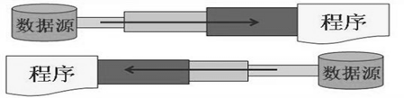

# JavaIO总结


# 1. File操作文件(不能读取和写入)

**必须知道：** **File类只能操作文件，不能读取文件和写入文件**

1. File类的理解
> File类位于java.io包下，本章中涉及到的相关流也都声明在java.io包下。
> File类的一个对象，对应与操作系统下的一个文件或一个文件目录（或文件夹）
> File类中声明了新建、删除、获取名称、重命名等方法，并没有涉及到文件内容的读写操作。要想实现文件内容的读写，
> 我们就需要使用io流。
> File类的对象，通常是作为io流操作的文件的端点出现的。
>
> > 代码层面，将File类的对象作为参数传递到IO流相关类的构造器中。


2. 内部api使用说明
  2.1 构造器
  - public File(String pathname)  ：以pathname为路径创建File对象，可以是绝对路径或者相对路径，如果pathname是相对路径，则默认的当前路径在系统属性user.dir中存储。
  - public File(String parent, String child)  ：以parent为父路径，child为子路径创建File对象。
  - public File(File parent, String child) ：根据一个父File对象和子文件路径创建File对象

2.2 方法
获取文件和目录基本信息

- public String getName() ：获取名称
- public String getPath() ：获取路径
- `public String getAbsolutePath()`：获取绝对路径
- public File getAbsoluteFile()：获取绝对路径表示的文件
- public String getParent()`：获取上层文件目录路径。若无，返回null
- public long length() ：获取文件长度（即：字节数）。不能获取目录的长度。
- public long lastModified() ：获取最后一次的修改时间，毫秒值
  列出目录的下一级
- public String[] list() ：返回一个String数组，表示该File目录中的所有子文件或目录。
- public File[] listFiles() ：返回一个File数组，表示该File目录中的所有的子文件或目录。
  File类的重命名功能
- public boolean renameTo(File dest):把文件重命名为指定的文件路径。
  判断功能的方法
- `public boolean exists()` ：此File表示的文件或目录是否实际存在。
- `public boolean isDirectory()` ：此File表示的是否为目录。
- `public boolean isFile()` ：此File表示的是否为文件。
- public boolean canRead() ：判断是否可读
- public boolean canWrite() ：判断是否可写
- public boolean isHidden() ：判断是否隐藏
  创建、删除功能
- `public boolean createNewFile()` ：创建文件。若文件存在，则不创建，返回false。
- `public boolean mkdir()` ：创建文件目录。如果此文件目录存在，就不创建了。如果此文件目录的上层目录不存在，也不创建。
- `public boolean mkdirs()` ：创建文件目录。如果上层文件目录不存在，一并创建。
- `public boolean delete()` ：删除文件或者文件夹
  删除注意事项：① Java中的删除不走回收站。② 要删除一个文件目录，请注意该文件目录内不能包含文件或者文件目录。


# 2. 节点流


## 2.1 什么是节点流

直接从数据源或目的地读写数据


## 2.2 字符流

**注意：**字符流只能用来操作文本文件(.txt,.java,.py)，不能用来处理非文本文件(音乐，视频等等)。

### 1. FileInput字符输入流

- 不带buffer
  ``` java
      @Test
      public void TestInput() {
  
          // 第一步：创建File类对象
          final File file = new File("src/main/java/com/iorn/Demo02节点流/p1字符节点流/input.txt");
  
          // 第二步：创建对应的流
          FileReader reader = null;
          try {
  
              reader = new FileReader(file);
  
              int data;
              while ((data = reader.read()) != -1) {  // 返回该字符的Unicode编码值(int类型值)。如果已经到达流末尾了，则返回-1
  
                  System.out.print((char) data);
              }
  
          } catch (Exception e) {
  
              throw new RuntimeException(e);
          } finally {
  
              // 第三步：关闭流
              if (reader != null) {
                  try {
                      reader.close();
                  } catch (IOException e) {
                      throw new RuntimeException(e);
                  }
              }
          }
  
      }
  ```

- 带buffer
  ``` java
      @Test
      public void TestInputByBuffer() {
  
          // 第一步：创建File类对象
          final File file = new File("src/main/java/com/iorn/Demo02节点流/p1字符节点流/input.txt");
  
          // 第二步：创建对应的流
          final char[] buffer = new char[5];
          FileReader reader = null;
  
          try {
  
              reader = new FileReader(file);
  
              int len;
              while ((len = reader.read(buffer)) != -1) {     // 返回实际读取的字符个数。如果已经到达流末尾，没有数据可读，则返回-1
  
                  for (int i = 0; i < len; i++) {
                      System.out.print(buffer[i]);
                  }
              }
  
          } catch (Exception e) {
  
              throw new RuntimeException(e);
          } finally {
  
              // 第三步：关闭流
              if (reader != null) {
                  try {
                      reader.close();
                  } catch (IOException e) {
                      throw new RuntimeException(e);
                  }
              }
          }
  
      }
  ```

  

### 2. FileWriter字符输出流

**注意：**写入的时候不带换行符，自行进行换行

- 不带buffer
  ``` java
      @Test
      public void TestFileInput() {
  
          // 第一步
          final File file = new File("src/main/java/com/iorn/Demo02节点流/p1字符节点流/output.txt");
  
          FileWriter writer = null;
          try {
  
              // 第二步
              writer = new FileWriter(file);
              writer.write("你好！\n");
          } catch (Exception e) {
  
              e.printStackTrace();
          } finally {
  
              if (writer != null) {
  
                  try {
                      // 第三步
                      writer.close();
                  } catch (Exception e) {
  
                      e.printStackTrace();
                  }
              }
          }
  
      }
  ```

- 带buffer且追加
  ``` java
     @Test
      public void TestOutputByBufferAndAppend() {
  
          // 第一步
          final File file = new File("src/main/java/com/iorn/Demo02节点流/p1字符节点流/output.txt");
  
          FileWriter writer = null;
          try {
  
              // 第二步
              writer = new FileWriter(file, true);
              final char[] arr = "hello china!\n".toCharArray();
              writer.write(arr);
          } catch (Exception e) {
  
              e.printStackTrace();
          } finally {
  
              if (writer != null) {
  
                  try {
                      // 第三步
                      writer.close();
                  } catch (Exception e) {
  
                      e.printStackTrace();
                  }
              }
          }
      }
  ```

  

## 2.3 字节流

**注意：**

- 字节流主要用来处理非文本文件(.doc、.xls 、.jpg 、.pdf、.mp3、.mp4、.avi)
- 也可以用来读取非文本文件，但得注意文件编码格式带来的影响，以免导致乱码。
  - 文件编码格式UTF，汉字为三个字节，英文为一个字节。
  - 文件边骂格式GBK，汉字为两个字节，英文为一个字节。

### 1. FileInputStream字节输入流

- 不带buffer
  ``` java
      @Test
      public void TestFileInputStream() {
  
          // 第一步
          final File file = new File("src/main/java/com/iorn/Demo02节点流/p1字符节点流/input.txt");
  
          FileInputStream inputStream = null;
          try {
  
              // 第二步
              inputStream = new FileInputStream(file);
  
              int data;
              while ((data = inputStream.read()) != -1) {
  
                  System.out.print((char) data);
              }
  
          } catch (Exception e) {
  
              e.printStackTrace();
          } finally {
  
              if (inputStream != null) {
  
                  try {
                      // 第三步
                      inputStream.close();
                  } catch (Exception e) {
  
                      e.printStackTrace();
                  }
              }
          }
      }
  ```

- 带buffer
  ``` java
     @Test
      public void TestFileInputStreamByBuffer() {
  
          // 第一步
          final File file = new File("src/main/java/com/iorn/Demo02节点流/p2字节节点流/input.txt");
  
          FileInputStream inputStream = null;
          final byte[] buffer = new byte[3];              // utf-8 汉字占三个字节，gbk 汉字占两个字节
          try {
  
              // 第二步
              inputStream = new FileInputStream(file);
  
              int len;
              while ((len = inputStream.read(buffer)) != -1) {
  
                  System.out.println(new String(buffer));
              }
  
          } catch (Exception e) {
  
              e.printStackTrace();
          } finally {
  
              if (inputStream != null) {
  
                  try {
                      // 第三步
                      inputStream.close();
                  } catch (Exception e) {
  
                      e.printStackTrace();
                  }
              }
          }
      }
  ```

### 2. FileOutputStream字节输出流

``` java
    @Test
    public void TestFileOutPutStream() {

        final File file = new File("src/main/java/com/iorn/Demo02节点流/p2字节节点流/output.txt");

        FileOutputStream outputStream = null;
        try {

            outputStream = new FileOutputStream(file);

            final byte[] bytes = "你好".getBytes();
            outputStream.write(bytes, 0 , 3);   // utf-8默认一个汉字三个字节
            outputStream.write(97); // 转换为字符
        } catch (Exception e) {

            e.printStackTrace();
        } finally {

            if (outputStream != null) {

                try {

                    outputStream.close();
                } catch (Exception e) {

                    e.printStackTrace();
                }
            }
        }
    }
```


# 3. 处理流





## 3.1 什么是处理流

不直接连接到数据源或目的地，而是“连接”在已存在的流（节点流或处理流）之上，通过对数据的处理为程序提供更为强大的读写功能。


## 3.2 缓冲流

建立在**节点流**的基础上，提供了缓冲功能，以提高I/O操作的性能。缓冲流内部维护了一个缓冲区，通过将数据缓存在内存中，减少了与底层数据源的直接交互次数，从而提高了读写效率。

### 1. 字符缓冲流

#### 1.1 BufferedReader 

``` java
    @Test
    public void TestInput() {

        // 第一步：创建File类对象
        final File file = new File("src/main/java/com/iorn/Demo02节点流/p1字符节点流/input.txt");

        // 第二步：创建对应的流
        FileReader reader = null;
        BufferedReader bufferedReader = null;
        try {

            reader = new FileReader(file);
            bufferedReader = new BufferedReader(reader, 1024);

            String line;
            while ((line = bufferedReader.readLine()) != null) {

                System.out.println(line);
            }
        } catch (Exception e) {

            throw new RuntimeException(e);
        } finally {

            // 第三步：关闭流
            if (bufferedReader != null) {
                try {
                    bufferedReader.close();
                } catch (IOException e) {
                    throw new RuntimeException(e);
                }
            }
        }

    }
```


#### 1.2 BufferedWriter

``` java
    @Test
    public void testNewLine()throws IOException {
        // 创建流对象
        BufferedWriter bw = null;
        try {

            bw = new BufferedWriter(new FileWriter("src/main/java/com/iorn/Demo03处理流/p1缓冲流/字符缓冲流/out.txt"),1024);
            // 写出数据
            bw.write("尚");
            // 写出换行
            bw.newLine();
            bw.write("硅");
            bw.newLine();
            bw.write("谷");
            bw.newLine();

        } catch (Exception e) {

            e.printStackTrace();
        } finally {

            if (bw != null) {
                bw.close();
            }
        }

    }
```

### 2. 字节缓冲流

#### 2.1 BufferedInputStream

``` java
   @Test
    public void TestInput() {

        // 第一步
        final File file = new File("src/main/java/com/iorn/Demo02节点流/p2字节节点流/input.txt");

        FileInputStream inputStream = null;
        BufferedInputStream bufferedInputStream = null;
        try {

            // 第二步
            inputStream = new FileInputStream(file);
            bufferedInputStream = new BufferedInputStream(inputStream);

            int len;
            byte[] buffer = new byte[100];
            while ((len = bufferedInputStream.read(buffer)) != -1) {

                System.out.print(new String(buffer, 0, len));
            }
        } catch (Exception e) {

            e.printStackTrace();
        } finally {

            if (inputStream != null) {

                try {
                    // 第三步
                    bufferedInputStream.close();
                } catch (Exception e) {

                    e.printStackTrace();
                }
            }
        }
    }
```

#### 2.2 BufferedOutputStream

``` java
    @Test
    public void TestOutput() {

        final File file = new File("src/main/java/com/iorn/Demo03处理流/p1缓冲流/字节缓冲流/output.txt");

        FileOutputStream outputStream = null;
        BufferedOutputStream bufferedOutputStream = null;
        try {

            outputStream = new FileOutputStream(file);
            bufferedOutputStream = new BufferedOutputStream(outputStream);

            bufferedOutputStream.write("hello".getBytes());
        } catch (Exception e) {

            e.printStackTrace();
        } finally {

            if (outputStream != null) {

                try {

                    bufferedOutputStream.close();
                } catch (Exception e) {

                    e.printStackTrace();
                }
            }
        }
    }
```


## 3. 转换流

**作用：转换流是字节与字符间的桥梁！**


具体来说：


### 3.1 输入转换流InputStreamReader

文件中字节读入转入特定的编码字符数据。

``` java
 @Test
    public void TestFileInputReader() {

        final File file = new File("src/main/java/com/iorn/Demo03处理流/p2转换流/input.txt");
        FileInputStream inputStream = null;
        InputStreamReader inputStreamReader = null;
        try {

            inputStream = new FileInputStream(file);
            inputStreamReader = new InputStreamReader(inputStream, "gbk");

            final char[] buffer = new char[5];
            int len;

            while ((len = inputStreamReader.read(buffer)) != -1) {

                final String s = new String(buffer, 0, len);
                System.out.print(s);
            }

        } catch (Exception e) {

            e.printStackTrace();
        } finally {

            if (inputStreamReader != null) {

                try {
                    inputStreamReader.close();
                } catch (IOException e) {
                    e.printStackTrace();
                }
            }
        }

    }
```

### 3.2 输出转换流OutputStreamWriter

将内存中的字符数据，以特定的编码存入到文件中。

``` java
    @Test
    public void TestOutputStreamWriter() {

        final File file = new File("src/main/java/com/iorn/Demo03处理流/p2转换流/output.txt");
        FileOutputStream fileOutputStream = null;
        OutputStreamWriter outputStreamWriter = null;

        try {

            fileOutputStream = new FileOutputStream(file);
            outputStreamWriter = new OutputStreamWriter(fileOutputStream, "GBK");

            outputStreamWriter.write("你好啊！");
        } catch (Exception e) {

            e.printStackTrace();
        } finally {

            if (outputStreamWriter != null) {

                try {
                    outputStreamWriter.close();
                } catch (IOException e) {
                   e.printStackTrace();
                }
            }
        }
    }
```


## 4. 对象流

### 4.1 什么是序列化机制？

序列化机制是指一种将对象转换为字节流的过程，可以将对象的状态保存到磁盘上或通过网络传输，然后在需要时将其重新恢复成对象。序列化主要用于对象的持久化存储和网络通信。


- 序列化时，可以将对象写入**ObjectOutputStream流**中；
- 反序列化时，可以从**ObjectInputStream流**中读取对象。序列化过程中，对象的类信息、属性值等都会被写入到字节流中，以便在反序列化时恢复对象的状态。


### 4.2 实现序列化的方式

**Serializable接口**：Serializable接口是Java提供的一个标记接口，实现了该接口的类可以被序列化。该接口没有任何方法，只是用来标识类的对象是可序列化的。当一个类实现了Serializable接口时，表示该类的对象可以被序列化，其内部的所有属性也会被序列化。

**但是class文件在序列化对象之后发生了修改，那么反序列化操作也会失败**，抛出一个`InvalidClassException`异常。发生这个异常的原因如下：

* 该类的序列版本号与从流中读取的类描述符的版本号不匹配 
* 该类包含未知数据类型  

解决方法：

​	`Serializable` 接口给需要序列化的类，提供了一个序列版本号：`serialVersionUID` 。凡是实现 Serializable接口的类	都应该有一个表示序列化版本标识符的静态变量：
``` java\
static final long serialVersionUID = 234242343243L; //它的值由程序员随意指定即可。
```


### 4.3 对象输入流ObjectInputStream(反序列化)

``` java
    @Test
    public void TestObjectInputStream() {

        final File file = new File("src/main/java/com/iorn/Demo03处理流/p3对象流/output.txt");
        FileInputStream fileInputStream = null;
        ObjectInputStream objectInputStream = null;

        try {

            fileInputStream = new FileInputStream(file);
            objectInputStream = new ObjectInputStream(fileInputStream);
            Employee employee = (Employee) objectInputStream.readObject();
            System.out.println(employee);
        } catch (Exception e) {

            e.printStackTrace();
        } finally {

            if (objectInputStream != null) {

                try {
                    objectInputStream.close();
                } catch (IOException e) {
                    e.printStackTrace();
                }
            }
        }
    }
```


### 4.4 对象输出流ObjectOutputStream(序列化)

``` java
   @Test
    public void TestObjectOutputStream() {

        final File file = new File("src/main/java/com/iorn/Demo03处理流/p3对象流/output.txt");
        FileOutputStream fileOutputStream = null;
        ObjectOutputStream objectOutputStream = null;

        try {

            fileOutputStream = new FileOutputStream(file);
            objectOutputStream = new ObjectOutputStream(fileOutputStream);

            final Employee employee = new Employee("张三", "北京市", 22);
            objectOutputStream.writeObject(employee);
        } catch (Exception e) {

            e.printStackTrace();
        } finally {

            if (objectOutputStream != null) {

                try {
                    objectOutputStream.close();
                } catch (IOException e) {
                    e.printStackTrace();
                }
            }
        }
    }
```


