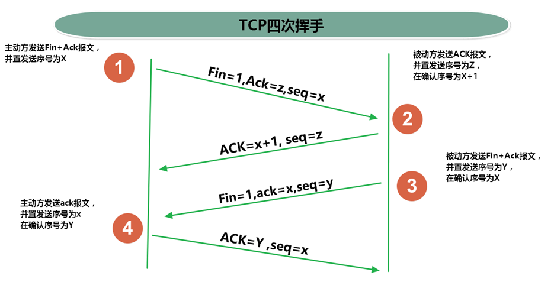

# Java通信

# 一. 网络通信三大要素

## 1.协议

`网络通信协议`：在计算机网络中，这些**连接和通信的规则**被称为网络通信协议，它对数据的传输格式、传输速率、传输步骤、出错控制等做了统一规定，通信双方必须同时遵守才能完成数据交换。

### 1.1 为什么使用分层模式？

**网络协议太复杂、涉及内容太多，怎么解决？**

`通信协议分层思想`：把复杂成份分解成一些简单的成份，再将它们复合起来。
最常用的复合方式是`层次方式`，即`同层间可以通信、上一层可以调用下一层，而与再下一层不发生关系`。各层互不影响，利于系统的开发和扩展。

### 1.2 分层模式一：OSI模式

过于理想化，放弃了。

### 1.3 分层模式二：TCP/IP 模式

### 

**TCP/IP协议：** 传输控制协议/因特网互联协议( Transmission Control Protocol/Internet Protocol)，TCP/IP 以其两个主要协议：**传输控制协议(TCP)**和**网络互联协议(IP)**而得名，实际上**是一组协议**，包括多个具有不同功能且互为关联的协议。是Internet最基本、最广泛的协议。

#### 1.3.1 TCP/IP协议中的四层介绍

- `应用层`：应用层**决定**了向用户提供应用服务时**通信的活动**。主要协议有：HTTP协议、FTP协议、SNMP（简单网络管理协议）、SMTP（简单邮件传输协议）和POP3（Post Office Protocol 3的简称,即邮局协议的第3个版）等。
- `传输层`：主要使网络程序进行通信，在进行网络通信时，可以采用TCP协议，也可以采用UDP协议。
  **TCP（Transmission Control Protocol）协议**，即传输控制协议，是一种面向连接的、可靠的、基于字节流的传输层通信协议。
  **UDP(User Datagram Protocol，用户数据报协议)**：是一个无连接的传输层协议、提供面向事务的简单不可靠的信息传送服务。
- `网络层`：网络层是整个TCP/IP协议的核心，支持网间互连的数据通信。它主要用于**将传输的数据进行分组，将分组数据发送到目标计算机或者网络**。而IP协议是一种非常重要的协议。IP（internet protocal）又称为互联网协议。**IP的责任就是把数据从源传送到目的地**。它在源地址和目的地址之间传送一种称之为数据包的东西，它还提供对数据大小的重新组装功能，以适应不同网络对包大小的要求。

* `物理+数据链路层`：链路层是用于定义**物理传输通道**，通常是对某些网络连接设备的驱动协议，例如针对光纤、网线提供的驱动。

#### 1.3.2 传输层 TCP 和 UDP区别

通信的协议还是比较复杂的，`java.net` 包中包含的类和接口，它们提供低层次的通信细节。我们可以直接使用这些类和接口，来专注于网络程序开发，而不用考虑通信的细节。

`java.net` 包中提供了两种常见的网络协议的支持：

- **UDP**：用户数据报协议(User Datagram Protocol)。
- **TCP**：传输控制协议 (Transmission Control Protocol)。

#### 1.3.3  TCP协议与UDP协议

**TCP协议：**

- TCP协议进行通信的两个应用进程：**客户端**、**服务端**。
- 使用TCP协议前，须先**`建立TCP连接`**，形成基于字节流的传输数据通道
- 传输前，采用“三次握手”方式，**点对点通信**，是`可靠的`
  - TCP协议使用`重发机制`，当一个通信实体发送一个消息给另一个通信实体后，需要收到另一个通信实体确认信息，如果没有收到另一个通信实体确认信息，则会再次重复刚才发送的消息。
- 在连接中可进行**`大数据量的传输`**
- 传输完毕，需**`释放已建立的连接，效率低`**

**UDP协议：**

- UDP协议进行通信的两个应用进程：**发送端**、**接收端**。
- 将数据、源、目的封装成数据包（传输的基本单位），**`不需要建立连接`**
- 发送不管对方是否准备好，接收方收到也不确认，不能保证数据的完整性，故是`不可靠的`
- 每个数据报的大小限制在`64K`内
- 发送数据结束时**`无需释放资源，开销小，通信效率高`**
- 适用场景：音频、视频和普通数据的传输。例如视频会议

> TCP生活案例：打电话
>
> UDP生活案例：发送短信、发电报，直播

#### 1.3.4 TCP的三次握手

TCP协议中，在发送数据的准备阶段，客户端与服务器之间的三次交互，以保证连接的可靠。

- 第一次握手，**客户端**向服**务器端**发起TCP连接的**请求**(你准备好了没有)
- 第二次握手，**服务器端**发送针对**客户端**TCP连接请求的**确认**(我准备好了你准备好了没有)
- 第三次握手，客户端发送**确认的确认**(好了我知道我准备好了你准备好了)

> 1、客户端会随机一个初始序列号seq=x，设置SYN=1 ，表示这是SYN握手报文。然后就可以把这个 SYN 报文发送给服务端了，表示向服务端发起连接，之后客户端处于`同步已发送`状态。
>
> 2、服务端收到客户端的 SYN 报文后，也随机一个初始序列号(seq=y)，设置ack=x+1，表示收到了客户端的x之前的数据，希望客户端下次发送的数据从x+1开始。
> 设置 SYN=1 和 ACK=1。表示这是一个SYN握手和ACK确认应答报文。最后把该报文发给客户端，该报文也不包含应用层数据，之后服务端处于`同步已接收`状态。
>
> 3、客户端收到服务端报文后，还要向服务端回应最后一个应答报文，将ACK置为 1 ，表示这是一个应答报文
> ack=y+1 ，表示收到了服务器的y之前的数据，希望服务器下次发送的数据从y+1开始。
> 最后把报文发送给服务端，这次报文可以携带数据，之后客户端处于 连接已建立 状态。服务器收到客户端的应答报文后，也进入`连接已建立`状态。

完成三次握手，连接建立后，客户端和服务器就可以开始进行数据传输了。由于这种面向连接的特性，TCP协议可以保证传输数据的安全，所以应用十分广泛，例如下载文件、浏览网页等。

#### 1.3.5  TCP的四次挥手

TCP协议中，在发送数据结束后，释放连接时需要经过四次挥手。

* 第一次挥手：客户端向服务器端提出结束连接，`让服务器做最后的准备工作`。此时，客户端处于半关闭状态，即表示不再向服务器发送数据了，但是还可以接受数据。
* 第二次挥手：服务器接收到客户端释放连接的请求后，`会将最后的数据发给客户端`。并告知上层的应用进程不再接收数据。
* 第三次挥手：服务器发送完数据后，会给客户端`发送一个释放连接的报文`。那么客户端接收后就知道可以正式释放连接了。
* 第四次挥手：客户端接收到服务器最后的释放连接报文后，要`回复一个彻底断开的报文`。这样服务器收到后才会彻底释放连接。这里客户端，发送完最后的报文后，会等待2MSL，因为有可能服务器没有收到最后的报文，那么服务器迟迟没收到，就会再次给客户端发送释放连接的报文，此时客户端在等待时间范围内接收到，会重新发送最后的报文，并重新计时。如果等待2MSL后，没有收到，那么彻底断开。

> 1、客户端打算断开连接，向服务器发送FIN报文(FIN标记位被设置为1，1表示为FIN，0表示不是)，FIN报文中会指定一个序列号，之后客户端进入FIN_WAIT_1状态。也就是客户端发出连接释放报文段(FIN报文)，指定序列号seq = u，主动关闭TCP连接，等待服务器的确认。
>
> 2、服务器收到连接释放报文段(FIN报文)后，就向客户端发送ACK应答报文，以客户端的FIN报文的序列号 seq+1 作为ACK应答报文段的确认序列号ack = seq+1 = u + 1。接着服务器进入CLOSE_WAIT(等待关闭)状态，此时的TCP处于半关闭状态(下面会说什么是半关闭状态)，客户端到服务器的连接释放。客户端收到来自服务器的ACK应答报文段后，进入FIN_WAIT_2状态。
>
> 3、服务器也打算断开连接，向客户端发送连接释放(FIN)报文段，之后服务器进入LASK_ACK(最后确认)状态，等待客户端的确认。服务器的连接释放(FIN)报文段的FIN=1，ACK=1，序列号seq=m，确认序列号ack=u+1。
>
> 4、客户端收到来自服务器的连接释放(FIN)报文段后，会向服务器发送一个ACK应答报文段，以连接释放(FIN)报文段的确认序号 ack 作为ACK应答报文段的序列号 seq，以连接释放(FIN)报文段的序列号 seq+1作为确认序号ack。
>
> 之后客户端进入TIME_WAIT(时间等待)状态，服务器收到ACK应答报文段后，服务器就进入CLOSE(关闭)状态，到此服务器的连接已经完成关闭。客户端处于TIME_WAIT状态时，此时的TCP还未释放掉，需要等待2MSL后，客户端才进入CLOSE状态。