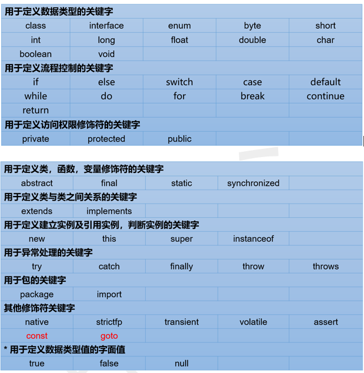
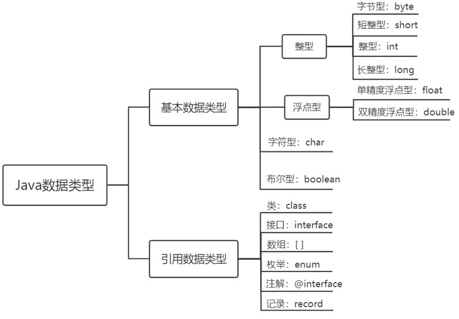
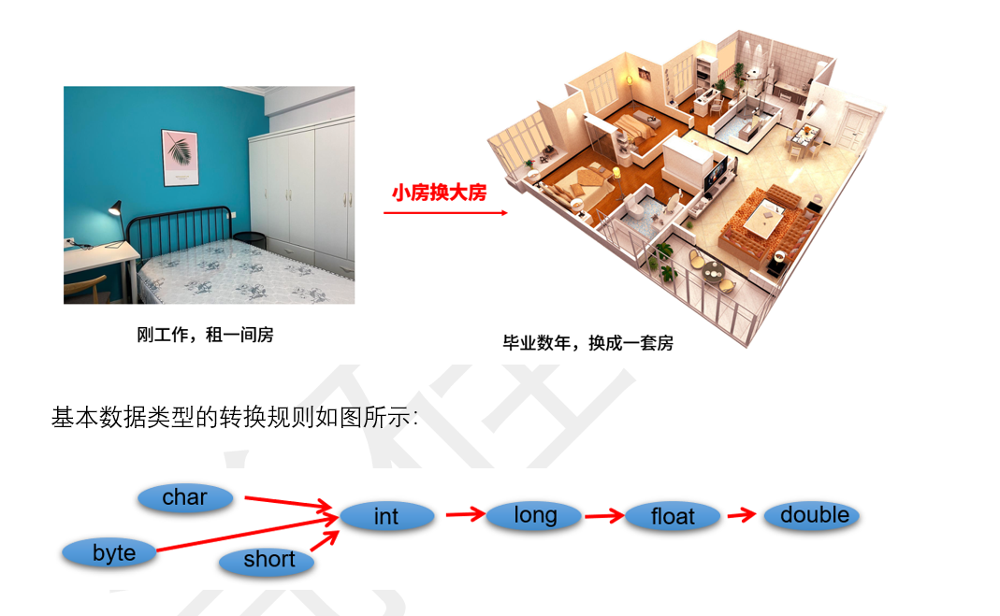

# 1. java的优点

- JVM虚拟机的良好跨平台性：将java类转为字节码文件class，再通过不同平台如linux，windows的jvm进行解析
- 面向对象：通过封装，继承多态。实现了高内聚低耦合
- 通过jvm进行自动内存管理


# 2. 关键字、标识符、变量

## 1. 关键字

​	定义：被Java语言赋予了特殊含义，用做专门用途的字符串（或单词）HelloWorld案例中，出现的关键字有 class、public 、 static 、 void 等，这些单词已经被Java定义好了。

特点：全部关键字都是小写字母。



1. 其中const和goto是保留字(reserved word)。

2. true，false，null不在其中，它们看起来像关键字，其实是字面量，表示特殊的布尔值和空值。


## 2. 标识符

Java中变量、方法、类等要素命名时使用的字符序列，称为标识符。

技巧：凡是自己可以起名字的地方都叫标识符。

**标识符的命名规则**（必须遵守的硬性规定）：

\> 由26个英文字母大小写，0-9 ，_或 $ 组成 
 \> 数字不可以开头。
 \> 不可以使用关键字和保留字，但能包含关键字和保留字。
 \> Java中严格区分大小写，长度无限制。
 \> 标识符不能包含空格。


## 3. 变量

- 变量的概念：***\*变量是程序中不可或缺的组成单位，最基本的存储单元\****。

–     **内存** 中的一个存储区域，该区域的数据可以在同一类型范围内不断变化

–     变量的构成包含三个要素：数据类型、变量名、存储的值

–     Java中变量声明的格式：数据类型 变量名 = 变量值


- 变量的数据类型
  

Java各整数类型有固定的表数范围和字段长度，不受具体操作系统的影响，以保证Java程序的可移植性


## 4. 变量的转化

### 1. 自动转换



1 当把存储范围小的值（常量值、变量的值、表达式计算的结果值）赋值给了存储范围大的变量时（1）当把存储范围小的值（常量值、变量的值、表达式计算的结果值）赋值给了存储范围大的变量时

int i = 'A';*//char**自动升级为int**，其实就是把字符的编码值赋值给i**变量了*
 double d = 10;*//int**自动升级为double*
 long num = 1234567; *//**右边的整数常量值如果在int**范围呢，编译和运行都可以通过，这里涉及到数据类型转换*

 *//byte bigB = 130;//**错误，右边的整数常量值超过byte**范围*
 long bigNum = 12345678912L;*//**右边的整数常量值如果超过int**范围，必须加L**，显式表示long**类型。**否则编译不通过*

2 当存储范围小的数据类型与存储范围大的数据类型变量一起混合运算时，会按照其中最大的类型运算。

int i = 1;
 byte b = 1;
 double d = 1.0; 
 double sum = i + b + d;*//**混合运算，升级为double*

（3）当byte,short,char数据类型的变量进行算术运算时，按照int类型处理。

byte b1 = 1;
 byte b2 = 2;
 byte b3 = b1 + b2;*//**编译报错，b1 + b2**自动升级为int*

 char c1 = '0';
 char c2 = 'A';
 int i = c1 + c2;*//**至少需要使用int**类型来接收*
 System.out.println(c1 + c2);*//113* 

3 当byte,short,char数据类型的变量进行算术运算时，按照int类型处理。

byte b1 = 1;
 byte b2 = 2;
 byte b3 = b1 + b2;*//**编译报错，b1 + b2**自动升级为int*

 char c1 = '0';
 char c2 = 'A';
 int i = c1 + c2;*//**至少需要使用int**类型来接收*
 System.out.println(c1 + c2);*//113* 

### 2. 强制类型转换 

将3.14 赋值到int 类型变量会发生什么？产生编译失败，肯定无法赋值。

int i = 3.14; *//* *编译报错*

想要赋值成功，只有通过强制类型转换，将double 类型强制转换成int 类型才能赋值。


//float f1 = 12.3; //报错，因为12.3看做是double，不能自动转换为float类型
 float f2 = 12.3F;
 float f3 = (float)12.3;

long l1 = 123L;
 long l2 = 123;//如何理解呢？ 此时可以看做是int类型的123自动类型提升为long类型

//long l3 = 123123123123; //报错，因为123123123123超出了int的范围。
 long l4 = 123123123123L;


### 3. 总结：


byte，char类型相加会自动转为int类型

1321312312312321超过int长度赋值给int要为：1321312312312321L

3.14 会自动转为double类型,所以：float a = 3.14F / (float)3.14

多个类型相加会转为最大的那个类型

**小可以自动转为大，但是大转小得强制类型转换**


## 5. 权限修饰符

| 修饰符    | 本类内部 | 本包内 | 其他包的子类 | 其他包非子类 |
| --------- | -------- | ------ | ------------ | ------------ |
| private   | √        | ×      | ×            | ×            |
| 缺省      | √        | √      | ×            | ×            |
| protected | √        | √      | √            | ×            |
| public    | √        | √      | √            | √            |


# 3. 编码

**编码与解码**

计算机中储存的信息都是用*二进制数*表示的，而我们在屏幕上看到的数字、英文、标点符号、汉字等字符是二进制数转换之后的结果。按照某种规则，将字符存储到计算机中，称为*编码* 。反之，将存储在计算机中的二进制数按照某种规则解析显示出来，称为*解码* 。

**字符编码**（Character Encoding）：就是一套自然语言的字符与二进制数之间的对应规则。

**字符集**：也叫编码表。是一个系统支持的所有字符的集合，包括各国家文字、标点符号、图形符号、数字等。


UTF-8和GBK是两种常用的字符编码方式，它们在处理汉字时有不同的特点和实现方式。下面详细解释这两种编码方式在汉字存储方面的具体差异。

### UTF-8

**特点**

- **可变长度编码**：UTF-8使用1到4个字节来表示一个字符。
- **兼容ASCII**：对于标准ASCII字符（U+0000到U+007F），UTF-8使用单字节编码，与ASCII编码相同。
- **多语言支持**：UTF-8可以表示所有Unicode字符，适用于多语言环境。

**汉字存储**

- 汉字的Unicode码点通常在U+4E00到U+9FFF之间。
- 在UTF-8中，汉字通常使用**3**个字节进行编码。

**编码规则**

1. 一个字节（单字节）：0xxxxxxx
2. 两个字节（双字节）：110xxxxx 10xxxxxx
3. 三个字节（三字节）：1110xxxx 10xxxxxx 10xxxxxx
4. 四个字节（四字节）：11110xxx 10xxxxxx 10xxxxxx 10xxxxxx

**示例**

1. 将二进制的码点01001111 01100000分割成适合的段落：

   - 高位4位：0100
   - 中间6位：111101
   - 低位6位：100000

   #### 2.2 填充到UTF-8格式的字节中

   按照三字节的格式：

   - 第一个字节：1110xxxx（填充高位4位）
   - 第二个字节：10xxxxxx（填充中间6位）
   - 第三个字节：10xxxxxx（填充低位6位）

   将这些位填充进去：

   - 第一个字节：1110 0100（填充0100）
   - 第二个字节：10 011111（填充111101）
   - 第三个字节：10 100000（填充100000）

   #### 2.3 组合结果

   将所有的部分组合起来：

   - 第一个字节：1110 0100 -> E4
   - 第二个字节：10 011111 -> 9F
   - 第三个字节：10 100000 -> A0

   所以，Unicode码点U+4F60 ("你") 的UTF-8编码结果为：E4 9F A0

```
java复制代码public class Utf8EncodingExample {
    public static void main(String[] args) {
        String chinese = "你";
        
        byte[] utf8Bytes = chinese.getBytes(StandardCharsets.UTF_8);
        
        System.out.println("UTF-8编码字节数组长度: " + utf8Bytes.length);
        System.out.print("UTF-8编码字节数组内容: ");
        for (byte b : utf8Bytes) {
            System.out.printf("%02X ", b);
        }
    }
}
```

### GBK

**特点**

- **变长编码**：GBK编码可以使用单字节或双字节来表示字符。
- **兼容性**：GBK向下兼容GB2312，能够表示更多的汉字和符号。
- **主要用于中文**：GBK主要用于处理简体中文文本。

**汉字存储**

- GBK编码中，一个汉字通常使用**2**个字节表示。

**编码规则**

1. 单字节编码：用于表示ASCII字符（0x00到0x7F）。
2. 双字节编码：用于表示汉字和其他符号，第一个字节范围为0x81到0xFE，第二个字节范围为0x40到0xFE（不包括0x7F）。

**示例**

以汉字“你”（GBK编码：C4E3）为例：

```
java复制代码public class GbkEncodingExample {
    public static void main(String[] args) {
        String chinese = "你";
        
        byte[] gbkBytes = chinese.getBytes(Charset.forName("GBK"));
        
        System.out.println("GBK编码字节数组长度: " + gbkBytes.length);
        System.out.print("GBK编码字节数组内容: ");
        for (byte b : gbkBytes) {
            System.out.printf("%02X ", b);
        }
    }
}
```

### 主要差异

1. **字节数**：UTF-8使用可变长度编码，汉字通常需要3个字节；GBK使用固定长度的双字节编码，汉字使用2个字节。
2. **兼容性**：UTF-8是国际通用的编码方式，支持所有Unicode字符，适用于多语言环境；GBK主要用于中文环境，不支持所有Unicode字符。
3. **存储效率**：对英文字符，UTF-8更高效；对汉字，GBK更高效。
4. **应用场景**：UTF-8广泛应用于互联网和多语言文本处理；GBK常用于中文系统和中文文本处理。

