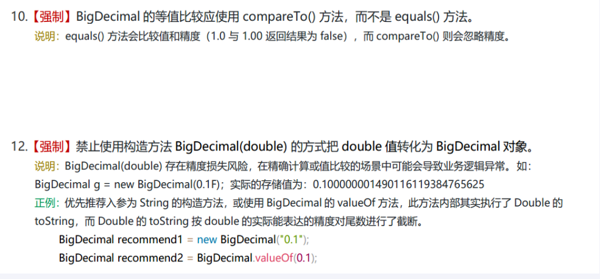
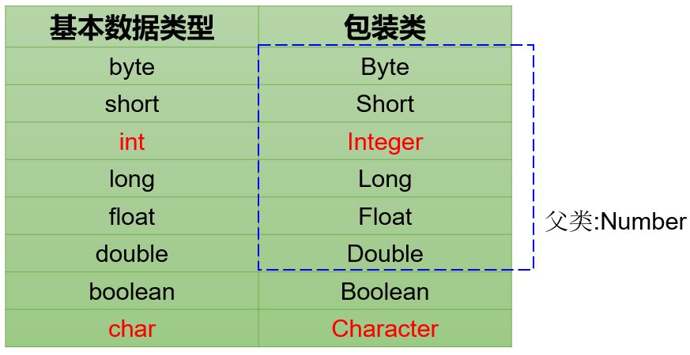
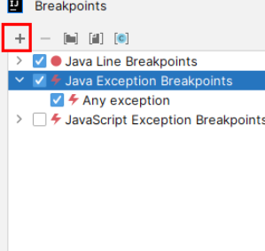
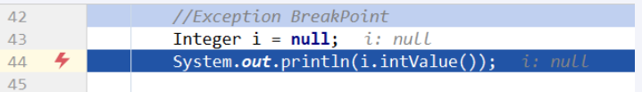
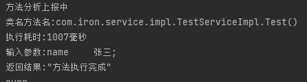

# **高频面试总结**

## 一、Java高频问题

代码：C:\Users\Iron\Desktop\面试\尚硅谷Java大厂面试题第4季\Code\Demo1-Java常见问题\JavaBaseQuestion

### 1. 加加减减

``` java
public class IPlusPlus
{
    public static void main(String[] args)
    {
        int i = 1;

        System.out.println("i: "  +   i);// 1
        System.out.println("++i: "+   ++i);// 2
        System.out.println("i++: "+   i++);// 2（执行完成i=3)
        System.out.println("i: "  +     i);// 3
        System.out.println("--i: "+   --i);// 2
        System.out.println("i--: "+   i--);// 2
        System.out.println("i: "  +   i);// 1
    }
}
```

### 2. 服务可用性的数字9问题


### 3. Arrays.asList问题

Arrays.AsList类继承自AbstractList，实现了List接口。它**重写了add()、remove()等修改List结构的方法，并将它们直接抛出UnsupportedOperationException异常**，从而禁止了对List结构的修改。具体来说，Arrays.asList()方法返回的是Arrays类中的一个私有静态内部类ArrayList，它继承自AbstractList类，实现了List接口。

**问题：** Arrays.asList() 生成的list是重写了 add remove方法，所以调用报错。

**解决方法：**外面包一层 new ArrayList()


### 4. Iterator循环不能使用List.add/remove

**问题：** iterator 循环中 不能使用 list.remove() list.add()

**解决方法：**使用 **Iterator.remove() iterator.add() 替代**


### 5.  hasCoode？哈希冲突？

#### **什么是hashCode？它属于那个类的方法?**

`hashCode` 是一个方法，定义在 `java.lang.Object` 类中。它用于返回对象的哈希码值。哈希码是一个整数，通常用于哈希表中的散列分布。哈希码的存在主要是为了提高使用哈希表等数据结构的性能。

**`hashCode` 方法的定义**

在 `java.lang.Object` 类中，`hashCode` 方法的签名如下：

```java
public native int hashCode();
```


**`hashCode` 的作用**

1. **哈希表操作**：`hashCode` 方法广泛用于哈希表（例如，`HashMap`、`HashSet` 等）中，以便快速查找、插入和删除操作。哈希表通过 `hashCode` 方法将对象分布到不同的“桶”中，从而减少比较操作的次数。
2. **提高性能**：使用哈希码可以大大提高查找和存储操作的性能，尤其是在大规模数据集的情况下。


**`hashCode` 和 `equals` 的关系**

为了正确地在哈希表中工作，`hashCode` 和 `equals` 方法必须满足以下两个规则：

1. **如果两个对象相等（即 `equals` 方法返回 `true`），那么它们的 `hashCode` 值必须相同**。这确保了相同的对象在哈希表中位于同一个桶中。
2. **如果两个对象的 `hashCode` 值相同，它们不一定相等**。这意味着不同的对象可以具有相同的哈希码，但相同的哈希码不保证对象相等。


**默认的 `hashCode` 实现**

默认情况下，`Object` 类的 `hashCode` 方法返回**对象的内存地址转换成的整数**表示。这种默认实现满足哈希码的基本契约，但在某些情况下，你可能需要根据对象的内容来计算哈希码。

**重写 `hashCode` 方法**

通常，当你重写 `equals` 方法时，也需要重写 `hashCode` 方法。以下是一个示例：

```java
public class Person {
    private String name;
    private int age;

    public Person(String name, int age) {
        this.name = name;
        this.age = age;
    }

    @Override
    public boolean equals(Object obj) {
        if (this == obj) return true;
        if (obj == null || getClass() != obj.getClass()) return false;	// 判空 或 class对象不同
        Person person = (Person) obj;
        return age == person.age && Objects.equals(name, person.name);	// object默认比较内存地址，这里重写比较的是 实体类 name 和 age 的值。
    }

    @Override
    public int hashCode() {	// 必须重写 hashCode 方法。
        return Objects.hash(name, age);
    }
}
```


在这个示例中，`equals` 方法比较两个 `Person` 对象的 `name` 和 `age` 是否相等，而 `hashCode` 方法则基于 `name` 和 `age` 生成哈希码。


**上面修改的示例**

以下是一个使用 `hashCode` 和 `equals` 的示例：

```java
public class Main {
    public static void main(String[] args) {
        Person p1 = new Person("Alice", 30);
        Person p2 = new Person("Alice", 30);
        Person p3 = new Person("Bob", 25);

        System.out.println(p1.equals(p2)); // true
        System.out.println(p1.equals(p3)); // false

        System.out.println(p1.hashCode()); // p1 和 p2 的 hashCode 值相同
        System.out.println(p2.hashCode()); // p1 和 p2 的 hashCode 值相同
        System.out.println(p3.hashCode()); // p1 和 p3 的 hashCode 值不同
    }
}
```

在这个示例中，`p1` 和 `p2` 是相等的（`equals` 返回 `true`），因此它们的 `hashCode` 值也相同。而 `p3` 与前两个对象不同，因此它的 `hashCode` 值也不同。


**总结来说**，`hashCode` 方法在 Java 中用于生成对象的哈希码，以便在哈希表等数据结构中高效地存储和查找数据。而 `hashCode` 和 `equals` 方法应当一致地进行重写，以确保对象在哈希表中的正确行为。


#### 什么是hash冲突？给个例子？

当两个或多个不同的**输入数据**通过**哈希函数**得到相同的**哈希值**时，就发生了哈希冲突。

例如，假设有两个键 "Alice" 和 "Bob"，它们经过哈希函数处理后都得到哈希值 `5`，那么它们在哈希表中会映射到同一个位置。

**例子：**

``` java
public class HashConflictDemo
{
    static class Person
    {
        int id;
    }

    public static void main(String[] args)
    {
        HashSet<Integer> hashSet = new HashSet<>();

        for (int i = 1; i <=10 * 10000; i++) {
            int personHashCode = new Person().hashCode();
            if(!hashSet.contains(personHashCode))
            {
                hashSet.add(personHashCode);
            }else{
                System.out.println("发生了hash冲突,在第"+i+"次，值是："+personHashCode);
            }
        }
        System.out.println(hashSet.size());

    }

    private static void m1()
    {
        System.out.println("AA".hashCode());	// AA 和 BB 发生Hash冲突
        System.out.println("BB".hashCode());
        System.out.println();
        System.out.println("Aa".hashCode());	// Aa 和 BB 发生Hash冲突
        System.out.println("BB".hashCode());
        System.out.println();
        System.out.println("柳柴".hashCode());	// 同理
        System.out.println("柴柕".hashCode());
    }
}
```


### 6.整形包装类Integer问题

**构造注意：**
jdk8后不使用：


使用：


**Integer缓存equals比较的问题**

将基本类型int赋值给包装类型Integer时，自动装箱，调用的是 Integer.valueOf方法，查看源码可知(如下代码)，**在-127与128**之间的基本类型做自动装箱操作时，会返回一个**IntegerCache的缓存池内容**，所以比较**地址是相同**的。


**代码：**

``` java
        Integer a = Integer.valueOf(600); // a 是一个新的 Integer 对象，值为 600
        Integer b = Integer.valueOf(600); // b 是另一个新的 Integer 对象，值为 600
        int c = 600;                      // c 是一个基本类型 int，值为 600
        System.out.println(a == b);       // false，因为 a 和 b 是不同的对象实例
        System.out.println(a.equals(b));  // true，因为 a 和 b 的值相同(Integer重写了equals比较的是值，原本是比较引用和==一样)
        System.out.println(a == c);       // true，因为 a 自动拆箱为 int 后与 c 比较，值相同

        System.out.println("===================");

        Integer x = Integer.valueOf(99);  // x 是一个 Integer 对象，值为 99
        Integer y = Integer.valueOf(99);  // y 指向与 x 相同的 Integer 对象，值为 99（缓存范围内）
        System.out.println(x == y);       // true，因为 x 和 y 指向相同的对象（整数缓存范围内）
        System.out.println(x.equals(y));  // true，因为 x 和 y 的值相同

		Integer a = 111;
		Integer b = 111;
		System.out.println(a.equals(b));  // true 因为 111 在缓存内。
```


### 7. BigDecimal中的坑

项目中金额处理操作都得使用

**BigDecimal概述**

 Java在java.math包中提供的API类BigDecimal，用来对超过16位有效位的数进行精确的运算。双精度浮点型变量double可以处理16位有效数，但在实际应用中，可能需要对更大或者更小的数进行运算和处理。一般情况下，对于那些**不需要准确计算精度**的数字，我们可以直接使用Float和Double处理，但是Double.valueOf(String) 和Float.valueOf(String)会丢失精度。所以开发中，如果我们**需要精确计算的结果，则必须使用BigDecimal类来操作**。

 BigDecimal所创建的是对象故我们不能使用传统的＋，-,×÷等算术运算符直接对其对象进行数学运算，而必须调用其相对应的方法。方法中的参数也必须是BigDecimal的对象。构造器是类的特殊方法，专门用来创建对象，特别是带有参数的对象。




**代码：**

``` java
public class BigDecimal_BugDemo {
    public static void main(String[] args) {
        // doubleDemo(); // double类型精度丢失

        // ===================BigDecimal===================
        // m1();
        // m2();
        m3();
        // m4();
    }

    // 科学计数法
    private static void m4() {
        BigDecimal amount1 = BigDecimal.valueOf(1234567890123456789.3141592631415926);
        System.out.println(amount1);                    // 1.23456789012345677E+18, 默认以科学计数法显示
        System.out.println(amount1.toString());         // 1.23456789012345677E+18, toString方法以科学计数法显示
        System.out.println(amount1.toPlainString());    // 1234567890123456789.3141592631415926, toPlainString方法不使用科学计数法

        System.out.println();
        BigDecimal amount2 = new BigDecimal("1234567890123456789.3141592631415926");
        System.out.println(amount2);                    // 1234567890123456789.3141592631415926, 使用字符串构造方法时，不使用科学计数法
        System.out.println(amount2.toString());         // 1234567890123456789.3141592631415926, toString方法不使用科学计数法
        System.out.println(amount2.toPlainString());    // 1234567890123456789.3141592631415926, toPlainString方法不使用科学计数法
    }
	
    // 约值关系
    private static void m3() {
        BigDecimal amount1 = new BigDecimal("2.0");
        BigDecimal amount2 = new BigDecimal("3.0");
        // System.out.println(amount1.divide(amount2)); // Non-terminating decimal expansion; no exact representable decimal result.
        System.out.println(amount1.divide(amount2, 2, RoundingMode.HALF_UP)); // 0.67, 四舍五入模式下保留2位小数
    }

    private static void m2() {
        BigDecimal amount1 = new BigDecimal("0.9");
        BigDecimal amount2 = new BigDecimal("0.90");
        System.out.println("equals比较结果：" + amount1.equals(amount2)); // equals比较结果：false, equals方法比较值和精度，精度不同
        System.out.println("compareTo比较结构：" + amount1.compareTo(amount2)); // compareTo比较结构：0, compareTo方法只比较数值，数值相等
    }
	
    // 初始化赋值问题：得用string
    private static void m1() {
        BigDecimal amount1 = new BigDecimal(0.03);
        BigDecimal amount2 = new BigDecimal(0.02);
        System.out.println("amount1: " + amount1); // amount1: 0.0299999999999999988897769753748434595763683319091796875, 使用double构造时出现精度问题
        System.out.println("amount2: " + amount2); // amount2: 0.0199999999999999982236431605997495353221893310546875, 使用double构造时出现精度问题
        System.out.println(amount1.subtract(amount2)); // 0.01, 精度问题导致结果不准确

        System.out.println();
        BigDecimal amount3 = new BigDecimal("0.03");
        BigDecimal amount4 = new BigDecimal("0.02");
        System.out.println(amount3.subtract(amount4)); // 0.01, 使用字符串构造时精度正确

        System.out.println();
        BigDecimal amount5 = BigDecimal.valueOf(0.03);	// valueOf 默认进行了将double转String
        BigDecimal amount6 = BigDecimal.valueOf(0.02);
        System.out.println(amount5.subtract(amount6)); // 0.01, 使用valueOf方法精度正确
    }

    private static void doubleDemo() {
        double amount1 = 0.03;
        double amount2 = 0.02;
        System.out.println(amount1 - amount2); // 0.009999999999999998, double类型精度丢失导致的误差
    }
}
```


**最强工具类：** 请看代码

### 8.List去重的几种方式

1. List.container()判断
    ``` java
        private static void m1()
        {
            List<Integer> initList = Arrays.asList(70,70,-1,5,3,3,4,4,4,4,99);
            List<Integer> srcList = new ArrayList<>(initList);
            List<Integer> newList = new ArrayList<>();
    
            for (int i = 0; i < srcList.size(); i++)
            {
                if(!newList.contains(srcList.get(i)))
                {
                    newList.add(srcList.get(i));
                }
            }
            System.out.println(newList);
            System.out.println();
        }
    ```

2. HashSet/LinkedHashSet去重(LinkedHashSet可以保持原来的顺序，但HashSet是无序的)
   ``` java
       private static void m2()
       {
           List<Integer> srcList = Arrays.asList(70,70,-1,5,3,3,4,4,4,4,99);
           List<Integer> newList = new ArrayList<>(new HashSet<>(srcList));
   
           newList = new ArrayList<>(new LinkedHashSet<>(srcList));	// HashSet去重
           newList.forEach((s) -> System.out.print(s+" "));
       }
   ```

3. Stream流distinct方法去重
   ``` java
       private static void m3()
       {
           List<Integer> initList = Arrays.asList(70,70,-1,5,3,3,4,4,4,4,99);
           List<Integer> srcList = new ArrayList<>(initList);
           List<Integer> newList = null;
   
           newList = srcList.stream().distinct().collect(Collectors.toList());
   
           newList.forEach((s) -> System.out.print(s+", "));
       }
   ```

4. List.indexOf and List.LastIndexOf 去重
   ``` java
       private static void m4()
       {
           List<Integer> initList = Arrays.asList(70,70,-1,5,3,3,4,4,4,4,99);
           List<Integer> srcList = new ArrayList<>(initList);
           List<Integer> newList = new ArrayList<>(initList);
   
           System.out.println(srcList.indexOf(70));
           System.out.println(srcList.lastIndexOf(70));
   
   
           for (Integer element : srcList) {
               if(newList.indexOf(element) != newList.lastIndexOf(element)) {
                   newList.remove(newList.lastIndexOf(element));
               }
           }
           newList.forEach((s) -> System.out.print(s+", "));
       }
   ```

5. 双层for循环去重(双指针)：
   
   - 第一个指针指向去重元素。
   - 第二个指针指向list尾部进行去重。
   
   ``` java
       private static void m5()
       {
           List<Integer> initList = Arrays.asList(70,70,-1,5,3,3,4,4,4,4,99);
           List<Integer> srcList = new ArrayList<>(initList);
           List<Integer> newList = new ArrayList<>(initList);
   
           for (int i = 0; i < newList.size()-1; i++) {
               System.out.println("外层循环第："+i+" "+newList);
               for (int j = newList.size()-1; j > i ; j--) {
                   if(newList.get(j).equals(newList.get(i))){
                       newList.remove(j);
                   }
                   System.out.println("   内存循环第："+j+" "+newList);
               }
               System.out.println();
               System.out.println();
           }
           newList.forEach((s) -> System.out.print(s+" "));
       }
   ```


### 9.== 和 equals的区别？

1. ==
   - *==* 既可以比较**基本类型**也可以比较**引用类型**
   - == 对于**基本类型值**是否相等，对于**引用类型内存地址**是否相等
2. equals
   - 只能比较引用类型，equals(Object obj)
   - 没有被重写，出厂默认就是 **==** (继承自Object)
   - 重写看具体方法：如 String，Integer 等引用类 equals 比较的是**值**是否相等

**代码：**

``` java
String s1 = new String("abc");
String s2 = new String("abc");
System.out.println(s1 == s2); 
// 输出: false
// 原因: s1 和 s2 是通过 new 关键字创建的不同对象，== 比较的是对象的引用，因此它们不相等。

System.out.println(s1.equals(s2)); 
// 输出: true
// 原因: String重写了equals方法 equals() 方法比较的是对象的内容，s1 和 s2 的内容都是 "abc"，因此相等。

Set<String> set01 = new HashSet<>();
set01.add(s1);
set01.add(s2);
System.out.println(set01.size()); 
// 输出: 1
// 原因: HashSet 不允许重复元素，s1 和 s2 的内容相同，并且 String 类已经正确覆盖了(重写) equals() 和 hashCode() 方法，因此 s2 不能被添加到集合中。(equals为truehashcode一定相同，反过来不成立)

System.out.println(s1.hashCode() + "\t" + s2.hashCode());
// 输出: 96354	96354
// 原因: s1 和 s2 的内容相同，因此它们的 hashCode() 返回值也相同。

System.out.println("================================");


Person p1 = new Person("abc");
Person p2 = new Person("abc");
System.out.println(p1 == p2); 
// 输出: false
// 原因: p1 和 p2 是通过 new 关键字创建的不同对象，== 比较的是对象的引用，因此它们不相等。

System.out.println(p1.equals(p2)); 
// 输出: false
// 原因: 如果 Person 类没有重写 equals() 方法，则默认使用 Object 类的 equals() 方法，比较的是对象的引用，因此它们不相等。

Set<Person> set02 = new HashSet<>();
set02.add(p1);
set02.add(p2);
System.out.println(set02.size()); 
// 输出: 2
// 原因: 如果 Person 类没有重写 equals() 和 hashCode() 方法，HashSet 会认为 p1 和 p2 是不同的对象，因此会将它们都添加到集合中。

System.out.println(p1.hashCode() + "\t" + p2.hashCode()); 
// 输出: 不同的 hashCode 值
// 原因: 如果 Person 类没有重写 hashCode() 方法，不同的对象通常会有不同的 hashCode 值。

System.out.println("================================");
System.out.println();
```


### 10.传值和传引用对比


**基本数据类型传值**：

- 当方法参数是基本数据类型（如 `int`、`char` 等）时，传递的是值的副本。方法内部对参数的修改不会影响到原来的变量。

``` java
public class Test {
    public static void main(String[] args) {
        int a = 10;
        changeValue(a);
        System.out.println(a); // 输出: 10
    }

    public static void changeValue(int x) {
        x = 20;
    }
}
```

**引用数据类型传引用的值**：

- 当方法参数是引用数据类型（如对象、数组等）时，传递的是引用的副本。引用的副本指向原对象，因此方法内部对对象的修改会影响到原来的对象。但是，引用本身是值的副本，因此对引用的重新赋值不会影响到原来的引用。
  ``` java
  class Person {
      String name;
  
      Person(String name) {
          this.name = name;
      }
  }
  
  public class Test {
      public static void main(String[] args) {
          Person p1 = new Person("Alice");
          modifyPerson(p1);
          System.out.println(p1.name); // 输出: Bob
  
          resetPerson(p1);
          System.out.println(p1.name); // 输出: Bob
      }
  
      public static void modifyPerson(Person person) {
          person.name = "Bob";
      }
  
      public static void resetPerson(Person person) {
          person = new Person("Charlie");
      }
  }
  ```

  **注意：** String 特殊性

  - 引用对象 **String** 对象是**不可变**的，也就是说，一旦创建，`String` 对象的内容就不能被改变。每次对 `String` 的操作都会产生一个**新的 `String` 对象**，而不是在原有对象上进行修改。
    因为
  - Java 中的字符串池是一种特殊的内存区域，用于存储字符串字面量。字符串池的存在可以优化内存使用和提高性能。

  ``` java
  public class Test {
      public static void main(String[] args) {
          String s = "Hello";
          changeValue(s);
          System.out.println(s); // 输出: Hello
      }
  
      public static void changeValue(String str) {
          str = "World";
      }
  }
  ```

  **不可变性**：`String` 对象一旦创建，其内容不能改变。

  **字符串池**：相同的字符串字面量在内存中只存储一份，以节省内存。

  **引用传递**：传递 `String` 作为方法参数时，传递的是引用的副本，但由于 `String` 是不可变的，方法内的任何修改都会创建新的 `String` 对象，不会影响原来的字符串对象。


**图解：**

基本类型传值：
值随着方法压入栈中，执行完弹出，互不影响。


引用类型传引用：


引用类型String特殊性：

- 修改前：
  
- 修改后：
  


### 11.浅拷贝和深拷贝对比


**浅拷贝：**

浅拷贝创建的新对象与原对象**共享同一引用对象(拷贝的是内存地址)**。因此一个对象改变了这个地址会影响到另一个对象。

**深拷贝：**

深拷贝会另外创造一个一模一样的对象，新对象跟原对象不共享内存，修改新对象不会改到原对象。深拷贝是拷贝了元对象的所有值。**元对象发生变化，拷贝对象不会发生变化。**

1. **避免共享引用**

   当你复制一个对象时，如果不使用深拷贝，那么复制的实际上是对原对象的引用，而不是真正的副本。这意味着对副本的任何修改都会影响到原对象。深拷贝则能确保复制的是对象的真正副本，与原对象没有引用关系。

2. **线程安全**

   在多线程环境中，如果多个线程同时访问和修改同一个对象，可能会导致数据不一致和竞态条件。通过深拷贝创建对象的副本，每个线程都可以在自己的副本上进行操作，从而避免了线程安全问题。


**Cloneable标记接口：**

为了使用 Object 类中的clone方法，必须得实现Cloneable接口，并重写clone方法。

Cloneable是一个标记接口，其它还有：

1. **`java.io.Serializable`**：标记一个类的对象可以被序列化。序列化是指将对象的状态转换为字节流，以便对象可以通过网络传输或保存到文件中。
2. **`java.lang.Cloneable`**：标记一个类支持对象的浅拷贝。实现这个接口的类可以通过调用 `Object` 类的 `clone()` 方法来创建对象的副本。
3. **`java.util.concurrent.locks.Lock`**：标记一个类是一个锁，可以用于多线程同步控制。


**浅拷贝实现：**

Object.clone() 默认是浅拷贝，实现 Cloneable 接口，调用 super.clone()即可
``` java
@Data
@AllArgsConstructor
@NoArgsConstructor
class Emp implements Cloneable
{
    private String empName;
    private Integer age;

    private Boss boss;

    public Emp(String empName, Integer age, String bossName,String title)
    {
        this.empName = empName;
        this.age = age;
        this.boss = new Boss(bossName,title);
    }

    @Override
    protected Object clone() throws CloneNotSupportedException
    {
        return super.clone();
    }
}
```


**深拷贝的实现：**

实现Cloneable标记接口，重写clone类，new一个新对象。

``` java
// 实现了 cloneable 重写 clone 方法深拷贝
@Data
@AllArgsConstructor
@NoArgsConstructor
class Emp implements Cloneable
{
    private String empName;
    private Integer age;

    private Boss boss;

    public Emp(String empName, Integer age, String bossName,String title)
    {
        this.empName = empName;
        this.age = age;
        this.boss = new Boss(bossName,title);
    }

    @Override
    protected Object clone() throws CloneNotSupportedException
    {
        return new Emp(empName,age,boss.getBossName(),boss.getTitle());
    }
```


### 12. Arr数组的排序（补充）


1. 冒泡排序
    外层：控制排序的次数 length-1。

   内层：冒泡交换，将最大值或最小值交换到最后。

   ``` java
           int []arr = new int[]{6, 5, 1, 19, 22, 3};
           // 冒泡排序
           for (int i=0; i<arr.length-1; i++)
           {
               for (int j=0; j<arr.length-i-1; j++)
               {
                   if (arr[j] > arr[j+1])
                   {
                       // 异或进行交换
                       arr[j+1] = arr[j+1] ^ arr[j];
                       arr[j] = arr[j+1] ^ arr[j];
                       arr[j+1] = arr[j+1] ^ arr[j];
                   }
               }
           }
           // 循环打印
           for (int i : arr)
           {
               System.out.print(i + " ");
           }
   ```

   优化版本
   ``` java
           boolean flag = false;
           int []arr = new int[]{6, 5, 1, 19, 22, 3};
           // 冒泡排序
           for (int i=0; i<arr.length-1; i++)
           {
               flag = true;
               for (int j=0; j<arr.length-i-1; j++)
               {
                   if (arr[j] > arr[j+1])
                   {
                       // 异或进行交换
                       arr[j+1] = arr[j+1] ^ arr[j];
                       arr[j] = arr[j+1] ^ arr[j];
                       arr[j+1] = arr[j+1] ^ arr[j];
                       // 代表进入了冒泡
                       flag = false;
                   }
               }
               // 排序完成
               if (flag) break;
           }
           // 循环打印
           for (int i : arr)
           {
               System.out.print(i + " ");
           }
   
   ```

2. 选择排序

   ```java
       public static void main(String[] args) {
           int[] arr = {9, 8, 7, 6, 5, 4, 3, 2, 1};
           selectionSort(arr);
           for (int i : arr) {
               System.out.print(i + " ");
           }
       }
    
       public static void selectionSort(int[] arr) {
           for (int i = 0; i < arr.length - 1; i++) {
               int minIndex = i;
               for (int j = i + 1; j < arr.length; j++) {
                   if (arr[j] < arr[minIndex]) {
                       minIndex = j;
                   }
               }
               int temp = arr[i];
               arr[i] = arr[minIndex];
               arr[minIndex] = temp;
           }
       }
   ```

3. 快速排序：每次把小于此值放左边，大于此值放右边 
   ``` java
       public static void quickSort(int[] arr, int low, int high) {
           if (low < high) {
               // 获取分区后的枢纽位置
               int pivotIndex = partition(arr, low, high);
   
               // 分别对枢纽左右两边的子数组进行递归排序
               quickSort(arr, low, pivotIndex - 1);
               quickSort(arr, pivotIndex + 1, high);
           }
       }
   
       private static int partition(int[] arr, int low, int high) {
           // 选择数组的最后一个元素作为枢纽值(即中间的比较值)
           int pivot = arr[high];
           int i = (low - 1);	// 这个指针是慢指针
   
           // 遍历数组，将小于枢纽值的元素放到左边，大于枢纽值的元素放到右边(利用的是快慢指针)
           for (int j = low; j < high; j++) {	// 这里是快指针
               if (arr[j] < pivot) {
                   i++;
   
                   // 交换 arr[i] 和 arr[j]
                   int temp = arr[i];
                   arr[i] = arr[j];
                   arr[j] = temp;
               }
           }
   
           // 将枢纽元素放到正确的位置
           int temp = arr[i + 1];
           arr[i + 1] = arr[high];
           arr[high] = temp;
   
           // 返回枢纽位置
           return i + 1;
       }
   
       public static void main(String[] args) {
           int[] arr = {10, 7, 8, 9, 1, 5};
           quickSort(arr, 0, arr.length - 1);
   
           // 输出排序后的数组
           for (int val : arr) {
               System.out.print(val + " ");
           }
       }
   ```
   
4. 堆排序
   ``` java
   public class HeapSort {  
     
       // 堆排序  
       public static void heapSort(int[] arr) {  
           int n = arr.length;  
     
           // 构建大顶堆  
           for (int i = n / 2 - 1; i >= 0; i--) {  
               heapify(arr, n, i);  
           }  
     
           // 一个个从堆顶取出元素  
           for (int i = n - 1; i > 0; i--) {  
               // 移动当前根到末尾  
               int temp = arr[0];  
               arr[0] = arr[i];  
               arr[i] = temp;  
     
               // 调用max heapify在减少的堆上  
               heapify(arr, i, 0);  
           }  
       }  
     
       // 调整给定的数组arr，以i为根的子树成为大顶堆  
       // n是arr的长度  
       private static void heapify(int[] arr, int n, int i) {  
           int largest = i; // 初始化最大值为根  
           int l = 2 * i + 1; // 左 = 2*i + 1  
           int r = 2 * i + 2; // 右 = 2*i + 2  
     
           // 如果左子节点大于根节点  
           if (l < n && arr[l] > arr[largest]) {  
               largest = l;  
           }  
     
           // 如果右子节点大于目前最大节点  
           if (r < n && arr[r] > arr[largest]) {  
               largest = r;  
           }  
     
           // 如果最大值不是根节点  
           if (largest != i) {  
               int swap = arr[i];  
               arr[i] = arr[largest];  
               arr[largest] = swap;  
     
               // 递归地调整受影响的子树  
               heapify(arr, n, largest);  
           }  
       }  
     
       // 测试堆排序  
       public static void main(String[] args) {  
           int[] arr = {12, 11, 13, 5, 6, 7};  
           heapSort(arr);  
           System.out.println("Sorted array is");  
           for (int i = 0; i < arr.length; i++) {  
               System.out.print(arr[i] + " ");  
           }  
       }  
   }
   ```

   

### 13. java对象头是什么？

Java对象头是存放在对象的内存布局中的起始位置，也就是对象的内存地址的开始处。在Java虚拟机（JVM）中，对象在堆内存中的存储布局可以划分为三个部分：对象头（Header）、实例数据（Instance Data）和对齐填充（Padding）。其中，对象头部分包含了关于对象的重要元数据信息。

具体来说，Java对象头主要包含以下两部分信息：

1. **Mark Word（标记字）**：用于存储对象自身的运行时数据，如哈希码（HashCode）、GC分代年龄（Generational GC Age）、锁状态标志（Lock Status Flag）、线程持有的锁（Thread holding the lock，如果有的话）、偏向线程ID（Biased Locking ID）等。Mark Word的大小会根据JVM的实现和是否启用了指针压缩而有所不同，但通常占据对象头的一部分空间。
2. **Class Metadata Address（类元数据地址）**：这是一个指针，**指向对象类元数据的内存地址。JVM通过这个指针来确定这个对象是哪个类的实例**。类元数据包含了类的结构信息，如方法的定义和变量信息等。类元数据地址的大小也取决于JVM的实现和是否启用了指针压缩。

## 一、(补充java基础)


### 0. 关键字，标识符，权限修饰符，变量，编码。

[对应资料](E:\学习学习\Fighting\面试\Java\java基础\基础.md)

### 1. 类的成员变量和局部变量区别


相同点：

– 变量声明的格式相同： 数据类型 变量名 = 初始化值

– 变量必须先声明、后初始化、再使用。

– 变量都有其对应的作用域。只在其作用域内是有效的

不同点：

1、声明位置和方式 （1）实例变量：在类中方法外 （2）局部变量：在方法体{}中或方法的形参列表、代码块中

2、**在内存中存储的位置不同** （1）实例变量：堆 （2）局部变量：栈 (3) 类变量Static修饰：方法区

3、生命周期 （1）实例变量：和对象的生命周期一样，随着对象的创建而存在，随着对象被GC回收而消亡，  而且每一个对象的实例变量是独立的。 （2）局部变量：和方法调用的生命周期一样，每一次方法被调用而在存在，随着方法执行的结束而消亡，  而且每一次方法调用都是独立。

4、作用域 （1）实例变量：通过对象就可以使用，本类中直接调用，其他类中“对象.实例变量” （2）局部变量：出了作用域就不能使用

5、修饰符（后面来讲） （1）实例变量：public,protected,private,final,volatile,transient等 （2）局部变量：final

6、默认值 （1）实例变量：有默认值 （2）局部变量：没有，必须手动初始化。其中的形参比较特殊，靠实参给它初始化。


### 2. static修饰符

**作用范围：**

- static修饰类属性(类变量)
  类变量(static修饰属性), 实例变量(非static修饰属性)，成员变量(方法里面的变量)
- static修饰代码块
  用于在类创建的时候初始化 static 变量。且类初始化的时候只会调用一次，后面进行初始化不会再进行调用。
- 修饰内部类


**特点：**

- 随着类的加载而加载
- 优先于对象存在
- 修饰的成员，被所有对象所共享
- 访问权限允许时，可不创建对象，直接被类调用


**重点：**static修饰后的属性是放在 **方法区** 里面的，而不是随着对象创建而放在 **堆** 中


### 3. 什么是MVC模型

MVC设计模式将整个程序分为三个层次：*数据模型(Model)层*，*视图模型(Viewer)层*，*控制器(Controller)层*。这种将程序输入输出、数据处理，以及数据的展示分离开来的设计模式使程序结构变的灵活而且清晰，同时也描述了程序各个对象间的通信方式，降低了程序的耦合性。


### 4. 什么是this

**使用：**

- 方法中使用(实例方法，即非static修饰方法)：表示调用该方法的对象(比如类实例对象)。
- 构造器中使用：表示正在初始化的对象。

**范围：**

可以调用成员变量，方法，构造器。


### 4. 面向对象：封装，继承，多态，抽象(抽象类，接口)。

Java是典型的面向对象编程（OOP）语言，面向对象编程是一种**通过使用对象**来设计和**构建应用程序的方法**。在Java中，面向对象编程的四大基本原则是封装、继承、多态和抽象。让我们更详细地看看这些概念及其在Java中的应用。


1. 对象和类（Objects and Classes）

- **类（Class）：** 类是一个蓝图或模板，用来定义对象的**属性**和**行为**。在Java中，类包含字段（变量）和方法。

- **对象（Object）：** 对象是类的实例。类是静态的定义，而对象是动态的实例。通过类可以创建多个对象，每个对象都有其独特的状态。

  **例子：**

  ```
  java复制代码public class Car {
      // 属性（字段）
      String model;
      String color;
      int year;
  
      // 行为（方法）
      public void startEngine() {
          System.out.println("The engine is started.");
      }
  
      public void stopEngine() {
          System.out.println("The engine is stopped.");
      }
  }
  
  public class Main {
      public static void main(String[] args) {
          // 创建Car类的对象
          Car myCar = new Car();
          myCar.model = "Toyota";
          myCar.color = "Red";
          myCar.year = 2022;
  
          myCar.startEngine();  // 调用对象的方法
          myCar.stopEngine();
      }
  }
  ```

  在这个例子中，`Car`是一个类，`myCar`是`Car`类的一个对象。


2. 封装（Encapsulation）

封装是通过**将对象的状态（属性）和行为（方法）捆绑在一起，并隐藏对象的内部实现来保护对象数据的完整性**。通过封装，我们可以控制对象内部的访问和修改，通常通过使用访问修饰符（如`private`、`protected`、`public`）来实现。


3. 继承（Inheritance）

继承允许一个类（子类）继承另一个类（父类）的属性和方法。这种机制提高了代码的重用性，(将实例变量和实例方法创建在父类)，使得我们可以创建具有父类特性的子类，并在子类中添加特定的功能。(但是提高了程序的耦合性)

- 子类 继承 类(单继承)
- 子类继承抽象类(单继承)
- 接口 继承 接口，接口，接口(可以进行多继承)

细节：

- 不能继承父类的private方法或者属性
- 访问属性和方法是从 子类 -> 父类 进行查找。


4. 多态（Polymorphism）

多态性使得一个接口方法可以被多个类实现 或 一个类方法被多个类继承后重写对应方法，使得同一个操作(父类)可以作用于不同的对象(子类)。在Java中，多态性可以通过方法重写（子类重写父类的方法）和接口实现。
即：**通过 继承 或者 实现，使得父类的一个操作(方法调用)，可以作用不同的子类对象。**

格式：**父类** 变量名 = new **子类**();

- 继承(extends)：抽象类，类
  ``` java
  public class InterviewTest1
  {
  
  	public static void main(String[] args)
  	{
  		Base sub1 = new Sub1();
  		Base sub2 = new Sub2();
  		sub1.printing();	
  		sub2.printing();
  	}
  }
  
  class Base
  {
  	public void printing() {
  		System.out.println("base");
  	}
  }
  
  class Sub1 extends Base
  {
  	@Override
  	public void printing()
  	{
  		System.out.println("sub1");
  	}
  }
  
  class Sub2 extends Base
  {
  	@Override
  	public void printing()
  	{
  		System.out.println("sub2");
  	}
  }
  ```

- 实现(implements)：接口
  ``` java
  // 省略：具体方法和上面的一样。
  ```

**理解：**

- **编译时** 调用的方法和 **运行时** 调用的方法不同。
- **编译时看左边(父类)** 运行时 **看右边子类**


5. 抽象（Abstraction）

抽象是通过隐藏对象的复杂实现细节，只暴露必要的部分给外部使用。在Java中，抽象可以通过抽象类（`abstract class`）和接口（`interface`）来实现。抽象类不能实例化，它们可以包含抽象方法（没有方法体）和具体方法。接口则完全由抽象方法组成，类可以通过`implements`关键字来实现接口。


- 抽象类
  不能进行实例化(不能进行new)，只能进行继承。

  ``` java
  abstract class abc
  {
  	int age;	// 正常变量
  	
  	public void test()	// 正常方法
  	{
  		System.out.println("test");
  	}
  	public abstract void printing();	// 抽象类
  }
  
  ```

  

  问题1：为什么抽象类不可以使用final关键字声明？
  抽象类的定义目的是类不允许直接实例化，必须被继承重写。而[final修饰符](https://so.csdn.net/so/search?q=final修饰符&spm=1001.2101.3001.7020)的概念正好相反，final修饰的类是不允许被继承的，只能被new实例化。因此抽象类和final是矛盾的。

  问题2：一个抽象类中可以定义构造器吗？
  是的，抽象类中是可以定义构造器的。尽管抽象类不能被实例化，但它们仍然可以有构造器。构造器的主要作用是为抽象类的子类提供初始化工作。子类在创建对象时会调用父类（即抽象类）的构造器，以完成继承自父类的成员变量的初始化。

  问题3：是否可以这样理解：抽象类就是比普通类多定义了抽象方法，除了不能直接进行类的实例化操作之外，并没有任何的不同？
  可以这么理解，但是理念是不同的，抽象类是定义一些公共功能并且要求子类实现特定的方法功能，而普通类则是具体实现这些功能并可以直接创建实例。

- 接口
  ``` java
  interface aaa extends bbb, ccc{
  
      public static final int flag = 1;  // 必须赋初值，所以不用构造器和代码块
  
      public abstract void interfaceMethod(); // 抽象方法
  
      public default void test()  // 默认方法 jdk8开始
      {
          System.out.println("默认方法");
      }
  
      public static void test2()  // 静态方法 jdk8开始
      {
          System.out.println("静态方法");
      }
  
      private void test3()    // 私有方法 jdk9开始
      {
          System.out.println("私有方法");
      }
  }
  
  interface bbb
  {
  
  }
  
  interface ccc
  {
  
  }
  ```

**细节：**

- 为什么会有默认方法出现：提高接口的扩展性，在扩展接口的时候可以直接扩展默认方法；降低代码复用，多个接口的实现可以复用默认方法里面的内容。(**默认方法**主要作用在接口中)
- 为什那么会有静态方法出现：Collection接口有Collections对应的静态服务类，那么这样设计一对API，不如把静态方法直接定义到接口中使用和维护更方便。
- 为什么出现private方法：默认方法和静态方法中有重用代码，定义到 private方法中。


总结

Java通过类和对象的概念实现了面向对象编程，使得代码更加模块化、易维护和可扩展。封装、继承、多态和抽象是Java面向对象编程的核心原则，它们共同作用，使得开发者能够构建复杂的应用程序，同时保持代码的清晰和简洁。


### 6. Object 类

java.lang.object 是所有类的父类

1. equals
   用来进行对象之间的比较，引用类型一般会进行重写。

   比如 String 重写：比较的就是引用类型String的内容是否相等。

   ``` java
       public boolean equals(Object anObject) {
           if (this == anObject) {
               return true;
           }
           return (anObject instanceof String aString)
                   && (!COMPACT_STRINGS || this.coder == aString.coder)
                   && StringLatin1.equals(value, aString.value);
       }
   ```

   和 == 差别(上面已经陈述)：引用类型：比较否相同内存地址；基本数据类型：比较值

2. toString

   默认情况下，toString()返回的是“对象的运行时类型 @ 对象的hashCode值的十六进制形式"
   例如：com.iron.Sub1@41629346

   进行 字符串连接 或 直接打印 会自动调用 对象toString()方法

   同样可以进行重写，一般会进行打印对象属性等信息。

3. Clone
   通过实现标记接口 Cloneable 然后重写 Clone方法。默认是浅拷贝，重写可以实现深拷贝。
   浅拷贝：公用一个内存。深拷贝：不共用内存，即一个新的对象。

   **浅拷贝实现：**

   Object.clone() 默认是浅拷贝，实现 Cloneable 接口，调用 super.clone()即可

   ``` java
   @Data
   @AllArgsConstructor
   @NoArgsConstructor
   class Emp implements Cloneable
   {
       private String empName;
       private Integer age;
   
       private Boss boss;
   
       public Emp(String empName, Integer age, String bossName,String title)
       {
           this.empName = empName;
           this.age = age;
           this.boss = new Boss(bossName,title);
       }
   
       @Override
       protected Object clone() throws CloneNotSupportedException
       {
           return super.clone();
       }
   }
   ```

   

   **深拷贝的实现：**

   实现Cloneable标记接口，重写clone类，new一个新对象。

   ``` java
   // 实现了 cloneable 重写 clone 方法深拷贝
   @Data
   @AllArgsConstructor
   @NoArgsConstructor
   class Emp implements Cloneable
   {
       private String empName;
       private Integer age;
   
       private Boss boss;
   
       public Emp(String empName, Integer age, String bossName,String title)
       {
           this.empName = empName;
           this.age = age;
           this.boss = new Boss(bossName,title);
       }
   
       @Override
       protected Object clone() throws CloneNotSupportedException
       {
           return new Emp(empName,age,boss.getBossName(),boss.getTitle());
       }
   ```

4. Finalize
   当对象被回收时系统自动调用Finalize()方法。（不是垃圾回收器调用的，是本类对象调用的)

   - 永远不要主动调用某个对象的finalize方法，应该交给垃圾回收机制调用。

   - 当某个对象没有任何引用时，JVM就认为这个对象是垃圾对象，就会在之后不确定的时间使用垃圾回收机制来销毁该对象，在销毁该对象前，会先调用 finalize()方法。 

   - java9开始就标记为弃用
     ``` java
         @Deprecated(since="9")
         protected void finalize() throws Throwable { }
     ```

5. getClass
   获取对象的运行时类型。

   - java多态编译时候无法判断时那个类，通过此方法可以判断运行时类型。
     ``` java
     class com.iron.Sub1
     ```

6. hashCode
   返回每个对象的hash值

7. wait
   当前线程等待

8. notify/notifyAll
   激活所有的等待线程。


### 7. Final修饰符

- 修饰类

  表示这个类不能被继承，没有子类，只能被实例化。提高安全性，提高程序的可读性。

  例如：String类、System类、StringBuffer类

  final class Eunuch{//太监类
  *}*
  class Son extends Eunuch{//错误

  }

- final修饰方法

  表示这个方法不能被子类重写。

- final修饰变量

  final修饰某个变量（成员变量或局部变量），一旦赋值，它的值就不能被修改，即常量，常量名建议使用大写字母。

  例如：final double MY_PI = 3.14;

  如果某个成员变量用final修饰后，没有set方法，并且必须初始化（可以显式赋值、或在初始化块赋值、实例变量还可以在构造器中赋值）


### 8. 枚举类

枚举类型本质上也是一种类，只不过是这个类的对象是有限的、固定的几个，不能让用户随意创建。

例子：

- *星期*：Monday(星期一)......Sunday(星期天)
-  *性别*：Man(男)、Woman(女)
- *月份*：January(1月)......December(12月)


**实现方法：**

- jdk5之前
  私有化成员变量属性，定义静态不可修改的属性。

  ``` java
  class Season{
      private final String SEASONNAME;//季节的名称
      private final String SEASONDESC;//季节的描述
      private Season(String seasonName,String seasonDesc){
          this.SEASONNAME = seasonName;
          this.SEASONDESC = seasonDesc;
      }
      public static final Season SPRING = new Season("春天", "春暖花开");
      public static final Season SUMMER = new Season("夏天", "夏日炎炎");
      public static final Season AUTUMN = new Season("秋天", "秋高气爽");
      public static final Season WINTER = new Season("冬天", "白雪皑皑");
  
      @Override
      public String toString() {
          return "Season{" +
                  "SEASONNAME='" + SEASONNAME + '\'' +
                  ", SEASONDESC='" + SEASONDESC + '\'' +
                  '}';
      }
  }
  class SeasonTest{
      public static void main(String[] args) {
          System.out.println(Season.AUTUMN);
      }
  }
  ```

- jdk5之后引入了 enum 枚举关键字
  ``` java
  public enum Season
  {
      SPRING("春天","春风又绿江南岸"),
      SUMMER("夏天","映日荷花别样红"),
      AUTUMN("秋天","秋水共长天一色"),
      WINTER("冬天","窗含西岭千秋雪");
  
      private final String seasonName;
      private final String description;
  
      Season(String seasonName, String description)
      {
          this.seasonName = seasonName;
          this.description = description;
      }
  
      @Override
      public String toString() {
          return "季节：" + seasonName + " 描述：" + description;
      }
  }
  ```

  ``` java
  Season spring = Season.SPRING;  // 直接获取枚举类对象
  
  Season spring2 = Season.valueOf("SPRING");  // 根据名称获取对应的枚举对象
  
  Season[] values = Season.values();  // 获取枚举类所有的类型
  
  System.out.println(spring.ordinal());   // 获取当前枚举类对象的下标
  
  System.out.println(spring.name());  // 获取枚举类对象名称
  ```

  

  **细节：**

  - 第一行：枚举类的常量对象列表，建议大写。
  - 列出的实例系统会自动添加 public static final 修饰。
  - 如果枚举类需要的是有参构造，需要手动定义，有参构造的private可以省略，调用有参构造的方法就是在常量对象名后面加(实参列表)就可以。
  - JDK5.0 之后switch，提供支持枚举类型，case后面可以写枚举**常量名**，无需添加枚举类作为限定。

### 9. 包装类

Java提供了两个类型系统，*基本数据类型*与*引用数据类型*。使用基本数据类型在于效率，然而当要使用只针对对象设计的API或新特性（例如泛型）就得使用包装类。



- 装箱
  ``` java
  Integer obj1 = new Integer(4);//使用构造函数函数
  Float f = new Float(“4.56”);
  Long l = new Long(“asdf”);  //NumberFormatException
  
  Integer obj2 = Integer.valueOf(4);//使用包装类中的valueOf方法
  ```

- 拆箱

  - 手动拆箱

  ``` java
  Integer obj = new Integer(4);
  int num1 = obj.intValue();
  ```

  - 自动拆箱

  ``` java
  Integer i = 4;//自动装箱。相当于Integer i = Integer.valueOf(4);
  i = i + 5;//等号右边：将i对象转成基本数值(自动拆箱) i.intValue() + 5;
  //加法运算完成后，再次装箱，把基本数值转成对象。
  
  Integer i = 1000;
  double j = 1000;
  System.out.println(i==j);//true  会先将i自动拆箱为int，然后根据基本数据类型“自动类型转换(向上转换)”规则，转为double比较
  
  Integer i = 1000;
  int j = 1000;
  System.out.println(i==j);//true 会自动拆箱，按照基本数据类型进行比较
  
  Integer i = 1;
  Double d = 1.0
  System.out.println(i==d);//编译报错：Operator '==' cannot be applied to 'java.lang.Integer', 'java.lang.Double'
  ```

- 包装类自带的缓存（自动封装时候可以直接用缓存里的内容：仅限直接赋值给包装类，new出来的是再堆中不会取缓存)

- | 包装类    | 缓存对象    |
  | --------- | ----------- |
  | Byte      | -128~127    |
  | Short     | -128~127    |
  | Integer   | -128~127    |
  | Long      | -128~127    |
  | Float     | 没有        |
  | Double    | 没有        |
  | Character | 0~127       |
  | Boolean   | true和false |

  ``` java
  Integer a = 1;
  Integer b = 1;
  System.out.println(a == b);//true
  
  Integer i = 128;
  Integer j = 128;
  System.out.println(i == j);//false
  
  Integer m = new Integer(1);//新new的在堆中
  Integer n = 1;//这个用的是缓冲的常量对象，在方法区
  System.out.println(m == n);//false
  
  Integer x = new Integer(1);//新new的在堆中
  Integer y = new Integer(1);//另一个新new的在堆中
  System.out.println(x == y);//false
  Double d1 = 1.0;
  Double d2 = 1.0;
  System.out.println(d1==d2);//false 比较地址，没有缓存对象，每一个都是新new的
  ```

- 包装类传引用
  基本数据类型和包装类都是**传值**的。

  引用数据类型(除了String)是传引用。因为 String 有字符串常量池，每次都创建一个新的字符串。
  
  ``` java
  public static void main(String[] args)
  {
      Integer integer = 200;
      exchange(integer);
      System.out.println(integer);	// 传值：输出200
  
  }    
  public static void exchange(Integer integer)
  {
      integer = 100;
  }
  ```


### 10. 异常处理

- 方式一：try catch finaly 异常
  ``` java
  try
  {
      
  } catch (Exception e)
  {
      
  } finally 
  {
      
  }
  ```
  
- 方式二：向上抛出


## 一、补充(JavaSE)

### 1. 多线程

[多线程](E:\Fighting\面试\Java\Demo01-Java多线程\尚硅谷_宋红康_第10章_多线程.md)

### 2. 时间函数

获取时间戳：System.currentTimeMillis()

时间转换：

- Date + SimpleDateFormat
  ``` java
  Date date = new Date()
  SimpleDateFormat format = new SimpleDateFormat("yyyy-mm-dd:hh:mm:ss");
  String time = format.format(date);
  System.out.println(time);
  ```

- Calendar
  ``` java
  Calendar c = Calendar.getInstance();
  System.out.println(c);
  
  int year = c.get(Calendar.YEAR);
  int month = c.get(Calendar.MONTH)+1;
  int day = c.get(Calendar.DATE);
  int hour = c.get(Calendar.HOUR_OF_DAY);
  int minute = c.get(Calendar.MINUTE);
  
  System.out.println(year + "-" + month + "-" + day + " " + hour + ":" + minute);
  ```

  ``` java
  calendar.add(Calendar.HOUR, 2);	// 同时支持加时间；
  ```

- Java8：LocalDate、LocalTime、LocalDateTime + DateTimeFormatter

  ``` java
  DateTimeFormatter dateTimeFormatter = DateTimeFormatter.ofPattern("yyyy-MM-dd hh:mm:ss");
  LocalDateTime now = LocalDateTime.now();
  String time = dateTimeFormatter.format(now);
  System.out.println("time = " + time);
  ```

### 3. 比较器

**`Comparable`**: 用于类的自然排序。类本身需要实现 `Comparable` 接口，定义一种默认排序方式。

``` java
public interface Comparable<T> {
    int compareTo(T o);
}
```

``` java
public class Student implements Comparable<Student> {
    private String name;
    private int grade;
    
    public Student(String name, int grade) {
        this.name = name;
        this.grade = grade;
    }
    
    @Override
    public int compareTo(Student other) {
        // 按成绩升序排序
        return Integer.compare(this.grade, other.grade);
    }
    
    @Override
    public String toString() {
        return name + ": " + grade;
    }
}

public class Main {
    public static void main(String[] args) {
        List<Student> students = new ArrayList<>();
        students.add(new Student("Alice", 90));
        students.add(new Student("Bob", 85));
        students.add(new Student("Charlie", 95));
        
        Collections.sort(students);
        System.out.println(students);
    }
}

```

**`Comparator`**: 用于类的外部排序。可以定义多个 `Comparator` 来实现不同的排序规则，而不需要修改类本身。

``` java
public interface Comparator<T> {
    int compare(T o1, T o2);
    boolean equals(Object obj);
}
```

``` java
import java.util.*;

public class Student {
    private String name;
    private int grade;
    
    public Student(String name, int grade) {
        this.name = name;
        this.grade = grade;
    }
    
    public String getName() {
        return name;
    }
    
    public int getGrade() {
        return grade;
    }
    
    @Override
    public String toString() {
        return name + ": " + grade;
    }
}

public class GradeComparator implements Comparator<Student> {
    @Override
    public int compare(Student s1, Student s2) {
        return Integer.compare(s1.getGrade(), s2.getGrade());
    }
}

public class NameComparator implements Comparator<Student> {
    @Override
    public int compare(Student s1, Student s2) {
        return s1.getName().compareTo(s2.getName());
    }
}

public class Main {
    public static void main(String[] args) {
        List<Student> students = new ArrayList<>();
        students.add(new Student("Alice", 90));
        students.add(new Student("Bob", 85));
        students.add(new Student("Charlie", 95));
        
        // 使用 GradeComparator 排序
        Collections.sort(students, new GradeComparator());
        System.out.println("Sorted by Grade: " + students);
        
        // 使用 NameComparator 排序
        Collections.sort(students, new NameComparator());
        System.out.println("Sorted by Name: " + students);
    }
}
```


### 4. ArrayList和Vector之间的区别

它们的底层物理结构都是数组，我们称为动态数组。

• ArrayList是新版的动态数组，**线程不安全**，效率高，Vector是旧版的动态数组，**线程安全**，效率低。

• 动态数组的扩容机制不同，**ArrayList默认扩容为原来的1.5倍，Vector默认扩容增加为原来的2倍**。

• 数组的初始化容量，如果在构建ArrayList与Vector的集合对象时，没有显式指定初始化容量，那么Vector的内部数组的初始容量默认为**10**，而ArrayList在JDK 6.0 及之前的版本也是**10**，JDK8.0 之后的版本ArrayList初始化为长度为0的空数组，之后在添加第一个元素时，再创建长度为**10**的数组。原因：

– 用的时候，再创建数组，避免浪费。因为很多方法的返回值是ArrayList类型，需要返回一个ArrayList的对象，例如：后期从数据库查询对象的方法，返回值很多就是ArrayList。有可能你要查询的数据不存在，要么返回null，要么返回一个没有元素的ArrayList对象。

### 5. HashMap的底层原理

**底层存储原理：**

- jdk1.7之前：数组 + 链表
  

- jdk1.8之后：数组 + 链表/红黑树
  

  static final int TREEIFY_THRESHOLD = 8;*//树化阈值*

  static final int MIN_TREEIFY_CAPACITY = 64;*//最小树化容量*

  static final int UNTREEIFY_THRESHOLD = 6;*//反树化阈值*

  • 当某table[index]下的链表的结点个数达到8，并且table.length>=64，那么如果新Entry对象还添加到该table[index]中，那么就会将table[index]的链表进行树化。

  • 当某table[index]下的红黑树结点个数少于6个，此时，

  – 当继续删除table[index]下的树结点，最后这个根结点的左右结点有null，或根结点的左结点的左结点为null，会反树化

  – 当重新添加新的映射关系到map中，导致了map重新扩容了，这个时候如果table[index]下面还是小于等于6的个数，那么会反树化

  

**JDK1.7中HashMap的循环链表是怎么回事？如何解决？**

产生原因：扩容时候因为1.7之前用的是 **头插法** 所以会倒转顺序，如果线程一完成扩容此 **链表倒转了** 但是线程二指向还没变，所以造成了 **链表循环**


解决方法：

- jdk1.8及之后用的尾插法，不会改变顺序，所以不会出现循环链表。
- 多线程环境下使用线程安全的 **ConcurrentHashMap** 代替 线程不安全的 **HashMap**。
- 加锁：Sychronized 不推荐性能底。
- 使用线程安全的HashTable代替，不推荐性能底。


### 6. HashMap 和 LinkedHashMap 和 TreeMap HashTable Properties区别

HashMap 是无序的，数组加链表/红黑树。

LinedHashMap 通过双端链表实现了有序性。

TreeMap 存储 key-value 对时，需要根据 key-value 对进行排序，底层红黑树。

HashTable 线程安全，数组+链表，不可以存储null的键，null值(以上都可以)。
Properties 是HashTable子类，用于读取配置文件。

``` java
// 检测LinkedHashMap的有序性
LinkedHashMap<String, String> map = new LinkedHashMap<>();
map.put("a", "1");
map.put("b", "2");
map.put("c", "3");
for (String value : map.values()) {
    System.out.println("value = " + value);
}
//value = 1
//value = 2
//value = 3
```

``` java
// 利用TreeMap对Map的key进行排序
Map<String, Integer> map = new HashMap<>();
map.put("key1", 1);
map.put("key2", 2);
map.put("key10", 3);
map.put("key4", 1);

TreeMap<String, Integer> treeMap = new TreeMap<>(new Comparator<Object>() {
    @Override
    public int compare(Object o1, Object o2) {
        if (o1 instanceof String && o2 instanceof String)
        {
            return ((String) o1).compareTo((String) o2);
        }
        throw new RuntimeException("输入的类型不匹配");
    }
});
treeMap.putAll(map);
map.clear();
map.putAll(treeMap);
```

``` java
// properties读取配置文件
Properties pros = new Properties();
pros.load(new FileInputStream("jdbc.properties"));
String user = pros.getProperty("user");
System.out.println(user);
```


### 7. String内存结构

String类比较特殊，有 **字符串常量池** 且 **常量不变的**。
JDK6中，字符串常量池在方法区。JDK7开始，就移到堆空间，直到目前JDK17版本。(下面的图全是默认jdk6)

底层使用的是字符串：char []values，且字符串的字符数组内容也不可变的，即String代表着不可变的字符序列。即，一旦对字符串进行修改，就会产生新对象。

- 直接赋值字符串，内存指向常量池对象

  ``` java
  String s1 = "hello";
  String s2 = "hello";
  System.out.println(s1 == s2); // true
  ```

  

- new 出来的String对象创建了**两个对象**, 一个是在 **堆中** 一个是在 **字符串常量池**

  ``` java
  Person p1 = new Person();
  p1.name = “Tom";
  
  Person p2 = new Person();
  p2.name = “Tom";
  
  System.out.println(p1.name.equals( p2.name)); //true比较值
  System.out.println(p1.name == p2.name); //false比较对象(比较堆中对象)
  System.out.println(p1.name == "Tom"); //true比较常量池对象(方法区常量比上面更深一步）
  ```

  

- new 和 直接赋值字符串区别

  ``` java
  String s1 = "javaEE";
  String s2 = "javaEE";
  String s3 = new String("javaEE");
  String s4 = new String("javaEE");
  
  System.out.println(s1 == s2);//true
  System.out.println(s1 == s3);//false
  System.out.println(s1 == s4);//false
  System.out.println(s3 == s4);//false
  ```

- intern()：返回字符串常量池里的字符 

  ``` java
  String s1 = "hello";
  String s2 = "world";
  String s3 = "hello" + "world";	// 非变量相加：创建一个字符串常量池对象
  String s4 = s1 + "world";		// 变量加非变量：创建一个新String对象
  String s5 = s1 + s2;			// 变量相加先创建一个新String对象
  String s6 = (s1 + s2).intern();	// 同上，但是intern()返回字符串常量池内容
  
  System.out.println(s3 == s4);	// false
  System.out.println(s3 == s5);	// false
  System.out.println(s4 == s5);	// false
  System.out.println(s3 == s6);	// true
  ```

- 字符串拼接：非变量拼接指向字符串常量池 变量拼接/变量和非变量拼接创建一个新的String对象

  ``` java
  String s1 = "hello";
  String s2 = "world";
  String s3 = "hello" + "world";	// 非变量相加：创建一个字符串常量池对象
  String s4 = s1 + "world";		// 变量加非变量：创建一个新String对象
  String s5 = s1 + s2;			// 变量相加先创建一个新String对象
  String s6 = (s1 + s2).intern();	// 同上，但是intern()返回字符串常量池内容
  
  System.out.println(s3 == s4);	// false
  System.out.println(s3 == s5);	// false
  System.out.println(s4 == s5);	// false
  System.out.println(s3 == s6);	// true
  ```

  所以为了节省内存避免大量使用 += "字符串内容"等创建新对象，尽量使用 ”a" + "b"使用常量池内容或在常量池中创建一个新的可复用内容。

### 8. StringBuffer 和 StringBuilder区别

 区分String、StringBuffer、StringBuilder

- String:不可变的字符序列； 底层使用char[]数组存储(JDK8.0中)

-  StringBuffer:可变的字符序列；**线程安全**（方法有synchronized修饰），效率低；底层使用char[]数组存储 (JDK8.0中)

- StringBuilder:可变的字符序列； jdk1.5引入，**线程不安全**的，效率高；底层使用char[]数组存储(JDK8.0中)

### 9. 泛型和通配符

**泛型：** List<T> Map<K, V> 尖括号里面的就是泛型，声明泛型避免了 Object 到具体类型如 String 的转变。

``` java
class Son4<T2, A, B> extends Father<Integer, T2> {
    public T2 name;
    public A Age;
    public B tall;
}
```


**通配符：** List<?> 表示类型不缺定的，只可以进行读取，增加只能增加 null，因为它是所有引用类型的默认值。

• *<?>*

– 允许所有泛型的引用调用

• 通配符指定上限：*<? extends 类/接口 >*

– 使用时指定的类型必须是继承某个类，或者实现某个接口，即<= 

• 通配符指定下限：*<? super 类/接口 >*

– 使用时指定的类型必须是操作的类或接口，或者是操作的类的父类或接口的父接口，即>=

• 说明：

  <? **extends** Number>   *//(无穷小 , Number]*

  *//只允许泛型为Number及Number子类的引用调用*

  

  <? **super** Number>   *//[Number , 无穷大)*

  *//只允许泛型为Number及Number父类的引用调用*

  

  <? **extends** Comparable>

  *//只允许泛型为实现Comparable接口的实现类的引用调用*
``` java
 public static void main(String[] args) {
     Collection<Integer> list1 = new ArrayList<Integer>();
     Collection<String> list2 = new ArrayList<String>();
     Collection<Number> list3 = new ArrayList<Number>();
     Collection<Object> list4 = new ArrayList<Object>();
     
     getElement1(list1);
     getElement1(list2);//报错
     getElement1(list3);
     getElement1(list4);//报错
   
     getElement2(list1);//报错
     getElement2(list2);//报错
     getElement2(list3);
     getElement2(list4);
   
 }
 // 泛型的上限：此时的泛型?，必须是Number类型或者Number类型的子类
 public static void getElement1(Collection<? extends Number> coll){}
 // 泛型的下限：此时的泛型?，必须是Number类型或者Number类型的父类
 public static void getElement2(Collection<? super Number> coll){}
```

### 10. IO流

[IO流总结](E:\Fighting\面试\Java\Demo02-JavaIO\总结.md)

### 11. 网络编程

[网络编程](E:\学习学习\Fighting\面试\Java\Demo03-Java网络编程\总结.md)


### 12. Stream流

1. 创建工作流

   - 数组方式进行创建
     ``` java
     int []arr = new int[]{1, 2, 3};
     IntStream stream = Arrays.stream(arr);
     IntStream intStream = stream.map(var -> var * 2);
     intStream.forEach(System.out::println);
     ```

   - List进行创建
     ``` java
     List<Integer> list = Arrays.asList(1,2, 3, 4);
     Stream<Integer> stream = list.stream();
     List<Integer> collect = stream.map(var -> var * 2).collect(Collectors.toList());
     System.out.println(collect);
     ```

   - Stream.of进行创建
     ``` java
     Stream<Integer> integerStream = Stream.of(1, 2, 3);
     integerStream.map(var -> var * 2).forEach(System.out::println);
     ```

   - 创建无限流
     ``` java
     // 创建方式一：public static<T> Stream<T> iterate(final T seed, final UnaryOperator<T> f)
     Stream.iterate(0, x -> x + 2).forEach(System.out::println);
     
     // 创建方式二：public static<T> Stream<T> generate(Supplier<T> s)
     Stream.generate(Math::random).forEach(System.out::println);
     ```

   2. 基本操作
      ``` java
      // 过滤 filter
      @Test
      public void test01(){
          //1、创建Stream
          Stream<Integer> stream = Stream.of(1,2,3,4,5,6);
      
          stream = stream.filter(t -> t%2==0);
      
          //3、终结操作：例如：遍历
          stream.forEach(System.out::println);
      }
      
      //  foreEach 循环
      @Test
      public void test02(){
          Stream.of(1,2,3,4,5,6)
              .filter(t -> t%2==0)
              .forEach(System.out::println);
      }
      
      //  distinck去重
      @Test
      public void test03(){
          Stream.of(1,2,3,4,5,6,2,2,3,3,4,4,5)
              .distinct()
              .forEach(System.out::println);
      }
      
      // limit 获取前面num个
      @Test
      public void test04(){
          Stream.of(1,2,3,4,5,6,2,2,3,3,4,4,5)
              .limit(3)
              .forEach(System.out::println);
      }
      
      // skip 跳过前num个，返回之后的元素
      @Test
      public void test06(){
          Stream.of(1,2,3,4,5,6,2,2,3,3,4,4,5)
              .skip(5)
              .forEach(System.out::println);
      }
      
      // peek：中间调试操作
      @Test
      public void test08(){
          Stream.of(10, 11, 12, 13)
              .filter(n -> n % 2 == 0)
              .peek(e -> System.out.println("Debug filtered value: " + e))
              .map(n -> n * 10)
              .peek(e -> System.out.println("Debug mapped value: " + e))
              .collect(Collectors.toList());
      
          // 注意：在java9之后count这种短路操作会导致peek失效
          long cnt = Stream.of(10, 11, 12, 13)
              .peek(e -> System.out.println("Debug: " + e))
              .count();
          System.out.println("总共个数: " + cnt);
      }
      
      // 多线程的并行操作
      @Test
      public void test() {
          Stream.of(15, 10, 17, 11)
              .parallel()
              .peek(x -> System.out.println("当前线程为:" + Thread.currentThread().getName()))
              .forEach(System.out::println);
      }
      
      // sorted：排序
      @Test
      public void test09(){
          //希望能够找出前三个最大值，前三名最大的，不重复
          Stream.of(11,2,39,4,54,6,2,22,3,3,4,54,54)
              .distinct()
              .sorted((t1,t2) -> -Integer.compare(t1, t2))//Comparator接口  int compare(T t1, T t2)
              .limit(3)
              .forEach(System.out::println);
      }
      
      // map：操作每个元素
      @Test
      public void test10(){
          Stream.of(1,2,3,4,5)
              .map(t -> t+=1)//Function<T,R>接口抽象方法 R apply(T t)
              .forEach(System.out::println);
      }
      
      //  flatMap 打散操作每个元素
      @Test
      public void test12(){
          String[] arr = {"hello","world","java"};
          Arrays.stream(arr)
              .flatMap(t -> Stream.of(t.split("|")))//Function<T,R>接口抽象方法 R apply(T t)  现在的R是一个Stream
              .forEach(System.out::println);
      }
      
      // reduce：归约
      @Test
      public void test11() {
          Stream.of(1, 2, 3, 4, 5, 6)
              .reduce((a, b) ->{
                  System.out.println( a + " + "  + b + " = " + (a+b));
                  return a+b;
              });
      }
      
      // collect：收集，流式转换。
      @Test
      public void test13() {
          Optional<Integer> max = Stream.of(1, 2, 3, 4, 5, 6)
              .max((t1,t2) -> -Integer.compare(t1, t2));
      
          List<Integer> list = Arrays.asList(1, 1, 1, 2, 3, 4, 5);
          List<Integer> list1= list.stream().collect(Collectors.toList());
      
          Set<Integer> set= list.stream().collect(Collectors.toSet());
          Collection<Integer> emps =list.stream().collect(Collectors.toCollection(ArrayList::new));
      
          long count = list.stream().collect(Collectors.counting());
          Double average = list.stream().collect(Collectors.averagingInt(e -> e));
      
          IntSummaryStatistics summaryStatistics = list.stream().collect(Collectors.summarizingInt(e -> e));
          System.out.println(summaryStatistics.getMax());
      
          Map<Integer, List<Integer>> map= list.stream().collect(Collectors.groupingBy(e -> e));
          System.out.println(map);
      
          Map<Boolean, List<Integer>> collect1 = list.stream().collect(Collectors.partitioningBy(e -> e == 2));
          System.out.println(collect1);
      
          Optional<Integer> collect = list.stream().collect(Collectors.reducing((a, b) -> a + b));
          System.out.println(collect);
      
          Integer size = list.stream().collect(Collectors.collectingAndThen(Collectors.toList(), List::size));
          System.out.println("size = " + size);
      }
      ```

### 13. 排序API

1. 数组进行排序
    ``` java
    int []arr = new int []{5, 2, 8, 1, 3, 9};
    
    // 排序方法一：
    Arrays.sort(arr);
    
    // 排序方法二：
    int[] newArr = Arrays.stream(arr).sorted().toArray();
    for (int i : newArr) {
        System.out.println(i);
    }
    ```

2. List进行排序
   ``` java
   List<Integer> list = Arrays.asList(1, 2, 3, 4);
   list.stream().sorted((t1, t2) -> -Integer.compare(t1, t2)).forEach(System.out::println);
   
   // 方式二
   Collections.sort(list, (t1, t2) -> t1 - t2);
   for (Integer integer : list) {
       System.out.println(integer);
   }
   
   // 方式三
   list.sort((t1, t2) -> -(t1-t2));
   for (Integer integer : list) {
       System.out.println(integer);
   }
   ```

   

## 二、Ideal的使用

Tool - HttpClient

### 1. Ideal调用接口

常用的调用接口方法有 PostMan、AioFox、Swagger等等工具，但是 Ideal 有着自己自带的接口调用。

案例：
``` java
    @GetMapping("/get")
    public Map getMethod() {

        final Map<String, String> map = new HashMap<>();
        map.put("name", "zhangsan");
        map.put("age", "18");

        return map;
    }

    @PostMapping("/post")
    public void postMethod(String name, int age) {

        System.out.println("name = " + name);
        System.out.println("age = " + age);
    }

    @PostMapping("/post2")
    public void post2Method(@RequestBody Student student) {

        System.out.println(student);
    }
```

调用：

``` java
GET http://localhost:9999/ideal/get

###
POST http://localhost:9999/ideal/post?name=zhangsan&age=18

###
POST http://localhost:9999/ideal/post2
Content-Type: application/json
{
  "age": 18,
  "name": "zhangsan"
}
```


使用方法：

- 生成对应的api请求
  
- 设置参数参考
  

### 2. Ideal中的Debug

**常用的功能图标：**


其中：

- Force Into
  用于强制进入java自带的方法。

- Evaluate Expression

  选中变量，可以体检进变量加减等操作。
  

- Force Return
  Force Return：强制进行返回，**不会执行后续内容**。
  Stop：会继续执行后续内容，产生废数据。

- Reset Fram

  弹出方法栈的顶部方法：此时栈中有三个方法。
  
  点击Reset Fram：弹出一个，只剩下两个，相当于回退的一步。

  
  
- Trace Current Strem Chain

  ```java
  private static void myStreamChain()
  {
      List<Integer> list = Stream.of(1,2,3,4,5,6).filter(f -> f>3).map(m -> m * 2).collect(Collectors.toList());
  }
  ```

  
  

**最终布局：**


**添加DebugAction：**


**BreakPoint的四种类别：**


其中：

- Mthod Breakpoint
  接口方法监控，只要是调用了接口就会自动 debug。

  - 断点：
    

  - 自动跳转：
    

  - Feild Watchpoint

    再成员变量上打上变量，所有调用此变量的地方会自动debug

    - 断点：
      
    - 自动跳转：
      

  - Exception Breakpoint
    可以提前新增一个节点，出现此错误时候会自动debug错误位置

    - 第一步：
      
    - 第二步：
      
    - 第三步：
      
    - 第四步：
      
    - 第五步：自动跳转到对应的Exception位置
      


## 三、Junit单元测试

### 1. ideal快速生成Test

- 第一步：在要测试类中右击鼠标，选Test
- 配置想要测试的方法
  

### 2. assert断言


**实例：**

- 代码：
  ``` java
  public class Calculator {
  
      public int add(int x, int y) {
  
          return x + y;
      }
  
      public int minus(int x, int y) {
  
          return x - y;
      }
  }
  ```

- assert断言测试：
  ``` java
  class CalculatorTest {
  
      @Test
      void add() {
  
          final Calculator calculator = new Calculator();
          assertEquals(4, calculator.add(2, 2));	// 断言测试
      }
  
      @Test
      void minus() {
  
          final Calculator calculator = new Calculator();
          assertEquals(0, calculator.minus(2, 2));	// 断言测试
      }
  }
  ```


### 3. Junit Converage

JUnit Coverage 通常是指使用 JUnit 进行单元测试时，测试覆盖率的情况。测试覆盖率（Test Coverage）是衡量测试用例对代码的测试程度的一个指标。它可以帮助开发人员了解代码的哪些部分已经被测试了，以及哪些部分还没有被测试到，从而提高代码的质量和稳定性。

JUnit 是一个广泛使用的 Java 单元测试框架。使用 JUnit 可以编写和运行测试用例，确保代码在不同情况下的正确性。为了测量测试覆盖率，可以使用一些工具，例如 JaCoCo（Java Code Coverage）或 Cobertura。这些工具可以与 JUnit 集成，生成详细的覆盖率报告，显示哪些代码被执行了，哪些没有被执行。

测试覆盖率通常包括以下几种类型：

1. **行覆盖率（Line Coverage）**：测量代码的每一行是否被执行过。
2. **分支覆盖率（Branch Coverage）**：测量代码中的每一个分支（如 `if` 语句的不同分支）是否被执行过。
3. **方法覆盖率（Method Coverage）**：测量代码中的每一个方法是否被调用过。
4. **类覆盖率（Class Coverage）**：测量代码中的每一个类是否被实例化或使用过。

通过分析这些覆盖率报告，开发人员可以识别未被测试到的代码部分，并编写相应的测试用例来覆盖这些部分，从而提高整体的测试覆盖率和代码质量。

**操作：**


**实例：**

- 被测试类：
  ``` java
  public class ScoreDemo
  {
      public String scoreLevel(int score)
      {
          if(score <= 0) {
              throw new IllegalArgumentException("缺考");
          } else if (score < 60) {
              return "弱";
          } else if (score < 70) {
              return "差";
          } else if (score < 80) {
              return "中";
          } else if (score < 90) {
              return "良";
          } else {
              return "优";
          }
      }
  }
  ```

- 测试类
  ``` java
  class ScoreDemoTest {
  
      @Test
      void scoreLevel() {
  
          ScoreDemo scoreDemo = new ScoreDemo();
          assertEquals("弱",scoreDemo.scoreLevel(52));
      }
  
      @Test
      void scoreLevel2() {
  
          ScoreDemo scoreDemo = new ScoreDemo();
          assertEquals("差",scoreDemo.scoreLevel(66));
      }
  
      @Test
      void scoreLevel3() {
  
          ScoreDemo scoreDemo = new ScoreDemo();
          assertEquals("中",scoreDemo.scoreLevel(77));
      }
  }
  ```

- 结果：
  

### 4. 注解解释

从Spring Boot在2.x版本中已经使用了Junit5来作为单元测试的支持，本次是springboot3 + Java17

**在Junit5中 在Junit5中 在Junit5中 在Junit5中**

@Before和@After注解被@BeforeEach和@AfterEach所替代；

@BeforeClass和@AfterClass注解被@BeforeAll和@AfterAll所替代；


**解释：**

- @BeforeEach
  **void** setUp()  每一个测试方法调用前必执行的方法
- @AfterEach
  **void** tearDown() 每一个测试方法调用后必执行的方法
- @BeforeAll  所有测试方法调用前执行一次，在测试类没有实例化之前就已被加载，需用static修饰
- @AfterAll  所有测试方法调用后执行一次，在测试类没有实例化之前就已被加载，需用static修饰

 

## 四、JUC应当注意的点

### 1. ThreadLocal

**什么是ThreadLocal？**

ThreadLocal提供**线程局部变量**。这些变量与正常的变量不同，因为每一个线程在访问ThreadLocal实例的时候（通过其get或set方法）都有自己的、独立初始化的变量副本。ThreadLocal实例通常是类中的私有静态字段，使用它的目的是希望将状态（例如，用户ID或事务ID）与线程关联起来。

**ThreadLocal优点？** 

实现**每一个线程都有自己专属的本地变量副本(自己用自己的变量不麻烦别人，不和其他人共享，人人有份，人各一份)**

主要解决了让每个线程绑定自己的值，通过使用get()和set()方法，获取默认值或将其值更改为当前线程所存的副本的值从而避免了线程安全问题。

不用锁也可以实现线程安全的方法之一。


**API方法：**


``` java
ThreadLocal<Integer> salePersonal = ThreadLocal.withInitial(() -> 0);
```


**代码：**

``` java
import lombok.Getter;
import java.util.Random;
import java.util.concurrent.CountDownLatch;

public class ThreadLocalTest {
    // 资源类，操作得加锁
    static class Su7 {

        @Getter
        private int saleTotal;//本门店总体销售额
        public synchronized void saleTotal()
        {
            saleTotal++;
        }
        // 初始化ThreadLocal
        ThreadLocal<Integer> salePersonal = ThreadLocal.withInitial(() -> 0);

        public void salePersonal()
        {
            salePersonal.set(1+salePersonal.get());
        }

    }

    public static void main(String[] args) throws InterruptedException {

        //线程操作资源类
        final Su7 su7 = new Su7();

        // 同步辅助类，它允许一个或多个线程等待，直到在其他线程中执行的一组操作完成。
        CountDownLatch countDownLatch = new CountDownLatch(3);

        for (int i = 1; i <=3; i++) {
            new Thread(() -> {
                try {
                    for (int j = 1; j <= 3000; j++) {
                        su7.saleTotal();//本门店需要统计的总数
                        su7.salePersonal();//本门店各自销售自己的，独立的销售额
                    }
                    System.out.println(Thread.currentThread().getName()+"\t"+"号销售卖出："+su7.salePersonal.get());
                } finally {
                    countDownLatch.countDown();
                    su7.salePersonal.remove();  // 防止 TreahdLocal 线程复用，所以执行完成后必须remove
                }
            },String.valueOf(i)).start();
        }

        // 执行完后一下放出
        countDownLatch.await();

        System.out.println(Thread.currentThread().getName()+"\t"+"销售总额："+su7.getSaleTotal());
    }
}
```


**ThreadLocal + 线程问题：**

**注意上述的代码，每个线程在创建 ThreadLocal的时候线程结束的时候都应该 Remove**
**目的是：防止造成内存泄漏，即不同线程读取同一个ThreadLocal值**


**总结：**

如何保证线程安全：

- synchronized 或者 lock 锁
- 给每个线程分配一个 ThreadLocal 线程保存


### 2. 线程间的数据传递和父子线程共享

#### ThreadLocal

`ThreadLocal` 是 Java 提供的一种机制，用于为每个线程提供独立的变量副本。这意味着一个线程中的变量对其他线程是不可见的，从而避免了多线程环境下的并发问题。每个线程可以通过 `ThreadLocal` 对象来获取和修改自己的本地变量副本。

**缺点：** 不能将值传递给子线程

**使用示例：**

```java
java复制代码public class ThreadLocalExample {
    private static ThreadLocal<Integer> threadLocal = ThreadLocal.withInitial(() -> 1);

    public static void main(String[] args) {
        Runnable task = () -> {
            int value = threadLocal.get();
            System.out.println(Thread.currentThread().getName() + " initial value: " + value);
            threadLocal.set(value + 1);
            System.out.println(Thread.currentThread().getName() + " updated value: " + threadLocal.get());
        };

        Thread thread1 = new Thread(task, "Thread 1");
        Thread thread2 = new Thread(task, "Thread 2");

        thread1.start();
        thread2.start();
    }
}
```

**输出示例：**

```java
mathematica复制代码Thread 1 initial value: 1
Thread 1 updated value: 2
Thread 2 initial value: 1
Thread 2 updated value: 2
```


#### InheritableThreadLocal

`InheritableThreadLocal` 是 `ThreadLocal` 的子类，它允许子线程继承父线程的值。这样，在创建新线程时，子线程可以继承并使用父线程的本地变量副本。

**缺点：**线程池值不会跟随线程同步修改。

**使用示例：**

```java
java复制代码public class InheritableThreadLocalExample {
    private static InheritableThreadLocal<Integer> inheritableThreadLocal = new InheritableThreadLocal<>();

    public static void main(String[] args) {
        inheritableThreadLocal.set(42);
        System.out.println("Main thread value: " + inheritableThreadLocal.get());

        Runnable task = () -> {
            System.out.println(Thread.currentThread().getName() + " inherited value: " + inheritableThreadLocal.get());
            inheritableThreadLocal.set(inheritableThreadLocal.get() + 1);
            System.out.println(Thread.currentThread().getName() + " updated value: " + inheritableThreadLocal.get());
        };

        Thread childThread = new Thread(task, "Child Thread");
        childThread.start();
    }
}
```

**输出示例：**

```java
yaml复制代码Main thread value: 42
Child Thread inherited value: 42
Child Thread updated value: 43
```

#### TransmittableThreadLocal

`TransmittableThreadLocal` 是阿里巴巴的开源项目 [Alibaba TransmittableThreadLocal (TTL)](https://github.com/alibaba/transmittable-thread-local) 提供的一个增强版 `ThreadLocal`，解决了 `InheritableThreadLocal` 在使用线程池等并发框架时的局限性(线程池的内容不随者线程同步修改)。它不仅支持**子线程继承父线程的值**，还支持在**使用线程池或其他多线程组件时传递上下文**。

**使用示例：**

```java
java复制代码import com.alibaba.ttl.TransmittableThreadLocal;
import com.alibaba.ttl.threadpool.TtlExecutors;

import java.util.concurrent.ExecutorService;
import java.util.concurrent.Executors;

public class TransmittableThreadLocalExample {
    private static TransmittableThreadLocal<Integer> transmittableThreadLocal = new TransmittableThreadLocal<>();

    public static void main(String[] args) {
        transmittableThreadLocal.set(100);
        System.out.println("Main thread value: " + transmittableThreadLocal.get());

        ExecutorService executorService = TtlExecutors.getTtlExecutorService(Executors.newFixedThreadPool(2));
        Runnable task = () -> {
            System.out.println(Thread.currentThread().getName() + " inherited value: " + transmittableThreadLocal.get());
            transmittableThreadLocal.set(transmittableThreadLocal.get() + 1);
            System.out.println(Thread.currentThread().getName() + " updated value: " + transmittableThreadLocal.get());
        };

        executorService.submit(task);
        executorService.submit(task);
        executorService.shutdown();
    }
}
```

**输出示例：**

```java
arduino复制代码Main thread value: 100
pool-1-thread-1 inherited value: 100
pool-1-thread-1 updated value: 101
pool-1-thread-2 inherited value: 100
pool-1-thread-2 updated value: 101
```

#### 总结

- **ThreadLocal**：为每个线程提供独立的变量副本，避免并发问题。
- **InheritableThreadLocal**：允许子线程继承父线程的变量值。
- **TransmittableThreadLocal**：扩展 `InheritableThreadLocal`，支持在使用线程池等并发框架时传递上下文。


### 3. 线程池 

#### 线程池

线程池通过**复用**一组线程来提高性能，减少创建和销毁线程的开销，并提供了统一的管理方式。通过选择合适的线程池类型和配置，可以有效地优化并发任务的执行效率。

**主要的线程池类型**

1. **Fixed Thread Pool**（固定大小线程池）
2. **Cached Thread Pool**（缓存线程池）
3. **Scheduled Thread Pool**（定时线程池）
4. **Single Thread Executor**（单线程执行器）

**1. Fixed Thread Pool**

固定大小的线程池，适用于负载比较均匀的任务。

```java
import java.util.concurrent.ExecutorService;
import java.util.concurrent.Executors;

public class Main {
    public static void main(String[] args) {
        ExecutorService fixedThreadPool = Executors.newFixedThreadPool(5);
        for (int i = 0; i < 10; i++) {
            final int index = i;
            fixedThreadPool.execute(() -> {
                System.out.println("Task: " + index + " executed by " + Thread.currentThread().getName());
            });
        }
        fixedThreadPool.shutdown();
    }
}
```

**2. Cached Thread Pool**

可缓存的线程池，适用于执行很多短期异步任务的小程序。

**无限制线程创建**：在任务提交频繁且每个任务执行时间较长的情况下，`CachedThreadPool` 会不断创建新线程来处理这些任务，只要系统资源（如CPU和内存）允许。这意味着如果有100个任务需要同时执行，线程池会创建100个线程来处理这些任务。

**线程回收**：在任务执行完毕后，如果线程在60秒内没有接收到新的任务，线程将会被终止并从池中移除。这有助于释放资源，避免长时间占用不必要的系统资源。

**资源耗尽**：如果提交的任务数量非常大，而任务执行时间又很长，可能会导致系统资源（如内存和CPU）耗尽，影响系统的稳定性和性能。

**线程争用**：过多的线程可能会导致线程争用（线程竞争CPU时间），降低整体性能。

```java
java复制代码import java.util.concurrent.ExecutorService;
import java.util.concurrent.Executors;

public class Main {
    public static void main(String[] args) {
        ExecutorService cachedThreadPool = Executors.newCachedThreadPool();
        for (int i = 0; i < 10; i++) {
            final int index = i;
            cachedThreadPool.execute(() -> {
                System.out.println("Task: " + index + " executed by " + Thread.currentThread().getName());
            });
        }
        cachedThreadPool.shutdown();
    }
}
```

**3. Scheduled Thread Pool**

定时执行或周期性执行任务的线程池。

```java
java复制代码import java.util.concurrent.Executors;
import java.util.concurrent.ScheduledExecutorService;
import java.util.concurrent.TimeUnit;

public class Main {
    public static void main(String[] args) {
        ScheduledExecutorService scheduledThreadPool = Executors.newScheduledThreadPool(5);
        scheduledThreadPool.schedule(() -> {
            System.out.println("Task executed by " + Thread.currentThread().getName());
        }, 3, TimeUnit.SECONDS);
        scheduledThreadPool.shutdown();
    }
}
```

**4. Single Thread Executor**

单线程执行器，适用于需要保证顺序执行各个任务的场景。

```java
java复制代码import java.util.concurrent.ExecutorService;
import java.util.concurrent.Executors;

public class Main {
    public static void main(String[] args) {
        ExecutorService singleThreadExecutor = Executors.newSingleThreadExecutor();
        for (int i = 0; i < 10; i++) {
            final int index = i;
            singleThreadExecutor.execute(() -> {
                System.out.println("Task: " + index + " executed by " + Thread.currentThread().getName());
            });
        }
        singleThreadExecutor.shutdown();
    }
}
```

**线程池的管理**

1. **`execute(Runnable command)`**：执行任务，无返回值。
2. **`submit(Callable<T> task)`**：执行任务，有返回值。
3. **`shutdown()`**：关闭线程池，不再接收新任务。
4. **`shutdownNow()`**：尝试停止所有正在执行的任务并返回等待执行的任务列表。
5. **`awaitTermination(long timeout, TimeUnit unit)`**：等待线程池关闭，直到指定的时间到期或所有任务完成。


#### 线程池的关闭

##### 1. shutDown

启动一个有序的关闭过程，在这个过程中，**之前已经提交的任务将被执行，但不会接受新的任务**。如果系统已经关闭，那么再次调用此方法将不会产生额外的效果。当前正在执行的也会执行完。

**例子：**
银行五点下班，五点之前进来的人会办理完，五点之后不能进入。

``` java
  public static void main(String[] args) {

        // 创建一个单线程执行器
        final ExecutorService threadPool = Executors.newSingleThreadExecutor();

        // 循环执行
        for (int i=0; i<10; i++) {

            System.out.println("第："+i+" 次提交");

            try
            {
                threadPool.execute(new Task(i));
            } catch (Exception e) {

                // 执行失败打印
                e.printStackTrace();
                System.out.println("第" + i + "次执行失败执行中断了");
            }


            //i等于5的时候shutdown，意味着从第6次开始就不能提交新任务
            if (i == 5)
            {
                threadPool.shutdown();
            }

        }
    }

    static class Task implements Runnable {

        @Getter
        private String name;

        public Task(int i) {
            name = "task-" + i;
        }


        @Override
        public void run() {

            try {
                TimeUnit.SECONDS.sleep(2);
                System.out.println("sleep completed, " + getName());
            } catch (InterruptedException e) {
                e.printStackTrace();
                System.out.println("interrupted：" + getName());
            }

            // 执行成功打印
            System.out.println(getName() + " finished");
            System.out.println();
        }
    }
```


**总结：**

- 不再接受新任务
- 在 shutDown 调用之前的接受的任务会被执行下去，**待执行的任务** 和 **正在执行的任务** 都不会取消，将继续执行。
- 如果已经 shutDown 了，再调用不会有其它影响。

  

##### 2. shutDownNow


``` java
package com.iron.Demo03_关闭线程;

import lombok.Getter;

import java.util.concurrent.ExecutorService;
import java.util.concurrent.Executors;
import java.util.concurrent.TimeUnit;

public class P2_shutDownNow {

    public static void main(String[] args) {

        // 创建一个单线程执行器
        final ExecutorService threadPool = Executors.newSingleThreadExecutor();

        // 循环执行
        for (int i=0; i<10; i++) {

            System.out.println("第："+i+" 次提交");

            try
            {
                threadPool.execute(new P1_ShutDown.Task(i));
            } catch (Exception e) {

                // 执行失败打印
                e.printStackTrace();
                System.out.println("第" + i + "次执行失败执行中断了");
            }


            //i等于5的时候shutdown，意味着从第6次开始就不能提交新任务
            if (i == 5)
            {
                threadPool.shutdownNow();
            }

        }
        
        System.out.println("main方法执行完成了！----- 不会等待线程执行完毕");
    }
    static class Task implements Runnable {

        @Getter
        private String name;

        public Task(int i) {
            name = "task-" + i;
        }


        @Override
        public void run() {

            try {
                TimeUnit.SECONDS.sleep(2);
                System.out.println("sleep completed, " + getName());
            } catch (InterruptedException e) {
                e.printStackTrace();
                System.out.println("interrupted：" + getName());
            }

            // 执行成功打印
            System.out.println(getName() + " finished");
            System.out.println();
        }
    }
}

```


尝试停止所有正在执行的任务(等待中和正在执行的任务)，中止等待中任务的处理，并返回等待执行的任务列表。

**注意：**尝试取消执行的任务仅仅是做尝试，成功与否取决于是否响应InterruptedException，以及对它做出的反应(Interrupt中断)。


**总结：**

- 不会再接受新提交的任务
- 尝试停止等待中 和 正在执行的任务
- 待执行的任务会取消并返回等待任务的列表，返回时这些等待列表中的数据会被清空。


##### 3. 总结

shutDown 和 shutDownNow 

- 区别是：shutDownNow 会尝试停止正在运行的线程(通过interrupt)

- 相同点：**主线程都不会等待线程执行完毕**，如果要等待线程执行完毕就得使用 **awaitTermination**

  

#### awaitTermination

阻塞线程直到所有任务在关闭请求后完成执行，或者发生超时，或者当前线程被中断，以先发生者为准。

等待可以设置一定时间，超过设置时间后还是会停止阻塞。
``` java
// 等100秒，100没有执行完成就不阻塞
boolean isStop = threadPool.awaitTermination(100, TimeUnit.SECONDS);
```


**shutDownNow_AwaitTermination**

``` java
    public static void main(String[] args) {

        ExecutorService threadPool = Executors.newSingleThreadExecutor();
        //提交10个任务，在第5个任务提交完，准备提交第6个的时候执行shutdown
        for (int i = 1; i <=10; i++)
        {
            System.out.println("第："+i+" 次提交");
            try {
                threadPool.execute(new ThreadPoolGracefulShutdownDemo.Task(i));
            } catch (RejectedExecutionException e) {
                System.out.println("rejected, task-" + i);
            }
            //i等于5的时候shutdown，意味着从第6次开始就不能提交新任务
            if (i == 5)
            {
                threadPool.shutdown();
                System.out.println("i等于5的时候shutdown，意味着从第6次开始就不能提交新任务");
                System.out.println();
            }
        }

        try
        {

            // 等100秒，100没有执行完成就不阻塞
            boolean isStop = threadPool.awaitTermination(100, TimeUnit.SECONDS);
            System.out.println("is pool isStop: " + isStop);
            System.out.println(Thread.currentThread().getName()+"\t"+"所有线程执行完毕");
        } catch (InterruptedException e) {
            e.printStackTrace();
        }
    }

    static class Task implements Runnable {

        @Getter
        private String name;

        public Task(int i) {
            name = "task-" + i;
        }


        @Override
        public void run() {

            try {
                TimeUnit.SECONDS.sleep(2);
                System.out.println("sleep completed, " + getName());
            } catch (InterruptedException e) {
                e.printStackTrace();
                System.out.println("interrupted：" + getName());
            }

            // 执行成功打印
            System.out.println(getName() + " finished");
            System.out.println();
        }
    }
```


**shutDownNow_AwaitTermination:**

``` java
// 省略将上面代码修改 shutDown()就行了
```


#### 如何优雅的关闭线程池？

关闭线程池的关键是 **shutdown + awaitTermination**或者 **shutdownNow + awaitTermination**


官网给出答案(ExcutorService)：

以下方法分两个阶段关闭 ExecutorService，首调用 shutdown 拒绝传入任务，然后在必要时调用 shutdownNow 取消任何延迟任务：

``` java
void shutdownAndAwaitTermination(ExecutorService pool) {
  pool.shutdown(); // Disable new tasks from being submitted
  try {
   // Wait a while for existing tasks to terminate
   if (!pool.awaitTermination(60, TimeUnit.SECONDS)) {
    pool.shutdownNow(); // Cancel currently executing tasks
    // Wait a while for tasks to respond to being cancelled
    if (!pool.awaitTermination(60, TimeUnit.SECONDS))
      System.err.println("Pool did not terminate");
   }
  } catch (InterruptedException ex) {
   // (Re-)Cancel if current thread also interrupted
   pool.shutdownNow();
   // Preserve interrupt status
   Thread.currentThread().interrupt();
  }
 } 
```


#### 如何解决线程池处理的异常？

**线程池中线程执行方法：**

- submit

  1. 默认会吞掉保存

  2. 线程执行完加上get不会吞掉保存。
     ``` java
                 Future<?> result = threadPool.submit(() -> {
                     System.out.println(Thread.currentThread().getName() + "\t" + "进入池中submit方法");
                     int age = 20 / 0;
                     System.out.println(Thread.currentThread().getName() + "\t" + "进入池中submit方法---end");
                 });
                 result.get();//如果没有这一行，异常被吞
     ```

- excutor
  默认会报错


**那么问题来了？怎么统一线程池的异常处理呢？**

自定义 ExcutorService + 覆写afterExecute方法：实现无论是 Excute 还是 submit 都会进行错误捕捉。
``` java
        ExecutorService threadPool = new ThreadPoolExecutor(
                Runtime.getRuntime().availableProcessors(),   // 核心线程数
                Runtime.getRuntime().availableProcessors() * 2,  // 最大线程数
                1L,  // 线程空闲时间
                TimeUnit.SECONDS,  // 空闲时间单位
                new LinkedBlockingQueue<>(100)  // 工作队列容量
        ) {
            @Override
            protected void afterExecute(Runnable runnable, Throwable throwable) {
                // execute运行：默认就会进行捕捉，加不加下面判断都可以
                if (throwable != null) {
                    System.out.println(throwable.getMessage());
                }
                // submit运行异常捕捉
                if (throwable == null && runnable instanceof Future<?>) {
                    try {
                        Future<?> future = (Future<?>) runnable;
                        if (future.isDone()) {
                            future.get();
                        }
                    } catch (CancellationException ce) {
                        throwable = ce;
                        ce.printStackTrace();
                    } catch (ExecutionException ee) {
                        throwable = ee.getCause();
                        ee.printStackTrace();
                    } catch (InterruptedException ie) {
                        ie.printStackTrace();
                        Thread.currentThread().interrupt();
                    }
                }
            }
        };
```


### 4.  多线程百万数据量怎么处理？

#### 处理方法

**多线程 + 线程池复用线程**

#### 线程池的选择

- JUC ： java.util.concurrent.ThreadPoolExecutor

- Spring框架自带的线程池Spring：org.springframework.scheduling.concurrent.ThreadPoolTaskExecutor
  ThreadPoolTaskExecutor是 Spring 提供的一个方便的线程池实现，用于异步执行任务或处理并发请求。在使用 ThreadPoolTaskExecutor作为 Spring Bean 注册到容器中后，Spring 会负责在应用程序关闭时自动关闭所有注册的线程池， 所以不需要手动关闭。这样不仅可以确保线程池中的线程正确地停止，还可以防止资源泄露和潜在的并发问题。

**实例：** 
C:\Users\Iron\Desktop\面试\尚硅谷Java大厂面试题第4季\Code\Demo04-JUC\JUCUse\src\main\java\com\iron\Demo07_多线程百万数据处理

其中使用了工具类实现通用：
``` java
package com.iron.Demo07_多线程百万数据处理.Utils;

import java.util.List;
import java.util.Objects;
import java.util.concurrent.CountDownLatch;
import java.util.concurrent.Executor;
import java.util.function.Consumer;

public class TaskBatchSendUtils
{
    // 多线程处理操作：传入 任务、线程池、本类的方法引用如 TaskBatchSendUtils::disposeTask
    public static <T> void send(List<T> taskList, Executor threadPool, Consumer<? super T> consumer) throws InterruptedException
    {
        if (taskList == null || taskList.size() == 0)
        {
            return;
        }

        if(Objects.isNull(consumer))
        {
            return;
        }

        CountDownLatch countDownLatch = new CountDownLatch(taskList.size());

        for (T couponOrShortMsg : taskList)
        {
            threadPool.execute(() ->
            {
                try
                {
                    consumer.accept(couponOrShortMsg);
                } finally {
                    countDownLatch.countDown();
                }
            });
        }
        countDownLatch.await();
    }

     // 对应的业务静态类类，通过静态类因公传递到上面的send的 Consumer<? super T> consumer 方法中
    public static void disposeTask(String task)
    {
        System.out.println(String.format(Thread.currentThread().getName() + "【%s】disposeTask下发优惠卷或短信成功", task));
    }

    public static void disposeTaskV2(String task)
    {
        System.out.println(String.format(Thread.currentThread().getName() + "【%s】disposeTask下发邮件成功", task));
    }

}
```


### 5. 异步编排 和 并行优化 结合 多线程

异步编排：如果任务穿行执行时间 = Task1 + Task2 + Task3，但是如果异步执行就是 MAX(Task1, Max(Task2, Task3))。

什么时候用：在加载页面，可以惊醒异步编排和多线程优化加载速度。

**例子：**C:\Users\Iron\Desktop\面试\尚硅谷Java大厂面试题第4季\Code\Demo04-JUC\JUCUse\src\main\java\com\iron\Demo08_异步编排结合多线程

``` java
----costTime: 620 毫秒	// 串行
----使用CompletableFuture测试案例,costTime: 306 毫秒	// 异步编排
```

- 串行
  ``` java
      @Override
      public CustomerMixInfo findCustomer()
      {
          CustomerMixInfo customerMixInfo = new CustomerMixInfo();
  
          long startTime = System.currentTimeMillis();
  
          customerMixInfo.setCid(1024L);
          customerMixInfo.setCname(this.getCustomerName());	// 200ms
          customerMixInfo.setScore(this.getScore());	// 200ms
          customerMixInfo.setOrderInfo(this.getOrderInfo()); // 200ms
  
          long endTime = System.currentTimeMillis();
          System.out.println("----costTime: "+(endTime - startTime) +" 毫秒");
  
          return customerMixInfo;
      }
  ```

- 异步编排+多线程
  ``` java
      ThreadPoolExecutor threadPoolExecutor = new ThreadPoolExecutor(10, 15, 1L, TimeUnit.SECONDS, new LinkedBlockingQueue<>(30));
    @Override
      public CustomerMixInfo findCustomerByCompletableFuture()
      {
          CustomerMixInfo customerMixInfo = new CustomerMixInfo();
          customerMixInfo.setCid(1024L);
  
          long startTime = System.currentTimeMillis();
  
          CompletableFuture<Void> customerInfoFuture = CompletableFuture.runAsync(() -> {
              customerMixInfo.setCname(this.getCustomerName());
          },threadPoolExecutor);
  
          CompletableFuture<Void> scoreFuture = CompletableFuture.runAsync(() -> {
              customerMixInfo.setScore(this.getScore());
          },threadPoolExecutor);
  
          CompletableFuture<Void> orderInfoFuture = CompletableFuture.runAsync(() -> {
              customerMixInfo.setOrderInfo(this.getOrderInfo());
          },threadPoolExecutor);
  
          /**
           * public static CompletableFuture<Void> allOf​(CompletableFuture<?>... cfs)
           * 返回在所有给定的CompletableFutures完成时完成的新CompletableFuture。
           * 如果任何给定的CompletableFutures异常完成，则返回的CompletableFuture也会这样做，
           * 并且CompletionException将此异常作为其原因。 否则，给定的CompletableFutures的结果（如果有的话）
           * 不会反映在返回的CompletableFuture中，
           * 但可以通过单独检查它们来获得。 如果未提供CompletableFutures，则返回CompletableFuture，其值为null 。
           * 此方法的应用之一是在继续执行程序之前等待完成一组独立的CompletableFutures，
           * 如： CompletableFuture.allOf(c1, c2, c3).join(); 。
           *
           * 参数
           * cfs - CompletableFutures
           * 结果
           * 在所有给定的CompletableFutures完成时完成的新CompletableFuture
           * 异常
           * NullPointerException - 如果数组或其任何元素是 null
           */
          CompletableFuture.allOf(customerInfoFuture, scoreFuture, orderInfoFuture).join();
  
          long endTime = System.currentTimeMillis();
          System.out.println("----使用CompletableFuture测试案例,costTime: "+(endTime - startTime) +" 毫秒");
  
          return customerMixInfo;
      }
  ```


### 6补充.  什么是AQS锁？

AQS锁是Java并发包中用于**实现锁和同步器的重要框架**，它通过提供一个基于FIFO等待队列的机制来管理线程的获取和释放资源的顺序。基于AQS框架实现的锁如ReentrantLock、ReentrantReadWriteLock等，在Java的并发编程中扮演着重要角色。通过理解和使用AQS锁，开发者可以更加高效地实现线程间的同步和互斥。


### 7补充. yeild 和 join区别？

- yield()方法：

  - 作用：`yield()`方法用于暂停当前正在执行的线程对象，并执行其他线程。它告诉Java虚拟机（JVM）的线程调度器，当前线程愿意放弃当前的CPU资源，以允许具有相同或更高优先级的线程有机会执行。
  - 目的：`yield()`的主要目的是让出CPU时间片，帮助实现线程间的公平调度，但它并不保证线程会立即停止执行或让其他线程立即执行。

  适用于多个线程之间需要适当轮转执行，但又不希望线程被阻塞或等待的场景。它更多地被用于测试和调试目的，或者在需要提高系统整体效率时，通过让出CPU资源来优化线程间的执行顺序。

- join()方法：

  - 作用：`join()`方法用于等待一个线程的完成。当一个线程调用了另一个线程的`join()`方法时，它会阻塞当前线程的执行，直到被调用的线程执行完毕。
  - 目的：`join()`的主要目的是实现线程间的同步，确保主线程（或调用线程）等待子线程完成任务后再继续执行。

  适用于需要等待某个线程执行完毕后再继续执行当前线程的场景。比如，主线程生成并启动了子线程进行耗时操作，主线程需要等待这些操作完成后才能继续执行后续操作。

## 五、MySql相关问题

### p.  Myisam 和 Innodb 的区别？

InnoDB有三大特性，分别是事务、外键、行级锁，这些都是MyIsAm不支持的，

另外InnoDB是聚簇索引，MyIAm是非聚簇索引，

InnoDB不支持全文索引，MyIAm支持(从MySQL 5.6.4版本开始，InnoDB引擎也开始支持全文索引。)

InnoDB支持自增和MVCC模式的读写，MyIAm不支持

MyIsAM的访问速度一般InnoDB快，差异在于innodb的mvcc、行锁会比较消耗性能，还可能有回表的过程（先去辅助索引中查询数据，找到数据对应的key之后，再通过key回表到聚簇索引树查找数据）


### p. Innodb的聚簇索引

**工作原理：**

- 聚簇索引将数据行按照索引键值的顺序进行排序，并在索引的叶子节点中存储完整的数据行。这意味着通过一次索引查找，就可以直接获得完整的数据行，无需额外的磁盘I/O操作。
- 聚簇索引的底层实现通常使用B+树等数据结构，以支持高效的查找、插入和删除操作。

**如何选择索引键值？**

- 默认为主键

- 创建表的时候定义
  ``` sql
  CREATE TABLE my_table (  
      id INT NOT NULL,  
      name VARCHAR(100),  
      age INT,  
      -- 其他列...  
      PRIMARY KEY (id) -- 这里显式指定了主键，InnoDB将使用它作为聚簇索引  
  ) ENGINE=InnoDB;
  ```

- 没有主键也没有定义：会创建一个隐式的唯一索引键值

### p. 什么是Innodb的MVCC？

MySQL MVCC（Multi-Version Concurrency Control，多版本并发控制）是一种并发控制的方法，主要在数据库管理系统中实现对数据库的并发访问，以及在编程语言中实现事务内存。其核心目的是提高数据库的并发性能，**用更好的方式去处理读写冲突，即使在存在读写冲突的情况下，也能做到不加锁。**

- **定义**：MVCC通过在数据库中维护数据的多个版本来实现并发控制，使得不同的事务可以读取到不同版本的数据，从而避免读写冲突。
- **应用范围**：MVCC是InnoDB存储引擎的核心特性之一，广泛应用于MySQL等数据库系统中。

- **提高并发性能**：读操作不会阻塞写操作，写操作也不会阻塞读操作，从而有效提高了数据库的并发性能。
- **解决读写冲突**：通过维护数据的多个版本，使得不同的事务可以读取到不同版本的数据，从而避免了读写冲突。

MySQL MVCC是一种高效的并发控制机制，通过维护数据的多个版本和ReadView来实现对数据库的并发访问。它不仅提高了数据库的并发性能，还解决了读写冲突的问题，是InnoDB存储引擎的重要特性之一。

MyISAM不支持MVCC，使用表级锁来管理并发访问，这在高并发环境下可能导致性能问题。


### p. B树和B+树的区别？

二叉树：索引字段有序，极端情况会变成链表形式

AVL数：树的高度不可控

B数：控制了树的高度，但是索引值和data都分布在每个具体的节点当中，若要进行范围查询，要进行多次回溯，IO开销大(**因为非叶子节点也存储数据，所以为了查询全面得回溯，然和B+树只有叶子节点存储数据，且以链表进行相连，所以范围查找不用回溯**)

B+树：非叶子节点只存储索引值，叶子节点再存储索引+具体数据，从小到大用链表连接在一起，范围查询可直接遍历不需要回溯

B+树只有叶子节点存储数据，数据集中，切叶子节点之间有链表进行相连，所以不用进行回溯。


### p. 索引在什么时候会失效？

13.哪些情况索引会失效
（1）where条件中有or，除非所有查询条件都有索引，否则失效

（2）like查询用%开头，索引失效

（3）索引列参与计算，索引失效

（4）违背最左匹配原则，索引失效

（5）索引字段发生类型转换，索引失效

（6）mysql觉得全表扫描更快时（数据少），索引失效


### 1. 如何建立复合索引，一般你加在那些字段？


**即：**

- 禁止在更新十分频繁，区分度不高的属性上建立索引。
- 复合索引把**区分度高**的放在前面


**区分度：**

区分度通常通过下面的公式计算：

区分度 = 列中不同值的数量 / 表中的总行数

例如，如果某个表中有1000行，而某列有800个不同的值，那么该列的区分度就是 0.8。

比如有一个 depart_id 列：
``` java
SELECT COUNT(DISTINCT department_id) / COUNT(*) AS selectivity
FROM employees;
```


**区分度作用：**

1. **索引优化**：高区分度的列更适合用于索引，因为它们能有效地减少查询结果的数量，提高查询性能。低区分度的列则可能会导致索引效率低下，因为它们无法有效地过滤数据。
2. **查询优化**：数据库优化器会根据区分度来决定使用哪个索引，以及是否进行全表扫描。高区分度的列可以帮助优化器更好地选择执行计划。
3. **数据分析**：区分度也可以用来了解数据的分布情况。高区分度的列通常表示数据更为分散，低区分度的列则表示数据更为集中。

**复合索引创建：**
根据上面的规则 product_id区分度 > audit_status区分度 且 product_id更新率 < audit_status 区分度

``` java
-- 建索引

CREATE INDEX idx_product_id_audit_status ON product_comment(product_id,audit_status)

--删索引

DROP INDEX idx_product_id_audit_status ON product_comment
```


**总结：**

- 复合索引将区分度高的放在前面
- 将索引加在复合度高即重复率底，且修改频率较低的字段上。


### 2.  InnoDB的行锁到底锁了什么？


**那些引擎支持数据库事务？**


**mysql级别锁：**

1. 行级锁（Row-level Locks）

   行级锁是最细粒度的锁，只锁定特定的行，而不是整个表。行级锁在InnoDB存储引擎中得到了很好的支持。

   **共享锁（S Lock）**：允许多个事务同时读取一行数据，但不能修改。

   **排他锁（X Lock）**：允许一个事务读取和修改一行数据，同时阻止其他事务读取或修改该行。

2. 表级锁（Table-level Locks）
   表级锁锁定整个表，适用于MyISAM存储引擎和一些存储过程中的操作。

   **读锁（Read Lock）**：允许多个事务读取表，但不允许任何事务修改表。

   **写锁（Write Lock）**：允许一个事务读取和修改表，同时阻止其他事务读取或修改表。

3. 页面级锁（Page-level Locks）
   页面级锁介于行级锁和表级锁之间，锁定数据页（通常是多个行）。这种锁在某些存储引擎（如BerkeleyDB）中使用。

4. 意向锁（Intention Locks）
   意向锁用于多粒度锁定（行级锁和表级锁的组合），允许事务声明它们即将在表中的某些行上请求行级锁。这有助于提高并发性能。

   **意向共享锁（IS Lock）**：事务打算在表中的一些行上请求共享锁。

   **意向排他锁（IX Lock）**：事务打算在表中的一些行上请求排他锁。

5. 自增锁（AUTO-INC Locks）
   自增锁用于确保插入操作中自增列的唯一性。主要在InnoDB存储引擎中实现。


主要考虑 **行级锁** 和 **表级锁**


**案例：**

背景条件：

``` sql
INSERT INTO t_customer(cname,age,phone,sex,birth) VALUES('z3',22,'13811112222',1,NOW());

INSERT INTO t_customer(cname,age,phone,sex,birth) VALUES('z4',24,'13811112223',0,NOW());

INSERT INTO t_customer(cname,age,phone,sex,birth) VALUES('z5',25,'13811112224',1,NOW());

create index idx_cname on  t_customer(cname);
```

字段 **cname** 加了索引其，其它字段没有加索引

测试：

- **命中索引**，**行锁**。只锁住当前的正在更新的一行。

  **第一步：**
  session1：

  ``` sql
  -- 开始事务并更新行，但不提交事务(注意：这里操作的cname加了索引)
  BEGIN;
  UPDATE t_customer SET age = 26 WHERE cname = 'z3'
  ```

  **第二步：**
  session2：

  ``` sql
  -- 执行第一个会被阻塞，执行第二个不会被阻塞
  UPDATE t_customer SET age = 88 WHERE phone = cname = 'z3'
  UPDATE t_customer SET age = 99 WHERE phone = cname = 'z4'
  ```

  **第三步：**
  session3：

  ``` sql
  -- 提交事务
  commit;
  ```

  **第四步：**

  ``` sql
  -- session2执行完成，因为session1把 行锁释放了。
  ```

  

- **没有命中索引**，**表锁**。会将整个聚簇索引都锁住，相当于锁表了。

  **第一步：**
  session1：

  ``` sql
  -- 开始事务并更新行，但不提交事务(注意：这里操作的phone没有加索引)
  BEGIN;
  UPDATE t_customer SET age = 26 WHERE phone = '13811112222'
  ```

  **第二步：**
  session2：

  ``` sql
  -- 执行第一个和第二个都会被阻塞
  UPDATE t_customer SET age = 88 WHERE phone = '13811112222'
  UPDATE t_customer SET age = 99 WHERE phone = '13811112223'
  ```

  **第三步：**
  session3：

  ``` sql
  -- 提交事务
  commit;
  ```

  **第四步：**

  ``` sql
  -- session2执行完成，因为session1把 表锁释放了。
  ```

**总结：**

InnoDB的行锁，是通过锁住索引来实现的，如果加锁查询的时候没有使用到索引，会将整个聚簇索引都锁住，相当于锁表了。

- **命中索引锁行**
- **没有命中锁表，问题会扩大化。**


### 3. 什么是一级索引，二级索引，辅助索引，聚簇索引？

**一级索引（Primary Index）**

一级索引通常是指主键索引（Primary Key Index），这是表中最重要的索引。它具有以下特点：

- **唯一性**：一级索引中的每个键值都是唯一的。
- **非空性**：一级索引中的每个键值都不能为空。
- **聚簇索引**：在很多数据库中（例如MySQL的InnoDB存储引擎），主键索引默认是聚簇索引，即数据的物理存储顺序与索引的顺序一致。

**二级索引（Secondary Index）**

二级索引（也称为辅助索引或非主键索引）是除了一级索引之外的其他索引，用于加速对非主键列的查询。二级索引的特点是：

- **非唯一性**：二级索引中的键值可以重复。
- **非聚簇**：二级索引通常不影响数据的物理存储顺序。

辅助索引（Secondary Index/Auxiliary Index）

辅助索引是二级索引的另一个名称，通常用来指代主键以外的索引。辅助索引用于加速查询，但不像主键索引那样具有唯一性和非空性。
**包含了主键的索引也是非聚簇索引。**：例如(id, name)

**聚簇索引（Clustered Index）**

聚簇索引是一种特殊类型的索引，表中的数据记录按索引的顺序进行物理存储。它的特点是：

- **数据物理排序**：数据的物理存储顺序与索引键值的顺序一致。
- **唯一性**：一个表只能有一个聚簇索引，因为数据记录只能按一种顺序存储。

在MySQL的InnoDB存储引擎中，主键索引默认是聚簇索引。

**示例总结**

假设我们有一个表`employees`，employee是主键，我们可以创建一级索引、二级索引和聚簇索引如下：

在这个示例中：

- `employee_id` 是一级索引（Primary Index），也是聚簇索引（Clustered Index）。
- `last_name` 是二级索引（Secondary Index），也是辅助索引（Auxiliary Index）。
- (employee_id, last_name) 不是一级索引。


### 4. 什么是回表？

通过辅助索引(二级索引)拿到主键后再回到主键索引查询数据的过程，就叫做**回表**。

**实例：**

背景： 通过 **二级索引/辅助索引age** 查询name。

整体流程：
第一步：通过 二级索引age 先查询到对应的 主键Id。


第二步：通过 二级索引 查询出来的 主键id，到一级索引去查询出对应的数据。

这里的R1，R2为对应的行数据

**总结：**

回表是指数据库根据索引（非主键）找到了指定的记录所在行后，还需要根据主键再次到数据块里获取数据的操作。这个过程在MySQL中可能涉及两次查询：首先通过索引扫描找到满足条件的记录的主键值，然后再通过主键值去主键索引中查找完整的行记录。

 

具体来说，在InnoDB存储引擎中，当通过非聚簇索引查询数据时，由于索引中不包含完整的行数据，因此需要根据索引中找到的主键值再去聚簇索引中查找完整的行数据，这个过程就是回表。

 

然而，回表操作虽然提供了更全面的数据信息，但也带来了一些问题和局限性。**首先，回表操作需要访问两次索引**，增加了IO开销和CPU消耗，对查询性能有一定的影响。特别是在高并发、大数据量的情况下，回表可能成为性能瓶颈。其次，由于回表操作是基于物理地址来获取数据，如果在回表过程中发生了数据修改（如DELETE、UPDATE），则可能会读取到不一致或错误的数据。

 

因此，在设计索引时，需要结合具体的业务场景和查询需求，选择合适的索引策略，以尽量减少回表的次数和影响，提高查询效率和性能。例如，可以通过使用**覆盖索引来避免回表操作**，覆盖索引是指索引包含了查询所需的所有字段的值，因此可以直接通过索引获取查询结果，而无需再去访问数据表。 

**注意：** 非主键索引的叶子节点数据肯定包含主键索引的值。


### 5. 千万级数据库增加索引？

新建表 + 建索引 + 导数据 + 废旧表

**大表加索引的问题：**

1. 添加索引时会使用锁来保证操作的原子性和一致性。具体来说，有两种主要的锁机制：
   

   **表级锁（Table-level Lock）**

   表级锁是一种粒度较大的锁，当对表结构进行变更（如添加索引）时，整个表都会被锁定。此时，其他对该表的读写操作都会被阻塞，直到索引添加完成。
   ``` sql
   ALTER TABLE employees ADD INDEX idx_last_name (last_name);
   ```

   在执行这条命令时，MySQL会对`employees`表加一个表级锁。以下是锁的影响：

   - **读锁（Read Lock）**：阻塞所有试图读取该表的数据读取操作。
   - **写锁（Write Lock）**：阻塞所有试图写入该表的数据写入操作。

   在加锁期间，其他事务对该表的读写操作都会被阻塞，直到索引添加完成。
   

   **行级锁（Row-level Lock）**

   对于某些存储引擎（如InnoDB），在某些情况下可以通过在线DDL（Data Definition Language）操作来避免长时间的表级锁。InnoDB支持**在线添加索引**，即使在添加索引期间，表仍然可以进行读写操作。在线添加索引时，InnoDB会使用行级锁来尽量减少对表操作的影响。在MySQL 5.6及以上版本中，可以使用如下命令来在线添加索引：

   ``` sql
   ALTER TABLE employees ADD INDEX idx_last_name (last_name), ALGORITHM=INPLACE, LOCK=NONE;
   ```

   在这种情况下：

   - **ALGORITHM=INPLACE**：使用原地算法添加索引，尽量减少数据复制和重建表。
   - **LOCK=NONE**：尽量避免加锁，仅在必要时加行级锁，而不是表级锁。

   这种方式能够允许在索引添加过程中继续对表进行读写操作，仅在某些关键时刻（如索引结构变更）才会短暂加锁。

2. 高资源消耗：

   - **CPU和内存**：索引添加操作会消耗大量的CPU和内存资源，特别是对于大表，数据量大，处理时间长。
   - **磁盘I/O**：添加索引需要读取大量的数据，并将索引写入磁盘，可能导致高磁盘I/O，影响数据库的整体性能。

3. 性能下降：

   - **查询性能**：在添加索引过程中，数据库的查询性能可能会受到影响，因为数据库需要处理额外的索引创建操作。
   - **写入性能**：在索引创建过程中，插入、更新和删除操作的性能可能会下降，因为这些操作可能会与索引创建过程发生冲突。


**解决方法:**

1.先创建一张跟原表A数据结构相同的新表B。

2.在新表B添加需要加上的新索引。

3.把原表A数据导到新表B

4.rename新表B为原表的表名A，原表A换别的表名；


### 6. 怎么删除重复数据？

**查询重复数据：**

``` sql
SELECT NAME, COUNT(NAME) FROM STUDENT GROUP BY name HAVING COUNT(NAME) > 1
```

**删除所有的重复数据：**

``` sql
DELETE FROM STUDENT WHERE NAME IN 
(
	SELECT S.NAME FROM (SELECT NAME FROM STUDENT GROUP BY NAME HAVING COUNT(NAME) > 1) AS S
)
```

**删除重复保留一个：**

``` sql
DELETE FROM STUDENT WHERE ID NOT IN
(
	SELECT S.ID FROM (SELECT MIN(ID) AS ID FROM STUDENT GROUP BY NAME) AS S
)
```

**注意：**
使用子查询来选择需要删除的记录时，可能会出现问题，尤其是在SQL标准中，不能直接在同一个表上执行子查询的删除操作。所以使用了 AS S

### 7. 千万级别表怎么分页？

**为什么大表分页查询速度慢？**
比如 limit 4950000,30 ，这个等同于数据库要扫描出 4950030条数据，然后再丢弃前面的 4950000条数据，返回剩下30条数据给用户，这种取法明显不合理

分页操作通常会使用limit加上偏移量的办法实现，同时再加上合适的order by子句。生产危险隐患：当偏移量非常大的时候，它会导致MySQL扫描大量不需要的行然后再抛弃掉。

**怎么解决？**


- **覆盖索引 + 子查询优化** : 现根据主键索引 ID 查询对应的ID然后在 WHERE 条件查询。

  ``` sql
  /*子查询获取偏移4950000条的位置的id，在这个位置上往后取30*/
  SELECT 
    a.empno,
    a.ename,
    a.job,
    a.sal,
    b.deptno,
    b.dname 
  FROM
    emp a 
    LEFT JOIN dept b 
      ON a.deptno = b.deptno 
  WHERE a.id >= (SELECT id FROM emp ORDER BY id LIMIT 4950000,1)
  ORDER BY a.id LIMIT 30;
  ```

  

- **起始位置重定义**：记住上次查找结果的主键位置，避免使用偏移量 offset

  ``` sql
  /*记住了上次的分页的最后一条数据的id是4950000，这边就直接跳过4950000，从4950001开始扫描表*/
  SELECT 
    a.empno,
    a.ename,
    a.job,
    a.sal,
    b.deptno,
    b.dname 
  FROM
    emp a 
    LEFT JOIN dept b 
      ON a.deptno = b.deptno 
  WHERE a.id > 4950000 ORDER BY a.id LIMIT 30;
  ```

- **服务降级：**不让使用
  阿里的方案：

  配置limit的偏移量和获取数一个最大值，超过这个最大值，就返回空数据。因为按照业务来说，超过这个值你已经不是在分页了，而是在刷数据了，如果确认要找数据，应该输入合适条件来缩小范围，而不是一页一页分页。

   

  客户请求request的时候 如果offset大于某个数值就先返回一个4xx的错误，避免黑客攻击or刷单行为呢，正常人，很少翻查10页以后的内容。

   

  另外，该有的限流、降级也应该考虑进去。比如工具多线程调用，在短时间频率内5000次调用，可以使用计数服务判断并反馈用户调用过于频繁，直接给予断掉

### 8.  MySQL如何做慢SQL优化？

可以查看执行计划分析数据的扫描类型、索引是否生效，常见的慢查询优化有：

（1）尽量减少select的数据列，尽量使用覆盖索引：避免回表操作

（2）orderby查找时使用索引进行排序：索引排序好了会更快。

（3）groupby查询时，同样要用索引，避免使用到临时表

（4）分页查询时，如果limit 后面的数字太大，可以使用子查询查出主键，再limit主键后n条数据就能走覆盖索引

（5） 使用复杂查询时，使用关联查询来代替子查询，并且最好使用内连接：外连接会进行全表扫描。

（6）使用count函数时直接使用count的话count(*)的效率最高(不用读取)

​	count(*)或count(唯一索引)或count(数字/1):表中总记录数，count(字段)不会统计null

 (7) 在写update语句时，where条件要使用索引，否则会锁会从行锁升级为表锁：(没有走索引，导致去全表扫描，出现表锁)

（8）表中数据是否太大，要进行分库分表：io量变大，索引B+树变深。


## 六、项目中重要的案例


### 1. SPringAOP执行流程，异常流程。


- 导包
   ``` xml
           <dependency>
               <groupId>org.springframework.boot</groupId>
               <artifactId>spring-boot-starter-aop</artifactId>
           </dependency>
   ```

- Aspect代码
  ``` java
  @Aspect
  @Component
  public class TestAspect
  {
      @Before("execution(public void com.iron.service.impl.TestServiceImpl.Test(..))")
      public void beforeNotify()
      {
          System.out.println("-----@Before前置通知");
      }
      @After("execution(public void com.iron.service.impl.TestServiceImpl.Test(..))")
      public void afterNotify()
      {
          System.out.println("-----@After后置通知");
      }
      @AfterReturning("execution(public void com.iron.service.impl.TestServiceImpl.Test(..))")
      public void afterReturningNotify()
      {
          System.out.println("-----@AfterReturning返回通知");
      }
      @AfterThrowing("execution(public void com.iron.service.impl.TestServiceImpl.Test(..))")
      public void afterThrowingNotify()
      {
          System.out.println("-----@AfterThrowing异常通知");
      }
  
      @Around("execution(public void com.iron.service.impl.TestServiceImpl.Test(..))")
      public Object aroundNotify(ProceedingJoinPoint proceedingJoinPoint) throws Throwable
      {
          Object retValue = null;
  
          System.out.println("-----@Around环绕通知AAA");
          retValue = proceedingJoinPoint.proceed();//放行
          System.out.println("-----@Around环绕通知BBB");
  
          return retValue;
      }
  }
  ```

- **结果：**

  1. 正常流程
     
  2. 异常流程
     

### 2. SpringAop + 自定义注解实现日志记录

**通过反射获取方法的输入输出，并统计执行时间输出到日志。**

- **自定义注解**

  ``` java
  @Target({ElementType.METHOD})//作用在方法上
  @Retention(RetentionPolicy.RUNTIME)//运行时生效
  public @interface LogAnnotation {
  }
  ```

- **Aspect**

  ``` java
  @Aspect
  @Component
  @Slf4j
  public class LogAnnotationAspect {
      //容器捞鱼，谁带着使用了MethodExporter注解将会触发Around业务逻辑
      @Around("@annotation(com.iron.logAnnotation.LogAnnotation)")
      public Object LogMethod(ProceedingJoinPoint proceedingJoinPoint) throws Throwable {
          Object retValue = null;
  
          long startTime = System.currentTimeMillis();
          System.out.println("-----@Around环绕通知AAA-methodExporter");
  
          retValue = proceedingJoinPoint.proceed(); //放行
  
          long endTime = System.currentTimeMillis();
          long costTime = endTime - startTime;
  
          //1 获得重载后的方法名
          MethodSignature signature = (MethodSignature) proceedingJoinPoint.getSignature();
          Method method = signature.getMethod();
  
          //2 确定方法名后获得该方法上面配置的注解标签MyRedisCache
          LogAnnotation methodExporterAnnotation = method.getAnnotation(LogAnnotation.class);
  
          if (methodExporterAnnotation != null) {
              //3 获得方法里面的形参信息
              StringBuffer jsonInputParam = new StringBuffer();
              Object[] args = proceedingJoinPoint.getArgs();
              DefaultParameterNameDiscoverer discoverer = new DefaultParameterNameDiscoverer();
              String[] parameterNames = discoverer.getParameterNames(method);
              for (int i = 0; i < parameterNames.length; i++) {
                  jsonInputParam.append(parameterNames[i] + "\t" + args[i].toString() + ";");
              }
              //4 将返回结果retValue序列化
              String jsonResult = null;
              if (retValue != null) {
                  jsonResult = new ObjectMapper().writeValueAsString(retValue);
              } else {
                  jsonResult = "null";
              }
  
              log.info("\n方法分析上报中 " +
                      "\n类名方法名:" + proceedingJoinPoint.getTarget().getClass().getName() + "." + proceedingJoinPoint.getSignature().getName() + "()" +
                      "\n执行耗时:" + costTime + "毫秒" +
                      "\n输入参数:" + jsonInputParam + "" +
                      "\n返回结果:" + jsonResult + "" +
                      "\nover"
              );
              System.out.println("-----@Around环绕通知BBB-methodExporter");
          }
  
          return retValue;
      }
  }
  
  ```

- **结果**
  


### 3. Redis + Lua + 自定义注解 (Aop +反射获得参数)实现限流

自定义接口实现了了 注解实现方法的限流： 主要通过Redis设置固定秒限制次数和过期时间，每次访问进行减一，如果在过期时间内减少到零，就进行返回false(0), 否则返回ture(非零)。

- Aop + 反射自定义注解实现热插拔
- redis实现存储和支持分布式
- lua脚本辅助redis实现了redis操作原子性

**具体代码：**

- **注解：**

  ``` java
  @Retention(RetentionPolicy.RUNTIME)
  @Target({ElementType.METHOD})
  @Documented
  public @interface RedisLimitAnnotation
  {
      /**
       * 资源的key,唯一
       * 作用：不同的接口，不同的流量控制
       */
      String key() default "";
  
      /**
       * 最多的访问限制次数
       */
      long permitsPerSecond() default 2;
  
      /**
       * 过期时间也可以理解为单位时间或滑动窗口时间，单位秒，默认60
       */
      long expire() default 60;
  
      /**
       * 得不到令牌的提示语
       */
      String msg() default "default message:系统繁忙or你点击太快,请稍后再试，谢谢";
  }
  ```

- **Aspect**

  ``` java
  @Slf4j
  @Aspect
  @Component
  public class RedisLimitAop
  {
      Object result = null;
  
      @Resource
      private StringRedisTemplate stringRedisTemplate;
  
  
      private DefaultRedisScript<Long> redisLuaScript;
      @PostConstruct
      public void init()
      {
          redisLuaScript = new DefaultRedisScript<>();
          redisLuaScript.setResultType(Long.class);
          redisLuaScript.setScriptSource(new ResourceScriptSource(new ClassPathResource("rateLimiter.lua")));
      }
  
      @Around("@annotation(com.iron.annotations.RedisLimitAnnotation)")
      public Object around(ProceedingJoinPoint joinPoint)
      {
          System.out.println("---------环绕通知1111111");
  
          MethodSignature signature = (MethodSignature) joinPoint.getSignature();
          Method method = signature.getMethod();
  
          //拿到RedisLimitAnnotation注解，如果存在则说明需要限流，容器捞鱼思想
          RedisLimitAnnotation redisLimitAnnotation = method.getAnnotation(RedisLimitAnnotation.class);
  
          if (redisLimitAnnotation != null)
          {
              //获取redis的key
              String key = redisLimitAnnotation.key();
              String className = method.getDeclaringClass().getName();
              String methodName = method.getName();
  
              String limitKey = key +"\t"+ className+"\t" + methodName;
              log.info(limitKey);
  
              if (null == key)
              {
                  log.info("it's danger,limitKey cannot be null");
              }
  
              long limit = redisLimitAnnotation.permitsPerSecond();
              long expire = redisLimitAnnotation.expire();
              List<String> keys = new ArrayList<>();
              keys.add(key);
  
              Long count = stringRedisTemplate.execute(
                      redisLuaScript,
                      keys,
                      String.valueOf(limit),
                      String.valueOf(expire));
  
              System.out.println("Access try count is "+count+" \t key= "+key);
              if (count != null && count == 0)
              {
                  System.out.println("启动限流功能key: "+key);
                  //throw new RedisLimitException(redisLimitAnnotation.msg());
                  return redisLimitAnnotation.msg();
              }
          }
  
  
          try {
              result = joinPoint.proceed();//放行
          } catch (Throwable e) {
              throw new RuntimeException(e);
          }
  
          System.out.println("---------环绕通知2222222");
          System.out.println();
          System.out.println();
  
          return result;
      }
  
  
      /**
       * 构建redis lua脚本,防御性编程，程序员自我保护，闲聊
       * 能用LuaScript，就不要用java拼装
       * @return
       */
      /*private String buildLuaScript() {
          StringBuilder luaString = new StringBuilder();
          luaString.append("local key = KEYS[1]");
          //获取ARGV内参数Limit
          luaString.append("\nlocal limit = tonumber(ARGV[1])");
          //获取key的次数
          luaString.append("\nlocal curentLimit = tonumber(redis.call('get', key) or '0')");
          luaString.append("\nif curentLimit + 1 > limit then");
          luaString.append("\nreturn 0");
          luaString.append("\nelse");
          //自增长 1
          luaString.append("\n redis.call('INCRBY', key, 1)");
          //设置过期时间
          luaString.append("\nredis.call('EXPIRE', key, ARGV[2])");
          luaString.append("\nend");
          return luaString.toString();
      }*/
  }
  ```

  

- **lua脚本**

  ```lua
  --获取KEY,针对那个接口进行限流
  local key = KEYS[1]
  --获取注解上标注的限流次数
  local limit = tonumber(ARGV[1])
  
  local curentLimit = tonumber(redis.call('get', key) or "0")
  
  --超过限流次数直接返回零，否则再走else分支
  if curentLimit + 1 > limit
  then return 0
  -- 首次直接进入
  else
      -- 自增长 1
      redis.call('INCRBY', key, 1)
      -- 设置过期时间
      redis.call('EXPIRE', key, ARGV[2])
      return curentLimit + 1
  end
  
  --@RedisLimitAnnotation(key = "redisLimit", permitsPerSecond = 2, expire = 1, msg = "当前排队人数较多，请稍后再试！")
  ```

- **Controller**

  ``` java
      @GetMapping("/redis/limit/test")
      @RedisLimitAnnotation(key = "redisLimit", permitsPerSecond = 3, expire = 10, msg = "当前排队人数较多，请稍后再试！")
      public String redisLimit()
      {
          return "正常业务返回，订单流水："+ IdUtil.fastUUID();
      }
  ```

  

### 4. Redis实现缓存


#### 业务版本1：朴实而无华

**框架搭建省略，主要看service层的代码。**

- 存
  ``` java
      @Override
      public int addUser(User user)
      {
          log.info("插入之前user:{}",user);
          int retValue = userMapper.insertSelective(user);
          log.info("插入之后user:{}",user);
          log.info("=================================");
  
          if(retValue > 0)
          {
              //到数据库里面，重新捞出新数据出来，做缓存
              user=this.userMapper.selectByPrimaryKey(user.getId());
              //缓存key
              String key=CACHE_KEY_USER+user.getId();
              //往mysql里面插入成功随后再从mysql查询出来，再插入redis
              redisTemplate.opsForValue().set(key,user);
          }
          return retValue;
      }
  ```

- 取
  ``` java
      @Override
      public User getUserById(Integer id)
      {
          User user = null;
  
          //缓存key
          String key=CACHE_KEY_USER+id;
          //1 查询redis
          user = (User) redisTemplate.opsForValue().get(key);
  
          //redis无，进一步查询mysql
          if(user==null)
          {
              //从mysql查出来user
              user=this.userMapper.selectByPrimaryKey(id);
              // mysql有，redis无
              if (user != null) {
                  //把mysql捞到的数据写入redis，方便下次查询能redis命中。
                  redisTemplate.opsForValue().set(key,user);
              }
          }
          return user;
      }
  ```

- 其它：双检加锁
  ``` java
    public User findUserById2(Integer id)
      {
          User user = null;
          String key = CACHE_KEY_USER+id;
  
          //1 先从redis里面查询，如果有直接返回结果，如果没有再去查询mysql，
          // 第1次查询redis，加锁前
          user = (User) redisTemplate.opsForValue().get(key);
          if(user == null) {
              //2 大厂用，对于高QPS的优化，进来就先加锁，保证一个请求操作，让外面的redis等待一下，避免击穿mysql
              synchronized (UserService.class){	// 这里使用的是一个同步代码块
                  //第2次查询redis，加锁后
                  user = (User) redisTemplate.opsForValue().get(key);
                  //3 二次查redis还是null，可以去查mysql了(mysql默认有数据)
                  if (user == null) {
                      //4 查询mysql拿数据(mysql默认有数据)
                      user = userMapper.selectByPrimaryKey(id);
                      if (user == null) {
                          return null;
                      }else{
                          //5 mysql里面有数据的，需要回写redis，完成数据一致性的同步工作
                          redisTemplate.opsForValue().setIfAbsent(key,user,7L,TimeUnit.DAYS);
                      }
                  }
              }
          }
          return user;
  ```


#### **业务版2：利用AOP实现热插拔缓存**

将判断redis是否有封装到 aop 中，并结合反射进行判断自定义注解实现了可插拔缓存。

-  自定义注解：根据prefix 和 machValue 结合 SpringExpress 表达式拼接对应 redisKey
  ``` java
  @Target(ElementType.METHOD)
  @Retention(RetentionPolicy.RUNTIME)
  public @interface MyRedisCache     //@EnableAspectJAutoProxy //启AOP自动代理
  {
      //约等于键的前缀prefix,
      String keyPrefix();
  
      //SpringEL表达式，解析占位符对应的匹配value值
      String matchValue();
  }
  ```

- AOP
  ``` java
  @Component
  @Aspect
  public class MyRedisCacheAspect
  {
      @Resource
      private RedisTemplate redisTemplate;
  
      //配置织入点
      @Pointcut("@annotation(com.iron.annotation.MyRedisCache)")
      public void cachePointCut(){}
  
      @Around("cachePointCut()")
      public Object doCache(ProceedingJoinPoint joinPoint)
      {
          Object result = null;
  
          try
          {
              //1 获得重载后的方法名
              MethodSignature signature = (MethodSignature) joinPoint.getSignature();
              Method method = signature.getMethod();
  
              //2 确定方法名后获得该方法上面配置的注解标签MyRedisCache
              MyRedisCache myRedisCacheAnnotation = method.getAnnotation(MyRedisCache.class);
  
              //3 拿到了MyRedisCache这个注解标签，获得该注解上面配置的参数进行封装和调用
              String keyPrefix = myRedisCacheAnnotation.keyPrefix();
              String matchValueSpringEL = myRedisCacheAnnotation.matchValue();
  
              //4 SpringEL 解析器
              ExpressionParser parser = new SpelExpressionParser();
              Expression expression = parser.parseExpression(matchValueSpringEL);
              EvaluationContext context = new StandardEvaluationContext();
  
              //5 获得方法里面的形参个数
              Object[] args = joinPoint.getArgs();
              DefaultParameterNameDiscoverer discoverer = new DefaultParameterNameDiscoverer();
              String[] parameterNames = discoverer.getParameterNames(method);
              for (int i = 0; i < parameterNames.length; i++)
              {
                  System.out.println(parameterNames[i] + "\t" + args[i].toString());
                  context.setVariable(parameterNames[i], args[i].toString());
              }
  
              //6 通过上述，拼接redis的最终key形式
              String key = keyPrefix + ":" + expression.getValue(context).toString();
              System.out.println("------redis 查询 key: " + key);
  
              //7 先去redis里面查询看有没有
              result = redisTemplate.opsForValue().get(key);
              if (result != null)
              {
                  System.out.println("------redis里面有，我直接返回结果不再打扰mysql: " + result);
                  return result;
              }
  
              //8 redis里面没有，去找msyql查询或叫进行后续业务逻辑
              //-------aop精华部分,才去找findUserById方法干活
              result = joinPoint.proceed();//放行
  
              //9 mysql步骤结束，还需要把结果存入redis一次，缓存补偿
              if (result != null)
              {
                  redisTemplate.opsForValue().set(key, result);
              }
          } catch (Throwable throwable) {
              throwable.printStackTrace();
          }
  
          return result;
      }
  }
  ```

- service
  ``` java
      @MyRedisCache(keyPrefix = "user", matchValue = "#id")   // 根据此传入的值拼接 redis的key user:id
      @Override
      public User selectById(int id)
      {
          return testMapper.selectById(id);
      }
  ```


### 5. 如何设计一个直播间项目

**分为三步：**

- 主播开播初始化数据：redis中的 zset 数据，key为对应房间号
- 用户进入直播间返回用户最新的五条数据：zset返回最新的五条数据
- xxl-job等定时工具每间隔五秒拉取数据给用户：


**代码：**

``` java
@Service
@Slf4j
public class TaskService {

    @Resource
    private RedisTemplate redisTemplate;

    /**
     *模拟直播间的数据
     */
    @PostConstruct
    public void init(){
        log.info("启动初始化,淘宝直播弹幕case开始 ..........");

        System.out.println();

        //1 微服务启动一个线程，模拟直播间各个观众发言
        new Thread(() ->
        {
            AtomicInteger atomicInteger = new AtomicInteger();

            while (true)
            {
                //2 模拟观众各种发言，5秒一批数据，自己模拟造一批发言数据到100后break
                if(atomicInteger.get() == 100)
                {
                    break;
                }
                //3 模拟直播100房间号 的弹幕数据，拼接redis的Key   room:100
                String  key= Constants.ROOM_KEY+100;
                Random rand = new Random();

                for(int i=1;i<=5;i++){
                    Content content = new Content();

                    int id= rand.nextInt(1000) + 1;
                    content.setUserId(id);

                    int temp= rand.nextInt(100) + 1;
                    content.setContent("发表言论: "+temp+"\t"+RandomUtil.randomString(temp));

                    long time=System.currentTimeMillis()/1000;
                    //4 对应的redis命令 zadd room:100 time content
                    /**
                     * 4.1 redis的原生命令
                     *  ZADD key score1 member1 [score2 member2] [score3 member3]
                     * 向有序集合添加一个或多个成员，或者更新已存在成员的分数
                     *
                     * 4.2 redisTemplate操作Zset的API
                     * Boolean add(K key, V value, double score);
                     */
                    this.redisTemplate.opsForZSet().add(key,content,time);

                    log.info("模拟直播间100房间号的发言弹幕数据={}",content);
                }
                //TODO 在分布式系统中，建议用xxl-job来实现定时,此处阳哥为了直播方便讲解，简单模拟
                try { TimeUnit.SECONDS.sleep(5); } catch (InterruptedException e) { e.printStackTrace(); }

                //模拟观众各种发言，5秒一批数据,到100自动退出break
                atomicInteger.getAndIncrement();

                System.out.println("-------每间隔5秒钟，拉取一次最新聊天记录");
            }
        },"init_Live_Data").start();
    }
}
```

``` java
    /**
     *某个用户(userId=12)第一次进入房间,返回最新的前5条弹幕
     * http://localhost:24618/goRoom?roomId=100&userId=12
     */
    @GetMapping(value = "/goRoom")
    public List<Content> goRoom(Integer roomId, Integer userId){

        List<Content> list= new ArrayList<>();

        String  key= Constants.ROOM_KEY+roomId;
        //进入房间,返回最新的前5条弹幕
        //对应redis命令，ZREVRANGE room:100 0 4 WITHSCORES
        Set<ZSetOperations.TypedTuple<Content>> rang= this.redisTemplate.opsForZSet().reverseRangeWithScores(key,0,4);
        for (ZSetOperations.TypedTuple<Content> obj:rang){
            list.add(obj.getValue());
            log.info("首次进房间取最新前5条弹幕content={},score={}",obj.getValue(),obj.getScore().longValue());
        }

        String userkey=Constants.ROOM_USER_TIME_KEY+userId;
        //把当前的时间T,保持到redis，供下次拉取用
        Long now=System.currentTimeMillis()/1000;
        this.redisTemplate.opsForValue().set(userkey,now);

        return list;
    }
```


### 6. 项目中使用到的设计模式

- 单例模式
  项目中使用cache实现了，redis缓存cache类，保证了缓存对象的唯一性。
  同时使用了懒汉式的 **双检加锁**，解决了多线程下的 **线程安全问题**

- 工厂模式
  项目中主要运用了 **静态工厂**，封装了每个接口的 **Dao层类和业务方法类对象的获取**

- 模板方式

  相当于Spring中的Aop，通过抽象类定通用行为普通方法，然后业务核心为抽象方法。
  子类继承并且调用通用方法和重写抽象业务方法。

- 接口模式
  相当于是多态的使用，定义了一个公共的实例父类，每个实例都继承了这一个父类声明了delete方法。调用的时候就直接调用各个子实现类的delete

  策略类之间可以自由切换

  由于策略类都实现同一个接口，所以使它们之间可以自由切换。

  易于扩展，增加一个新的策略只需要添加一个具体的策略类即可，基本不需要改变原有的代码，符合“开闭原则“

  避免使用多重条件选择语句（if else），充分体现面向对象设计思想。


## 七、框架中的问题

### 1. 详细对应文档

- [SpringFramwork](E:\学习学习\Fighting\面试\SpringAndSpringBoot\SpringFramwork.md)
- [SpringFramwork](E:\学习学习\Fighting\面试\SpringAndSpringBoot\SpringMVC.md)
- [MyBtais](E:\学习学习\Fighting\面试\SpringAndSpringBoot\Mybatis.md)
- [SpringCloud](E:\学习学习\Fighting\面试\SpringCloud\Iron\笔记\SpringCloud.md)
- [SpringCloudAlibaba](E:\学习学习\Fighting\面试\SpringCloud\Iron\笔记\SpringCloud-Alibaba.md)

### 2. Spring和SpringFramwork区别？

**Spring Framework** 指的是 Spring 项目的核心框架，它是一个开源的 Java 框架，用于简化企业级 Java 应用程序的开发。Spring Framework 包含了依赖注入（DI）、面向切面编程（AOP）、数据访问、事务管理、MVC 模型、以及很多其他的基础设施和工具。

- **核心功能**: 依赖注入、AOP、事务管理、SpringMVC 框架等。
- **模块化设计**: Spring Framework 被设计为一组独立的模块，开发者可以根据项目需求选择使用哪些模块，而不需要加载整个框架。
- **广泛使用**: 它是企业级 Java 应用开发的基础，很多其他的 Spring 项目和第三方库都依赖于 Spring Framework。

**Spring** 是一个更广泛的术语，通常指整个 Spring 项目生态系统。Spring 包含了多个独立的子项目或扩展，其中最核心的部分就是 Spring Framework，但它不仅仅局限于此。

- **Spring Boot**: 用于简化 Spring 应用开发和配置的项目。它通过自动配置和嵌入式服务器，帮助开发者快速启动应用程序。
- **Spring Cloud**: 专注于微服务架构，提供了一套工具来构建和部署分布式系统，包括服务发现、配置管理、负载均衡、熔断器等。
- **Spring Data**: 为数据访问提供更简单的 API，支持多种数据存储技术，如关系型数据库、NoSQL 数据库。
- **Spring Security**: 用于保护 Java 应用程序的身份验证和访问控制框架。
- **Spring Batch**: 用于批处理任务的框架，支持大规模的企业批处理操作。
- **Spring Integration**: 用于集成不同应用程序和系统的企业集成模式实现。
- **Spring AMQP**: 基于 AMQP 协议的消息传递支持，常用于与 RabbitMQ 集成。

**总结：**

- **Spring Framework**: 这是 Spring 项目的核心**框架**，专注于提供企业级应用程序开发所需的基本功能和工具。
- **Spring**: 这是一个更广泛的术语，指整个 Spring 生态系统，包括了 Spring Framework 和许多其他项目（如 Spring Boot、Spring Cloud 等）。Spring 项目可以独立使用或结合使用，以满足不同的应用需求。


### 3. SpringFramwork 和 SpringBoot的区别？

SpringFramwork 是 spring的**核心框架**。**SpringBoot不是框架**，是在SpringFramwork基础上的优化。

SpringBoot简化了 Spring 的 配置 和 部署，偏向于开箱即用。

- SpringBoot 配置了很多的起步依赖(Starters)
  Spring-boot-starter-web

  ``` tex
  依赖树如下：
  spring-boot-starter-web	
  |-- spring-boot-starter
  |   |-- spring-core
  |   |-- spring-context
  |   |-- spring-aop				# 导入了AOP
  |   |-- spring-beans
  |   |-- spring-expression
  |-- spring-boot-starter-logging
  |   |-- logback-classic
  |   |-- log4j-to-slf4j
  |   |-- jul-to-slf4j
  |-- spring-web
  |   |-- spring-web
  |   |-- spring-webmvc		# 导入了SpringMVC
  |-- spring-boot-starter-json
  |   |-- jackson-databind
  |   |-- jackson-core
  |   |-- jackson-annotations
  |-- spring-boot-starter-tomcat
  |   |-- tomcat-embed-core
  |   |-- tomcat-embed-websocket
  |   |-- tomcat-embed-el
  |-- spring-boot-starter-validation
  |   |-- hibernate-validator
  |   |-- validation-api
  ```

- 内嵌了Tomcat服务器，无需外部配置服务器，通过启动类启动。

- SpringBoot新增 yaml 和 properties 配置文件 代替大量的 XML 配置文件，并且进行了很多默认配置（SpringMVC默认组件配置，handlelMapping，adaptMapping)
  

  **例子一：**SpringFramwork 配置 SpringMVC数据源一般是 xml配置文件 或 Java配置类 + 注解扫描

  **SpringFramWork**
  方式一：配置类

  ``` java
  @EnableWebMvc     
  @Configuration
  @ComponentScan(basePackages = "com.atguigu.controller") //TODO: 进行controller扫
  //WebMvcConfigurer springMvc进行组件配置的规范,配置组件,提供各种方法! 前期可以实现
  public class SpringMvcConfig implements WebMvcConfigurer {
  
      @Bean
      public HandlerMapping handlerMapping(){
          return new RequestMappingHandlerMapping();
      }
  
      @Bean
      public HandlerAdapter handlerAdapter(){
          return new RequestMappingHandlerAdapter();
      }
      
  }
  ```

  方式二：XML配置 src/main/resources/SpringMvcConfig.xml

  ``` xml
  <?xml version="1.0" encoding="UTF-8"?>
  <beans xmlns="http://www.springframework.org/schema/beans"
         xmlns:xsi="http://www.w3.org/2001/XMLSchema-instance"
         xmlns:context="http://www.springframework.org/schema/context"
         xmlns:mvc="http://www.springframework.org/schema/mvc"
         xsi:schemaLocation="http://www.springframework.org/schema/beans
             http://www.springframework.org/schema/beans/spring-beans.xsd
             http://www.springframework.org/schema/context
             http://www.springframework.org/schema/context/spring-context.xsd
             http://www.springframework.org/schema/mvc
             http://www.springframework.org/schema/mvc/spring-mvc.xsd">
  
      <!-- 启用 Spring MVC 注解驱动功能 -->
      <mvc:annotation-driven />
  
      <!-- 扫描 controller 包 -->
      <context:component-scan base-package="com.atguigu.controller" />
  
      <!-- 配置自定义的 HandlerMapping -->
      <bean id="handlerMapping" class="org.springframework.web.servlet.mvc.method.annotation.RequestMappingHandlerMapping" />
  
      <!-- 配置自定义的 HandlerAdapter -->
      <bean id="handlerAdapter" class="org.springframework.web.servlet.mvc.method.annotation.RequestMappingHandlerAdapter" />
  
  </beans>
  ```

  **SpringBoot**

  在 Spring Boot 中，默认情况下，不需要显式使用 `@EnableWebMvc`，因为 Spring Boot 提供了对 Spring MVC 的自动配置，自动装配了大多数常用的 MVC 组件（如 `HandlerMapping`, `HandlerAdapter`, `MessageConverters` 等）。
  
  
  
  
   **例子二：**配置Mybatis
   **SpringFramwork（XML配置）:**
  
    ``` xml
  <?xml version="1.0" encoding="UTF-8" ?>
  <!DOCTYPE configuration
          PUBLIC "-//mybatis.org//DTD Config 3.0//EN"
          "http://mybatis.org/dtd/mybatis-3-config.dtd">
  <configuration>
  
      <settings>
          <!-- 开启驼峰式映射(表的字段名)-->
          <setting name="mapUnderscoreToCamelCase" value="true"/>
          <!-- 开启logback日志输出-->
          <setting name="logImpl" value="SLF4J"/>
          <!--开启resultMap自动映射 -->
          <setting name="autoMappingBehavior" value="FULL"/>
      </settings>
  
      <typeAliases>
          <!-- 给实体类起别名(后续的配置类文件可以不用全类名) -->
          <package name="com.atguigu.pojo"/>
      </typeAliases>
  
      <!-- environments表示配置Mybatis的开发环境，可以配置多个环境，在众多具体环境中，使用default属性指定实际运行时使用的环境。default属性的取值是environment标签的id属性的值。 -->
      <environments default="development">
          <!-- environment表示配置Mybatis的一个具体的环境 -->
          <environment id="development">
              <!-- Mybatis的内置的事务管理器 -->
              <transactionManager type="JDBC"/>
              <!-- 配置数据源 -->
              <dataSource type="POOLED">
                  <!-- 建立数据库连接的具体信息 -->
                  <property name="driver" value="com.mysql.cj.jdbc.Driver"/>	
                  <property name="url" value="jdbc:mysql://localhost:3306/mybatis-example"/>
                  <property name="username" value="root"/>
                  <property name="password" value="admin123"/>
              </dataSource>
          </environment>
      </environments>
  	
      <!-- Mapper注册：指定Mybatis映射文件的具体位置 -->
      <!-- mapper标签：配置一个具体的Mapper映射文件 -->
      <!-- 对Maven工程的目录结构来说，resources目录下的内容会直接放入类路径，所以这里我们可以以resources目录为基准 -->
      <mappers>
          <!-- resource属性：指定Mapper映射文件的实际存储位置，这里需要使用一个以类路径根目录为基准的相对路径 -->
          <mapper resource="mappers/UserMapper.xml"/>
          <!-- name属性：指定Mybatis映射文件下的所有xml文件 -->
          <package name="com.atguigu.mapper"/>
      </mappers>
  	
      <!-- 配置插件 -->
      <plugins>
          <plugin interceptor="com.github.pagehelper.PageInterceptor">
              <property name="helperDialect" value="mysql"/>
          </plugin>
      </plugins>
      
  </configuration>
    ```
  
    **SpringBoot（yaml）:**
  
    方式一(yaml+配置类)：
  
    ``` yaml
  spring:
    datasource:
      driver-class-name: com.mysql.jdbc.Driver
      url: jdbc:mysql://localhost:3306/mydatabase
      username: username
      password: password
  
  mybatis:
    mapper-locations: classpath:/mappers/*.xml
    configuration:
      map-underscore-to-camel-case: true		#设置驼峰映射
    ```
  
    ``` java
  @Configuration
  public class MyBatisConfig {
  
      @Autowired
      private DataSource dataSource;
  
      // 配置mapper.xml文件文件位置等参数
      @Bean
      public SqlSessionFactory sqlSessionFactory() throws Exception {
          SqlSessionFactoryBean sessionFactory = new SqlSessionFactoryBean();
          sessionFactory.setDataSource(dataSource);
          sessionFactory.setTypeAliasesPackage("com.example.model"); // 设置实体类所在包路径
          ResourcePatternResolver resolver = new PathMatchingResourcePatternResolver();
          Resource[] resources = resolver.getResources("classpath:mapper/*.xml"); // 设置mapper.xml文件的位置
          sessionFactory.setMapperLocations(resources);
          return sessionFactory.getObject();
      }
  	
      // 开启事务(SpringBoot继承Mybatis事务，不配置springboot会自动进行配置)
      @Bean
      public DataSourceTransactionManager transactionManager() {
          return new DataSourceTransactionManager(dataSource);
      }
  }
    ```
  
  
    方式二(纯yaml)：
  
    ``` yaml
  spring:
    datasource:	#数据库配置方式一
      driver-class-name: com.mysql.jdbc.Driver
      url: jdbc:mysql://localhost:3306/mydatabase
      username: username
      password: password
  
  mybatis:
    configuration:
      map-underscore-to-camel-case: true
      log-impl: SLF4J
      auto-mapping-behavior: FULL
      
    type-aliases-package: com.atguigu.pojo
    
    environment: #数据库配置方式二：很少用
      id: development
      transaction-factory: JDBC
      data-source:
        type: POOLED
        driver: com.mysql.cj.jdbc.Driver
        url: jdbc:mysql://localhost:3306/mybatis-example
        username: root
        password: admin123
        
    mapper-locations: 
      - classpath:mappers/UserMapper.xml
      - classpath:com/atguigu/mapper/*.xml
      
    plugins:
      - interceptor: com.github.pagehelper.PageInterceptor
        properties:
          helperDialect: mysql
    ```
  
  

- SpringBoot 不需要配置 注解扫描，默认启动类及其子类所有的文件都会进行扫描。


### 4. SpringFramwork 和 SpringCloud框架区别

​	Spring Cloud 和 Spring Framework 是两个紧密相关但用于不同目的的**框架**。以下是它们的主要区别：

1. **目的和领域**

- **Spring Framework**：
  - **核心框架**：用于开发基于 Java 的企业级应用程序。它提供了核心的容器功能（IoC 容器），以及对事务管理、数据访问、消息传递、Web 应用开发（如 Spring MVC）、AOP（面向切面编程）等功能的支持。
  - **主要用途**：简化和管理 Java 应用程序的开发。它可以单独使用，也可以作为其他框架（如 Spring Boot、Spring Cloud）的基础。
- **Spring Cloud**：
  - **云原生微服务框架**：用于构建和管理分布式系统和微服务架构。它基于 Spring Framework，并集成了多个子项目和工具来处理分布式系统的常见问题。
  - **主要用途**：帮助开发者快速构建分布式系统，解决服务发现、配置管理、断路器、智能路由、负载均衡等问题。

2. **功能范围**

- **Spring Framework**：
  - 提供基础设施支持，例如依赖注入、面向切面编程（AOP）、声明式事务管理等。
  - 包括 Spring MVC，用于开发 Web 应用程序。
  - 提供对各种数据访问技术的支持，如 JDBC、JPA、Hibernate 等。
- **Spring Cloud**：
  - **服务发现**：提供 Eureka、Consul、Zookeeper 等服务发现和注册机制。
  - **配置管理**：提供 Spring Cloud Config 服务器，用于集中管理和动态更新配置。
  - **断路器和容错**：集成了 Hystrix、Resilience4j 等工具，实现断路器模式、服务降级和限流。
  - **智能路由和 API 网关**：如 Spring Cloud Gateway，管理请求路由、负载均衡和 API 限流。
  - **分布式追踪**：集成 Sleuth 和 Zipkin，支持分布式系统的请求链路跟踪。
  - **消息驱动的微服务**：集成 Spring Cloud Stream，支持与 Kafka、RabbitMQ 等消息代理的集成。
  - **跨服务调用和负载均衡：** RestTemplate + LoadBalance 和 OpenFeign(内嵌类负载均衡) 或 gateWay配置负载均衡。

3. **典型用例**

- **Spring Framework**：
  - 单体应用程序开发：适合开发中小型企业应用，或作为大型企业应用的一部分。
  - 传统的 Web 应用：使用 Spring MVC 开发基于 Java 的 Web 应用程序。
- **Spring Cloud**：
  - 微服务架构：帮助企业将单体应用拆分为多个独立的、可伸缩的微服务。
  - 分布式系统：**在云环境或容器化环境中部署和管理多个服务**。

4. **与 Spring Boot 的关系**

- **Spring Framework**：
  - Spring Boot 是基于 Spring Framework 的扩展，它简化了 Spring 应用程序的配置和开发。
  - Spring Boot 自动化了很多配置任务，提供了一套简化的开发模型。
- **Spring Cloud**：
  - Spring Cloud 通常与 Spring Boot 一起使用，Spring Boot 提供了快速启动应用的基础，而 Spring Cloud 则为分布式系统提供了支持。
  - Spring Cloud 依赖于 Spring Boot 的自动配置功能，使开发者能够快速构建云原生应用程序。

5. **开发和部署的复杂性**

- **Spring Framework**：
  - 对于单体应用程序和传统企业级应用，它是理想的选择。
  - 部署相对简单，通常是将一个或少数几个应用程序部署到服务器上。
- **Spring Cloud**：
  - 适用于复杂的分布式系统和微服务架构。
  - 部署更加复杂，需要管理多个服务的生命周期、网络通信、配置同步等。

**总结**

- **Spring Framework** 适合构建**单体应用程序**或较小的企业级应用，它提供了构建 Java 应用程序的基础设施。
- **Spring Cloud** 是构建现代**分布式系统**和**微服务**架构的框架，它**建立在 Spring Framework** 之上，并解决了分布式系统中的许多复杂性。

两者是互补的，可以结合使用，以满足从传统企业应用到现代云原生应用的各种需求。


### 5. SpringCloud 和 SpringCloudAlibaba区别？

- SpringCloudAlibaba有更强的流控、熔断、限流功能。
  SpringCloud：
  ① 熔断降级(Circuitbreaker) ② 限流(ratelimiter) ③ 限制并发(bulkhead)

  SpringCloudAlibaba：
  ① 熔断降级(Circuitbreaker) ② 限流(ratelimiter) ③ 限制并发(bulkhead) ⑤ 授权规则(黑/白名单通过传参) ⑥ 热点规则(针对热点接口参数进行限流)，并且支持更多的流控效果(快速失败，warmup, 排队等待)，支持更多流控模式(直接url地址，关联(张三生病李四吃药)，链路(SentinelResource声明service层))

- SpringCloudAlibaba的技术都有前端可视化配置页面，省略了大量的编码。

- SpringCloud是一个通用的微服务架构框架。

- Spring Cloud Alibaba 则更适合在阿里云上运行的系统，并且提供了对阿里巴巴中间件的深度集成。根据项目的需求和部署环境，可以选择合适的框架。


### 6. spring框架用到了那些设计模式？

BeanFactory用了工厂模式，AOP用了动态代理模式，RestTemplate用来模板方法模式，SpringMVC中handlerAdaper用来适配器模式，Spring里的监听器用了观察者模式


## 八、JVM知识

[JVM](E:\学习学习\Fighting\面试\JVM\Iron\JVM总结.md)

## 九、设计模式

### 1. 设计模式六大原则

设计模式六大原则
（1）单一职责原则：一个类或者一个方法只**负责一项职责**，尽量做到类只有一个行为引起变化
（2）里氏替换原则：子类可以扩展父类的功能，但不能改变原有父类的功能，保证了任何父类出现地方子类一定可以出现
（3）依赖倒置原则：高层模块不应该依赖底层模块，两者都应该依赖接口或抽象类
（4）接口隔离原则：建立单一接口，尽量细化接口。客户端不应该被迫依赖于它不使用的方法；一个类对另一个类的依赖应该建立在最小的接口上。
（5）迪米特原则：**只和直接的朋友交谈**，如果两个软件实体无须直接通信，那么就不应当发生直接的相互调用，可以通过第三方转发该调用。
（6）开闭原则：对于拓展是开放，对于修改是封闭的


### 2. 类与类之间关系的表示方式

#### 2.1 关联关系

关联关系是对象之间的一种引用关系，用于表示一类对象与另一类对象之间的联系，如老师和学生、师傅和徒弟、丈夫和妻子等。关联关系是类与类之间最常用的一种关系，分为一般关联关系、聚合关系和组合关系。我们先介绍一般关联。

关联又可以分为单向关联，双向关联，自关联。

**1，单向关联**


在UML类图中单向关联用一个带箭头的实线表示。上图表示每个顾客都有一个地址，这通过让Customer类持有一个类型为Address的成员变量类实现。

**2，双向关联**


从上图中我们很容易看出，所谓的双向关联就是**双方各自持有对方类型的成员变量**。

在UML类图中，双向关联用一个不带箭头的直线表示。上图中在Customer类中维护一个List\<Product>，表示一个顾客可以购买多个商品；在Product类中维护一个Customer类型的成员变量表示这个产品被哪个顾客所购买。

**3，自关联**


自关联在UML类图中用一个带有箭头且指向自身的线表示。上图的意思就是Node类包含类型为Node的成员变量，也就是“自己包含自己”。


#### 2.2 聚合关系

聚合关系是关联关系的一种，是强关联关系，是**整体和部分**之间的关系。

聚合关系也是通过成员对象来实现的，其中成员对象是整体对象的一部分，但是成员对象可以脱离整体对象而独立存在。例如，学校与老师的关系，学校包含老师，但如果学校停办了，老师依然存在。

在 UML 类图中，聚合关系可以用带空心菱形的实线来表示，菱形指向整体。下图所示是大学和教师的关系图：


#### 2.3 组合关系

组合表示类之间的**整体与部分**的关系，但它是一种**更强烈的**聚合关系。

在组合关系中，整体对象可以控制部分对象的生命周期，一旦整体对象不存在，部分对象也将不存在，部分对象不能脱离整体对象而存在。例如，头和嘴的关系，没有了头，嘴也就不存在了。

在 UML 类图中，组合关系用带实心菱形的实线来表示，菱形指向整体。下图所示是头和嘴的关系图：


#### 2.4 依赖关系

依赖关系是一种使用关系，它是对象之间耦合度最弱的一种关联方式，是临时性的关联。在代码中，某个类的方法通过局部变量、方法的参数或者对静态方法的调用来访问另一个类（被依赖类）中的某些方法来完成一些职责。

在 UML 类图中，依赖关系使用带箭头的虚线来表示，箭头从使用类指向被依赖的类。下图所示是司机和汽车的关系图，司机驾驶汽车：


#### 2.5 继承关系

继承关系是对象之间耦合度最大的一种关系，表示一般与特殊的关系，是父类与子类之间的关系，是一种继承关系。

在 UML 类图中，泛化关系用带空心三角箭头的实线来表示，箭头从子类指向父类。在代码实现时，使用面向对象的继承机制来实现泛化关系。例如，Student 类和 Teacher 类都是 Person 类的子类，其类图如下图所示：


#### 2.6 实现关系

实现关系是接口与实现类之间的关系。在这种关系中，类实现了接口，类中的操作实现了接口中所声明的所有的抽象操作。

在 UML 类图中，实现关系使用带空心三角箭头的虚线来表示，箭头从实现类指向接口。例如，汽车和船实现了交通工具，其类图如图 9 所示。


### 3.  详细介绍

[设计模式](E:\学习学习\Fighting\面试\设计模式\设计模式.md)
