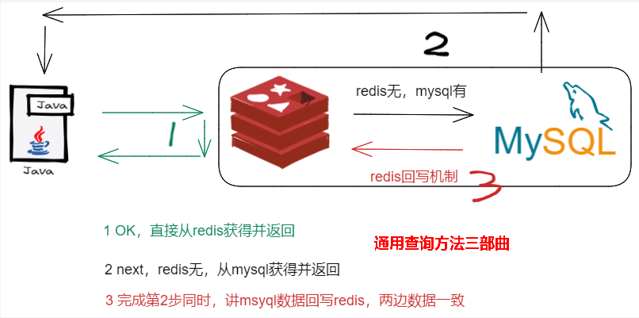
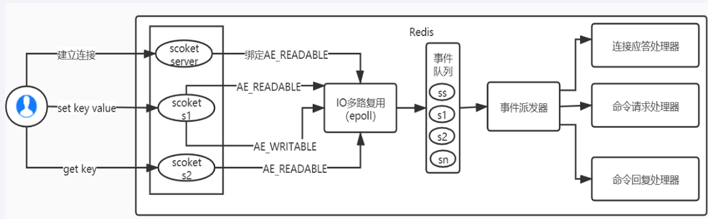
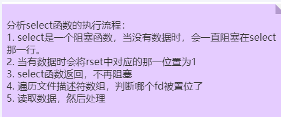

# Redis基础知识

# 1. Redis是什么？

Remote Dictionary Server(**远程字典服务**)是完全开源的，使用ANSIC语言编写遵守BSD协议，是一个高性能的Key-Value数据库提供了丰富的数据结构，例如String、Hash、List、Set、SortedSet等等。数据是存在**内存**中的，同时Redis支持事务、持久化、LUA脚本、发布/订阅、缓存淘汰、流技术等多种功能特性提供了主从模式、Redis Sentinel和Redis Cluster集群架构方案

# 2. Redis的优缺点？

优点：

1. 高性能：由于数据存储在内存中，读写速度非常快。

2. 支持丰富的数据结构：除了简单的键值对，还支持列表、集合、有序集合等复杂数据结构。

3. 持久化选项：支持将数据持久化到磁盘，以防止数据丢失。

4. 分布式：支持分布式部署，可以横向扩展以处理大规模数据。

   - **Redis-Repica主从复制 + Redis-Sentinel哨兵进行实现**

   - **Redis集群进行实现**

5. 支持事务和原子操作：可以执行多个命令作为一个事务进行处理，保证原子性操作。

缺点：

1. 内存限制：由于数据存储在内存中，受到内存容量的限制，不能存储过大的数据集。
2. 持久化性能：将数据持久化到磁盘会影响性能，尤其是在频繁写入的情况下。
3. 单线程：Redis是单线程的(程序执行是单线程)，对于某些高并发场景可能存在性能瓶颈，不适合CPU密集型任务，难以充分利用多核处理器。
4. 数据一致性：在分布式环境下，需要额外的工作来保证数据的一致性。


# 3. Redis有哪些数据格式？

1. **Redis字符串(String),类型(key-value)**
   基本操作：

   - 设置：set
   - 获取：get
   - 数字类型value自增：incr key 1

   **使用场景：**

   - 例如抖音点赞可以使用 incr (点赞都可以使用)
   - 存储用用户的登录信息

2. **Redis列表(List),类型(单Key多value)**
   **底层实际上十个双向链表：两端操作性高，通过索引操作中间节点性能差**
   基本操作：

   - 增加：lpush/rpush
   - 获取：lindex list index / lrange startIndex endIndex

   **使用场景：**

   - 微信公众号订阅消息
     ① 只要某个公众号发布了消息就会 **lpush 用户List** 

     ② 用户浏览公众号发布的消息的时候类似于分页Limit **lrange 用户list 0 9**

3. **Redis哈希(Hash),类型(key-value，但是value值为Map<Object, Object>)**
   基本操作：

   - 增加：hset
   - 获取：hget/hgetall; hkeys/hvals; 
   - 删除：hdel

   **使用场景：**

   - 用户购物车数据的存储 userId, (<productId1, productJson1>,  <productId2, productJson2>)

4. **Redis集合(Set),类型(单key多value,且value不重复)**
   基本操作：

   - 增加：SADD
   - 获取：SMEMBERS(获取所有), 
   - 删除：SREM
   - SISMEMBER key member 判断元素是否在集合中
   - 弹出元素：
     ① SRANDMEMBER key(从set中随机弹出一个元素，元素不删除)
     ② SPOP key(从set中随机弹出一个元素，元素删除)|
   - 集合运算：
     ① A - B SDIFF A B
     ② A ∪ B SUNION A B
     ③ A ∩ B SINTER A B 

   **使用场景：**

   - 抽奖程序(通过上面弹出元素进行实现)
   - 判断好友是否点赞(SISMEMBER pub:msgID 用户ID)
   - 内推你可能认识的人(Set1 Set2 SDIFF Set1 Set2)

5. **Redis有序集合(Zset),类型(单key多value,类似set但每个value前加一个value值用于排序)**
   基本操作：

   - 增加：ZADD <score value>, <score value>
   - 遍历：ZRANGE key start end(从小到大), ZREVERANGE(从大到小)
   - 删除：ZREM key value

   **使用场景：**

   - 获取前销量前十的商品信息

6. **Redis位图(bitmap),类型就是由0和1状态表现出的二进制位的bit数组**
   基本操作：

   - 设置：SETBIT k1 0  1(把位置为0的值设置为1)
   - 获取：GETBIT k1 0(获取位置为0的值)
   - 统计占用字节数：strlen k1
   - 统计全部键里面含有1的有多少：bitcount k1

   **优势**：Bitmap支持的最大位数是2^32位，它可以极大的节约存储空间，使用512M内存就可以存储多达42.9亿的字节信息(2^32 = 4294967296)

   **使用场景：**

   - 登录打卡
   - 设计成布隆过滤器
   
7. **Redis基数统计(HyperLogLog)**
   基本操作：

   - 增加：pfadd hyper1 1 3 4 4 5 6
   - 统计： PFCOUNT hyper1(去重，拿上面的来说就是5)
   - 融合：PFMERGE hyper1 hyper2

   **使用场景：**

   - 统计网站的UV(Unique Visitor：统计客户端的IP)
   
   **注意：**
   
   - 在Redis中，HyperLogLog是一种概率性算法，用于估计集合的基数，而不是存储实际的元素。因此，HyperLogLog数据结构并不支持直接遍历出其中的元素。

# 4. Redis持久化有那些方式？

1. **RDB持久化**

   RDB（Redis Database Backup）是Redis的一种持久化方式，用于将Redis服务器的**数据状态**保存到磁盘上。以下是RDB持久化的工作流程：

   1. 触发持久化：RDB持久化可以通过手动触发（使用SAVE或BGSAVE命令）或自动触发（基于配置文件中的save指令）来执行。
      **手动触发：**
      
      - SAVE：Redis服务器会阻塞，无法处理新的写操作，同时也无法响应客户端的请求。
      - BGSAVE：不会阻塞，因为是异步子线程处理。
      
      **自动触发：**
      
      - 配置文件：<span style="color:red">save 5 2</span>(在5秒的时间间隔内，如果数据集发生了至少2次写操作，记住这两次不一定要在5秒内，而是累计修改次数)
      
   2. **创建子进程(这里是进程不是线程)**：当触发RDB持久化时，Redis会创建一个子进程来执行持久化操作。

   3. 写入临时文件：子进程会通过遍历Redis的内存数据，将数据以二进制格式写入到一个临时文件中。在此过程中，子进程会使用fork和copy-on-write机制，确保只复制父进程修改的数据。

   4. 替换RDB文件：当子进程完成RDB文件的创建后，它会将RDB文件重命名为一个新的文件名，并将该文件替换掉之前的RDB文件。

   5. 持久化完成：子进程完成RDB文件的创建和替换后，它会通知父进程持久化操作已完成。

   RDB持久化的优点包括：

   - RDB文件是一个紧凑的二进制文件，适合用于备份和恢复。
   - RDB持久化操作对Redis服务器的性能影响较小，因为它是在子进程中执行的。
   - RDB文件可以在不同的Redis实例间进行迁移和复制。

   需要注意的是，RDB持久化方式的缺点是，如果在最后一次持久化操作后Redis服务器崩溃，可能会丢失最后一次持久化之后的数据。因此，在生产环境中，可以结合使用AOF（Append-Only File）持久化方式，将写操作以日志的形式追加到AOF文件中，以提供更高的数据安全性和可靠性。

   

2. **AOF持久化**

   AOF（Append-Only File）是Redis的一种持久化方式，用于将Redis服务器的**写操作**以**日志**的形式追加到AOF文件中。以下是AOF持久化的工作流程：

   1. 写入AOF缓冲区：当客户端执行写操作（如SET、INCR等）时，Redis会先将写操作以命令的形式追加到AOF缓冲区中。

   2. AOF缓冲区同步：根据配置，Redis会定期或根据写入操作的数量将AOF缓冲区中的内容同步到AOF文件中。同步的方式有三种：
      - **always**：每次写操作都同步到磁盘，最安全但最慢。
      - **everysec**（默认）：每秒同步一次，平衡了数据安全性和性能。
      - **no**：由操作系统决定何时同步，最快但风险较高，可能会丢失一秒内的数据。

   3. AOF文件持久化：AOF文件会记录了所有的写操作命令，因此通过重新执行AOF文件中的写操作命令，可以还原出Redis服务器的数据状态。

   AOF持久化的优点包括：

   - AOF文件是一个追加写的日志文件，可以确保数据的完整性和一致性。
   - AOF文件记录了所有的写操作命令，因此可以更好地保证数据的持久化和恢复。

   需要注意的是，AOF持久化方式的缺点是，AOF文件可能会变得非常大，因为它记录了所有的写操作命令。为了解决这个问题，Redis提供了AOF重写机制，可以通过AOF重写来压缩AOF文件的大小，去除冗余的写操作命令，从而减小AOF文件的体积(**注意这里是创建了一个子线程**))。

   - **手动触发：**BGREWRITEAOF
   - **自动触发：**根据配置的策略，如文件大小增长到一定阈值

   总的来说，AOF持久化方式通过将写操作以日志的形式追加到AOF文件中，提供了一种可靠的持久化方式，可以更好地保证数据的完整性和一致性。
   
3. **混和使用**

   **数据恢复**：在Redis重启时，如果同时启用了RDB和AOF，Redis会优先使用AOF文件来恢复数据，因为AOF文件包含了更多的操作细节，能够提供更精确的数据状态恢复。AOF重写时可能包含一个**RDB格式的头部**，用于加速启动时的数据加载，随后应用AOF日志进行最终数据校正，这就是所谓的混合持久化策略。

   **优缺点结合**：RDB提供了快速的数据恢复能力以及数据的定期备份点，而AOF则提供了更高的数据持久性，几乎可以做到数据零丢失。结合使用这两种方式，可以确保在灾难发生时，既能快速恢复数据，又能最大程度地减少数据损失。
   
   # 5. Redis事务
   
   1. **是什么**
      一次执行多个命令，本质是一组命令的集合。一个事务中的所有命令都会序列化，**按顺序地串行执行而不会被其它命令插入，不许加塞**。
   
   2. **基本操作**
   
      - 开启：MULTI
      - 执行：EXEC
      - 放弃：DISCARD
      - 监控(乐观锁)：WATCH
      - 解开锁定：UNWATCH
   
      **悲观锁**：每次拿取数据都会上锁，不允许其他人操作。
      **乐观锁**：每次拿取数据认为别人不会修改，不会上锁。但通过**版本**比较，如果修改前发现版本与之前拿到版本不一致，就会重新进行获取。
   
   3. **执行的几种情况**
   
      - 正常执行：**命令集合编译通过，且执行没有报错**
      - 全体连坐：**编译的时候报错(语法错误)，全体不执行**
      - 源头债主：**编译没有报错(语法没错误)，但执行出错(INCR 一个非数值类型)，其它会执行出错的不执行。**
   
      **综上所述，Redis 事务不保证原子性(不一定要么一起成功，要么一起失败)。**
   
   4. **数据库管理系统的ACID**
   
      - **原子性（Atomicity）**： 原子性保证了数据库事务的操作是不可分割的单位。这意味着事务中的所有操作要么全部执行成功，要么全部不执行，不会出现部分执行的情况。如果事务在执行过程中遇到任何错误，所有已经完成的变化都会被回滚，就像这个事务从未发生过一样。
      - **一致性（Consistency）**： 一致性是指在事务执行前后，数据库都保持在一种合法的状态，即满足所有的预定义规则。比如，账户转账的事务应该保证转账前后两个账户的总金额不变。事务的执行不能破坏数据库的内部逻辑一致性。
      - **隔离性（Isolation）**： 隔离性确保了并发执行的事务之间互不影响。当多个事务并发访问同一数据时，每个事务看到的数据就像其它事务不存在一样，从而避免了脏读、不可重复读和幻读等问题。数据库系统提供了不同的事务隔离级别来平衡性能和数据一致性之间的关系。
      - **持久性（Durability）**： 持久性意味着一旦事务提交，它引起的数据变化就会永久保存在数据库中，即使发生系统崩溃或电源故障等情况，这些改变也不会丢失。通常，数据库系统通过日志记录和恢复机制来实现这一特性。
   
   5. **例子：**
   
      开启事务：
   
      ``` bash
      # 开始事务  
      MULTI  
      
      # 添加命令到事务  
      SET key1 "value1"  
      INCR key2  
      
      # 执行事务  
      EXEC  
      
      # 假设key2之前不存在，EXEC命令的返回结果可能是  
      # 1) OK  
      # 2) (integer) 1  
      # 其中"OK"是SET命令的返回值，"(integer) 1"是INCR命令的返回值（因为key2之前不存在，所以INCR从0开始）
      ```
   
      开启乐观锁监视，如果事务执行时该键被修改，事务执行失败：
   
      ``` bash
      WATCH mykey  
      # 取消对 mykey 的监视  
      UNWATCH 
      # 现在可以安全地执行 MULTI 和 EXEC，而不用担心 mykey 的状态  
      MULTI  
      SET mykey "somevalue"  
      EXEC
      ```
   
      

# 5.  如何优化频繁命令往返造成的性能瓶颈？

Redis是一种基于**客户端-服务端**模型以及请求/响应协议的TCP服务。一个请求会遵循以下步骤：

1. 客户端向服务端发送命令分四步(发送命令→命令排队→命令执行→返回结果)，并监听Socket返回，通常以阻塞模式等待服务端响应。
2. 服务端处理命令，并将结果返回给客户端。

**上述两步称为：Round Trip Time(简称RTT,数据包往返于两端的时间)**

如果同时需要执行大量的命令，那么就要等待上一条命令应答后再执行，这中间不仅仅多了RTT（Round Time Trip），而且还频繁调用**系统IO**，发送网络请求，同时需要redis调用多次read()和write()系统方法，系统方法会将数据从用户态转移到内核态，这样就会对进程上下文有比较大的影响了，性能不太好，o(╥﹏╥)o

<span style="color:red">**Redis管道解决此问题**</span>

1. **是什么？**

   Redis管道的工作原理是，客户端可以累积多个命令而不立即发送，而是将这些命令一起打包到一个请求中发送给服务器。服务器接收到这一批命令后，会顺序执行它们，并将所有命令的响应一起返回给客户端。这样，多条命令的网络往返次数就从多次减少到了一次，大大减少了网络延迟带来的开销，提高了执行效率。

2. **基本操作**
   cat cmd.txt | redis-cli -a 111111 --piple

3. **注意事项**
   Redis管道不具有**原子性**，批处理发生异常依然会执行其它的指令。原生批处理mget，mset具有**原子性**。

# 6. Redis-Repica主从复制

<span style="color:red">主机写，从机读</span>（从机写，不会同步到主机)

**原理**

1. **单向复制**：数据复制是单向的，由Master节点向Replica节点进行。
2. **异步复制**：Redis的复制默认是异步的，这意味着Master节点在执行完客户端的命令后，立即将响应返回给客户端，然后异步地将命令复制到Replica节点。（**创建一个线程**）
3. 全量复制与增量复制：
   - **全量复制(首次连接)**：当一个新的Replica首次连接到Master时，会进行全量复制。Master生成一份当前数据集的RDB（Redis Database）快照文件，并将其发送给Replica。Replica加载这个快照来初始化其数据状态。
   - **增量复制**：一旦全量复制完成后，Replica开始持续监听Master的写操作。Master维护一个复制积压缓冲区（Replication Backlog），记录了最近的写操作命令。Replica通过`PSYNC`命令与Master同步这段时间内的增量变更，保持数据的实时一致性。

**工作流程**

1. **初始化连接**：Replica使用`REPLICAOF`命令（以前版本为`SLAVEOF`）配置Master的地址和端口，建立连接。
2. 同步阶段：
   - **全量复制**：Master开始创建RDB快照，并将其发送给Replica。此期间Master继续处理客户端的写请求，这些请求会被记录在复制积压缓冲区中。
   - **增量复制**：全量复制完成后，Replica开始执行增量复制，定期发送`PSYNC`命令检查并获取未同步的命令。
3. **命令传播**：Master将所有写操作命令追加到复制积压缓冲区，并通过`PSYNC`响应给Replica，Replica执行这些命令来保持与Master的数据同步。
4. **心跳与健康检查**：Replica定期向Master发送PING/PONG消息，以保持连接活跃并监控Master的健康状态。
5. **故障恢复**：如果连接中断，Replica会尝试重新连接并根据情况决定进行全量复制还是增量复制来恢复同步。

**缺点**

1. **数据不强一致**：由于Redis的复制是异步的，所以在极端情况下，如果Master节点在将数据更改复制到Replica节点之前崩溃，那么可能会有数据丢失。这意味着Redis不能保证强一致性，而是最终一致性。
   - **强一致性：所有用户都能立即看到最新的、一致的数据状态。**
     常用于金融交易、银行系统、计费系统等对数据即时准确度要求极高的场景。
   - **最终一致性：最终一致性模型允许系统在一段时间后达到一致性状态，**
     广泛应用于社交网络、电子商务、内容管理系统等，这些场景可以容忍短暂的数据不一致，追求更高的系统扩展性和可用性。
2. **主从延迟**：在高负载情况下，Master和Replica之间的数据同步可能会出现延迟。这可能影响依赖最新数据的应用程序性能，尤其是在读操作需要高度一致性的场景中。
3. **资源消耗**：全量复制过程中，生成RDB快照和传输整个数据集会消耗Master的CPU和网络资源，同时Replica也需要资源来加载和解析RDB文件。对于大型数据库，这可能是一个显著的开销。
4. **单点故障问题**：在没有额外组件（如Redis Sentinel或Redis Cluster）的情况下，如果**Master**节点失败，需要手动干预来提升一个Replica为新的Master，这可能导致服务中断。
5. **写操作扩展受限**：Redis的复制主要是为了数据冗余和读取扩展，写操作仍然只能在Master上执行。这意味着写操作的吞吐量受限于单个Master的能力。
6. **复杂性增加**：随着Redis集群规模的扩大，管理复制关系、故障转移、以及监控复制延迟等任务的复杂性也会增加。
7. **网络分区问题**：在网络分区（Network Partition）情况下，如果没有适当的配置和工具（例如Redis Sentinel），可能会导致数据不一致或者服务不可用。

**实例：**

- Master
  ``` bash
  # 绑定地址，根据需要修改  
  bind 127.0.0.1  
    
  # 端口号  
  port 6379  
    
  # 持久化配置（可选，根据需要配置）  
  # save 900 1  
  # save 300 10  
  # save 60 10000  
    
  # AOF 持久化配置（可选）  
  # appendonly yes  
    
  # 日志文件位置  
  logfile "/var/log/redis/redis-server.log"  
    
  # 数据库数量  
  databases 16  
    
  # 其他配置...
  ```

- Slave
  ``` bash
  # 绑定地址，根据需要修改  
  bind 127.0.0.1  
    
  # 端口号，确保与主节点不同  
  port 6380  
    
  # 复制设置  
  replicaof 127.0.0.1 6379  
    
  # 持久化配置（可选，根据需要配置）  
  # save 900 1  
  # save 300 10  
  # save 60 10000  
    
  # AOF 持久化配置（可选）  
  # appendonly yes  
    
  # 日志文件位置  
  logfile "/var/log/redis/redis-server-slave1.log"  
    
  # 数据库数量  
  databases 16  
    
  # 其他配置...
  ```
  
- 注意

  1. Master节点负责写，Slave节点负责读，Slave节点写不会同步到Master节点。

**<span style="color:red">因为无法自己选出故障master节点， 引出 Sentinel(哨兵)</span>**

# 7. Redis-Sentinel哨兵

<span style="color:red">Sentinel是单独的一个服务器，一般是奇数个，进行投票选出master节点。</span>

Redis Sentinel（哨兵）是Redis官方提供的一个分布式监控和故障恢复系统，主要用来解决Redis集群中Master节点故障时的自动发现和故障转移问题。Sentinel系统可以监视多个Redis实例，包括主服务器（Master）和从服务器（Slave），并能够在主服务器变得不可用时自动将一个从服务器升级为新的主服务器。下面是Redis Sentinel的一些关键特性及工作原理：

**关键特性：**

1. **监控**: Sentinel持续检查主服务器和从服务器是否按预期运行，通过定期发送PING命令并监视响应。
2. **通知**: 当检测到Redis实例运行异常时（比如主服务器下线），Sentinel可以通知管理员或其他应用程序关于系统中的异常情况。
3. **自动故障转移**: 最核心的功能，当主服务器被判定为失联时，Sentinel会自动启动一个选举过程来选择一个新的主服务器，并将剩余的从服务器重新配置为新主服务器的从属。
4. **配置提供者**: 在故障转移之后，Sentinel充当客户端的配置提供者，能够告知客户端新的主服务器地址，使得客户端能够透明地发现和连接到新的主服务器，这一过程对客户端而言通常是透明的。

**工作原理简述：**

- **部署**: Sentinel作为一个独立的服务运行，**通常建议部署至少三个Sentinel实例以形成一个Sentinel系统**，以避免因单点故障导致的误判或无法完成故障转移。
- **主观下线与客观下线**:
  - **主观下线**: 如果一个Sentinel在一定时间内没有收到某个Redis实例的响应，它会标记该实例为“主观下线”。
  - **客观下线**: 当足够多的Sentinel（根据配置，通常是大多数）都报告同一个主服务器主观下线时，这个主服务器会被标记为“客观下线”，触发故障转移过程。
- **领导者选举**: 在进行故障转移之前，Sentinels之间会进行领导者选举，选出的领导者负责故障转移的具体操作。
- **故障转移**: 包括选择一个新的主服务器（通常是最“合适”的从服务器）、重新配置所有其他从服务器指向新的主服务器、更新客户端配置等步骤。

通过上述机制，Redis Sentinel提供了Redis集群的高可用性保障，确保即使面对单点故障也能维持服务的连续性和数据的完整性。

**缺点：**

1. **数据不一致性风险**：在故障转移期间，如果客户端在旧主服务器被标记为下线前写入数据，这部分数据可能会丢失，因为故障转移后这部分数据可能没有来的即被复制到salve机器，并且不会被同步到新的主服务器。
2. **脑裂问题**：在网络分区或网络不稳定的情况下，不同的Sentinel集群可能对系统状态有不同的看法，导致“脑裂”现象，即同一时间可能存在多个主服务器，造成数据冲突和不一致性。
3. **配置复杂性**：相对于单一的Redis服务器或简单的主从配置，引入Sentinel增加了系统的配置复杂度。正确设置和维护Sentinel集群需要细致的规划和对Sentinel工作机制的深入理解。

**实例：**
配置 **三个哨兵** + **一主二从**

- Sentinel1
  ``` bash
  bind 0.0.0.0
  daemonize yes
  protected-mode no
  port 26379
  logfile "/myredis/sentinel26379.log"
  pidfile /var/run/redis-sentinel26379.pid
  dir /myredis
  sentinel monitor mymaster 192.168.111.169 6379 2	# 主机名称，地址，端口号，选举最低票数
  sentinel auth-pass mymaster 111111	# 主机密码
  ```

- Sentinel2
  ``` bash
  bind 0.0.0.0
  daemonize yes
  protected-mode no
  port 26380
  logfile "/myredis/sentinel26380.log"
  pidfile /var/run/redis-sentinel26380.pid
  dir "/myredis"
  sentinel monitor mymaster 192.168.111.169 6379 2
  sentinel auth-pass mymaster 111111
  ```

- Sentinel3
  ``` bash
  bind 0.0.0.0
  daemonize yes
  protected-mode no
  port 26381
  logfile "/myredis/sentinel26381.log"
  pidfile /var/run/redis-sentinel26381.pid
  dir "/myredis"
  sentinel monitor mymaster 192.168.111.169 6379 2
  sentinel auth-pass mymaster 111111
  ```

- MasterRedis
  ``` bash
  bind 192.168.11.100 	
  # 端口号  
  port 6379  
  # 设置密码  
  requirepass 111111  
  # 设置主机密码
  masterauth 111111
  ```

- SalveRedis1
  ``` bash
  bind 192.168.11.101 	
  # 端口号  
  port 6380  
  # 设置密码  
  requirepass 111111  
  # 设置主机密码
  masterauth 111111
  # 设置主从复制
  replicaof 192.168.11.100 6379
  ```

- SalveRedis2
  ``` bash
  bind 192.168.11.102 	
  # 端口号  
  port 6381  
  # 设置密码  
  requirepass 111111  
  # 设置主机密码
  masterauth 111111
  # 设置主从复制
  replicaof 192.168.11.100 6379
  ```
  
- SpringBoot配置
  ``` yaml
  spring:
    redis:
      sentinel:
        master: mymaster                # 哨兵监控的主节点名称，哨兵配置中指定的 "mymaster"
        nodes:                          # 哨兵节点地址
          - <sentinel1-ip>:26379
          - <sentinel2-ip>:26380
          - <sentinel3-ip>:26381
      password: your-redis-password      # Redis 主从节点的密码（如果设置）
      database: 0                        # 默认数据库编号
      timeout: 3000                      # 连接超时时间，单位毫秒
  ```

- 启动
  先启动 **一主三从 ** 再启动 **三个Sentinel哨兵** **redis-sentinel sentinel.conf** 

- 注意

  1. Sentinel哨兵模式只支持一个Master节点
  2. Master节点负责写，Slave节点负责读，从节点写入不会同步到Master节点。

**因为不能保证数据的零丢失引出 cluster集群 概念**, 因为再主机下线之前向主机传入数据，而主机没有来得及更新。

# 8. Redis-Cluster集群

<span style="color:red">redis集群支持多个master，且不需要额外开启多余的Redis服务器。</span>

Redis Cluster 是Redis的一个**分布式实现**，它提供了数据**自动分片（sharding）**、**故障转移**、**高可用性和水平扩展的能力**。以下是Redis Cluster的基本原理和部署步骤：

**原理**

1. **数据分片（Sharding）与哈希槽**：Redis Cluster使用**哈希槽（Slot）**分区算法来分片数据。整个键空间被划分为16384个槽（编号从0到16383），每个键值对都会根据键的CRC16校验值对16384取模，确定其所属的槽位。集群中的每个节点负责一部分槽，这样就可以将数据**均匀分布**在不同的节点上。
   - **哈希槽机制**让Redis Cluster能够轻松地实现数据的分布式存储，自动负载均衡，以及在不影响服务的情况下动态地调整集群规模。通过这种设计，Redis Cluster不仅提高了系统的可扩展性和可用性，还保持了相对简单的客户端实现逻辑。
2. **无中心化设计**：Redis Cluster是一个去中心化的系统，每个节点都存储了集群的元数据，包括集群的拓扑结构、各节点状态以及槽的分配情况。节点间通过Gossip协议来传播和维护这些信息，实现最终一致性。
3. **高可用性**：Redis Cluster支持主从复制，每个主节点都有一个或多个从节点作为备份。当主节点发生故障时，从节点可以被提升为新的主节点，以保证服务的连续性。
4. **故障检测与恢复**：Sentinel机制不是Redis Cluster的一部分，但**Cluster内部有内置的故障检测机制，通过互相发送PING命令和监测节点的响应来判断节点状态。一旦发现主节点故障，会自动触发故障转移流程。**
5. **客户端路由**：客户端可以直接与Redis Cluster交互，无需中间代理。客户端需要实现或使用支持Cluster协议的客户端库来计算键的槽位，并根据槽位找到对应的节点进行操作。

**部署步骤**

1. **准备环境**：确保每台服务器安装了Redis，并且配置了正确的端口和服务启动参数。
2. **初始化集群**：选择几台服务器作为初始集群节点，使用`redis-cli`命令行工具或者专用的集群管理工具（如`redis-trib.rb`或`redis-cli --cluster create`）来创建集群。你需要指定参与集群的所有节点地址和端口。
3. **节点分配**：在创建集群时，工具会询问你是否使用默认的槽分配（通常会平均分配给所有主节点）或手动分配。完成后，集群将自动分配槽给各个节点。
4. **测试集群**：使用客户端连接到任一节点，并尝试进行读写操作，验证数据是否能正确分布和读取。
5. **监控与管理**：考虑部署Sentinel或使用云服务商提供的监控服务来监控集群状态，以便及时发现并处理故障。

**实例：**
布置 **三主三从cluster集群**

- Cluster1
  ``` bash
  bind 0.0.0.0
  daemonize yes
  protected-mode no
  port 6381
  logfile "/myredis/cluster/cluster6381.log"
  pidfile /myredis/cluster6381.pid
  dir /myredis/cluster
  dbfilename dump6381.rdb
  appendonly yes
  appendfilename "appendonly6381.aof"
  requirepass 111111
  masterauth 111111
   
  cluster-enabled yes
  cluster-config-file nodes-6381.conf
  cluster-node-timeout 5000
  ```

- Cluster2
  ``` bash
  bind 0.0.0.0
  daemonize yes
  protected-mode no
  port 6382
  logfile "/myredis/cluster/cluster6382.log"
  pidfile /myredis/cluster6382.pid
  dir /myredis/cluster
  dbfilename dump6382.rdb
  appendonly yes
  appendfilename "appendonly6382.aof"
  requirepass 111111
  masterauth 111111
   
  cluster-enabled yes
  cluster-config-file nodes-6382.conf
  cluster-node-timeout 5000
  ```

- Cluster3
  ``` bash
  bind 0.0.0.0
  daemonize yes
  protected-mode no
  port 6383
  logfile "/myredis/cluster/cluster6383.log"
  pidfile /myredis/cluster6383.pid
  dir /myredis/cluster
  dbfilename dump6383.rdb
  appendonly yes
  appendfilename "appendonly6383.aof"
  requirepass 111111
  masterauth 111111
  
  cluster-enabled yes
  cluster-config-file nodes-6383.conf
  cluster-node-timeout 5000
  ```

- Cluster4
  ```bash
  bind 0.0.0.0
  daemonize yes
  protected-mode no
  port 6384
  logfile "/myredis/cluster/cluster6384.log"
  pidfile /myredis/cluster6384.pid
  dir /myredis/cluster
  dbfilename dump6384.rdb
  appendonly yes
  appendfilename "appendonly6384.aof"
  requirepass 111111
  masterauth 111111
   
  cluster-enabled yes
  cluster-config-file nodes-6384.conf
  cluster-node-timeout 5000
  ```

- Cluster5

  ``` bash
  bind 0.0.0.0
  daemonize yes
  protected-mode no
  port 6385
  logfile "/myredis/cluster/cluster6385.log"
  pidfile /myredis/cluster6385.pid
  dir /myredis/cluster
  dbfilename dump6385.rdb
  appendonly yes
  appendfilename "appendonly6385.aof"
  requirepass 111111
  masterauth 111111
   
  cluster-enabled yes
  cluster-config-file nodes-6385.conf
  cluster-node-timeout 5000
  ```

- Cluster6
  ``` bash
  bind 0.0.0.0
  daemonize yes
  protected-mode no
  port 6386
  logfile "/myredis/cluster/cluster6386.log"
  pidfile /myredis/cluster6386.pid
  dir /myredis/cluster
  dbfilename dump6386.rdb
  appendonly yes
  appendfilename "appendonly6386.aof"
  requirepass 111111
  masterauth 111111
   
  cluster-enabled yes
  cluster-config-file nodes-6386.conf
  cluster-node-timeout 5000
  ```

- 启动

  1. 分别启动六台Cluster集群
     redis-server redis.conf
  2. 构建主从关系
     **redis-cli -a 111111** **--cluster create** **--cluster-replicas 1** **192.168.111.175:6381 192.168.111.175:6382 192.168.111.172:6383 192.168.111.172:6384 192.168.111.174:6385 192.168.111.174:6386**
  3. 节点检查
     - info replication：查看本节点状态
     - cluster info：查看集群信息
     - cluster nodes：查看整个节点状况

- 注意事项

  1. **集群允许有多个mater节点**

  2. 同时每个集群实例分配一定范围的**槽位**，通过某个master节点操作时候为了实现主从复制，记得加上 -c
     ``` bash
     redis-cli -a 111111 -p 6370 -c
     ```

  3. 无论是 **主从复制**、**Setninel哨兵**、**Cluster集群**，Master节点负责写，Slave节点负责读取。

  4. Cluster集群自带 **故障转移** 无需使用 Sentinel集群。

# 高级篇

# 1. Redis是单线程的么？

Redis的版本很多3.x、4.x、6.x，版本不同架构也是不同的，不限定版本问是否单线程也不太严谨。

1. 版本3.x ，最早版本，也就是大家口口相传的redis是单线程。
2. 版本4.x，严格意义来说也不是单线程，而是负责处理客户端请求的线程是单线程，但是开始加了点多线程的东西(异步删除)。
3. 2020年5月版本的6.0.x后及2022年出的7.0版本后，告别了大家印象中的单线程，用一种全新的多线程来解决问题。

但对于**大数据的 key 删除**还是卡顿厉害，因此在 Redis 4.0 引入了**多线程unlink key/flushall async(多线程的删除)** 等命令，主要用于 Redis 数据的异步删除；

而在 Redis6/7中引入了 **I/O 多线程的读写**，这样就可以更加高效的处理更多的任务了，Redis 只是将 I/O 读写变成了多线程，而命令的执行依旧是由主线程串行执行的，因此在多线程下操作 Redis 不会出现线程安全的问题。

**总结：**
**Redis在大部分情况下是单线程的，但在特定的场景下会使用多线程来执行一些特定的任务。这种设计既保持了Redis的简单性和高性能，又能满足一些复杂场景下的需求。**

**Redis工作线程是单线程的(单线程处理客户端请求)， 整个Redis来说是多线程的。**


## Redis什么时候会使用多线程？

- 主从复制(Repica)：在Redis的主从复制中，主节点负责处理客户端请求，而从节点负责复制主节点的数据。从节点会使用多线程来处理复制过程，以提高复制的效率。
- AOF重写：当Redis使用AOF（Append Only File）持久化方式时，会定期进行AOF文件的重写，以减小AOF文件的大小。AOF重写过程中，Redis会使用多线程来读取旧的AOF文件并重写新的AOF文件。
- 集群模式：在Redis集群模式中，不同的节点之间会使用多线程进行通信和数据同步，以保证集群的一致性和高可用性。
- 多线程网络IO读写：当有多个客户端同时向Redis服务器发送请求时，网络IO线程会负责接收并解析这些请求，但处理时单线程的。
- 特定的操作优化：如大数据Key删除，过期键的清理等。

**注意：**

1. RDF持久化过程创建RDF文件过程是 **创建了一个新线程**

2. 在Redis6.0及7后，**多线程机制默认是关闭的**，如果需要使用多线程功能，需要在redis.conf中完成两个设置
   ``` bash
   io-thread-do-reads yes
   io-thread 4 # 如果为 8 核 CPU 建议线程数设置为 6
   ```

   

# 2. 为什么Redis那么快？

1. **内存存储**：Redis将数据存储在内存中，而不是磁盘上，这使得它能够快速读取和写入数据。相比于传统的基于磁盘的数据库，内存存储可以提供更高的读写性能。
2. **单线程模型**：Redis 是单线程处理命令的，避免了**多线程之间的锁竞争**和**上下文切换**的开销。这使得Redis能够在**处理请求时更加高效**，并且能够处理大量的并发请求。
3. **基于异步IO**：Redis使用了异步IO来处理网络请求，这意味着它可以同时处理多个客户端请求，而不需要等待前一个请求完成。这种异步处理方式可以提高Redis的响应速度和并发能力。
   **异步IO实现方式：**<span style="color:red">**IO多路复用+非阻塞IO(epoll函数实现)**</span>
4. 简单的数据结构：Redis支持多种简单而高效的数据结构，如字符串、哈希表、列表、集合和有序集合等。这些数据结构的实现非常精简，使得Redis能够快速地进行数据操作。
5. 优化的算法和数据结构：Redis内部使用了一些优化的算法和数据结构，如跳跃表和压缩列表等。这些优化使得Redis在执行一些常见的操作时能够更加高效。

**对于Redis主要性能瓶颈是<span style="color:red">网络带宽，内存</span>而非CPU**

# 3. 什么是IO多路复用和非阻塞IO？

<span style="color:red">就是解决Redis-IO单线程瓶颈问题</span>

IO多路复用（IO multiplexing）和非阻塞IO（non-blocking IO）是用于提高系统并发性能和响应速度的两种技术。

1. **IO多路复用：**
   IO多路复用是一种**通过一个线程来监听多个IO事件的机制**。在IO多路复用中，程序可以通过一个系统调用（如select、poll、epoll等）来同时监听多个文件描述符（sockets、pipes等），当有IO事件发生时，程序会被通知并可以对相应的IO事件进行处理。这种机制可以避免创建多个线程或进程来处理多个IO事件，提高了系统的并发性能。

在IO多路复用中，当某个IO事件发生时，程序会被唤醒并得到通知，然后程序可以通过非阻塞IO的方式来处理这个IO事件。常见的IO多路复用技术包括select、poll和epoll。在Linux系统中，**epoll**是最为常用和高效的IO多路复用技术。

2. **非阻塞IO：**

   在传统的阻塞 I/O 模型中，I/O 操作（如读取、写入）会阻塞当前线程，直到操作完成。而 Redis 使用非阻塞 I/O，它不会在等待 I/O 操作时阻塞执行，而是立即返回并继续处理其他任务。当数据准备好时，Redis 会接收到相应的事件通知，然后继续处理这个 I/O 操作。

   - **非阻塞的读取（Non-blocking read）：** 当客户端发送请求时，Redis 不会等待完整的请求数据到达再开始处理，而是使用非阻塞读取。它可以立即返回，且当数据准备好时再次触发读取操作。
   - **非阻塞的写入（Non-blocking write）：** 类似于读取，Redis 向客户端返回数据时，也会使用非阻塞写入。数据可能一次性写入完成，也可能是部分写入，这时 Redis 会再次等待写入事件，然后继续将剩余数据发送出去。

在非阻塞IO中，程序可以通过**轮询或者回调**等方式来检查IO操作的状态，当IO操作完成时，程序可以继续执行后续的操作。非阻塞IO通常与IO多路复用结合使用，以提高系统的并发性能和响应速度。

3. **总结**

总的来说，IO多路复用和非阻塞IO都是用于提高系统并发性能和响应速度的技术。IO多路复用可以同时监听多个IO事件，提高系统的并发能力；非阻塞IO可以使程序在进行IO操作时不会阻塞，提高系统的响应速度。这两种技术通常结合使用，以提高系统的性能和效率。


# 4. Redis怎么优化开启多线程？

Redis7将所有数据放在内存中，内存的响应时长大约为100纳秒，对于小数据包，Redis服务器可以处理8W到10W的QPS，

这也是Redis处理的极限了，**对于80%的公司来说，单线程的Redis已经足够使用了**。

**QPS**是"Queries Per Second"的缩写，指的是每秒钟能够处理的查询数量。

在Redis6.0及7后，多线程机制默认是关闭的，如果需要使用多线程功能，需要在redis.conf中完成两个设置

- 设置**io-thread-do-reads**配置项为yes，表示启动多线程。
- **io-threads 线程数**：设置线程个数。关于线程数的设置，官方的建议是如果为 4 核的 CPU，建议线程数设置为 2 或 3，如果为 8 核 CPU 建议线程数设置为 6，线程数一定要小于机器核数，线程数并不是越大越好。


# 5. 如何限制FlushAll, Flushall等危险命令？

配置文件设置禁用选项：

- rename- command keys ""
- rename- command flushdb ""
- rename- command FLUSHALL ""

**测试：**

- 循环生成对应的数据文件：for((i=1;i<=100*10000;i++)); do echo "set k$i v$i" >> redisTest.txt ;done;

- 管道批处理：cat redisTest.txt | redis-cli -h 127.0.0.1 -p 6379 -a 111111 --pipe

此时禁用了Keys选项，取而代之的为Scan选项：

- **scan cusor [mathch 匹配字段] [count num]**
  EX: scan 0 match k* count 2
  **注意：**次数为非顺序的，但可以通过match进行匹配出你想要的key

# 6. 多大算bigkey？怎么发现？怎么处理？

1. **多大算bigkey？**

   - String类型控制在10kb以内，hash，list，set，zset元素不能超过5000个

   **bigkey坏处：**

   1. **内存占用过高**：大键占用大量内存，可能导致Redis实例的内存占用过高，降低了系统的稳定性和性能。
   2. **影响性能**：处理大键可能会影响Redis的性能，特别是在执行一些操作时，比如复制数据、持久化、备份等。
   3. **增加网络传输开销**：当需要将大键从一个Redis节点传输到另一个节点时，会增加网络传输的开销，影响系统的响应速度。
   4. **影响持久化**：大键可能会影响Redis的持久化操作，例如RDB快照或AOF日志文件的生成和加载。
   5. **增加复制延迟**：在Redis主从复制中，大键的传输可能会增加复制延迟，影响从节点的同步速度。
   6. **降低缓存效率**：如果大键是用于缓存数据的，那么它可能会降低缓存的效率，因为大键需要更多的内存空间，并且可能导致缓存命中率降低。

2. **如何发现bigkey？**

   

   - 使用命令：--bigkeys

     redis-cli -h 127.0.0.1 -p 6379 -a 111111 --bigkeys

     ``` tex
     Sampled 1000000 keys in the keyspace!
     Total key length in bytes is 6888896 (avg len 6.89)
     
     Biggest string found '"k1000000"' has 8 bytes
     
     0 lists with 0 items (00.00% of keys, avg size 0.00)
     0 hashs with 0 fields (00.00% of keys, avg size 0.00)
     1000000 strings with 6888896 bytes (100.00% of keys, avg size 6.89)
     0 streams with 0 entries (00.00% of keys, avg size 0.00)
     0 sets with 0 members (00.00% of keys, avg size 0.00)
     0 zsets with 0 members (00.00% of keys, avg size 0.00)
     ```

   - MEMORY USAGE(**判断key的字节数**)

     ``` tex
     127.0.0.1:6379> SET mykey "Hello"
     OK
     127.0.0.1:6379> MEMORY USAGE mykey
     (integer) 40
     ```

     **返回结果为字节**

3. **怎么进行删除BigKey**

   **因为Redis删除操作时阻塞的，因此在进行bigKey删除的时候不建议直接进行删除，而是渐进式删除或者unlink多线程进行删除**

   1. **非字符串** 的bigkey不要使用 **del删除** ，应使用hscan，sscan，zscan进行**渐进删除**(先将bigkey删除到体量为非bigkey然后再用del进行删除)

   2. **字符串** 类型一般用Del,如果过于庞大使用Unlink进行删除。

      

   **具体实例：**

   <span style="color:red">具体实现思路：</span> 
   ① 如果数量超过BigKey阈值(5000一般)触发惰性扫描
   ② 每次通过Scan扫描出100个值的所以Cusor
   ③ 循环进行删除即可，直到

   - Hash类型渐进式删除

     ``` java
     import org.springframework.beans.factory.annotation.Autowired;
     import org.springframework.data.redis.core.Cursor;
     import org.springframework.data.redis.core.HashOperations;
     import org.springframework.data.redis.core.RedisTemplate;
     import org.springframework.data.redis.core.ScanOptions;
     import org.springframework.stereotype.Service;
     
     @Service
     public class ProgressiveHashDeleteService {
     
         private static final int BATCH_SIZE = 100; // 每次删除的元素数量
         private static final long THRESHOLD = 5000; // 大键的阈值
     
         @Autowired
         private RedisTemplate<String, Object> redisTemplate;
     
         public void progressiveDelete(String hashKey) {
             long size;
             do {
                 size = redisTemplate.opsForHash().size(hashKey); // 获取哈希表的元素数量
     
                 if (size > THRESHOLD) {
                     // 如果大键的元素数量超过阈值，则开始渐进式删除
                     Cursor<Map.Entry<Object, Object>> cursor = redisTemplate.opsForHash().scan(hashKey, ScanOptions.scanOptions().count(BATCH_SIZE).build());
                     while (cursor.hasNext()) {
                         Map.Entry<Object, Object> entry = cursor.next();
                         Object field = entry.getKey();
                         redisTemplate.opsForHash().delete(hashKey, field); // 删除哈希表中的元素
                     }
                     cursor.close();
                 }
             } while (size > THRESHOLD);	// 直到不再是bigKey
     
             // 最后，删除键本身(此时不是BigKey删除不会造成阻塞)
             redisTemplate.delete(hashKey);
         }
     }
     
     ```

   - Set类型渐进式删除
     ``` java
     import org.springframework.beans.factory.annotation.Autowired;
     import org.springframework.data.redis.core.Cursor;
     import org.springframework.data.redis.core.RedisTemplate;
     import org.springframework.data.redis.core.ScanOptions;
     import org.springframework.stereotype.Service;
     
     @Service
     public class ProgressiveDeleteService {
     
         private static final int BATCH_SIZE = 100; // 每次删除的元素数量
         private static final long THRESHOLD = 5000; // 大键的阈值
     
         @Autowired
         private RedisTemplate<String, Object> redisTemplate;
     
         public void progressiveDelete(String key) {
             long size;
             do {
                 size = redisTemplate.opsForSet().size(key); // 获取集合的元素数量
     
                 if (size > THRESHOLD) {
                     // 如果大键的元素数量超过阈值，则开始渐进式删除
                     Cursor<Object> cursor = redisTemplate.opsForSet().scan(key, ScanOptions.scanOptions().count(BATCH_SIZE).build());
                     while (cursor.hasNext()) {
                         Object member = cursor.next();
                         redisTemplate.opsForSet().remove(key, member); // 删除集合中的元素
                     }
                     cursor.close();
                 }
             } while (size > THRESHOLD);
     
             // 最后，删除键本身
             redisTemplate.delete(key);
         }
     }
     
     ```

   - ZSet渐进式删除
     ``` java
     import org.springframework.beans.factory.annotation.Autowired;
     import org.springframework.data.redis.core.Cursor;
     import org.springframework.data.redis.core.RedisTemplate;
     import org.springframework.data.redis.core.ScanOptions;
     import org.springframework.stereotype.Service;
     
     @Service
     public class ProgressiveZSetDeleteService {
     
         private static final int BATCH_SIZE = 100; // 每次删除的元素数量
         private static final long THRESHOLD = 5000; // 大键的阈值
     
         @Autowired
         private RedisTemplate<String, Object> redisTemplate;
     
         public void progressiveDelete(String zsetKey) {
             long size;
             do {
                 size = redisTemplate.opsForZSet().zCard(zsetKey); // 获取有序集合的元素数量
     
                 if (size > THRESHOLD) {
                     // 如果大键的元素数量超过阈值，则开始渐进式删除
                     Cursor<org.springframework.data.redis.core.ZSetOperations.TypedTuple<Object>> cursor =
                             redisTemplate.opsForZSet().scan(zsetKey, ScanOptions.scanOptions().count(BATCH_SIZE).build());
                     while (cursor.hasNext()) {
                         org.springframework.data.redis.core.ZSetOperations.TypedTuple<Object> tuple = cursor.next();
                         Object member = tuple.getValue();
                         redisTemplate.opsForZSet().remove(zsetKey, member); // 删除有序集合中的元素
                     }
                     cursor.close();
                 }
             } while (size > THRESHOLD);
     
             // 最后，删除键本身
             redisTemplate.delete(zsetKey);
         }
     }
     ```

   - List渐进式删除
     ``` java
     import org.springframework.beans.factory.annotation.Autowired;
     import org.springframework.data.redis.core.Cursor;
     import org.springframework.data.redis.core.RedisTemplate;
     import org.springframework.data.redis.core.ScanOptions;
     import org.springframework.stereotype.Service;
     
     @Service
     public class ProgressiveListDeleteService {
     
         private static final int BATCH_SIZE = 100; // 每次删除的元素数量
         private static final long THRESHOLD = 5000; // 大键的阈值
     
         @Autowired
         private RedisTemplate<String, Object> redisTemplate;
     
         public void progressiveDelete(String listKey) {
             long size;
             do {
                 size = redisTemplate.opsForList().size(listKey); // 获取列表的元素数量
     
                 if (size > THRESHOLD) {
                     // 如果大键的元素数量超过阈值，则开始渐进式删除
                     Cursor<Object> cursor = redisTemplate.opsForList().scan(listKey, ScanOptions.scanOptions().count(BATCH_SIZE).build());
                     while (cursor.hasNext()) {
                         Object element = cursor.next();
                         redisTemplate.opsForList().remove(listKey, 1, element); // 删除列表中的元素
                     }
                     cursor.close();
                 }
             } while (size > THRESHOLD);
     
             // 最后，删除键本身
             redisTemplate.delete(listKey);
         }
     }
     ```

   - String一般用del但过于庞大用**unlink多线程删除**
     该命令和`DEL`十分相似：删除指定的key(s),若key不存在则该key被跳过。但是，相比`DEL`会产生阻塞，该命令会在另一个线程中回收内存，因此它是非阻塞的。 这也是该命令名字的由来：仅将keys从keyspace元数据中删除，真正的删除会在后续异步操作。
     
     ``` java
     import org.springframework.beans.factory.annotation.Autowired;
     import org.springframework.data.redis.core.RedisTemplate;
     import org.springframework.stereotype.Service;
     
     import java.util.concurrent.ExecutorService;
     import java.util.concurrent.Executors;
     
     @Service
     public class MultiThreadedDeleteService {
     
         @Autowired
         private RedisTemplate<String, String> redisTemplate;
     
         private static final int THREAD_COUNT = 5; // 线程数量
     
         public void multiThreadedDelete(String key) {
             ExecutorService executor = Executors.newFixedThreadPool(THREAD_COUNT);
     
             for (int i = 0; i < THREAD_COUNT; i++) {
                 executor.execute(() -> {
                     redisTemplate.unlink(key);
                 });
             }
     
             executor.shutdown();
             while (!executor.isTerminated()) {
                 // 等待所有任务完成
             }
             executor.shutdownNow(); // 确保线程池中的所有线程都已关闭
         }
     }
     
     ```


# 7. 开启非阻塞DEL，FLUSHDB，FLUSHALL

**在Redis中，`DEL`, `FLUSHDB`, 和 `FLUSHALL` 命令都是阻塞的，因为它们会在执行期间阻止其他命令的执行。但是，你可以通过在Redis中使用多个实例来模拟非阻塞的行为。**

- lazyfree-lazy-server-del yes
- replica-lazy-flush yes
-  lazyfree-lazy-user-del yes


# 8. 怎么保证Redis和Mysql数据的一致性？

基本流程：



## 1. 你怎么实现基本Redis缓存业务逻辑的呢(双检加锁)？

**问题：**
在高并发场景下，假如此时redis中为空，两个线程会同时去mysql中请求数据，那么如果第一个线程请求成功此时mysql数据修改了，第二个在此时也去请求但在此时mysql中数据修改了导致此时redis中数据和线程一中的不一致。

**高并发通过双检加锁进行优化基本业务逻辑：**

- 第一个线程查到为空，加锁实现线程同步(互斥锁)
- 第一线程在查找一次，如果还没有就从数据库中加入到redis缓存中

``` java
public class UserService {
    public static final String CACHE_KEY_USER = "user:";
    @Resource
    private UserMapper userMapper;
    @Resource
    private RedisTemplate redisTemplate;

    /**
     * 双检加锁：加强补充，避免突然key失效了，高并发，打爆mysql，做一下预防，尽量不出现击穿的情况。
     * @param id
     * @return
     */
    public User findUserById2(Integer id)
    {
        User user = null;
        String key = CACHE_KEY_USER+id;

        //1 先从redis里面查询，如果有直接返回结果，如果没有再去查询mysql，
        // 第1次查询redis，加锁前
        user = (User) redisTemplate.opsForValue().get(key);
        if(user == null) {
            //2 大厂用，对于高QPS的优化，进来就先加锁，保证一个请求操作，让外面的redis等待一下，避免击穿mysql
            synchronized (UserService.class){	// 这里使用的是一个同步代码块
                //第2次查询redis，加锁后
                user = (User) redisTemplate.opsForValue().get(key);
                //3 二次查redis还是null，可以去查mysql了(mysql默认有数据)
                if (user == null) {
                    //4 查询mysql拿数据(mysql默认有数据)
                    user = userMapper.selectByPrimaryKey(id);
                    if (user == null) {
                        return null;
                    }else{
                        //5 mysql里面有数据的，需要回写redis，完成数据一致性的同步工作
                        redisTemplate.opsForValue().setIfAbsent(key,user,7L,TimeUnit.DAYS);
                    }
                }
            }
        }
        return user;
    }

}
```

**QPS(每秒查询次数)小于等于1000**

``` java
public class UserService {
    public static final String CACHE_KEY_USER = "user:";
    @Resource
    private UserMapper userMapper;
    @Resource
    private RedisTemplate redisTemplate;

    /**
     * 业务逻辑没有写错，对于小厂中厂(QPS《=1000)可以使用，但是大厂不行
     * @param id
     * @return
     */
    public User findUserById(Integer id)
    {
        User user = null;
        String key = CACHE_KEY_USER+id;

        //1 先从redis里面查询，如果有直接返回结果，如果没有再去查询mysql
        user = (User) redisTemplate.opsForValue().get(key);

        if(user == null)
        {
            //2 redis里面无，继续查询mysql
            user = userMapper.selectByPrimaryKey(id);
            if(user == null)
            {
                //3.1 redis+mysql 都无数据
                //你具体细化，防止多次穿透，我们业务规定，记录下导致穿透的这个key回写redis
                return user;
            }else{
                //3.2 mysql有，需要将数据写回redis，保证下一次的缓存命中率
                redisTemplate.opsForValue().set(key,user);
            }
        }
        return user;
    }

}
```

## 2. mysql数据库和redis缓存一致性策略(更新)？

1.  **可以停机更新**

   使用单线程保证数据一致性，单线程保证操作顺序性，避免并发带来的数据不一致问题。
   
2. **不能停机更新**
   不能停机更新具体可以分为以下几种情况:

   -  先更新MySql再更新Redis

     1. 异常一：Mysql更新成功（99->100）,此时再更新Redis（100），如果失败Redis（100）中还是老数据。

     2. 异常二：多线程顺序导致异常

        A线程更新为100，然后B线程更新80

        1 A update mysql 100

        3 B update mysql 80

        4 B update redis 80

        2 A update redis 100
        结果：mysql80，Redis100

   - 先更新Redis再更新MySql

     1. 不推荐MySql一般为底单数据库，保证最后的解释

     2. 异常：多线程顺序异常

        A线程更新为100，然后B线程更新80

        A update redis  100

        B update redis  80

        B update mysql 80

        A update mysql 100

        结果：mysql100，Redis80

   - **先删除缓存，再更新数据库**

     1. 异常一：多线程下造成的异常

        A更新为100，B此时在A删除缓存后但没有进行数据库的更新时候**访问**

        此时缓存中没有数据，B线程重新从MySql中加载数据，但加载的是 **脏数据(旧值)**

        最终Redis中的数据还是没变为100。(正常应该是redis没数据，下次查询读取mysql中新数据)

        异常二：
        当缓存删除后，有可能导致请求因缓存缺失而访问数据库，给数据库带来压力导致打满mysql。

     2. 解决：**延迟双删策略**

        思路：

        ① A线程就假设每次都会有线程B在MySql没有进行更新时读取 **脏数据**，A线程进行删除Redis并更新MySql。

        ② A线程sleep等待**B线程读取脏数据加入到redis**(sleep时间大于B线程读取数据写入Redis缓存时间)。

        ③ 此时B线程再进行一次删除Redis(下次读取就会重新从MySql中拉取最新数据)

        

     3. 延迟双删问题：
        ① 延迟时间怎么确定呢？
        业务读取mysql数据库并写入缓存时间基础上加白毫秒

        新起一个监控程序(如看门狗监控程序)

        ② 这种方式吞吐量降低怎么办？
        将第二次删除作为异步的，另起一个线程进行异步删除。
        

   - **先更新数据库，再删除缓存**
     <span style="color:red">最终推荐的</span>

     1. 异常：
        ① 当还没有删除缓存前读取缓存，会读取到旧值(等删除后，读取的就为新值了)。
        ② 缓存删除失败缓存的还是旧值。

     2. 解决方法：

        
        1 可以把要删除的缓存值或者是要更新的数据库值暂存到消息队列中（例如使用Kafka/RabbitMQ等)。
        2 当程序没有能够成功地删除缓存值或者是更新数据库值时，可以从消息队列中重新读取这些值，然后再次进行删除或更新。
        3 如果能够成功地删除或更新，我们就要把这些值从消息队列中去除，以免重复操作，此时，我们也可以保证数据库和缓存的数据一致了，否则还需要再次进行重试4 如果重试超过的一定次数后还是没有成功，我们就需要向业务层发送报错信息了，通知运维人员。

     

# 9. MySql有记录改动怎么立刻同步到Redis(Canal)？

**使用alibaba开源框架Canal进行数据库的监控**
具体实现方法看脑图

**传统的MySql主从复制**


MySQL的主从复制将经过如下步骤：

1、当 master 主服务器上的数据发生改变时，则将其改变写入二进制事件日志文件中（Binary log）；

2、salve 从服务器会在一定时间间隔内对 master 主服务器上的二进制日志进行探测，探测其是否发生过改变，

如果探测到 master 主服务器的二进制事件日志发生了改变，则开始一个 I/O Thread 请求 master 二进制事件日志；

3、同时 master 主服务器为每个 I/O Thread 启动一个dump Thread，用于向其发送二进制事件日志；

4、slave 从服务器将接收到的二进制事件日志保存至自己本地的**中继日志文件**中；

5、salve 从服务器将启动 **SQL Thread** 从中继日志中读取二进制日志，在本地重放，使得其数据和主服务器保持一致；

6、最后 I/O Thread 和 SQL Thread 将进入睡眠状态，等待下一次被唤醒；


**Canal脑图**

是什么？

Canal是阿里巴巴开源的一款基于数据库日志增量订阅&消费的解决方案。它可以订阅数据库的日志，解析日志内容，并将数据变更事件推送到消费者，如消息队列（Kafka、RocketMQ等）、存储引擎（Elasticsearch、HBase等）、缓存系统(Redis)等。


**工作原理**

- **模拟 MySQL 从库**：
  Canal 模拟了 MySQL 的从库，注册为 MySQL 的 Slave，使用 **MySQL 主从复制协议** 从主库读取 **Binlog** 日志。
- **解析 Binlog**：
  Canal 解析 Binlog 文件，将其转化为 JSON 格式的增量数据，如插入、更新、删除操作对应的表、字段、值等信息。
- **推送增量数据**：
  解析后的增量数据可以被推送到其他系统，或直接被消费者订阅并处理。

**案例：**
E:\学习学习\Fighting\面试\Redis\相关代码\Canal实现mysqlredis一致

# 10 BitMap、HyperLog、GEO实战

## 1.什么时候使用这些数据呢？

**BitMap（位图）**：

- **使用场景**：BitMap适合用于处理大规模数据的**位操作**需求，例如用户在线状态统计、用户签到记录、**布隆过滤器**等。
- **典型应用**：常见的应用包括打卡签到(0没签到，1签到)、布隆过滤器（Bloom Filter一种该数据结构用来快速检查一个元素是否在集合中）等。--**二值统计**

**HyperLogLog**：

- **使用场景**：HyperLogLog适合于需要快速估计基数（集合中不重复元素的数量）的场景，特别是在数据量大、内存有限的情况下。(只用来计算个数，不存储数据本身，即拿不到数据)
- **典型应用**：例如统计网站每天的独立访客数量、计算唯一IP地址数等。--**基数统计**

**GEO（地理位置）**：

- **使用场景**：GEO适合处理与地理位置相关的信息，如附近的人、附近的商店或地点、地理围栏等。
- **典型应用**：实现附近的人功能（比如社交网络中的附近的人）、周边商家推荐（比如基于用户位置的广告推送）、地理围栏（比如提醒用户靠近某个地点）等。

## 2. 相关术语


**下面这些术语涉及 基数统计(HyPerLogLog)**

**PV（页面浏览量 page View）**：指所有访问者在一段时间内访问的页面总次数。同一个访客访问同一页面多次，每次访问都会增加PV计数。

**UV（独立访客数Unique Vistor）**：指不重复访问网站或应用的用户数量。即使一个用户访问多次，UV计数也只会增加一次。

**DAU（日活跃用户数，Daily Active Users）**：

- DAU指的是在一天内（通常是24小时）访问某个应用程序或者网站的独立用户数量。每个用户在统计期间内只计算一次，无论他们访问了多少次或者使用了多少功能。
- DAU可以帮助分析应用的每日活跃程度，对于监测应用的日常使用情况、用户活跃度以及对特定时间点上的运营效果有很大帮助。

**MAU（月活跃用户数，Monthly Active Users）**：

- MAU指的是在一个月内（通常是30天或者31天）内访问某个应用程序或者网站的独立用户数量。和DAU类似，每个用户在统计期间内只计算一次。
- MAU通常用来评估应用的整体用户参与度和长期用户留存情况。通过比较不同月份的MAU数据，可以看出用户增长趋势以及应用在长期内的用户吸引力和留存情况。

## 4 实战一：HyperLogLog

**主要用来基数统计：**
例如：a = 1 2 3 4; a add 1 = 1 2 3 4


**为什么不用 HashSet 或者 BitMap来进行基数统计呢？**

- HashSet占用内存大Pass

- BitMap相对来说占用内存小，一亿 100000000 / 8 / 1024 / 1024 = 12M 已经很可以了，但十亿就是120M某且情况还是太大

- **精确**。

  

**为什么用 HyperLogLog实现基数统计呢？**

通过牺牲准确率来换取空间，对于不要求绝对准确率的场景下可以使用，因为概率算法不直接存储数据本身，

通过一定的概率统计方法预估基数值，同时保证误差在一定范围内，由于又不储存数据故此可以**大大节约内存**。

HyperLogLog就是一种**概率算法**的实现。

**误差**：0.81%左右


**那么hyperloglog存储效率如何呢？为什么一个HyperLogLog接口占用12k内存呢？**

HyperLogLog（HLL）是一种概率性数据结构，用于估计一个集合中不重复元素的数量，具有固定的内存消耗，不随元素数量的增加而线性增长。在Redis中，一个HyperLogLog数据结构的空间占用大约是 12 KB。

**12 KB 大小的 HyperLogLog** 结构可以**有效地处理数十亿级别的唯一元素**，但是它是基于概率估算的，并且能够提供可接受的误差率下的统计结果。


**实战：淘宝网站首页亿级UV的Redis统计方案**

前提：每天都产生亿级别数据(用MySql最多存储三百万，而且内存小号大，用BitMap内存也大)

## 5 实战二：GEO


**附近酒店推送：给定经纬度/名字为中心，找出半径内元素。具体看代码。**

## 5 实战三：BitMap

**是什么？**

由0和1表示的二进制数组位的bit数组。


**能干吗？**

- **使用场景**：BitMap适合用于处理大规模数据的**位操作**需求，例如用户在线状态统计、用户签到记录、**布隆过滤器**等。
- **典型应用**：常见的应用包括打卡签到(0没签到，1签到)、布隆过滤器（Bloom Filter一种该数据结构用来快速检查一个元素是否在集合中）等**二值统计**

**优势？**

传统mysql：
```mysql
CREATE TABLE user_sign
(
  keyid BIGINT NOT NULL PRIMARY KEY AUTO_INCREMENT,
  user_key VARCHAR(200),#京东用户ID
  sign_date DATETIME,#签到日期(20210618)
  sign_count INT #连续签到天数
)
 
INSERT INTO user_sign(user_key,sign_date,sign_count)
VALUES ('20210618-xxxx-xxxx-xxxx-xxxxxxxxxxxx','2020-06-18 15:11:12',1);
 
SELECT
    sign_count
FROM
    user_sign
WHERE
    user_key = '20210618-xxxx-xxxx-xxxx-xxxxxxxxxxxx'
    AND sign_date BETWEEN '2020-06-17 00:00:00' AND '2020-06-18 23:59:59'
ORDER BY
    sign_date DESC
    LIMIT 1;
 
```

缺点：内存占用大

BitMap优点：

按年去存储一个用户的签到情况，365 天只需要 365 / 8 ≈ 46 Byte，1000W 用户量一年也只需要 44 MB 就足够了。

假如是亿级的系统，每天使用1个1亿位的Bitmap约占12MB的内存（10^8/8/1024/1024），10天的Bitmap的内存开销约为120MB，内存压力不算太高。在实际使用时，最好对Bitmap设置过期时间，让Redis自动删除不再需要的签到记录以节省内存开销。


**怎么判断连续签到呢？**


### 1. 布隆过滤器

布隆过滤器（Bloom Filter）是一种**空间效率非常高**的**概率型数据结构**，用于**快速判断一个元素是否属于一个集合**。布隆过滤器使用**多个哈希函数**将元素映射到一个**位数组（bit array这里用bitmap）**中，占用的空间非常小。

<span style="color:red">有不一定有(假阳性，哈希冲突)，无一定无(无假阴性)</span>

#### 优缺点

**优点**：

- 空间效率高，适用于需要存储大量数据但内存有限的场景。
- 查询速度快，适用于需要频繁查询的应用。
- 不存在假阴性(**查出不存在就一定不存在**)

**缺点**：

- 存在一定概率的假阳性(**即哈希碰撞，可能出现查出存在的元素实际不存在**)。
- **无法删除已添加的元素**(如果删除了，会误删其它元素的判断，因为有的是多值判断)。


#### 应用场景

布隆过滤器广泛应用于以下场景：

- **网页浏览器的缓存**：判断一个 URL 是否已经被缓存过。
- **垃圾邮件过滤**：快速判断一个邮件地址是否在黑名单中。
- **数据库查询优化**：在分布式系统中快速判断一个键是否存在于某个分片中，以减少不必要的数据库查询。**避免缓存穿透**
- **挡在 Redis 和 Mysql 的前面，先进行大致的判断某个元素是否在白名单或者黑名单中，再进一步判断是否进行Redis和数据库的查询**

布隆过滤器因其高效性和低空间占用，在大数据处理和分布式系统中得到了广泛的应用。


#### 具体操作

看代码 BloomFilter 利用 BitMap 和 hash函数 手写 布隆过滤器


# 11. 什么是缓存预热、缓存雪崩、缓存击穿、缓存穿透？


## 1. 缓存预热

缓存预热（Cache Pre-Warming）是一种技术，用于在系统启动或重启后，提前将热点数据加载到缓存中。这样做的目的是避免在系统刚启动时直接面对冷启动的情况，从而提高系统的响应速度和性能。缓存预热确保当用户或系统请求数据时，这些请求能够快速通过缓存得到响应，**减少对后端数据库或存储系统的压力**。

冷启动时如过来了大量的请求会导致大量访问后端数据库，造成将数据库打爆的局面。

Spring 利用 **@PostConstruct**(Bean初始化完成后调用) 预热


### 缓存预热的场景

- **系统重启后**：系统重启后，缓存会被清空。为了防止重启初期大量请求直接访问数据库，导致数据库压力过大，可以在系统启动时预先加载一些热点数据到缓存中。
- **新缓存节点加入**：在分布式缓存系统中，当新的缓存节点加入时，该节点的缓存是空的，需要一定时间来“变热”。通过缓存预热，可以加速这一过程。
- **热点数据变化**：对于某些特定事件或活动（如促销活动），预知将会有大量访问某些特定数据，可以提前将这些数据预热到缓存中。

### 缓存预热的实现方式

1. **静态预热**：根据历史访问记录或业务预测，事先确定好需要预热的数据列表，并在系统启动时加载这些数据到缓存中。
2. **动态预热**：通过监控系统的访问模式，在运行时动态地将热点数据加载到缓存中。这可以通过一些智能算法实现，如基于访问频率的算法。
3. **备份恢复**：将缓存数据定期备份到持久化存储中，在需要预热时从备份中恢复数据到缓存。
4. **日志回放**：通过回放一段时间内的访问日志，模拟这些访问请求，从而将数据加载到缓存中。


### 缓存预热的注意事项

- **选择合适的数据**：需要精心选择哪些数据是需要预热的，避免不必要的数据占用宝贵的缓存空间。
- **控制预热速率**：预热过程中，需要控制数据加载到缓存的速率，以免给数据库或存储系统带来过大压力。
- **实时监控**：在缓存预热的过程中，应实时监控系统的性能指标，以便及时调整预热策略。

缓存预热是提升系统性能、保证系统稳定的有效手段之一，特别是对于大规模、高并发的在线服务系统而言，通过合理的缓存预热策略，可以显著提高用户体验和系统的响应速度。


### 案例：@PostConsturct实现

利用Spring 的 @PostConstruct 注解，在系统启动时将部分数据加入到 Redis缓存(缓存预热)

``` java
@Service  
public class RedisCacheWarmUpService 
{  
  
    @Autowired  
    private RedisTemplate<String, Object> redisTemplate; // 导入RedisTemplate
  
    @Autowired  
    private DataService dataService; // 假设这是一个访问数据源的服务  
  
    @PostConstruct  	// 使用@PostConstruct注解的方法会在Bean的依赖注入完成后自动调用  
    public void warmUpRedisCache() 
    {  

        List<Data> commonDataList = dataService.loadCommonData();	// 从数据库中加载常用的数据          
  
        for (Data data : commonDataList) 
        {          // 将数据存储到Redis缓存中  
            redisTemplate.opsForValue().set(data.getKey(), data);  
        }  
    }  
  
}  
```


## 2. 缓存雪崩

缓存雪崩是指在一个缓存系统内，**当大量的缓存项同时过期失效，导致所有的请求都突然转向了数据库或底层存储系统(mysql等)**，从而给存储层带来巨大压力，甚至导致系统的崩溃的现象。


### 缓存雪崩的主要原因

1. **大量缓存同时过期**：如果大量的缓存设置了相同的过期时间，这些缓存项可能会在相同的时间点过期，导致大量的请求同时落到数据库。
2. **缓存服务器宕机**：如果使用的缓存服务突然宕机或者不可用，所有原本应该由缓存处理的请求都会直接转发到后端数据库。


### 缓存雪崩的影响

- **数据库压力剧增**：由于缓存失效，所有的请求都会直接落到数据库，导致数据库压力暴增。
- **服务性能下降**：数据库处理请求的速度远不及缓存，这会导致用户体验明显下降。
- **系统稳定性风险**：极端情况下，数据库可能因无法承受突如其来的高并发压力而崩溃，影响系统的整体稳定性。


### 缓存雪崩的解决方案

1. **设置不同的过期时间**：为缓存项设置不同的过期时间，避免大量缓存同时过期。可以通过在原有过期时间基础上加上一个随机值来实现。
2. **提升缓存服务的高可用性**：通过构建**缓存服务的集群（主从+哨兵、Redis Cluster）**，提高缓存服务的可用性和容错性，避免单点故障导致的缓存全面失效。
3. **使用持久化缓存**：对于一些重要的数据，可以使用持久化缓存策略，如**Redis的RDB或AOF持久化**，确保即使缓存服务重启也能从磁盘恢复数据。
4. **设置缓存更新锁**：在缓存失效时，使用分布式锁或者本地锁限制只有一个请求去数据库查询数据并更新缓存，其他请求等待缓存更新完成后再访问缓存。
5. **使用熔断限流机制/服务降级**：在系统中集成熔断器和限流器（**SpringCloud Sentinel**），当检测到数据库访问压力过大时，自动启动熔断保护，避免系统崩溃。
6. **缓存预热**：在系统启动后，通过缓存预热机制提前加载热点数据到缓存中，减少缓存失效后的数据库访问压力。


### 案例：随机化缓存时间

``` java
// 假设这是设置缓存的方法  
public void setCache(String key, Object value, long baseExpireTime) {  
    // baseExpireTime 是基本的过期时间（例如3600秒）  
    // 加上一个随机的时间段，比如0到600秒之间的一个随机数  
    long expireTime = baseExpireTime + (long) (Math.random() * 600);  
    // 使用 Redis 客户端设置缓存  
    redisTemplate.opsForValue().set(key, value, expireTime, TimeUnit.SECONDS);  
}
```


### 案例：双缓存策略

主缓存的过期时间相对较短，而备用缓存的过期时间相对较长。

``` java
// controller层
@GetMapping(value = "/pruduct/findab")
@ApiOperation("防止热点key突然失效，AB双缓存架构")
public List<Product> getByAB() {

    ArrayList<Product> list = null;
    // 查询A缓存
    list = (ArrayList<Produc-，，t>) redisTemplate.opsForList().range(JHS_KEY_A, 1, 10);

    if (list.isEmpty()) 
    {
        // 查询B缓存
        list = (ArrayList<Product>) redisTemplate.opsForList().range(JHS_KEY_B, 1, 10);

        if (list.isEmpty()) 
        {
            // 查询数据库
        }
    }
    return list;
}
```

``` java
// Service层开启预热，初始化bean之后开启定时器(xxl-job等)将数据加入AB缓存，A缓存存活时间比B缓存时间少。
@PostConstruct
public void init() 
{

    new Thread(() -> {
        //模拟定时器，定时把数据库的特价商品，刷新到redis中
        while (true){
            //模拟从数据库读取100件特价商品，用于加载到聚划算的页面中
            List<Product> list=this.getProductsFromMysql();
            //先更新B缓存
            this.redisTemplate.delete(JHS_KEY_B);
            this.redisTemplate.opsForList().leftPushAll(JHS_KEY_B,list);
            this.redisTemplate.expire(JHS_KEY_B,20L, TimeUnit.DAYS);
            //再更新A缓存
            this.redisTemplate.delete(JHS_KEY_A);
            this.redisTemplate.opsForList().leftPushAll(JHS_KEY_A,list);
            this.redisTemplate.expire(JHS_KEY_A,15L,TimeUnit.DAYS);
            //间隔一分钟 执行一遍
            try { TimeUnit.MINUTES.sleep(1); } catch (InterruptedException e) { e.printStackTrace(); }
        }
    },"t1").start();
}
```


## 3. 缓存穿透

缓存穿透是指查询**不存在于缓存**中也**不存在于数据库中**的数据的请求，直接穿过缓存层对数据库进行查询的现象。由于缓存无法命中这些请求，每次查询都会落到数据库上，当这类请求大量出现时，会给数据库带来极大的压力，甚至可能导致数据库宕机，严重影响系统的稳定性和性能。


### 缓存穿透的主要原因

- **恶意攻击**：攻击者故意构造大量不存在的key进行访问，试图使系统崩溃。
- **程序缺陷**：应用程序在查询数据之前没有做好校验，导致查询了不存在的数据。


### 缓存穿透的影响

- **数据库压力增大**：大量的无效请求直接查询数据库，增加了数据库的压力。
- **服务性能下降**：由于数据库压力增大，正常的数据查询响应时间可能会增加，影响用户体验。
- **资源浪费**：无效的查询消耗了服务器的计算和存储资源，造成资源浪费。


### 缓存穿透的解决方案


1. **布隆过滤器**：在缓存之前使用布隆过滤器，将所有可能查询的数据哈希到一个足够大的位数组中。一个查询请求来的时候，先经过布隆过滤器检查，如果数据肯定不存在，则直接返回，不再查询数据库。
2. **空值缓存**：当查询一个不存在的数据时，仍然将这个查询的结果（即null）缓存起来，并设置一个较短的过期时间。这样，对于这个不存在的数据的查询就能够在一段时间内命中这个空值缓存，从而避免对数据库的访问。
3. **缓存和数据库数据一致性维护**：保证缓存中存放的都是数据库中真实存在的数据，可以通过数据库约束和应用逻辑校验来实现。
4. **接口层增加校验**：在接口层增加校验逻辑，对于不合理的请求直接返回错误响应，避免查询数据库。

通过这些方法可以有效地减少或避免缓存穿透问题，保护数据库不受无效请求的影响，提升系统的稳定性和性能。


### 案例：布隆过滤器实现(黑白名单)

实现代码：E:\学习学习\Fighting\面试\Redis\相关代码\布隆过滤器_缓存击穿

有两种实现方式：

- BitMap实现布隆过滤器

  1. 初始化bitmap（将黑白名单对应的坑位加入到bitmap中去）
     ``` java
         @PostConstruct//初始化白名单数据，故意差异化数据演示效果......
         public void init()
         {
             //白名单客户预加载到布隆过滤器
             String uid = "customer:10";
             //1 计算hashcode，由于可能有负数，直接取绝对值
             int hashValue = Math.abs(uid.hashCode());
             //2 通过hashValue和2的32次方取余后，获得对应的下标坑位
             long index = (long) (hashValue % Math.pow(2, 32));
             //3 设置redis里面bitmap对应坑位，该有值设置为1
             redisTemplate.opsForValue().setBit("whitelistCustomer",index,true);
         }
     ```

  2. 每次数据库操作进行 布隆过滤器判断
     ``` java
     public boolean checkByBloomFilter(String checkItem, String key)
     {
     
         final int hashValue = Math.abs(key.hashCode());
     
         long index = (long)(hashValue % Math.pow(2,32));    //哈希函数进行映射，这里的长度为 Math.pow(2,32)
     
         final Boolean res = redisTemplate.opsForValue().getBit(checkItem, index);   // redis中的 bitmap 查询是否存在该值
     
         System.out.println("--->key:" + key + " 对应坑位下标index: " + index + " 是否存在：" + res);
         return res;
     }
     ```

  3. 进行数据库查询操作
     ``` java
     @Override
     public Customer findCustomerByIdWithBloomFilter(Integer customerId) {
     
         String key = CACHA_KEY_CUSTOMER + customerId;
         if (!checkByBloomFilter("whitelistCustomer", key)) {
     
             System.out.println("白名单无此顾客，不可以访问: " + key);
             return null;
         }
     
         Customer customer = null;
         customer = (Customer) redisTemplate.opsForValue().get(key);
         //redis无，进一步查询mysql
         if (customer == null) {
             //2 从mysql查出来customer
             customer = customerMapper.selectByPrimaryKey(customerId);
             // mysql有，redis无
             if (customer != null) {
                 //3 把mysql捞到的数据写入redis，方便下次查询能redis命中。
                 redisTemplate.opsForValue().set(key, customer);
             }
         }
         return customer;
     }
     ```

- Guava实现布隆过滤器
  业务逻辑和上面一样，无非是使用了包装好的技术

  1. 导入依赖
     ``` xml
     <!--guava Google 开源的 Guava 中自带的布隆过滤器-->
     <dependency>
         <groupId>com.google.guava</groupId>
         <artifactId>guava</artifactId>
         <version>23.0</version>
     </dependency>
     ```

  2. 操作逻辑
     ``` java
     // 创建 Guva BloomFilter 底层使用的是 二进制数组 + 多个Hash函数
     final BloomFilter<Integer> filter = BloomFilter.create(Funnels.integerFunnel(), 100);
     
     // 判断是否存在
     System.out.println(filter.mightContain(1)); // false
     
     // 加入元素
     filter.put(1);
     System.out.println(filter.mightContain(1));	// true
     ```


## 4. 缓存击穿

缓存击穿（Cache Breakdown）是指某些热点数据在缓存过期的**瞬间**，有大量请求同时访问这些数据，导致这些请求直接落到**数据库**上。这种情况常见于**高并发环境**中，当缓存过期时，多个请求同时查询数据库，可能会造成数据库压力骤增，甚至导致数据库崩溃。


### 缓存击穿的主要原因

- **热点数据过期**：某些访问频繁的数据在缓存过期的瞬间，所有请求都直接访问数据库。
- **高并发请求**：同时有大量请求访问同一数据，导致缓存过期后瞬间涌入数据库。


### 缓存击穿的解决方案

1. 互斥锁（Mutex）：
   - 当缓存失效时，使用分布式锁（如Redis锁）或本地锁（如Java的`ReentrantLock`）保证只有一个线程能够查询数据库并更新缓存，其他线程等待缓存更新完成后再读取缓存。

1. **双重缓存（Double Cache）**：
   - 在缓存失效前提前更新缓存，避免在高并发情况下同时查询数据库。例如，可以使用定时任务定期刷新缓存，或者在缓存即将过期时主动更新。
   - 当A缓存失效的时候可以直接访问B缓存中的数据，B缓存先更新且过期时间比A长所以A过期的时候B还没有过期。
2. **设置热点数据永不过期**：
   - 对于特别重要的热点数据，可以设置缓存永不过期，并通过后台线程定期更新缓存。
3. **异步更新缓存**：
   - 当缓存失效时，先返回旧缓存数据，同时异步更新缓存。这种方法适用于对实时性要求不高的场景。


### 实例：双检加锁

``` java
@Autowire
RedisTmplate redisTemplate;
@Autowire
MysqlService mysqlService;

public Object getData(String key) 
{
    Object value = redisTemplate.opsforVlaue().get(key);
    
    if (vlaue == null)	// 第一次检查
    {
        synchronized(Class.getClass)	// 加锁
        {
            if (value == null)	// 第二次检查
            {
          		value = mysqlService.SelectByDatabase(key);	// 查询数据库
                if (value != null)
                {
                    redisTemplate.opsforValue().set(key, value); // 重新将数据同步到redis缓存中
                }
            }
        }
    }
    
    return value;
}
```


### 案例：双缓存策略

主缓存的过期时间相对较短，而备用缓存的过期时间相对较长。

``` java
// controller层
@GetMapping(value = "/pruduct/findab")
@ApiOperation("防止热点key突然失效，AB双缓存架构")
public List<Product> getByAB() {

    ArrayList<Product> list = null;
    // 查询A缓存
    list = (ArrayList<Produc-，，t>) redisTemplate.opsForList().range(JHS_KEY_A, 1, 10);

    if (list.isEmpty()) 
    {
        // 查询B缓存
        list = (ArrayList<Product>) redisTemplate.opsForList().range(JHS_KEY_B, 1, 10);

        if (list.isEmpty()) 
        {
            // 查询数据库
        }
    }
    return list;
}
```

``` java
// Service层开启预热，初始化bean之后开启定时器(xxl-job等)将数据加入AB缓存，A缓存存活时间比B缓存时间少。
@PostConstruct
public void init() 
{

    new Thread(() -> {
        //模拟定时器，定时把数据库的特价商品，刷新到redis中
        while (true){
            //模拟从数据库读取100件特价商品，用于加载到聚划算的页面中
            List<Product> list=this.getProductsFromMysql();
            //先更新B缓存
            this.redisTemplate.delete(JHS_KEY_B);
            this.redisTemplate.opsForList().leftPushAll(JHS_KEY_B,list);
            this.redisTemplate.expire(JHS_KEY_B,20L, TimeUnit.DAYS);
            //再更新A缓存
            this.redisTemplate.delete(JHS_KEY_A);
            this.redisTemplate.opsForList().leftPushAll(JHS_KEY_A,list);
            this.redisTemplate.expire(JHS_KEY_A,15L,TimeUnit.DAYS);
            //间隔一分钟 执行一遍
            try { TimeUnit.MINUTES.sleep(1); } catch (InterruptedException e) { e.printStackTrace(); }
        }
    },"t1").start();
}
```


# 12. Redis 分布式锁(自写)


官网：https://redis.io/docs/reference/patterns/distributed-locks/

Redis分布式锁是一种基于Redis实现的锁机制，用于在分布式系统中控制对共享资源的访问。它的主要目的是防止多个进程或线程同时对某个资源进行操作，从而避免数据的不一致性或竞争条件。以下是Redis分布式锁的一些关键概念和实现步骤：


## 关键概念

**使用 SetNX 判断锁是否存在:**

- **如果存在的话(返回1)就代表此锁背其他的进程拿到了，就不能进行下面的逻辑(锁住)，并且 自旋(while循环判断) 直到拿到锁。**
- **如果不存在就代表此锁没有被其它的进程获取，此时创建对应的key(拿到锁)，然后最终删除对应的key(释放锁)**

1. **唯一性**：每个锁都有一个唯一的标识，通常使用UUID生成。
2. **超时时间**：为了避免死锁，每个锁都会设置一个超时时间，超过这个时间后，锁会自动释放。
3. **原子操作**：Redis的`SETNX`（Set if Not Exists）命令和`GETSET`命令可以确保对锁的操作是原子的。并配合使用 **Lua脚本**


## 实现步骤

1. **获取锁**：
   - 使用`SETNX`命令尝试设置一个键，如果成功设置（返回1），表示获取锁成功。
   - 同时使用`EXPIRE`命令为这个键设置一个超时时间，确保锁不会永久存在。
   - 如果`SETNX`返回0，表示锁已经存在，获取锁失败。

1. **释放锁**：
   - 释放锁时需要确保只有持有锁的客户端才能释放。
   - 可以使用Lua脚本来实现原子操作，先检查锁的值是否匹配，如果匹配则删除锁。

1. 自动续期（可选）：
   - 如果任务执行时间较长，可以实现锁的自动续期机制，防止锁在任务执行过程中超时释放。
   - 可以开启一个后台线程定期刷新锁的超时时间。

## 代码实例

``` java
      	String retMessage = "";
        String key = "zzyyRedisLock"; // 相关锁的key
        String uuidValue = IdUtil.simpleUUID()+":"+Thread.currentThread().getId();
		
        // 自旋进行拿取锁
        while(!stringRedisTemplate.opsForValue().setIfAbsent(key, uuidValue,30L,TimeUnit.SECONDS))
        {
            //暂停毫秒
            try { TimeUnit.MILLISECONDS.sleep(20); } catch (InterruptedException e) { e.printStackTrace(); }
        }
        try
        {
            //1 查询库存信息
            String result = stringRedisTemplate.opsForValue().get("inventory001");
            //2 判断库存是否足够
            Integer inventoryNumber = result == null ? 0 : Integer.parseInt(result);
            //3 扣减库存
            if(inventoryNumber > 0) {
                stringRedisTemplate.opsForValue().set("inventory001",String.valueOf(--inventoryNumber));
                retMessage = "成功卖出一个商品，库存剩余: "+inventoryNumber+"\t"+uuidValue;
                System.out.println(retMessage);
            }else{
                retMessage = "商品卖完了，o(╥﹏╥)o";
            }
        }finally {
            // 释放锁，同时判断加锁与解锁是不是同一个客户端，同一个才行，自己只能删除自己的锁，不误删他人的
            if(stringRedisTemplate.opsForValue().get(key).equalsIgnoreCase(uuidValue)){
                stringRedisTemplate.delete(key);
            }
        }
```


**缺陷：** Finally 释放锁的判断是否为自己的锁 和 删除锁不具有原子性，下文介绍 **Lua脚本保证原子性** 

## 注意事项

- **锁超时设置**：超时时间应根据实际情况合理设置，过短可能导致锁频繁失效，过长可能导致死锁。
- **锁竞争**：高并发情况下，可能会有多个进程竞争获取锁，此时需要考虑锁的公平性问题。
- **容错性**：在Redis服务不可用或网络故障情况下，需要设计合理的容错机制，确保系统的健壮性。

Redis分布式锁是实现分布式系统中资源共享控制的有效工具，但在使用过程中需要注意锁的合理设置和系统的容错设计，确保锁机制的可靠性和高效性。


## Lua脚本优化

**解决上述Finally释放锁的时候判断删除不具有原子性**

在Redis中，Lua脚本可以通过`EVAL`命令或`EVALSHA`命令执行。Redis作为一个内存数据库，支持使用Lua语言编写和执行脚本，这些脚本可以在服务器端执行，能够实现复杂的数据操作和业务逻辑。

### 主要特点和用途：

1. **原子性操作**：Lua脚本在Redis中是原子性的，执行期间不会被其他命令插入。这意味着可以使用Lua脚本实现复杂的事务操作，保证多个命令的原子性执行。
2. **减少网络开销**：将多个命令打包成一个Lua脚本发送给Redis服务器执行，可以减少网络开销，特别是在需要频繁通信的场景下更为有效。
3. **复用和性能优化**：可以将一些常用的逻辑封装在Lua脚本中，提高性能和代码复用性。由于Lua本身运行速度较快，适合处理Redis中的大量数据和复杂逻辑。
4. **原生数据结构操作**：Lua脚本可以直接访问Redis的原生数据结构，如字符串、列表、集合、有序集合和哈希表，可以实现对这些数据结构的复杂操作。

### 使用方法：

- **EVAL命令**：用于执行Lua脚本，语法为：

  ```css
  EVAL script numkeys key [key ...] arg [arg ...]
  ```

  - `script`：是Lua脚本的内容。
  - `numkeys`：指定脚本中访问的KEYS参数的数量。
  - `key [key ...]`：是被脚本访问的Redis键名列表。
  - `arg [arg ...]`：是脚本的参数列表。

  1. hello world
     ``` java
     // 例子一
     Eval "return 'hello eval'" 0
     "hello eval"
     // 例子二
     Eval "redis.call('set', 'k1', 'v1') return redis.call('get', 'k1')" 0
     v1
     // 例子三
     Eval "redis.call('mset', KEYS[1], ARGV[1], KEYS[2], ARGV[2])" 2 k1 k2 11 12
     get k1 
     11
     get k2
     12
     ```

  2. if条件语法(锁的释放)
     ``` java
     set zzyyRedisLock 111-222-333
     
     // LUA 脚本
     eval "
         if redis.call('get',KEYS[1]) == ARGV[1] 
       	then 
         	return redis.call('del',KEYS[1]) 
         else 
             return 0 
          end 
           " 1 zzyyRedisLock 1111-2222-333
     ```

     上述代码为：判断是否为当前用户的锁，是就进行删除，不是就返回0

- **EVALSHA命令**：与EVAL类似，不同之处在于它接受已经计算出的Lua脚本的SHA1哈希作为参数，可以减少传输数据量，提高效率。

### Lua脚本优化代码(保证原子性)：

``` java
        String retMessage = "";
        String key = "zzyyRedisLock";
        String uuidValue = IdUtil.simpleUUID()+":"+Thread.currentThread().getId();

        while(!stringRedisTemplate.opsForValue().setIfAbsent(key, uuidValue,30L,TimeUnit.SECONDS))
        {
            //暂停毫秒
                     try { TimeUnit.MILLISECONDS.sleep(20); } catch (InterruptedException e) { e.printStackTrace(); }
        }

        try
        {
            //1 查询库存信息
            String result = stringRedisTemplate.opsForValue().get("inventory001");
            //2 判断库存是否足够
            Integer inventoryNumber = result == null ? 0 : Integer.parseInt(result);
            //3 扣减库存
            if(inventoryNumber > 0) {
                stringRedisTemplate.opsForValue().set("inventory001",String.valueOf(--inventoryNumber));
                retMessage = "成功卖出一个商品，库存剩余: "+inventoryNumber+"\t"+uuidValue;
                System.out.println(retMessage);
            }else{
                retMessage = "商品卖完了，o(╥﹏╥)o";
            }
        }finally {
            //V将判断+删除自己的合并为lua脚本保证原子性
            String luaScript =
                    "if (redis.call('get',KEYS[1]) == ARGV[1]) then " +
                        "return redis.call('del',KEYS[1]) " +
                    "else " +
                        "return 0 " +
                    "end";
            stringRedisTemplate.execute(new DefaultRedisScript<>(luaScript, Boolean.class), Arrays.asList(key), uuidValue);
        }
```


## 可重入锁优化

**可重入锁又名递归锁**: 是指在同一个线程在外层方法获取锁的时候，再进入该线程的内层方法会自动获取锁(前提，锁对象得是同一个对象)，不会因为之前已经获取过还没释放而阻塞。

如果是1个有 synchronized 修饰的递归调用方法，程序第2次进入被自己阻塞了岂不是天大的笑话，出现了作茧自缚。

所以Java中**ReentrantLock**和**synchronized**都是可重入锁，可重入锁的一个优点是可一定程度避免死锁。**注意Lock会造成不可重入锁**

**实例：不会造成死锁**

``` java
public class ReEntryLockDemo
{
    public static void main(String[] args)
    {
        final Object objectLockA = new Object();

        new Thread(() -> {
            synchronized (objectLockA)
            {
                System.out.println("-----外层调用");
                synchronized (objectLockA)
                {
                    System.out.println("-----中层调用");
                    synchronized (objectLockA)
                    {
                        System.out.println("-----内层调用");
                    }
                }
            }
        },"a").start();
    }
}
```

``` java
public class ReEntryLockDemo
{
    public synchronized void m1()
    {
        System.out.println("-----m1");
        m2();
    }
    public synchronized void m2()
    {
        System.out.println("-----m2");
        m3();
    }
    public synchronized void m3()
    {
        System.out.println("-----m3");
    }

    public static void main(String[] args)
    {
        ReEntryLockDemo reEntryLockDemo = new ReEntryLockDemo();

        reEntryLockDemo.m1();
    }
}
```


**原理：**

- 每个锁对象拥有一个锁计数器和一个指向持有该锁的线程的指针。

 

- 当执行monitorenter时，如果目标锁对象的计数器为零，那么说明它没有被其他线程所持有，Java虚拟机会将该锁对象的持有线程设置为当前线程，并且将其计数器加1。


- 在目标锁对象的计数器不为零的情况下，如果锁对象的持有线程是**当前线程**，那么 Java 虚拟机可以将其计数器加1，否则(**非当前线程**)需要等待，直至持有线程释放该锁。

 

- 当执行monitorexit时，Java虚拟机则需将锁对象的计数器减1。计数器为**零**代表锁已被释放。


**根据上述原理设置Redis分布式可重入锁：**

利用 Redis Hash 类型，Map<Object, Map<Object,Object> 实现。

- **加锁Lua脚本**

  ```java
  if redis.call('exists',KEYS[1]) == 0 or redis.call('hexists',KEYS[1],ARGV[1]) == 1 then 
  
    redis.call('hincrby',KEYS[1],ARGV[1],1) 
  
    redis.call('expire',KEYS[1],ARGV[2]) 
  
    return 1 
  
  else
  
    return 0
  
  end
  ```

  判断锁是否存在KEYS[1]

  - 不存在：创建锁(即创建一个hash (ARGV[1], 1) )，设置对应的过期时间ARGV[2]，返回1
  - 存在但是是当前线程（存在对应的hash值[AGRV[1]）：返回1
  - 存在：返回0（代表上锁了)

- **解锁Lua脚本**

  ``` java
  if redis.call('HEXISTS',KEYS[1],ARGV[1]) == 0 then 
  
    return nil 
  
  elseif redis.call('HINCRBY',KEYS[1],ARGV[1],-1) == 0 then 
  
    return redis.call('del',KEYS[1]) 
  
  else 
  
    return 0
  
  end
  ```

  判断是否是当前线程（是否存在KEYS[1]的hash值)

  - 存在：判断当前锁KEYS[1]的值是否为0
    - 为零，删除锁
    - 不为零将KEYS[1]的hash值减一
  - 存在且减一后值不为零：返回零
  - 不存在：不为当前线程范围nill

### 实例-自定义可重复redis锁

``` java
package com.atguigu.redislock.mylock;

import cn.hutool.core.util.IdUtil;
import lombok.SneakyThrows;
import org.springframework.data.redis.core.StringRedisTemplate;
import org.springframework.data.redis.core.script.DefaultRedisScript;

import java.util.Arrays;
import java.util.Timer;
import java.util.TimerTask;
import java.util.concurrent.TimeUnit;
import java.util.concurrent.locks.Condition;
import java.util.concurrent.locks.Lock;

/**
 * @auther zzyy
 * @create 2022-10-23 22:36
 */
public class RedisDistributedLock implements Lock
{
    private StringRedisTemplate stringRedisTemplate;
    private String lockName;
    private String uuidValue;
    private long   expireTime;

    public RedisDistributedLock(StringRedisTemplate stringRedisTemplate, String lockName,String uuidValue)
    {
        this.stringRedisTemplate = stringRedisTemplate;
        this.lockName = lockName;
        this.uuidValue = uuidValue+":"+Thread.currentThread().getId();
        this.expireTime = 30L;
    }

    @Override
    public void lock()
    {
        this.tryLock();
    }
    @Override
    public boolean tryLock()
    {
        try
        {
            return this.tryLock(-1L,TimeUnit.SECONDS);
        } catch (InterruptedException e) {
            e.printStackTrace();
        }
        return false;
    }

    @Override
    public boolean tryLock(long time, TimeUnit unit) throws InterruptedException
    {
        if(time != -1L)
        {
            expireTime = unit.toSeconds(time);
        }

        String script =
                "if redis.call('exists',KEYS[1]) == 0 or redis.call('hexists',KEYS[1],ARGV[1]) == 1 then " +
                    "redis.call('hincrby',KEYS[1],ARGV[1],1) " +
                    "redis.call('expire',KEYS[1],ARGV[2]) " +
                    "return 1 " +
                "else " +
                    "return 0 " +
                "end";
        System.out.println("lockName: "+lockName+"\t"+"uuidValue: "+uuidValue);

        while (!stringRedisTemplate.execute(new DefaultRedisScript<>(script, Boolean.class), Arrays.asList(lockName), uuidValue, String.valueOf(expireTime)))
        {
            try { TimeUnit.MILLISECONDS.sleep(60); } catch (InterruptedException e) { e.printStackTrace(); }
        }

        return true;
    }

    @Override
    public void unlock()
    {
        String script =
                "if redis.call('HEXISTS',KEYS[1],ARGV[1]) == 0 then " +
                    "return nil " +
                "elseif redis.call('HINCRBY',KEYS[1],ARGV[1],-1) == 0 then " +
                    "return redis.call('del',KEYS[1]) " +
                "else " +
                        "return 0 " +
                "end";
        System.out.println("lockName: "+lockName+"\t"+"uuidValue: "+uuidValue);
        Long flag = stringRedisTemplate.execute(new DefaultRedisScript<>(script, Long.class), Arrays.asList(lockName), uuidValue, String.valueOf(expireTime));
        if(flag == null)
        {
            throw new RuntimeException("没有这个锁，HEXISTS查询无");
        }
    }

    //=========================================================
    @Override
    public void lockInterruptibly() throws InterruptedException
    {

    }
    @Override
    public Condition newCondition()
    {
        return null;
    }
}
```

**DistributedLockFactory**

``` java
@Component
public class DistributedLockFactory
{
    @Autowired
    private StringRedisTemplate stringRedisTemplate;
    private String lockName;
    private String uuidValue;

    public DistributedLockFactory()
    {
        this.uuidValue = IdUtil.simpleUUID();//UUID
    }

    public Lock getDistributedLock(String lockType)
    {
        if(lockType == null) return null;

        if(lockType.equalsIgnoreCase("REDIS")){
            lockName = "zzyyRedisLock";
            return new RedisDistributedLock(stringRedisTemplate,lockName,uuidValue);
        } else if(lockType.equalsIgnoreCase("ZOOKEEPER")){
            //TODO zookeeper版本的分布式锁实现
            return new ZookeeperDistributedLock();
        } else if(lockType.equalsIgnoreCase("MYSQL")){
            //TODO mysql版本的分布式锁实现
            return null;
        }
        return null;
    }
}
```


**Service**

``` java
@Service
@Slf4j
public class InventoryService
{
    @Autowired
    private StringRedisTemplate stringRedisTemplate;
    @Value("${server.port}")
    private String port;
    @Autowired
    private DistributedLockFactory distributedLockFactory;

    public String sale()
    {
        String retMessage = "";
        Lock redisLock = distributedLockFactory.getDistributedLock("redis");
        redisLock.lock();
        try
        {
            //1 查询库存信息
            String result = stringRedisTemplate.opsForValue().get("inventory001");
            //2 判断库存是否足够
            Integer inventoryNumber = result == null ? 0 : Integer.parseInt(result);
            //3 扣减库存
            if(inventoryNumber > 0) {
                stringRedisTemplate.opsForValue().set("inventory001",String.valueOf(--inventoryNumber));
                retMessage = "成功卖出一个商品，库存剩余: "+inventoryNumber;
                System.out.println(retMessage);
                this.testReEnter();
            }else{
                retMessage = "商品卖完了，o(╥﹏╥)o";
            }
        }catch (Exception e){
            e.printStackTrace();
        }finally {
            redisLock.unlock();
        }
        return retMessage+"\t"+"服务端口号："+port;
    }
```


## 自动续期(最终版本)

### **为什么要续期？**

避免锁过期时间内操作未完成而导致其他线程获取锁并执行相同操作的情况。

**操作耗时问题**：在某些情况下，业务操作可能会花费较长时间，超出了锁的设定过期时间。如果不进行续期，锁在过期后会自动释放，此时其他线程可能会获取到锁，导致并发操作问题或数据不一致性。

**保持原子性**：通过续期，可以确保在业务操作执行期间，锁的有效期始终延长，从而保持操作的原子性。这样即使在执行期间锁的过期时间到了，也不会被其他线程抢占。

**避免死锁**：续期操作可以避免由于某些异常情况导致的锁无法正常释放而造成的死锁问题。例如，持有锁的线程在执行过程中发生了意外退出或阻塞，锁可以通过续期最终超时释放，避免其他线程无法获取锁。


### 最终版本代码

**一般是通过一个异步线程，然后 定时器 判断过期时间到了 1/3 就进行自动续期。**

``` java
public class RedisDistributedLock implements Lock
{
    private StringRedisTemplate stringRedisTemplate;

    private String lockName;//KEYS[1]
    private String uuidValue;//ARGV[1]
    private long   expireTime;//ARGV[2]

    public RedisDistributedLock(StringRedisTemplate stringRedisTemplate,String lockName,String uuidValue)
    {
        this.stringRedisTemplate = stringRedisTemplate;
        this.lockName = lockName;
        this.uuidValue = uuidValue+":"+Thread.currentThread().getId();
        this.expireTime = 30L;
    }
    @Override
    public void lock()
    {
        tryLock();
    }

    @Override
    public boolean tryLock()
    {
        try {tryLock(-1L,TimeUnit.SECONDS);} catch (InterruptedException e) {e.printStackTrace();}
        return false;
    }

    /**
     * 干活的，实现加锁功能，实现这一个干活的就OK，全盘通用
     * @param time
     * @param unit
     * @return
     * @throws InterruptedException
     */
    @Override
    public boolean tryLock(long time, TimeUnit unit) throws InterruptedException
    {
        if(time != -1L)
        {
            this.expireTime = unit.toSeconds(time);
        }

        String script =
                "if redis.call('exists',KEYS[1]) == 0 or redis.call('hexists',KEYS[1],ARGV[1]) == 1 then " +
                        "redis.call('hincrby',KEYS[1],ARGV[1],1) " +
                        "redis.call('expire',KEYS[1],ARGV[2]) " +
                        "return 1 " +
                        "else " +
                        "return 0 " +
                        "end";

        System.out.println("script: "+script);
        System.out.println("lockName: "+lockName);
        System.out.println("uuidValue: "+uuidValue);
        System.out.println("expireTime: "+expireTime);

        while (!stringRedisTemplate.execute(new DefaultRedisScript<>(script,Boolean.class), Arrays.asList(lockName),uuidValue,String.valueOf(expireTime))) {
            TimeUnit.MILLISECONDS.sleep(50);
        }
        this.renewExpire();
        return true;
    }

    /**
     *干活的，实现解锁功能
     */
    @Override
    public void unlock()
    {
        String script =
                "if redis.call('HEXISTS',KEYS[1],ARGV[1]) == 0 then " +
                        "   return nil " +
                        "elseif redis.call('HINCRBY',KEYS[1],ARGV[1],-1) == 0 then " +
                        "   return redis.call('del',KEYS[1]) " +
                        "else " +
                        "   return 0 " +
                        "end";
        // nil = false 1 = true 0 = false
        System.out.println("lockName: "+lockName);
        System.out.println("uuidValue: "+uuidValue);
        System.out.println("expireTime: "+expireTime);
        Long flag = stringRedisTemplate.execute(new DefaultRedisScript<>(script, Long.class), Arrays.asList(lockName),uuidValue,String.valueOf(expireTime));
        if(flag == null)
        {
            throw new RuntimeException("This lock doesn't EXIST");
        }
    }

    private void renewExpire()
    {
        String script =
                "if redis.call('HEXISTS',KEYS[1],ARGV[1]) == 1 then " +
                        "return redis.call('expire',KEYS[1],ARGV[2]) " +
                        "else " +
                        "return 0 " +
                        "end";

        new Timer().schedule(new TimerTask()
        {
            @Override
            public void run()
            {
                if (stringRedisTemplate.execute(new DefaultRedisScript<>(script, Boolean.class), Arrays.asList(lockName),uuidValue,String.valueOf(expireTime))) {
                    renewExpire();
                }
            }
        },(this.expireTime * 1000)/3);
    }

    //===下面的redis分布式锁暂时用不到=======================================
    //===下面的redis分布式锁暂时用不到=======================================
    //===下面的redis分布式锁暂时用不到=======================================
    @Override
    public void lockInterruptibly() throws InterruptedException
    {

    }

    @Override
    public Condition newCondition()
    {
        return null;
    }
}
```


## 总结

以上是字写单机Redis单机锁的所有步骤，对于小公司来说已经完全够用了。

加锁主要步骤：

- 设置key并设置过期时间，为了避免死锁(防止突然宕机造成锁没有被删除)

- 自旋进行锁的获取

- 续期(只要对应的key(锁)还存在就得进行续期，直到业务完成后将锁自动进行删除)

  

但是存在一个致命的缺陷，就是如果 **分布式集群** Redis主机突然挂掉了，如果 主从还没有来得及复制的话，从节点上位此时锁还没有同步到从节点，就会导致访问从机的时候重新创建一个锁，这就形成了 **一锁多用的** 情况。

解决方案看下一篇章。

# 13 Redis分布式锁(Redisson)

[Redis官网分析](https://redis.io/docs/latest/develop/use/patterns/distributed-locks/)

[GitHub对应的java实现](https://github.com/redisson/redisson)

## 解决上面手写redis分布式锁多机问题


**Slave** 在 **Master** 崩溃之前没有来的及将数据进行 **同步**， 当 **Slave** 变成主机的时候，此时再次请求又成功获得锁，造成了 **一锁多用**


## Redisson其它的用途

 1. **分布式数据结构**

Redisson提供了一组类似于Java标准集合类的分布式数据结构，包括Map、Set、List、Queue、Deque、Lock、AtomicLong、CountDownLatch等。这些数据结构在多个JVM实例之间共享数据，简化了分布式系统的开发。
``` java
        final RMap<Object, Object> myMap = redisson.getMap("myMap");
        final Object abc = myMap.put("a", "abc");
```

2. **分布式锁**

Redisson实现了多种类型的分布式锁，包括可重入锁、公平锁、读写锁和联锁。这些锁用于在分布式环境中实现互斥访问，防止多个进程同时操作共享资源。
**下面将详细解释**


## Redisson实现单机锁

1. POM
   ``` xml
           <!--redisson-->
           <dependency>
               <groupId>org.redisson</groupId>
               <artifactId>redisson</artifactId>
               <version>3.13.4</version>
           </dependency>
   ```

2. YML

3. 主启动

4. 业务类
   ``` java
   @Service
   public class RedisLockService {
   
   
       @Autowired
       StringRedisTemplate stringRedisTemplate;
   
       @Autowired
       Redisson redisson;
       public void sale() {
   
   
           // 加锁
           final RLock lock = redisson.getLock("RedissonLock");
           lock.lock(12, TimeUnit.SECONDS);
   
           try{
   
               final String result = stringRedisTemplate.opsForValue().get("TestRedisLock");
               int num = result == null ? 0 : Integer.valueOf(result);
   
               if (num > 0) {
   
                   stringRedisTemplate.opsForValue().set("TestRedisLock", String.valueOf(--num));
               } else {
   
                   System.out.println("商品卖完了！");
               }
   
           } finally {
   
               // 释放锁
               if (lock.isLocked() && lock.isHeldByCurrentThread()) {
                   lock.unlock();
               }
           }
   
   
       }
   }
   ```

   **替代了上面我们自己手写的 Redisson 的所有功能，包括：**

   - 设置过期时间
   - 可重入锁
   - 删除自己的锁
   - 原子性操作
   - 自动续时


## Redisson 多机锁

Redisson 分布式锁支持 MultiLock 机制可以**将多个锁合并为一个大锁，对一个大锁进行统一的申请加锁以及释放锁**。

 

最低保证分布式锁的有效性及安全性的要求如下：

1.互斥；任何时刻只能有一个client获取锁

2.释放死锁；即使锁定资源的服务崩溃或者分区，仍然能释放锁

3.容错性；只要多数redis节点（一半以上）在使用，client就可以获取和释放锁

 

网上讲的基于故障转移实现的redis主从无法真正实现Redlock(**即Redis一般集群**):

因为redis在进行主从复制时是异步完成的，比如在clientA获取锁后，主redis复制数据到从redis过程中崩溃了，导致没有复制到从redis中，然后从redis选举出一个升级为主redis,造成新的主redis没有clientA 设置的锁，这时clientB尝试获取锁，并且能够成功获取锁，导致**互斥失效**，造成了**一锁多用**。

1. POM

   ``` xml
           <!--redisson-->
           <dependency>
               <groupId>org.redisson</groupId>
               <artifactId>redisson</artifactId>
               <version>3.13.4</version>
           </dependency>
   ```

2. YML

3. 主启动

4. 业务类
   ``` java
   @Configuration
   public class RedisConfig
   {
       @Autowired
       RedisProperties redisProperties;
   
       @Bean
       public RedisTemplate<String, Object> redisTemplate(LettuceConnectionFactory lettuceConnectionFactory)
       {
           RedisTemplate<String,Object> redisTemplate = new RedisTemplate<>();
   
           redisTemplate.setConnectionFactory(lettuceConnectionFactory);
           //设置key序列化方式string
           redisTemplate.setKeySerializer(new StringRedisSerializer());
           //设置value的序列化方式json，使用GenericJackson2JsonRedisSerializer替换默认序列化
           redisTemplate.setValueSerializer(new GenericJackson2JsonRedisSerializer());
   
           redisTemplate.setHashKeySerializer(new StringRedisSerializer());
           redisTemplate.setHashValueSerializer(new GenericJackson2JsonRedisSerializer());
   
           redisTemplate.afterPropertiesSet();
   
           return redisTemplate;
       }
   
       @Bean(name = "redissonClient1")
       RedissonClient redissonClient1() {
           Config config = new Config();
   
           config.useSingleServer()
                   .setAddress("redis://192.168.11.100:6379")
                   .setDatabase(0)
                   .setPassword("111111");
   
           return Redisson.create(config);
       }
   
       @Bean(name = "redissonClient2")
       RedissonClient redissonClient2() {
           Config config = new Config();
   
           config.useSingleServer()
                   .setAddress("redis://192.168.11.102:6380")
                   .setDatabase(0)
                   .setPassword("111111");
   
           return Redisson.create(config);
       }
   
       @Bean(name = "redissonClient3")
       RedissonClient redissonClient3() {
           Config config = new Config();
   
           config.useSingleServer()
                   .setAddress("redis://192.168.11.103:6381")
                   .setDatabase(0)
                   .setPassword("111111");
   
           return Redisson.create(config);
       }
   
   }
   ```

   

   ``` java
   @Service
   public class RedisLockService {
   
   
       @Autowired
       StringRedisTemplate stringRedisTemplate;
   
       @Autowired
       @Qualifier("redissonClient1")
       private RedissonClient redissonClient1;
   
       @Autowired
       @Qualifier("redissonClient2")
       private RedissonClient redissonClient2;
   
       @Autowired
       @Qualifier("redissonClient3")
       private RedissonClient redissonClient3;
   
       public void sale() {
   
           final RLock lock1 = redissonClient1.getLock("lock");
           final RLock lock2 = redissonClient2.getLock("lock");
           final RLock lock3 = redissonClient3.getLock("lock");
           // 加锁
           final RLock lock = new RedissonMultiLock(lock1,lock2, lock3);
           lock.lock();
           try{
   
               final String result = stringRedisTemplate.opsForValue().get("TestRedisLock");
               int num = result == null ? 0 : Integer.valueOf(result);
   
               if (num > 0) {
   
                   stringRedisTemplate.opsForValue().set("TestRedisLock", String.valueOf(--num));
               } else {
   
                   System.out.println("商品卖完了！");
               }
   
           } finally {
   
               lock.unlock();
           }
   
   
       }
   }
   ```

   **解决了 redis多机情况下 master 宕机导致锁没有来的及传递给 上位的从机 导致 互斥失效(一锁多用)**


# 14. Redis的缓存淘汰机制


## Redis得内存一般设置多大？


**一般设置为最大物理内存得 3/4**

**注意：** 如果是64位机器，默认位0就是无限制。

1. 内存查询
   - config get maxmemroy
   - 打开redis配置文件，设置 **maxmemory** 参数，maxmemory是bytes字节类型，注意转换。
2. 设置内存
   - config set maxmemory(字节)
   - 配置文件修改 maxmemory 字节数


## Redis内存打满了会怎么样？如何进行避免呢？


**内存打满报错：**OOM command not allowed when used memory > 'maxmemory'
**OOM：**out of memory


**如何进行避免呢：** 

- 设置合适得淘汰策略(下面详细讲)
- 调整最大内存限制(上面说了)
- 优化内存的使用
  1. **减少不必要的数据**: 确保只存储必要的数据，定期清理过期或无用的数据。
  2. **使用更高效的数据结构**: 选择合适的数据结构（如压缩列表、哈希表）来存储数据。
  3. **设置过期时间**: 对一些键设置过期时间（TTL），让它们在一定时间后自动删除。


## 往Redis中写的数据是怎么没了的？它如何删除的？

### 1. 定期删除

Redis每隔一段时间会随机检查一部分设置了过期时间的键，并删除其中已过期的键。

**优点**:

- 减少内存的占用。

**缺点**:

- 不能保证立即删除过期键，可能会有过期键滞留在内存中。

**配置**

1. **hz**:

   - 该参数决定了Redis内部任务执行的频率（包括过期键扫描任务）。

   - 默认值为10，表示每秒执行10次。

2. **active-expire-effort**:

   - 该参数控制定期删除任务的强度，值范围为1到10，默认值为1。值越大，Redis花费在定期删除任务上的CPU时间越多，但过期键删除也会更及时。


### 2. 惰性删除

当客户端尝试访问某个键时，Redis会检查这个键是否过期。如果过期，则立即删除这个键。

**优点**:

- 无需额外的CPU消耗来定期检查过期键。

**缺点**:

- 过期键可能会在内存中保留较长时间，直到某个客户端尝试访问它。

**配置：**

``` linux
lazyfree-lazy-eviction=yes
```


### 3. 主动删除

当内存使用接近`maxmemory`限制时，Redis会主动扫描并删除过期键。这是为了确保内存不会超出限制。

**优点**:

- 能有效控制内存使用，防止内存爆满。

**缺点**:

- 需要额外的CPU资源来扫描和删除过期键。


## Redis缓存淘汰策略(重点)

Redis的缓存淘汰策略（Eviction Policy）决定了当内存使用达到最大限制时，哪些键会被移除以腾出空间。Redis提供了多种不同的淘汰策略，可以根据具体的使用场景选择合适的策略。


### 什么是 LRU 和 LFU ？区别？

LRU：最近最少使用页面置换算法，淘汰最长**时间**未被使用的页面，看页面最后一次被使用到发生调度的时间长短，首先淘汰最长时间未被使用的页面。

LFU：最近最不常用页面置换算法，淘汰一定时期内被访问**次数**最少的页，看一定时间段内页面被使用的频率，淘汰一定时期内被访问次数最少的页

**举个栗子**

某次时期Time为10分钟,如果每分钟进行一次调页,主存块为3,若所需页面走向为2 1 2 1 2 3 4

假设到页面4时会发生缺页中断

若按LRU算法,应换页面1(1页面最久未被使用)，但按LFU算法应换页面3(十分钟内,页面3只使用了一次)

可见LRU关键是看页面最后一次被使用到发生调度的时间长短,而LFU关键是看一定时间段内页面被使用的频率!


### 具体配置

```linux
maxmemory-policy allkeys-lru
```


**noeviction**:

- 不会移除任何数据。当内存达到限制时，任何写操作（包括插入和更新）都会返回错误。
- 适用于只需要读取数据的场景。

**allkeys-lru**:

- 从所有键中移除最近最少使用（Least Recently Used, LRU）的键。
- 适用于希望确保最近使用的数据保留在内存中的场景。

**volatile-lru**:

- 从设置了过期时间的键中移除最近最少使用的键。
- 适用于只希望移除有过期时间的数据的场景。

**allkeys-lfu**:

- 从所有键中移除使用频率最少（Least Frequently Used, LFU）的键。
- 适用于希望保留使用频率高的数据的场景。

**volatile-lfu**:

- 从设置了过期时间的键中移除使用频率最少的键。
- 适用于只希望移除有过期时间且使用频率低的数据的场景。

**allkeys-random**:

- 随机移除所有键中的一个。
- 适用于不关心具体移除哪些数据的场景。

**volatile-random**:

- 随机移除设置了过期时间的键中的一个。
- 适用于只希望随机移除有过期时间的数据的场景。

**volatile-ttl**:

- 移除最接近过期时间的键。
- 适用于希望优先移除即将过期的数据的场景。


### **四个方面**

- LRU
- LFU
- random
- ttl

### 配置推荐

- 避免 BigKey
- 开启惰性淘汰：lazyfree-lazy-eviction=yes
- 一般来说是：maxmemory-policy maxmemory-policy


# 15 redis经典五大基础类型源码及实现


## Redis的底层运行步骤

redis中的

-  key 一般是 String 类型对象。 

- value 类型则为 redisObject结构体 表示 String、hash、list、set、zset等等
  
- K-V键值对都会有一个dictEntry
  

**整体流程图：**

1. 启动服务、读取db内容、生成dict、转为dictEntry(包含K-V)、转为具体的类型K-V
2. 启动服务。
3. 读取 RDB 或 AOF 文件，解析数据。
4. 为每个 Redis 数据库实例生成一个字典（dict）。
5. 解析的数据填充到字典中，生成 dictEntry（字典条目:包含键和值的指针）。
6. 根据值的类型，将其指针指向具体数据类型的结构体（如 SDS、链表、哈希表、跳跃表等存储在内存中）


## Redis 底层数据结构

所有的类型都是基于下面的 数据结构

1. SDS动态字符串
2. 双向链表
3. 压缩列表ziplist
4. 哈希表hashtable
5. 调表skiplist
6. 整数集合intset
7. 快速列表quicklist
8. 紧凑列表listpack

**数据类型对应关系：**

- redis6
  
- redis7
  


## 类型一：String数据结构

### SDS动态字符串

Redis中字符串的实现,SDS有多种结构（sds.h）：


**sdshdr5**、(2^5=32byte)

**sdshdr8**、(2 ^ 8=256byte)

**sdshdr16**、(2 ^ 16=65536byte=64KB)

**sdshdr32**、 (2 ^ 32byte=4GB)

**sdshdr64**，2的64次方byte＝17179869184G **用于存储不同的长度的字符串**。

**len** 表示 SDS 的长度，使我们在获取字符串长度的时候可以在 O(1)情况下拿到，而不是像 C 那样需要遍历一遍字符串。

**alloc** 可以用来计算 free 就是字符串已经分配的未使用的空间，有了这个值就可以引入**预分配空间**的算法了，而不用去考虑内存分配的问题。

**buf** 表示字符串数组，真存数据的。


### String的三大物理编码

- int

  只有**整数**才会使用此类型、最大值 2^63-1 最小值 -2^63-1

- embstr
  非整数(如浮点数)、长度小于44字节的字符串(存储格式都为**SDS**简单动态字符串)

- raw
  长度大于44字节的字符串(存储格式为 **SDS**)


### **为什么会用SDS，不用C里面的字符串？**


**总结**

只有**整数**才会使用 **int**，如果是浮点数， Redis 内部其实先将浮点数转化为字符串值，然后再保存。

**embstr** 与 **raw** 类型底层的数据结构其实都是 SDS (简单动态字符串，Redis 内部定义 sdshdr 一种结构)。

**注意：** embstr 是只读的，修改之后也会变成 **raw**

那这两者的区别见下图：

| 1 int    | Long类型整数时，RedisObject中的ptr指针直接赋值为整数数据，不再额外的指针再指向整数了，节省了指针的空间开销。 |
| -------- | ------------------------------------------------------------ |
| 2 embstr | 当保存的是字符串数据且字符串小于等于44字节时，embstr类型将会调用内存分配函数，只分配一块连续的内存空间，空间中依次包含 redisObject 与 sdshdr 两个数据结构，让元数据、指针和SDS是一块连续的内存区域，这样就可以避免内存碎片 |
| 3 raw    | 当字符串大于44字节时，SDS的数据量变多变大了，SDS和RedisObject布局分家各自过，会给SDS分配多的空间并用指针指向SDS结构，raw 类型将会调用两次内存分配函数，分配两块内存空间，一块用于包含 redisObject结构，而另一块用于包含 sdshdr 结构 |


## 类型二：Hash数据结构


### HashTable + ZipList(redis6)

**两个重要参数：**

hash-max-ziplist-entries：使用压缩列表保存时哈希集合中的最大元素个数。

hash-max-ziplist-value：使用压缩列表保存时哈希集合中单个元素的最大长度。

 


**触发条件：**

Hash类型键的字段个数 小于 hash-max-ziplist-entries 并且每个字段名和字段值的长度 小于 hash-max-ziplist-value 时，

Redis才会使用 OBJ_ENCODING_ZIPLIST来存储该键，前述条件**任意一个不满**足则会转换为 **OBJ_ENCODING_HT**的编码方式


**具体分析：**

- HashTable

  OBJ_ENCODING_HT 这种编码方式内部才是真正的哈希表结构，或称为字典结构，其可以实现O(1)复杂度的读写操作，因此效率很高。

  在 Redis内部，从 OBJ_ENCODING_HT类型到底层真正的散列表数据结构是一层层嵌套下去的，组织关系见面图：

  
  

  
  
  

- ZIPLIST

  为了**节约内存**而开发的，它是由**连续内存块**组成的**顺序型**数据结构，有点类似于数组

  ziplist是一个经过特殊编码的双向链表，它不存储指向前一个链表节点prev和指向下一个链表节点的指针next而是存储**上一个节点长度**和**当前节点长度**，通过牺牲部分读写性能，来换取高效的内存空间利用率，节约内存，是一种**时间换空间**的思想。只用在字段个数少，字段值小的场景里面

  
  

  **entry节点：**
  压缩列表zlentry节点结构：每个zlentry由**前一个节点的长度**、**encoding**和**entry-data**三部分组成

  


  **前节点**：(前节点占用的内存字节数)表示前1个zlentry的长度，privious_entry_length有两种取值情况：1字节或5字节。取值1字节时，表示上一个entry的长度小于254字节。虽然1字节的值能表示的数值范围是0到255，但是压缩列表中zlend的取值默认是255，因此，就默认用255表示整个压缩列表的结束，其他表示长度的地方就不能再用255这个值了。所以，当上一个entry长度小于254字节时，prev_len取值为1字节，否则，就取值为5字节。记录长度的好处：占用内存小，1或者5个字节

  **enncoding**：记录节点的content保存数据的类型和长度。

  **content**：保存实际数据内容

  


  **为什么entry节点这么设计？比链表有什么优势？**


  privious_entry_length，encoding长度都可以根据编码方式推算，真正变化的是content，而content长度记录在encoding里 ，因此entry的长度就知道了。entry总长度 = privious_entry_length字节数+encoding字节数+content字节数

  因为 **ziplist** 储存 **entry** 是顺序存储的类似于 **数组**。但是 **链表** 在内存中，一般是**不连续**的，遍历相对比较慢，而ziplist可以很好的解决这个问题。如果知道了当前的起始地址，因为entry是连续的，entry后一定是另一个entry，想知道下一个entry的地址，只要将当前的起始地址加上当前entry总长度。如果还想遍历下一个entry，只要继续同样的操作。
  


### 明明有链表为甚恶魔还用压缩链表？

1 普通的双向链表会有两个指针，在存储数据很小的情况下，我们存储的实际数据的大小可能还没有指针占用的内存大，得不偿失。ziplist 是一个特殊的双向链表没有维护双向指针:previous next；而是存储上一个 entry的长度和当前entry的长度，通过长度推算下一个元素在什么地方。牺牲读取的性能，获得高效的存储空间，因为(简短字符串的情况)存储指针比存储entry长度更费内存。这是典型的“时间换空间”。

 

2 链表在内存中一般是不连续的，遍历相对比较慢而ziplist可以很好的解决这个问题，普通数组的遍历是根据数组里存储的数据类型找到下一个元素的(例如int类型的数组访问下一个元素时每次只需要移动一个sizeof(int)就行)，但是ziplist的每个节点的长度是可以不一样的，而我们面对不同长度的节点又不可能直接sizeof(entry)，所以ziplist只好将一些必要的偏移量信息记录在了每一个节点里，使之能跳到上一个节点或下一个节点。

备注:sizeof实际上是获取了数据在内存中所占用的存储空间，以字节为单位来计数。

 

3 头节点里有头节点里同时还有一个参数 len，和string类型提到的 SDS 类似，这里是用来记录链表长度的。因此获取链表长度时不用再遍历整个链表，直接拿到len值就可以了，这个时间复杂度是 O(1)

### **HashTable + LISTPACK(Redis7)**

**两个重要参数：**

**hash-max-listpack-entries：使用压缩列表保存时哈希集合中的最大元素个数。**

**hash-max-listpack-value：使用压缩列表保存时哈希集合中单个元素的最大长度。**

 


**触发条件：**

Hash类型键的字段个数 小于 hash-max-listpack-entries且每个字段名和字段值的长度 小于 hash-max-listpack-value 时，

Redis才会使用OBJ_ENCODING_LISTPACK来存储该键，前述条件**任意一个**不满足则会转换为 OBJ_ENCODING_HT的编码方式


**具体分析：**

- HashTable

  OBJ_ENCODING_HT 这种编码方式内部才是真正的哈希表结构，或称为字典结构，其可以实现O(1)复杂度的读写操作，因此效率很高。

  在 Redis内部，从 OBJ_ENCODING_HT类型到底层真正的散列表数据结构是一层层嵌套下去的，组织关系见面图：

  
  
  

  
  
  

- LISTPACK

  ListPack 是 Redis 7.0 引入的一种新的紧凑数据结构，用于替代旧的 ziplist（压缩列表）。ListPack 的设计目标是提高性能和内存利用率，同时简化代码维护。它主要用于存储小数据量的有序数据集合，例如哈希表、列表和有序集合中的小规模数据。
  
  

  
  
  

  | Total Bytes         | 为整个listpack的空间大小，占用4个字节，每个listpack最多占用4294967295Bytes。 |
  | ------------------- | ------------------------------------------------------------ |
  | num-elements        | 为listpack中的元素个数，即Entry的个数占用2个字节             |
  | element-1~element-N | 为每个具体的元素                                             |
  | listpack-end-byte   | 为listpack结束标志，占用1个字节，内容为0xFF。                |

  **entry节点：**
  压缩列表zlentry节点结构：每个zlentry由**前一个节点的长度**、**encoding**和**entry-data**三部分组成

  
  

  
  

  **元素长度**（Entry Length)：

  - 变长字段，用于表示元素的长度。如果元素长度小于 64 字节，此字段仅占用 1 字节。如果元素长度大于等于 64 字节，则此字段占用多个字节。

  **编码类型**（Encoding Type）：

  - 变长字段，用于表示元素的类型和编码方式。ListPack 支持存储字符串和整数，不同的编码方式用来区分这些数据类型。

  **元素内容**（Entry Content）：

  - 存储具体的数据内容，可以是字符串或整数。

  **尾部偏移量**（Backwards Pointer）：

  - 变长字段，表示前一个元素的长度。这个字段用于快速向后遍历 ListPack。


### 为什么redis7舍弃了 ZIPLIST 转为了 LISTPACK？

和ziplist 列表项类似，listpack 列表项也包含了元数据信息和数据本身。不过，为了**避免ziplist引起的连锁更新问题**，listpack 中的每个列表项

 ziplist的连锁更新：压缩列表新增某个元素或修改某个元素时，如果空间不不够，压缩列表占用的内存空间就需要重新分配。而当新插入的元素较大时，可能会导致后续元素的 prevlen 占用空间都发生变化，从而引起「连锁更新」问题，导致每个元素的空间都要重新分配，造成访问压缩列表性能的下降。**压缩列表每个节点正因为需要保存前一个节点的长度字段，就会有连锁更新的隐患**


不再像ziplist列表项那样保存其**前一个列表项的长度**,。


**两种类型遍历方式的不同：**

- ziplist
  正向遍历：根据每个元素的大小直接向后遍历，因为是连续的。
  反向遍历：每个entry节点存储了前一个节点长的。
- listpack
  正向遍历：根据每个元素的大小直接向后遍历，因为是连续的。
  反向遍历：根据 tot-len总长度 和 元素长度，从后往前遍历。

## 类型三：List数据结构介绍


### QuickList redis6(底层用ziplist)

**两个重要参数**


(1) **ziplist压缩配置：list-compress-depth 0**

   表示一个quicklist两端不被压缩的节点个数。这里的节点是指quicklist双向链表的节点，而不是指ziplist里面的数据项个数

参数list-compress-depth的取值含义如下：

0: 是个特殊值，表示都不压缩。这是Redis的默认值。

1: 表示quicklist两端各有1个节点不压缩，中间的节点压缩。

2: 表示quicklist两端各有2个节点不压缩，中间的节点压缩。

3: 表示quicklist两端各有3个节点不压缩，中间的节点压缩。

依此类推…

 

(2) **ziplist中entry配置：list-max-ziplist-size -2**

  当取正值的时候，表示按照数据项个数来限定每个quicklist节点上的ziplist长度。比如，当这个参数配置成5的时候，表示每个quicklist节点的ziplist最多包含5个数据项。当取负值的时候，表示按照占用字节数来限定每个quicklist节点上的ziplist长度。这时，它只能取-1到-5这五个值，

每个值含义如下：

-5: 每个quicklist节点上的ziplist大小不能超过64 Kb。（注：1kb => 1024 bytes）

-4: 每个quicklist节点上的ziplist大小不能超过32 Kb。

-3: 每个quicklist节点上的ziplist大小不能超过16 Kb。

-2: 每个quicklist节点上的ziplist大小不能超过8 Kb。（-2是Redis给出的默认值）

-1: 每个quicklist节点上的ziplist大小不能超过4 Kb。

**具体分析：**


在Redis3.0之前，list采用的底层数据结构是**ziplist**压缩列表+**linkedList**双向链表

然后在高版本的Redis中底层数据结构是quicklist(替换了ziplist+linkedList)，而quicklist也用到了ziplist

结论：quicklist 就是「**双向链表** + **压缩列表**」组合，因为一个 quicklist 就是一个链表，而链表中的每个元素又是一个压缩列表

**结构：**

- qucklist 结构
  

- qucklistNode结构
  

- 具体关系

  QuckList 包含头尾节点指针，分别指向节点头和节点尾。每个QuckListNode又连接成链表，并且每个节点里面都包含一个 ZipList(压缩链表)
  


### QuckList Redis7(底层用ListPack)

和redis6内容相同，除了底层是用了 **listPack** 替代 **zipList**


## 类型四：Set数据结构

### intSet + HashTable

Redis用intset或hashtable存储set。

- 如果元素都是**整数类型**，就用intset存储。

- 如果**不是整数类型**，就用hashtable（数组+链表的存来储结构）。key就是元素的值，value为null。

**t.set.c**


## 类型五：ZSet数据结构


### ZipList + SkipList(redis6)


**两个关键属性**

当有序集合中包含的元素数量超过服务器属性 **server.zset_max_ziplist_entries** 的值（默认值为 128 ），

或者有序集合中新添加元素的 member 的长度大于服务器属性 **server.zset_max_ziplist_value** 的值（默认值为 64 ）时，

redis会使用**跳跃表**作为有序集合的底层实现。否则会使用**ziplist**作为有序集合的底层实现

**案例：**


**源码：**
t.zset.c


### ListPack + SkipList

**两个关键属性**

相当于把 redis6 中的 **ziplist** 换成了 **listpack**

当有序集合中包含的元素数量超过服务器属性 **server.zset_max_listpack_entries** 的值（默认值为 128 ），

或者有序集合中新添加元素的 member 的长度大于服务器属性 **server.zset_max_listpack_value** 的值（默认值为 64 ）时，

redis会使用**跳跃表**作为有序集合的底层实现。否则会使用**listpack**作为有序集合的底层实现


## 重点理解：SKIPLIST调表

#### 为什么引出跳表？


对于一个单链表来讲，即便链表中存储的数据是有序的，如果我们要想在其中查找某个数据，也只能从头到尾遍历链表。

这样查找效率就会很低，时间复杂度会很高**O(N)**

解决方法：升维(加索引)，也叫空间换时间。

**例子一：**
从底向上，两两取最大值。


**例子二：**
加上更多的索引


#### 跳表是什么？

skiplist是一种以空间换取时间的结构。

由于链表，无法进行**二分查找**，因此借鉴数据库索引的思想，提取出链表中关键节点（索引），先在关键节点上查找，再进入下层链表查找，提取多层关键节点，就形成了跳跃表

但是由于索引也要占据一定空间的，所以，索引添加的越多，空间占用的越多

总结来说跳表就是：**链表** + **多级索引**

- 时间复杂度：O(logN)
- 空间复杂度：O(N)

#### 优缺点？

**优点：**

跳表是一个最典型的空间换时间解决方案，而且只有在数据量较大的情况下才能体现出来优势。而且应该是读多写少的情况下才能使用，所以它的适用范围应该还是比较有限的

 

**缺点：** 

维护成本相对要高，

在单链表中，一旦定位好要插入的位置，插入结点的时间复杂度是很低的，就是O(1) 

but

新增或者删除时需要把所有索引都更新一遍，为了保证原始链表中数据的有序性，我们需要先找

到要动作的位置，这个查找操作就会比较耗时最后在新增和删除的过程中的更新，时间复杂度也是O(log n)


# 16 Redis/Nginx为什么那么快？IO多路复用(非阻塞IO)

## 什么是IO多路复用？

- IO：网络IO
- 多路：多个客户端连接(连接就是套接字描述符，即socket 或者 channel), 指的是多TCP连接
- 复用：用一个 **线程** 来处理多条连接，使用 **单线程** 就能实现同时处理多个客户端的连接


**总结：**使用 **单线程** 处理大量的用户连接


## IO多路复用的具体原理？

Redis利用**epoll**来实现IO多路复用，将连接信息和事件放到队列中，一次放到**文件事件分派器**，**事件分派器**将事件分发给事件处理器。


Redis 是跑在**单线程中**的，所有的操作都是按照**顺序**线性执行的(天生原子性)，但是由于**读写操作等待用户输入或输出都是阻塞的**，所以 I/O 操作在一般情况下往往不能直接返回，这会导致某一文件的 I/O 阻塞导致整个进程无法对其它客户提供服务，而 I/O 多路复用就是为了解决这个问题而出现

所谓 I/O 多路复用机制，就是说通过一种**机制**，可以监视多个描述符，一旦某个描述符就绪（一般是读就绪或写就绪），能够通知程序进行相应的读写操作。这种机制的使用需要 select 、 poll 、 epoll 来配合。**多个连接共用一个阻塞对象**，应用程序只需要在**一个阻塞对象**上等待，无需阻塞等待所有连接。当某条连接有新的数据可以处理时，操作系统通知应用程序，线程从阻塞状态返回，开始进行业务处理。


Redis 服务采用 **Reactor** 的方式来实现文件事件处理器（每一个网络连接其实都对应一个文件描述符） 

Redis基于**Reactor**模式开发了网络事件处理器，这个处理器被称为文件事件处理器。它的组成结构为4部分：


1. 多个套接字
2. IO多路复用程序(监视那个描述符就绪)
3. 文件事件分派器(基于Redis是单线程的)
4. 事件处理器

eactor 模式，是指通过一个或多个输入同时传递给服务处理器的服务请求的事件驱动处理模式。服务端程序处理传入多路请求，并将它们同步分派给请求对应的处理线程，Reactor 模式也叫 Dispatcher 模式。


**因为文件事件分派器队列的消费是单线程的，所以Redis才叫单线程模型**


## 解决什么问题？

Redis 是跑在**单线程**中的，所有的操作都是按照顺序线性执行的，但是由于读写操作等待用户输入或输出都是阻塞的，所以 I/O 操作在一般情况下往往不能直接返回，这会导致某一文件的 I/O 阻塞导致整个进程无法对其它客户提供服务，而 I/O 多路复用就是为了解决这个问题而出现


## Redis为什么快？

1. IO多路复用
2. 单线程和多线程相结合
   - 从Redis6开始，将网络数据读写、请求协议解析通过多个IO线程的来处理 ：解决网络IO慢的问题
   - 对于真正的命令执行来说，仍然使用单线程操作，一举两得：单个线程保证线程安全，高性能


## 阻塞、非阻塞、同步、非同步？

### 四种感念理解：

- 同步：调用者要一直等待调用结果的通知后才能进行后续的执行，现在就要，我可以等，等出结果为止。
- 异步：先让调用者回去，等到出结果后通知返回给调用方，返回结果一般通过回调。
- 阻塞：调用者一直在等待而且别的事情什么都不做，当前进程/线程会被挂起，啥都不干。
- 非阻塞：调用发出去后，调用方先去忙别的事情，不会阻塞当前线程/进程，而会立即返回。

同步和异步理解：同步和异步强调的是 **服务提供者返回结果的通知方式上**

阻塞和非阻塞理解：阻塞和非阻塞强调的的是 **调用者是否能干其他事情** 


### **四种组合方式：**

- 同步阻塞：柜台等着啥事不干。
- 同步非阻塞：柜台等着服务员通知，同时干别的事。
- 异步阻塞：不在柜台等，不干别的事。
- 异步阻塞：不在柜台等，并刷抖音。


### **Unix网络变成中的五种模型：**

- Blocking IO：阻塞IO
- NoneBlocking IO：非阻塞IO
- IO Mutiplexing IO：IO多路复用
- asynchronous：异步IO


### 实例：

**背景：** 一个 Server 两个 Client

#### 1. BlockIO-BIO

具体实例看代码：C:\Users\Iron\Desktop\面试\Redis\相关代码\Java实现IO模型\IO-MOdel-BlockModel

**Accept** 和 **Read** 都是阻塞的。

代码其中实现了：

- 单线程：server只能每次处理一个线程 

  **server:**

  ``` java
  
  public class Server {
  
      public static void main(String[] args) throws IOException {
  
          final ServerSocket server = new ServerSocket(3305);
  
          while (true) {
  
              System.out.println("--------------- 等待连接 ---------------");
              final Socket accept = server.accept();                          // 堵塞一
              System.out.println("--------------- 连接成功 ---------------");
  
              final InputStream inputStream = accept.getInputStream();        // 堵塞二
              final byte[] bytes = new byte[1024];
              int len = 0;
  
              System.out.println("--------------- 准备接受数据 ---------------");
              while ( (len = inputStream.read(bytes) )!= -1) {                // 阻塞三：单线程，等待用户处理完，才能连接下一个用户
  
                  final String string = new String(bytes, 0, len);
                  System.out.println("服务器接受到消息：" + string);
              }
  
              inputStream.close();
              accept.close();
          }
  
  
      }
  }
  ```

  

- 多线程：server能处理多个线程
  ``` java
  // 问题：单线程每次只能处理一个线程，即一个客户端
  public class Server {
  
      public static void main(String[] args) throws IOException {
  
          final ServerSocket server = new ServerSocket(3305);
  
          while (true) {
  
              System.out.println("--------------- 等待连接 ---------------");
              final Socket accept = server.accept();                          // 堵塞一
              System.out.println("--------------- 连接成功 ---------------");
  
              // 多线程进行处理
              new Thread(new Runnable() {
                  @Override
                  public void run() {
  
                      try {
  
                          final InputStream inputStream = accept.getInputStream();       
                          final byte[] bytes = new byte[1024];
                          int len = 0;
                          System.out.println("--------------- 准备接受数据 ---------------");
                          while ( (len = inputStream.read(bytes) )!= -1) {                // 阻塞二：单线程，等待用户处理完，才能连接下一个用户
  
                              final String string = new String(bytes, 0, len);
                              System.out.println("服务器接受到消息：" + string);
                          }
  
                          inputStream.close();
                          accept.close();
                      } catch ( Exception e) {
  
                          e.printStackTrace();
                      }
                  }
              }).start();
  
  
          }
  
  
      }
  }
  ```


**总结**：

1. Accept 时候是阻塞的
   ``` java
   Socket accept = server.accept();  
   ```

2. Read 时候是阻塞的
   ``` java
   while ( (len = inputStream.read(bytes) )!= -1)
   ```

3. 线程问题：

   - 如果是单线程：一个 Server 只能处理一个 Client(阻塞在Read)
   - 如果是多线程：一个 Server 能处理多个 Client 但是线程多了系统性能消耗大。


#### 2. NotBlockIO-NIO

具体代码看：C:\Users\Iron\Desktop\面试\Redis\相关代码\Java实现IO模型\IO-MOdel-NoBlockModel


在NIO模式中，**一切都是非阻塞的**：

**accept() **方法是非阻塞的，如果没有客户端连接，就返回无连接标识

**read()** 方法是非阻塞的，如果read()方法读取不到数据就返回空闲中标识，如果读取到数据时只阻塞read()方法读数据的时间

 

在NIO模式中，只有**一个线程**：

当一个客户端与服务端进行连接，这个socket就会加入到一个数组中，**隔一段时间遍历一次**，

看这个socket的read()方法能否读到数据，这样一个线程就能处理多个客户端的连接和读取了

 

**Server:**

**单线程** + **循环判断** 那个 **Socket** 准备就绪。

``` java
package com.iron;

import java.io.IOException;

import java.net.InetSocketAddress;
import java.nio.ByteBuffer;
import java.nio.channels.ServerSocketChannel;
import java.nio.channels.SocketChannel;
import java.util.ArrayList;
import java.util.List;

public class Server {

    private static List<SocketChannel> container = new ArrayList<>();
    private static ByteBuffer byteBuffer = ByteBuffer.allocate(1024);

    public static void main(String[] args) throws IOException {

        System.out.println("------------------- 等待非阻塞IO启动 ------------------------");
        final ServerSocketChannel serverSocket = ServerSocketChannel.open();
        serverSocket.bind(new InetSocketAddress("127.0.0.1", 3305));
        serverSocket.configureBlocking(false); // 设置非阻塞


        while (true) {

            // 非阻塞等待：空转进行判断那个Socket发送过来了数据
            for (SocketChannel channel : container) {

                final int read = channel.read(byteBuffer);
                if (read > 0) {

                    byteBuffer.flip(); // 从读取切换到写入
                    final byte[] bytes = new byte[read];
                    byteBuffer.get(bytes);
                    System.out.println(new String(bytes));
                    byteBuffer.clear(); // 清除数据
                }
            }

            // 非阻塞连接
            final SocketChannel accept = serverSocket.accept();
            if (accept != null) {

                System.out.println("------------------- 连接成功 ------------------------");
                accept.configureBlocking(false);    // 非阻塞连接
                container.add(accept);
            }

        }
    }
}
```


**总结：**

NIO成功的**解决了BIO需要开启多线程的问题**，**NIO中一个线程就能解决多个socket**，但是还存在2个问题。

 

**问题一：Scoket连接数量多性能差**

这个模型在客户端少的时候十分好用，但是客户端如果很多，

比如有1万个客户端进行连接，那么每次循环就要遍历1万个socket，如果一万个socket中只有10个socket有数据，也会遍历一万个socket，就会做很多无用功，每次遍历遇到 read 返回 -1 时仍然是一次浪费资源的系统调用。

 

**问题二：用户态和内核态频繁切换**

而且这个遍历过程是在用户态进行的，用户态判断socket是否有数据还是调用内核的read()方法实现的，这就涉及到**用户态和内核态的切换，每遍历一个就要切换一次**，开销很大因为这些问题的存在。

 

**优点**：不会阻塞在内核的等待数据过程，每次发起的 I/O 请求可以立即返回，不用阻塞等待，实时性较好。

**缺点**：轮询将会不断地询问内核，这将占用大量的 CPU 时间，系统资源利用率较低，所以一般 Web 服务器不使用这种 I/O 模型。

**结论**：让Linux内核搞定上述需求，我们将一批文件描述符通过一次系统调用传给内核由内核层去遍历，才能真正解决这个问题。IO多路复用应运而生，也即将上述工作直接放进Linux内核，不再两态转换而是直接从内核获得结果，**因为内核是非阻塞的。**


#### 3. IO-Mutiplexing

I/O multiplexing 这里面的 multiplexing 指的其实是在单个线程通过记录跟踪每一个Sock(I/O流)的状态来同时管理多个I/O流. 目的是尽量多的提高服务器的吞吐能力。


**多个Socket复用一根网线这个功能是在内核＋驱动层实现的**

##### Select模式

select 其实就是把NIO中用户态要遍历的fd数组(我们的每一个socket链接，安装进ArrayList里面的那个)**拷贝到了内核态，让内核态来遍历**，因为用户态判断socket是否有数据还是要调用内核态的，所有拷贝到内核态后，这样遍历判断的时候就不用一直用户态和内核态频繁切换了

 

从代码中可以看出，select系统调用后，返回了一个置位后的&rset，这样用户态只需进行很简单的二进制比较，就能很快知道哪些socket需要read数据，有效提高了效率

**之前的代码**

​		**每次Rred都是内核态和用户态之间的交换消耗性能**


**Select代码**



**优点：**select 其实就是把NIO中用户态要遍历的fd数组(我们的每一个socket链接，安装进ArrayList里面的那个)拷贝到了**内核态，让内核态来遍历**，因为用户态判断socket是否有数据还是要调用内核态的，所有拷贝到内核态后，这样遍历判断的时候就不用一直用户态和**内核态频繁切换**了

 

从代码中可以看出，select系统调用后，返回了一个置位后的&rset，这样用户态只需进行很简单的二进制比较，就能很快知道哪些socket需要read数据，有效提高了效率

**缺点：**


**总结：**select方式，既做到了一个线程处理多个客户端连接（文件描述符），又减少了系统调用的开销（多个文件描述符只有一次 select 的系统调用 + N次就绪状态的文件描述符的 read 系统调用

##### Poll


**优点：**
1、poll使用pollfd数组来代替select中的bitmap，数组没有1024的限制，可以一次管理更多的client。它和 select 的主要区别就是，去掉了 select 只能监听 1024 个文件描述符的限制。

2、当pollfds数组中有事件发生，相应的revents置位为1，遍历的时候又置位回零，实现了pollfd数组的重用


**问题：**

poll 解决了select缺点中的前两条，其本质原理还是select的方法，还存在select中原来的问题

1、pollfds数组拷贝到了内核态，仍然有开销

2、poll并没有通知用户态哪一个socket有数据，仍然需要O(n)的遍历


##### Epoll


**总结：**
多路复用快的原因在于，操作系统提供了这样的系统调用，使得原来的 while 循环里多次系统调用，

变成了**一次系统调用 + 内核层遍历**这些文件描述符。

epoll是现在最先进的IO多路复用器，Redis、Nginx，linux中的Java NIO都使用的是epoll。

这里“多路”指的是多个网络连接，“复用”指的是复用同一个线程。

1、一个socket的生命周期中只有一次从用户态拷贝到内核态的过程，开销小

2、使用event事件通知机制，每次socket中有数据会主动通知内核，并加入到就绪链表中，不需要遍历所有的socket

 

在多路复用IO模型中，会有一个内核线程不断地去轮询多个 socket 的状态，只有当真正读写事件发送时，才真正调用实际的IO读写操作。因为在多路复用IO模型中，只需要使用一个线程就可以管理多个socket，系统不需要建立新的进程或者线程，也不必维护这些线程和进程，并且只有真正有读写事件进行时，才会使用IO资源，所以它大大减少来资源占用。多路I/O复用模型是利用 select、poll、epoll 可以同时监察多个流的 I/O 事件的能力，在空闲的时候，会把当前线程阻塞掉，当有一个或多个流有 I/O 事件时，就从阻塞态中唤醒，于是程序就会轮询一遍所有的流（epoll 是只轮询那些真正发出了事件的流），并且只依次顺序的处理就绪的流，这种做法就避免了大量的无用操作。 采用多路 I/O 复用技术可以让单个线程高效的处理多个连接请求（尽量减少网络 IO 的时间消耗），且 Redis 在内存中操作数据的速度非常快，也就是说内存内的操作不会成为影响Redis性能的瓶颈


#### 总结

多路复用快的原因在于，操作系统提供了这样的系统调用，使得原来的 while 循环里多次系统调用，

变成了一次系统调用 + 内核层遍历这些文件描述符。 

五种IO模型对比：


不同系统IO多路复用调用方式：


三种IO复用对比：


最后的比喻：模拟一个tcp服务器处理30个客户socket，一个监考老师监考多个学生，谁举手就应答谁。

 

假设你是一个监考老师，让30个学生解答一道竞赛考题，然后负责验收学生答卷，你有下面几个选择：

第一种选择：按顺序逐个验收，先验收A，然后是B，之后是C、D。。。这中间如果有一个学生卡住，全班都会被耽误,你用循环挨个处理socket，根本不具有并发能力。 


第二种选择：你创建30个分身线程，每个分身线程检查一个学生的答案是否正确。 这种类似于为每一个用户创建一个进程或者线程处理连接。


第三种选择，你站在讲台上等，谁解答完谁举手。这时C、D举手，表示他们解答问题完毕，你下去依次检查C、D的答案，然后继续回到讲台上等。此时E、A又举手，然后去处理E和A。。。这种就是IO复用模型。Linux下的select、poll和epoll就是干这个的。

 

将用户socket对应的fd注册进epoll，然后epoll帮你监听哪些socket上有消息到达，这样就避免了大量的无用操作。此时的socket应该采用非阻塞模式。这样，整个过程只在调用select、poll、epoll这些调用的时候才会阻塞，收发客户消息是不会阻塞的，整个进程或者线程就被充分利用起来，这就是事件驱动，所谓的reactor反应模式。
