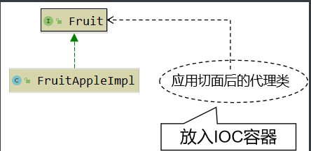
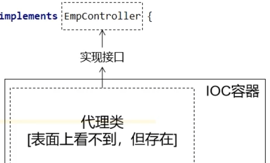
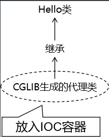

# Spring相关知识

# 前提知识

## 1. 什么是Maven？

Maven是一个用于**构建和管理Java项目**的项目管理工具。它提供了**项目自动化构建**、**依赖管理**、**项目报告生成**等功能

- **项目自动化构建**

  创建新项目：

  ```
  mvn archetype:generate -DgroupId=com.iron -DartifactId=projectName -DarchetypeArtifactId=maven-archetype-quickstart -DinteractiveMode=false
  ```

  构建项目：

  ```
  mvn package
  ```

  运行单元测试：

  ```
  mvn test
  ```

  清理项目：

  ```
  mvn clean
  ```

  安装项目到本地仓库：

  ```
  mvn install
  ```

  发布项目到远程仓库：

  ```
  mvn deploy
  ```

- **依赖管理**

  在 Maven 中，依赖管理是通过项目的 `pom.xml` 文件来管理的。`pom.xml` 是 Maven 项目的核心配置文件，其中包含了项目的元数据信息以及项目所需的依赖信息。
  ``` xml
  <dependencies>
      <dependency>
          <groupId>org.springframework</groupId>
          <artifactId>spring-core</artifactId>
          <version>5.3.10</version>
      </dependency>
      <dependency>
          <groupId>junit</groupId>
          <artifactId>junit</artifactId>
          <version>4.13.2</version>
          <scope>test</scope>
      </dependency>
  </dependencies>
  ```

- **项目报告生成**
  Maven 提供了多种插件来生成项目报告，其中最常用的是 `site` 插件。使用 `site` 插件，你可以生成项目的各种报告，如测试报告、代码覆盖率报告、静态代码分析报告等，并且可以生成一个完整的站点文档。

  1. **添加 `site` 插件配置**：在项目的 `pom.xml` 文件中添加 `site` 插件的配置。通常，你只需要指定插件的版本号，如下所示：

     ```xml
       <reporting>
         <plugins>
           <!-- 生成 Javadoc 文档 -->
           <plugin>
             <groupId>org.apache.maven.plugins</groupId>
             <artifactId>maven-javadoc-plugin</artifactId>
             <version>3.3.0</version>
           </plugin>
     
           <!-- 生成项目信息报告 -->
           <plugin>
             <groupId>org.apache.maven.plugins</groupId>
             <artifactId>maven-project-info-reports-plugin</artifactId>
             <version>3.1.1</version>
             <reportSets>
               <reportSet>
                 <reports>
                   <report>dependencies</report>
                   <report>dependency-convergence</report>
                   <report>dependency-info</report>
                   <report>dependency-management</report>
                   <report>index</report>
                   <report>modules</report>
                   <report>plugin-management</report>
                   <report>plugins</report>
                   <report>summary</report>
                 </reports>
               </reportSet>
             </reportSets>
           </plugin>
         </plugins>
       </reporting>
     ```

     1. dependencies：生成项目的依赖信息报告，包括项目所依赖的外部库和组件的详细信息。
     2. dependency-convergence：生成依赖收敛报告，用于检查项目中是否存在不一致的依赖版本。
     3. dependency-info：生成依赖信息报告，显示项目依赖的详细信息，如版本、范围等。
     4. dependency-management：生成依赖管理报告，显示项目中定义的依赖管理信息。
     5. index：生成项目信息索引报告，提供项目信息报告的索引页面。
     6. modules：生成模块信息报告，显示项目中的模块信息和依赖关系。
     7. plugin-management：生成插件管理报告，显示项目中定义的插件管理信息。
     8. plugins：生成插件信息报告，显示项目中使用的插件信息。
     9. summary：生成项目信息摘要报告，提供项目的概览信息和摘要。

  2. **运行 Maven Site 命令**：在命令行中执行以下 Maven 命令来生成项目报告：

     ```java
     mvn site
     ```

     这个命令将会触发 Maven 执行 `site` 插件，并生成项目的站点文档和报告。

  3. **查看生成的报告**：生成的报告和文档将位于项目目录下的 `target/site` 目录中。你可以在浏览器中打开相应的 HTML 文件来查看报告。

  在 `site` 插件的帮助下，你可以生成各种类型的报告，例如：

  - 项目概要信息
  - 项目的源码文档
  - 项目的测试报告
  - 代码覆盖率报告
  - 静态代码分析报告
  - 项目依赖信息等

  你可以根据需要配置 `site` 插件来生成特定类型的报告，也可以使用其他 Maven 插件来生成定制化的报告。

## 2. 什么是三层架构？

三层架构是一种软件设计模式，通常用于构建大型应用程序或系统。它将应用程序划分为三个逻辑层，每个层次都有不同的责任和功能。这三个层次分别是：

1. **表示层（Presentation Layer）**：也称为用户界面层，**负责处理用户与系统之间的交互**。它包括用户界面的设计和用户输入的处理。表示层的主要目标是提供一个友好的界面，使用户能够轻松地与应用程序交互。
2. **业务逻辑层（Business Logic Layer）**：也称为服务层或逻辑层，**负责处理应用程序的业务逻辑和规则**。这一层次包括处理数据、执行业务规则、计算和数据处理等任务。业务逻辑层独立于任何特定的用户界面或数据存储实现，因此可以在不影响其他层次的情况下进行修改或更新。
3. **数据访问层（Data Access Layer）**：也称为持久层，**负责与数据存储系统（如数据库）进行交互**，并管理数据的读取、写入和更新。数据访问层的主要责任是提供数据访问接口，使业务逻辑层能够访问和操作数据，同时尽可能地解耦业务逻辑和数据存储的实现细节。

通过将应用程序分解为这三个独立的层次，三层架构可以提高应用程序的可维护性、可扩展性和可重用性。此外，它还有助于团队协作，因为不同的开发人员可以专注于不同层次的开发工作，而无需过多地关注其他层次的实现细节。

# spring

## 1. 什么是SpringFramWork?

SpringFramWork(Spring框架)是一个开源的，轻量级的， **模块化的java开发框架**，简化 Java 应用程序的开发。
主要特点包括：

- **IOC 容器**：Spring 的 IOC（Inversion of Control）容器管理应用程序中的**对象**，帮助**解耦组件之间的依赖关系**，提高了代码的**灵活性**和**可测试性**。
- **AOP 支持**：Spring 提供了 AOP（Aspect-Oriented Programming）支持，允许开发者通过切面将横切关注点（如日志、事务管理等）模块化，使得这些关注点可以被多个组件共享和重用。
- **事务管理**：Spring 提供了一套强大的事务管理机制，可以与各种数据访问技术（如 JDBC、Hibernate、JPA 等）集成，简化事务管理的实现。
- **数据访问抽象**：Spring 提供了一组数据访问抽象层，简化了对持久化数据的访问，同时支持各种数据访问技术的集成，如 JDBC、Hibernate、MyBatis 等。(原本得用原生JDBC设置访问），现在可以使用配置类直接集成JDBC)
- **面向切面编程（AOP）**：Spring 支持 AOP 编程范式，允许开发者将横切关注点（如日志、事务、安全性等）从主要业务逻辑中分离出来，提高了代码的模块化和可维护性。
- **Web 开发支持**：Spring 提供了丰富的 Web 开发支持，包括 MVC 框架、REST 支持、WebSocket、WebFlux 等，使得开发者可以快速构建各种类型的 Web 应用程序。
- **集成支持**：Spring 可以与各种第三方框架和技术进行集成，如 Hibernate、JPA、MyBatis、Quartz、Apache Camel 等，为开发者提供了灵活的选择。

### 1.1 核心一：什么是SpringIOC容器(？

Spring IOC（Inversion of Control）容器是 Spring Framework 中的一个核心组件，负责**管理**应用程序中的**对象**（也称为 Bean）的**生命周期**和**依赖关系**。IOC 容器通过控制对象的创建、组装和管理，实现了控制反转（IOC）的概念，即将对象的控制权从应用程序代码转移到容器中。

Spring IOC 容器的核心接口是 **BeanFactory** 和 **ApplicationContext**，其中 BeanFactory 是 IOC 容器的基本接口，提供了最基本的 IOC 功能；ApplicationContext 是 BeanFactory 的扩展，提供了更丰富的功能，如国际化、事件处理、AOP 支持等。

### 1.2 SpringIoC容器的管理配置方式有那些？

- **XML配置**
  最早的配置方式

  ① 定义一个bean(**IOC容器管理的对象**)

  ``` xml
  <?xml version="1.0" encoding="UTF-8"?>
  <beans xmlns="http://www.springframework.org/schema/beans"
         xmlns:xsi="http://www.w3.org/2001/XMLSchema-instance"
         xsi:schemaLocation="http://www.springframework.org/schema/beans
                             http://www.springframework.org/schema/beans/spring-beans.xsd">
      <!-- 定义一个名为 "userDao" 的 UserDao Bean -->
      <bean id="userDao" class="com.example.UserDao"/>
  </beans>
  ```

  ② 实现依赖管理(DI依赖注入)

  其中：ref：注入依赖对象 vlaue：注入值
  注入包括两种方法：基于**构造器**注入，基于**setter**方法注入

  ``` xml
  <?xml version="1.0" encoding="UTF-8"?>
  <beans xmlns="http://www.springframework.org/schema/beans"
         xmlns:xsi="http://www.w3.org/2001/XMLSchema-instance"
         xsi:schemaLocation="http://www.springframework.org/schema/beans
                             http://www.springframework.org/schema/beans/spring-beans.xsd">
  
      <!-- 定义一个名为 "userService" 的 UserService Bean -->
      <bean id="userService" class="com.example.UserService">
          <!-- 基于构造器注入 -->
          <constructor-arg name="name" value="二狗子"/>
          <constructor-arg name="age" value="18"/>
          <!-- 基于构setter方法注入 -->
  		<property name="movieFinder" ref="movieFinder" />
           <property name="movieName" value="消失的她"/>
      </bean>
  
      <!-- 被注入项 -->
      <bean id="userDao" class="com.example.UserDao"/>
      <bean id="movieFinder" class="examples.MovieFinder"/>
  </beans>
  ```

  ③ XML其它知识：

  怎么进行Bean的实例化呢？

  ``` java
  ClassPathXmlApplicationContext applicationContext = new ClassPathXmlApplicationContext();
  applicationContext.setConfigLocations("spring-03.xml");
  A a = applicationContext.getBean(A.class);	// 根据类型进行获取不需要进行强制转换
  HappyComponent happyComponent = (HappyComponent) applicationContext.getBean("happyComponent");	// 根据bean的id值进行获取需要进行强制转换
  ```

  生命周期方法：

  ``` xml
  <beans>
    <bean id="beanOne" class="examples.BeanOne" init-method="init" />
    <bean id="beanTwo" class="examples.BeanTwo" destroy-method="cleanup" />
  </beans>
  ```

  scope配置单例和多例：

  ``` xml
  <bean id="happyMachine8" scope="prototype" class="com.atguigu.ioc.HappyMachine">
      <property name="machineName" value="happyMachine"/>
  </bean>
  
  <bean id="happyComponent8" scope="singleton" class="com.atguigu.ioc.HappyComponent">
      <property name="componentName" value="happyComponent"/>
  </bean>
  ```

  FactoryBean的配置
  此处省略

  

- **注解配置方式**

  1. bean对象创建

     @Component @Controller @Service @Repository @Mapper 将Bean对象注册到SpringIOC容器当中。
     
  2. 依赖管理(DI依赖注入)
     对象的依赖对象上添加注解 @Autowired
  
     
  
  3. xml配置包扫描
  
     xml配置：
  
     ``` xml
     <context:component-scan base-package="com.atguigu.ioc_01" />
     ```
  
     注解配置（配置类上添加）：
     ``` java
     @ComponentScan(basePackages = {"com.atguigu.components"})
     ```
  
     
  
- **JAVA配置类**

  Java配置类是一种使用Java编写配置信息的方式(代替XML配置文件的方式比如一个Mapper会有一个Mapper配置类XML文件现在只需要一个java配置类)，通过 **@Configuration, @Bean** 实现。

  

  这里以Mapper配置文件为例：

  1. 基于XML实现Mapper配置(放在src/resource放在文件夹里面)
     ``` xml
     <?xml version="1.0" encoding="UTF-8"?>
     <!DOCTYPE configuration PUBLIC "-//mybatis.org//DTD Config 3.0//EN"
             "http://mybatis.org/dtd/mybatis-3-config.dtd">
     <configuration>
         <environments default="development">
             <environment id="development">
                 <transactionManager type="JDBC"/>
                 <dataSource type="POOLED">
                     <property name="driver" value="${jdbc.driverClassName}"/>
                     <property name="url" value="${jdbc.url}"/>
                     <property name="username" value="${jdbc.username}"/>
                     <property name="password" value="${jdbc.password}"/>
                 </dataSource>
             </environment>
         </environments>
         <mappers>
             <mapper resource="com/example/mapper/UserMapper.xml"/>
             <!-- 其他 Mapper 文件 -->
         </mappers>
     </configuration>
     ```

  2. **通过注解实现**

     ``` java
     @Configuration
     public class MyBatisConfig {
     
         @Bean
         public DataSource dataSource() {
             PooledDataSource dataSource = new PooledDataSource();
             dataSource.setDriver("${jdbc.driverClassName}");
             dataSource.setUrl("${jdbc.url}");
             dataSource.setUsername("${jdbc.username}");
             dataSource.setPassword("${jdbc.password}");
             return dataSource;
         }
     
         @Bean
         public SqlSessionFactory sqlSessionFactory() throws IOException {
             InputStream inputStream = Resources.getResourceAsStream("mybatis-config.xml");
             SqlSessionFactory sqlSessionFactory = new SqlSessionFactoryBuilder().build(inputStream);
             return sqlSessionFactory;
         }
     
         @Bean
         public DataSourceTransactionManager transactionManager() {
             return new DataSourceTransactionManager(dataSource());
         }
     }
     ```

     

### 1.3 什么是IOC和DI？

1. **IOC（Inversion of Control）控制反转：**
   它指的是将对象的控制权交给容器或框架来管理，其中包括对象的创建、组装和管理。所以我们只需要关注业务逻辑的实现，而不必关心对象的创建和管理。
2. **DI (Dependency Injection) 依赖注入**
   它通过将对象所依赖的其他对象（依赖项）注入到对象中，实现了对象之间的解耦。我们只需要描述对象之间的依赖关系，由容器负责将依赖关系注入到对象中。
   
   

### 1.4 核心二：什么是面向AOP编程？

面向切面编程（Aspect-Oriented Programming, AOP）是一种编程范式，它旨在将与业务逻辑无关的关注点（如日志记录、事务管理、权限控制等）从主业务逻辑中分离出来，从而提高代码的模块化和可维护性。

**横切关注点（cross-cutting concern）**是指跨越系统中**多个模块或组件**的**共享功能**或**关注点**。它们是与系统的核心业务逻辑分离的概念上的关注点，通常涉及多个模块或层次，而不是单个类或方法。

AOP可以说是OOP（Object Oriented Programming，面向对象编程）的补充和完善。

- OOP允许开发者定义**纵向关系**(继承，实现等)
- AOP允许开发者定义**横向的关系**(日志共嗯，性能监控等)


例子：

**横切关注点**: 安检流程。无论你乘坐哪个航班，哪个航空公司，这个流程都必须执行。

**业务逻辑**: 登机和飞行。你购买机票、选择航班、登机和飞行，是你本次旅行的核心业务流程。


AOP相关的概念

- **切面（Aspect切面类）**：切面是横切关注点的模块化表述，它包含了一组连接点和通知。

- **切入点（Pointcut）**：切入点是一个表达式，用于匹配连接点。

- **通知（Advice）**：通知是切面在特定切入点上执行的具体操作。根据执行时机的不同，通知可以分为前置通知（Before）、后置通知（AfterReturning）、环绕通知（Around）、异常通知（AfterThrowing）、最终通知（After）等类型。

- **织入（Weaving）**：织入是**将切面(切面类)与目标对象**或者连接点关联起来的过程。织入可以在编译期、类加载期、运行期等阶段进行。**AOP框架负责将切面织入到目标对象中**，以创建代理对象，从而在目标对象的特定连接点上执行切面中定义的通知。

- **目标对象（Target Object）**：目标对象是切面所影响的对象，它通常是应用程序中的业务对象或者服务对象。AOP框架会为目标对象创建代理对象，并在代理对象上应用切面中定义的通知。

- 例子：

  1. 基于切入点进行织入

     ``` java
     // 1. 切面(切面类=连接点+通知)
     @Aspect
     @Component
     public class LoggingAspect {
     	
         // 2. 切入点 execution(* com.example.UserService.addUser(String)) && args(username)(一个表达式)
         @Around("execution(* com.example.UserService.addUser(String)) && args(username)")
         // 3. 通知 Around + logExecutionTime方法
         public void logExecutionTime(ProceedingJoinPoint joinPoint, String username) throws Throwable {
             long startTime = System.currentTimeMillis();
             System.out.println("Method execution started at: " + startTime);
     
             joinPoint.proceed(); // 调用目标方法
     
             long endTime = System.currentTimeMillis();
             System.out.println("Method execution finished at: " + endTime);
             System.out.println("Method execution time: " + (endTime - startTime) + " milliseconds");
         }
     }
     ```

  2. 基于自定义注解进行织入
     切面类：

     ``` java
     @Around(value = "@annotation(sysLog)")
     public Object doAroundAdvice(ProceedingJoinPoint joinPoint, Log sysLog) {
     	// 代码省略
     }
     ```

     这里的Log狮子顶的注解：

     ``` java
     @Target({ElementType.METHOD})        //这里的注解都是固定的可以防战其他的注解进行查看开头都是这两个注解
     @Retention(RetentionPolicy.RUNTIME)
     public @interface Log {
     
         public String title();      // 模块名称
         public OperatorType operatorType() default OperatorType.MANAGE;	// 操作人类别(默认是手机端客户)
         public int businessType();      // 业务类型(0其他 1新增 2修改， 3删除)
         public boolean isSaveRequestData() default true;        // 是否保存请求的参数
         public boolean isSaveResponseData() default true;       // 是否保存响应的参数
     }
     ```

     使用(controller里面使用)：

     ``` java
     @Log(title = "登录接口", businessType = 0)
     @Operation(summary = "登录接口")
     @PostMapping("/login")
     public Result login(@RequestBody LoginDto userDto) {
         // 代码省略
     }
     ```

     


AOP优先级设置：

相同目标方法上同时存在多个切面时，切面的优先级控制切面的内外嵌套顺序。

-   优先级高的切面：外面
-   优先级低的切面：里面

使用 @Order 注解可以控制切面的优先级：

-   @Order(较小的数)：优先级高
-   @Order(较大的数)：优先级低


AOP底层代理：

**基于接口的动态代理(JDK动态代理)**：

- Java中的动态代理主要依赖于 `java.lang.reflect.Proxy` 类。该类提供了一个静态方法 `newProxyInstance()`，用于创建动态代理对象。
- 基于接口的动态代理要求目标类必须实现一个接口，代理对象会实现该接口，并在代理对象的方法中调用实际目标对象的方法。
- 在运行时，通过反射机制创建代理对象，并动态生成字节码，实现了对目标对象方法的拦截和增强。
- 代理对象的方法调用会被转发到 `InvocationHandler` 接口的实现类中，该类负责在方法执行前后插入切面逻辑。




**是通过接口动态生成的代理类类对象放入到 IOC容器中， 所以得通过接口获取**

**基于类的动态代理(GLIB代理)**：

- 基于类的动态代理不要求目标类实现接口，而是通过继承目标类，生成代理类，并重写目标类的方法来实现代理。
- Java中并没有提供直接的类来实现基于类的动态代理，通常需要借助第三方库，如CGLIB（Code Generation Library）。
- CGLIB通过继承的方式创建目标类的子类，并在子类中重写方法，实现了对目标类方法的拦截和增强。
- CGLIB还提供了 `MethodInterceptor` 接口，用于在代理对象的方法执行前后插入切面逻辑。



**总结：**

a.  如果目标类有接口,选择使用jdk动态代理

b.  如果目标类没有接口,选择cglib动态代理

c.  如果有接口,接口接值()
``` java
@Autowired
private Calculator calculatorImpl;
```

d.  如果没有接口,类进行接值 
``` java
@Autowired
private calculatorImpl calculatorimpl;
```


### 1.5 核心三： Spring声明式事务

"tx" 是事务（Transaction）的简写。在软件开发中，事务是指一系列操作（如数据库操作、文件操作等）组成的逻辑工作单元，在这个工作单元中，**要么所有操作都成功执行并提交，要么所有操作都失败并回滚，以保证数据的一致性和完整性。**事务是数据库管理系统中非常重要的概念，在并发操作和数据一致性方面起到了关键作用。

区分：

- 编程式事务：
  ``` java
  Connection conn = ...;
    
  try {
      // 开启事务：关闭事务的自动提交
      conn.setAutoCommit(false);
      // 核心操作
      // 业务代码
      // 提交事务
      conn.commit();
    
  }catch(Exception e){
    
      // 回滚事务
      conn.rollBack();
    
  }finally{
    
      // 释放数据库连接
      conn.close();
    
  }
  ```

- 声明式事务
  声明式事务是指使用注解 或 XML 配置的方式来控制事务的提交和回滚。


**Spring基于注解事先声明式事务：**

1. pom
   ``` java
     <!-- 声明式事务依赖-->
     <dependency>
         <groupId>org.springframework</groupId>
         <artifactId>spring-tx</artifactId>
         <version>6.0.6</version>
     </dependency>
   ```

2. yml
   无

3. 配置类文件

   ``` java
   /**
    * projectName: com.atguigu.config
    *
    * description: 数据库和连接池配置类
    */
   
   @Configuration
   @ComponenScan("com.atguigu")
   @PropertySource(value = "classpath:jdbc.properties")
   @EnableTransactionManagement
   public class DataSourceConfig {
   
       /**
        * 实例化dataSource加入到ioc容器
        * @param url
        * @param driver
        * @param username
        * @param password
        * @return
        */
       @Bean
       public DataSource dataSource(@Value("${atguigu.url}")String url,
                                    @Value("${atguigu.driver}")String driver,
                                    @Value("${atguigu.username}")String username,
                                    @Value("${atguigu.password}")String password){
           DruidDataSource dataSource = new DruidDataSource();
           dataSource.setDriverClassName(driver);
           dataSource.setUrl(url);
           dataSource.setUsername(username);
           dataSource.setPassword(password);
   
           return dataSource;
       }
   
       /**
        * 实例化JdbcTemplate对象,需要使用ioc中的DataSource
        * @param dataSource
        * @return
        */
       @Bean
       public JdbcTemplate jdbcTemplate(DataSource dataSource){
           JdbcTemplate jdbcTemplate = new JdbcTemplate();
           jdbcTemplate.setDataSource(dataSource);
           return jdbcTemplate;
       }
       
       /**
        * 装配事务管理实现对象
        * @param dataSource
        * @return
        */
       @Bean
       public TransactionManager transactionManager(DataSource dataSource){
           return new DataSourceTransactionManager(dataSource);
       }
   
   }
   ```

   

**Srping实现声明式事务：**

1. 启动类
   ``` java
   import org.springframework.boot.SpringApplication;
   import org.springframework.boot.autoconfigure.SpringBootApplication;
   import org.springframework.transaction.annotation.EnableTransactionManagement;
   
   @SpringBootApplication
   @EnableTransactionManagement	// 开启声明式事务
   public class YourApplication {
       public static void main(String[] args) {
           SpringApplication.run(YourApplication.class, args);
       }
   }
   ```


**声明式事务的使用@Transactional注解：**

使用时只需要将@Transactional放在方法前面就行

在 Spring 中，`@Transactional` 注解支持多个参数，用于定义事务的属性和行为。以下是常用的一些参数：

1. **propagation（传播行为）**：指定事务的传播行为，控制多个事务方法之间的事务关系。常见的取值包括：
   - `REQUIRED`：如果当前存在事务，则加入该事务；否则新建一个事务。默认值。
   - `REQUIRES_NEW`：每次都创建一个新事务，如果当前存在事务，则挂起该事务。
   - `SUPPORTS`：支持当前事务，如果当前没有事务，则以非事务方式执行。
   - `MANDATORY`：强制使用当前事务，如果当前没有事务，则抛出异常。
   - 等等...
2. **isolation（隔离级别）**：指定事务的隔离级别，控制多个事务之间的数据可见性。常见的取值包括：
   - `DEFAULT`：使用默认的数据库隔离级别。
   - `READ_UNCOMMITTED`：最低的隔离级别，允许读取未提交的数据。
   - `READ_COMMITTED`：保证读取到已提交的数据，避免脏读。
   - `REPEATABLE_READ`：防止非重复读，但允许幻读。
   - `SERIALIZABLE`：最高的隔离级别，确保事务顺序执行，避免幻读。
3. **readOnly（只读事务）**：指定事务是否只读，如果设置为 `true`，则表示该事务只读取数据，不进行修改操作，有助于提升性能。
4. **timeout（超时时间）**：指定事务的超时时间，单位为秒，默认值为-1，表示不设置超时时间。
5. **rollbackFor（回滚异常）**：指定哪些异常触发事务回滚，可以指定一个或多个异常类型。
6. **noRollbackFor（不回滚异常）**：指定哪些异常不触发事务回滚，可以指定一个或多个异常类型。

这些参数可以在 `@Transactional` 注解中使用，根据业务需求来配置事务的行为。


## 2. 区分 Spring 和 SpringFramwork

**Spring Framework** 指的是 Spring 项目的核心框架，它是一个开源的 Java 框架，用于简化企业级 Java 应用程序的开发。Spring Framework 包含了依赖注入（DI）、面向切面编程（AOP）、数据访问、事务管理、MVC 模型、以及很多其他的基础设施和工具。

- **核心功能**: 依赖注入、AOP、事务管理、MVC 框架等。
- **模块化设计**: Spring Framework 被设计为一组独立的模块，开发者可以根据项目需求选择使用哪些模块，而不需要加载整个框架。
- **广泛使用**: 它是企业级 Java 应用开发的基础，很多其他的 Spring 项目和第三方库都依赖于 Spring Framework。

**Spring** 是一个更广泛的术语，通常指整个 Spring 项目生态系统。Spring 包含了多个独立的子项目或扩展，其中最核心的部分就是 Spring Framework，但它不仅仅局限于此。

- **Spring Boot**: 用于简化 Spring 应用开发和配置的项目。它通过自动配置和嵌入式服务器，帮助开发者快速启动应用程序。
- **Spring Cloud**: 专注于微服务架构，提供了一套工具来构建和部署分布式系统，包括服务发现、配置管理、负载均衡、熔断器等。
- **Spring Data**: 为数据访问提供更简单的 API，支持多种数据存储技术，如关系型数据库、NoSQL 数据库。
- **Spring Security**: 用于保护 Java 应用程序的身份验证和访问控制框架。
- **Spring Batch**: 用于批处理任务的框架，支持大规模的企业批处理操作。
- **Spring Integration**: 用于集成不同应用程序和系统的企业集成模式实现。
- **Spring AMQP**: 基于 AMQP 协议的消息传递支持，常用于与 RabbitMQ 集成。

**总结：**

- **Spring Framework**: 这是 Spring 项目的核心**框架**，专注于提供企业级应用程序开发所需的基本功能和工具。
- **Spring**: 这是一个更广泛的术语，指整个 Spring 生态系统，包括了 Spring Framework 和许多其他项目（如 Spring Boot、Spring Cloud 等）。Spring 项目可以独立使用或结合使用，以满足不同的应用需求。
