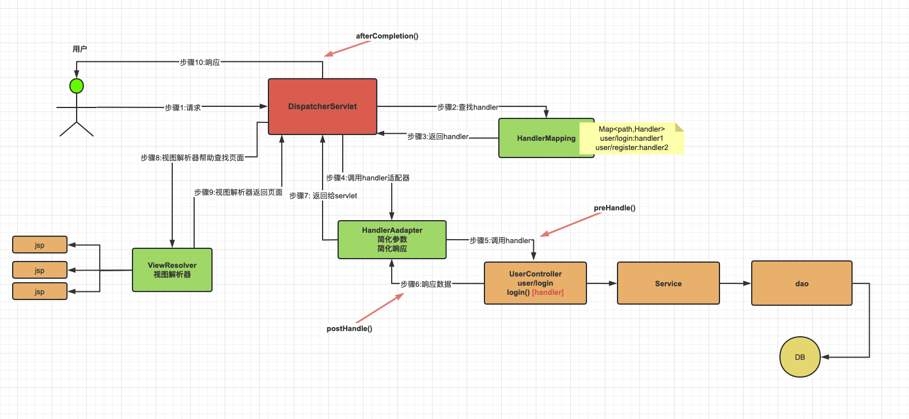

# 1. 什么是SpringMVC

**是什么？**

SpringMVC **控制层框架**， SpringMVC框架包含在SpringFramwork框架中。

在控制层框架历经Strust、WebWork、Strust2等诸多产品的历代更迭之后，目前业界普遍选择了SpringMVC作为Java EE项目表述层开发的首选方案。之所以能做到这一点，是因为SpringMVC具备如下显著优势：

-   **Spring 家族原生产品**，与IOC容器等基础设施无缝对接
-   表述层各细分领域需要解决的问题**全方位覆盖**，提供**全面解决方案**
-   **代码清新简洁**，大幅度提升开发效率
-   内部组件化程度高，可插拔式组件**即插即用**，想要什么功能配置相应组件即可
-   **性能卓著**，尤其适合现代大型、超大型互联网项目要求

原生Servlet API开发代码片段

```java
protected void doGet(HttpServletRequest request, HttpServletResponse response) 
                                                        throws ServletException, IOException {  
    String userName = request.getParameter("userName");
    
    System.out.println("userName="+userName);
}
```

基于SpringMVC开发代码片段

```java
@RequestMapping("/user/login")
public String login(@RequestParam("userName") String userName,Sting password){
    
    log.debug("userName="+userName);
    //调用业务即可
    
    return "result";
}
```


**主要作用：**


**总结：**

1.  简化前端参数接收( 形参列表 )
2.  简化后端数据响应(返回值)

SpringMVC 可以看作是前后端交互的中间桥梁或协调器。它负责接收前端的请求，处理业务逻辑，并将结果返回给前端。通过 SpringMVC，前端和后端的分工更加明确，前端专注于页面展示和用户交互，后端则负责业务逻辑处理和数据管理。


# 2. 具体执行流程


**SpringMVC涉及组件理解：**

1.  DispatcherServlet :  SpringMVC提供，我们需要使用web.xml配置使其生效，它是整个流程处理的核心，所有请求都经过它的处理和分发！\[ CEO ]
2.  HandlerMapping :  SpringMVC提供，我们需要进行IoC配置使其加入IoC容器方可生效，它内部缓存handler(controller方法)和handler访问路径数据，被DispatcherServlet调用，用于查找路径对应的handler！\[秘书]
3.  HandlerAdapter : SpringMVC提供，我们需要进行IoC配置使其加入IoC容器方可生效，它可以处理请求参数和处理响应数据数据，每次DispatcherServlet都是通过handlerAdapter间接调用handler，他是handler和DispatcherServlet之间的适配器！\[经理]
4.  Handler : handler又称处理器，他是Controller类内部的方法简称，是由我们自己定义，用来接收参数，向后调用业务，最终返回响应结果！\[打工人]
5.  ViewResovler : SpringMVC提供，我们需要进行IoC配置使其加入IoC容器方可生效！视图解析器主要作用简化模版视图页面查找的，但是需要注意，前后端分离项目，后端只返回JSON数据，不返回页面，那就不需要视图解析器！所以，视图解析器，相对其他的组件不是必须的！\[财务]

**总结：**

结合在亚信的实习:

- SringMVC：DIspatcherServlet 就像是亚信自定的 urlRedirect 分发类(通过反射去调用对应的handler及Action)。

- SpringFramwork：ServiceFactory就像是SpringIOC容器(使用了java的动态代理，即代理接口)：
  ``` java
  IBBoss2CrmSV mixBBoss2crmSV = (IBBoss2CrmSV)ServiceFactory.getService(IBBoss2CrmSV.class);
  ```

- Mybatis：有自己的代码生成文件，会生成对应的.bo配置文件(框架自定义)，以及实体类。


# 3. 使用实例

主要注解：@Ccontroller; @ResponseBody；@RestController：Controller+ResponseBody；@RequestMapping；@PostMapping；@GetMapping；@DelteMapping；@PutMapping等

1. 建POM

   - Spring项目：

     ``` xml
     <properties>
         <spring.version>6.0.6</spring.version>
         <servlet.api>9.1.0</servlet.api>
         <maven.compiler.source>17</maven.compiler.source>
         <maven.compiler.target>17</maven.compiler.target>
         <project.build.sourceEncoding>UTF-8</project.build.sourceEncoding>
     </properties>
     
     <dependencies>
         <!-- springIoc相关依赖  -->
         <dependency>
             <groupId>org.springframework</groupId>
             <artifactId>spring-context</artifactId>
             <version>${spring.version}</version>
         </dependency>
     
         <!-- web相关依赖  -->
         <!-- 需要使用 Jakarta EE 的其他功能（如直接处理 Servlet 或 JSP等Servlet API ）-->
         <dependency>
             <groupId>jakarta.platform</groupId>
             <artifactId>jakarta.jakartaee-web-api</artifactId>
             <version>${servlet.api}</version>
             <scope>provided</scope>
         </dependency>
     
         <!-- springwebmvc相关依赖  -->
         <dependency>
             <groupId>org.springframework</groupId>
             <artifactId>spring-webmvc</artifactId>
             <version>${spring.version}</version>
         </dependency>
     
     </dependencies>
     ```

   - SpringBoot项目：

     ``` xml
     <project xmlns="http://maven.apache.org/POM/4.0.0"
              xmlns:xsi="http://www.w3.org/2001/XMLSchema-instance"
              xsi:schemaLocation="http://maven.apache.org/POM/4.0.0 http://maven.apache.org/xsd/maven-4.0.0.xsd">
         <modelVersion>4.0.0</modelVersion>
     
         <groupId>com.example</groupId>
         <artifactId>demo</artifactId>
         <version>1.0.0</version>
         <packaging>jar</packaging>
     
         <parent>
             <groupId>org.springframework.boot</groupId>
             <artifactId>spring-boot-starter-parent</artifactId>
             <version>3.1.2</version> <!-- 使用最新版本 -->
             <relativePath/> <!-- 如果没有父项目，保持为空 -->
         </parent>
     
         <dependencies>
             <!-- Spring Boot Web Starter -->
             <dependency>
                 <groupId>org.springframework.boot</groupId>
                 <artifactId>spring-boot-starter-web</artifactId>
             </dependency>
     
             <!-- 测试依赖 -->
             <dependency>
                 <groupId>org.springframework.boot</groupId>
                 <artifactId>spring-boot-starter-test</artifactId>
                 <scope>test</scope>
             </dependency>
         </dependencies>
     
     </project>
     
     ```

     spring-boot-starter-web里面继承了很多的依赖：包括IOC，AOP，MVC，Tomcat等等。

     ``` tex
     依赖树如下：
     spring-boot-starter-web	
     |-- spring-boot-starter
     |   |-- spring-core
     |   |-- spring-context
     |   |-- spring-aop
     |   |-- spring-beans
     |   |-- spring-expression
     |-- spring-boot-starter-logging
     |   |-- logback-classic
     |   |-- log4j-to-slf4j
     |   |-- jul-to-slf4j
     |-- spring-web
     |   |-- spring-web
     |   |-- spring-webmvc
     |-- spring-boot-starter-json
     |   |-- jackson-databind
     |   |-- jackson-core
     |   |-- jackson-annotations
     |-- spring-boot-starter-tomcat
     |   |-- tomcat-embed-core
     |   |-- tomcat-embed-websocket
     |   |-- tomcat-embed-el
     |-- spring-boot-starter-validation
     |   |-- hibernate-validator
     |   |-- validation-api
     ```

   - spring配置/springbootyml

     - spring
       方式一：配置类

       ``` java
       @EnableWebMvc     
       @Configuration
       @ComponentScan(basePackages = "com.atguigu.controller") //TODO: 进行controller扫
       //WebMvcConfigurer springMvc进行组件配置的规范,配置组件,提供各种方法! 前期可以实现
       public class SpringMvcConfig implements WebMvcConfigurer {
       
           @Bean
           public HandlerMapping handlerMapping(){
               return new RequestMappingHandlerMapping();
           }
       
           @Bean
           public HandlerAdapter handlerAdapter(){
               return new RequestMappingHandlerAdapter();
           }
           
       }
       ```

       方式二：XML配置 src/main/resources/SpringMvcConfig.xml

       ``` xml
       <?xml version="1.0" encoding="UTF-8"?>
       <beans xmlns="http://www.springframework.org/schema/beans"
              xmlns:xsi="http://www.w3.org/2001/XMLSchema-instance"
              xmlns:context="http://www.springframework.org/schema/context"
              xmlns:mvc="http://www.springframework.org/schema/mvc"
              xsi:schemaLocation="http://www.springframework.org/schema/beans
                  http://www.springframework.org/schema/beans/spring-beans.xsd
                  http://www.springframework.org/schema/context
                  http://www.springframework.org/schema/context/spring-context.xsd
                  http://www.springframework.org/schema/mvc
                  http://www.springframework.org/schema/mvc/spring-mvc.xsd">
       
           <!-- 启用 Spring MVC 注解驱动功能 -->
           <mvc:annotation-driven />
       
           <!-- 扫描 controller 包 -->
           <context:component-scan base-package="com.atguigu.controller" />
       
           <!-- 配置自定义的 HandlerMapping -->
           <bean id="handlerMapping" class="org.springframework.web.servlet.mvc.method.annotation.RequestMappingHandlerMapping" />
       
           <!-- 配置自定义的 HandlerAdapter -->
           <bean id="handlerAdapter" class="org.springframework.web.servlet.mvc.method.annotation.RequestMappingHandlerAdapter" />
       
       </beans>
       ```

       

     - springboot yml 配置：在 Spring Boot 中，默认情况下，不需要显式使用 `@EnableWebMvc`，因为 Spring Boot 提供了对 Spring MVC 的自动配置，自动装配了大多数常用的 MVC 组件（如 `HandlerMapping`, `HandlerAdapter`, `MessageConverters` 等）。

   - 业务类：

     - controller

       ``` java
       @Controller	 // 代表控制层
       @RestController // 直接返回数据，且自动转换成对象。
       public class HelloController {
       
           //handler：controller每个方法都是一个handler
           @GetMapping("/springmvc/hello")
           public String hello(){
               System.out.println("HelloController.hello");
               return "hello springmvc!!";
           }
       }
       ```


# 4. 接受前端参数

## **路径参数接受：**

- 默认情况下传递 参数名 和 后端 handler接受参数 名称应当是一致的

  1. 前端请求: http://localhost:8080/param/value?name=xx&age=18

  2. 后端接受：
     ``` java
     public String setupForm(String name,int age)
     {
         System.out.println("name = " + name + ", age = " + age);
         return name + age;
     }
     ```

- 使用 @RequestParam 注解：默认必须传入，后端可以进行参数绑定。

  1. 前端请求: http://localhost:8080/param/value?name=xx&age=18

  2. 后端接受
     ``` java
     public String setupForm(@RequestParam("name")String myName, int myAge)
     {
         System.out.println("name = " + myName + ", age = " + myAge);
         return name + age;
     }
     ```

     ``` java
     @RequestParam(value = "stuAge",required = false,defaultValue = "18")
     ```

- 接受实体类

  1. 前端请求：http://localhost:8080/param/value?name=xx&age=18

  2. 后端接受
     ``` java
     public String setupForm(User user)
     {
         System.out.println("name = " + user.name + ", age = " + user.age);
         return name + age;
     }
     public class User
     {
         String name;
         int age;
     }
     ```

- 接受List：@RequestParam不能省略

  1. 前端请求：http://localhost:8080/param/mul?hbs=吃&hbs=喝

  2. 后端接受
     ``` java
     public Object mulForm(@RequestParam List<String> hbs){
         System.out.println("hbs = " + hbs);
         return hbs;
     }
     ```

- 路径参数传递

  1. 前端请求：http://localhost:8080/user/1/张三

  2. 后端接受：名字相同自动赋值，不同指定赋值
     ``` java
     @GetMapping("/user/{id}/{name}")
     @ResponseBody
     public String getUser(@PathVariable Long id, 
                           @PathVariable("name") String uname) {
         System.out.println("id = " + id + ", uname = " + uname);
         return "user_detail";
     }
     ```

## **Json传递传递参数**

- 接受实体参数：@RequestBody 将传入的json数据映射到实体类中

  1. 前端请求：
     ``` json
     {
       "name": "张三",
       "age": 18,
       "gender": "男"央视最坎坷女主持：丈夫入狱诈骗，男友死缓判刑，47岁依然未嫁
     }	
     ```

  2. 后端接受：
     ``` java
     @PostMapping("/person")
     @ResponseBody
     public String addPerson(@RequestBody Person person) 
     {
       return "success";
     }
     ```

  3. 同样可以接受部分参数
     ``` java
     @PostMapping("/person")
     @ResponseBody
     public String addPerson(String name, int age, String gender) 
     {
       return "success";
     }
     ```

## 原生操作

- 获得原生对象(session, request, response)

  ``` java
  @GetMapping("api")
  @ResponseBody
  public String api(HttpSession session , 
                    HttpServletRequest request,
                    HttpServletResponse response
                   ){
      String method = request.getMethod();
      System.out.println("method = " + method);
      return "api";
  }
  ```

  

  1. **`HttpServletRequest`** — 单个请求
  2. **`HttpSession`** — 单个用户会话
  3. **`PageContext`** — 单个 JSP 页面及其作用域
  4. **`ServletContext`** — 整个 Web 应用程序

- Spring对原生对象的使用
  **一、request级别**

  1. Model：request级别
     ``` java
     public String testAttrRequestModel(Model model) {
         
         // 我们将数据存入模型，SpringMVC 会帮我们把模型数据存入请求域
         // 存入请求域这个动作也被称为暴露到请求域
         model.addAttribute("requestScopeMessageModel","i am very happy[model]");
         return "target";
     }
     ```

  2. ModelMap：request级别
     ``` java
     public String testAttrRequestModelMap(ModelMap modelMap) {
         
         // 我们将数据存入模型，SpringMVC 会帮我们把模型数据存入请求域
         // 存入请求域这个动作也被称为暴露到请求域
         modelMap.addAttribute("requestScopeMessageModelMap","i am very happy[model map]");
         
         return "target";
     }
     ```

  3. Map：request级别，在 Spring MVC 中，`Map<String, Object>` 作为方法参数时，实际上是通过 `Model` 接口实现的。
     ``` java
     @RequestMapping("/attr/request/map")
     @ResponseBody
     public String testAttrRequestMap(Map<String, Object> map) {
         
         // 我们将数据存入模型，SpringMVC 会帮我们把模型数据存入请求域
         // 存入请求域这个动作也被称为暴露到请求域
         map.put("requestScopeMessageMap", "i am very happy[map]");
         
         return "target";
     }
     ```

  4. ModelAndView：request级别
     ``` java
     @RequestMapping("/attr/request/mav")
     public ModelAndView testAttrByModelAndView() {
         
         // 1.创建ModelAndView对象
         ModelAndView modelAndView = new ModelAndView();
         // 2.存入模型数据
         modelAndView.addObject("requestScopeMessageMAV", "i am very happy[mav]");
         // 3.设置视图名称
         modelAndView.setViewName("target");
         
         return modelAndView;
     }
     ```

  5. 接受cookie：request级别

     ``` java
     @GetMapping("/demo")
     public void handle(@CookieValue("JSESSIONID") String cookie) { 
         // 使用名为 "JSESSIONID" 的 Cookie 的值
         System.out.println("JSESSIONID: " + cookie);
         // 执行其他逻辑
     }
     ```

  6. 接受请求头：request级别

     ``` java
     @GetMapping("/demo")
     public void handle( @RequestHeader("Accept-Encoding") String encoding, @RequestHeader("Keep-Alive") long keepAlive) 
     { 
       //...
     }
     ```

  **Session级别**

  1. Session级别

     ``` java
     @RequestMapping("/attr/session")
     @ResponseBody
     public String testAttrSession(HttpSession session) {
         // 对 session 对象操作
         session.setAttribute("sessionScopeMessage", "Session level data");
         return "target";
     }
     ```

  **三、Application级别**

  1. Application级别：整个 Web 应用程序

     ``` java
     @Autowired
     private ServletContext servletContext;
     
     @RequestMapping("/attr/application")
     @ResponseBody
     public String attrApplication() {
         servletContext.setAttribute("appScopeMsg", "i am hungry...");
         return "target";
     }
     ```

# 5. 响应数据


## 响应json数据

注解：@RestController = @Responsebody + @Controller
``` java
@RestController
public class Test
{
    @GetMapping("getData")
    public User getUser(@RequestBody User userParam)
    {
        System.out.println("userParam = " + userParam);
        User user = new User();
        user.setAge(18);
        user.setName("John");
        //返回的对象,会使用jackson的序列化工具,转成json返回给前端!
        return user;
    }
}
```


Spring配置：

- 添加Json转换器
  ``` xml
  <dependency>
      <groupId>com.fasterxml.jackson.core</groupId>
      <artifactId>jackson-databind</artifactId>
      <version>2.15.0</version>
  </dependency>
  ```

- @EnableWebMvc
  ``` java
  @EnableWebMvc  //json数据处理,必须使用此注解,因为他会加入json处理器
  @Configuration
  @ComponentScan(basePackages = "com.atguigu.controller") 
  public class SpringMvcConfig implements WebMvcConfigurer 
  {
      
  }
  ```

- 添加 @Responsebody 或者 @RestController

SpringBoot配置：

- 添加 @Responsebody 或者 @RestController


## 转发和重定向

- 关键字实现
   ``` java
   @RequestMapping("/redirect-demo")
   public String redirectDemo() {
       // 重定向到 /demo 路径 
       return "redirect:/demo";
   }
   
   @RequestMapping("/forward-demo")
   public String forwardDemo() {
       // 转发到 /demo 路径
       return "forward:/demo";
   }
   
   //注意： 转发和重定向到项目下资源路径都是相同，都不需要添加项目根路径！填写项目下路径即可！
   ```

- request实现
  ``` java
  @RequestMapping("/forwardExample")
  public void forwardExample(HttpServletRequest request, HttpServletResponse response) throws ServletException, IOException {
      RequestDispatcher dispatcher = request.getRequestDispatcher("/targetPage.jsp");
      dispatcher.forward(request, response);
  }
  @RequestMapping("/redirectExample")
  public void redirectExample(HttpServletResponse response) throws IOException {
      response.sendRedirect("/newPage.jsp");
  }
  ```

- 转发和重定向的对比

  #### 1. 请求转发（Forward）

  - **请求和响应对象**：请求和响应对象在转发过程中是共享的，即转发后的资源可以访问原始请求中的数据（如请求参数、属性等）。

  - **URL**：URL 不会改变，客户端浏览器的地址栏仍然显示原始请求的 URL。

  - **性能**：请求转发比重定向稍快，因为没有额外的客户端请求过程。

  - 应用场景

    ：

    - 需要在服务器端进行处理，例如将请求转发到 JSP 页面进行展示。
    - 处理相同请求的不同部分，如将请求转发到一个控制器或业务逻辑处理类。

  #### 2. 请求重定向（Redirect）

  - **请求和响应对象**：请求和响应对象在重定向过程中不共享。重定向后，客户端会发起一个新的请求，新的请求中没有原始请求的数据。
  - **URL**：URL 会改变，客户端浏览器的地址栏会更新为重定向后的 URL。
  - **性能**：重定向可能稍慢，因为客户端需要发起一个新的 HTTP 请求。
  - 应用场景：
    - 提交表单后重定向到结果页面，避免表单重复提交。
    - 用户登录后重定向到用户首页。


## 返回静态资源

静态资源目录：src/main/resources/static
包括(**不需要在服务器端做任何运算、处理的数据**)：

-   纯HTML文件
-   图片
-   CSS文件
-   JavaScript文件
-   ……

返回图片：
``` java
@RestController
@RequestMapping("/images")
public class ImageController {

    @GetMapping("/image")
    public ResponseEntity<byte[]> getImage() throws IOException {
        // 读取图片文件
        Resource resource = new ClassPathResource("static/images/sample.jpg");
        byte[] imageBytes = Files.readAllBytes(resource.getFile().toPath());

        // 设置响应头
        HttpHeaders headers = new HttpHeaders();
        headers.setContentType(MediaType.IMAGE_JPEG);

        // 返回响应实体
        return new ResponseEntity<>(imageBytes, headers, HttpStatus.OK);
    }
}
```

常见配置：
``` java
@EnableWebMvc  //json数据处理,必须使用此注解,因为他会加入json处理器
@Configuration
@ComponentScan(basePackages = "com.atguigu.controller") //TODO: 进行controller扫描
public class SpringMvcConfig implements WebMvcConfigurer {

    //配置jsp对应的视图解析器
    @Override
    public void configureViewResolvers(ViewResolverRegistry registry) {
        //快速配置jsp模板语言对应的
        registry.jsp("/WEB-INF/views/",".jsp");
    }
    
    //开启静态资源处理 <mvc:default-servlet-handler/>,交给servlet而不是springMVC
    @Override
    public void configureDefaultServletHandling(DefaultServletHandlerConfigurer configurer) {
        configurer.enable();
    }
}
```


# 6. SpringMVC的异常处理器

- 声明异常处理器类
  ``` java
  /**
   * @RestControllerAdvice = @ControllerAdvice + @ResponseBody
   * @ControllerAdvice 代表当前类的异常处理controller! 
   */
  @RestControllerAdvice
  public class GlobalExceptionHandler {
  
      /**
       * 当发生空指针异常会触发此方法!
       */
      @ExceptionHandler(NullPointerException.class)
      public Object handlerNullException(NullPointerException e){
  
          return null;
      }
  
      /**
       * 当发任何触发此方法!
       */
      @ExceptionHandler(Exception.class)
      public Object handlerException(Exception e){
  
          return null;
      }
  }
  ```

- Spring项目记得注解扫描（SpringBoot项目因为有启动类，会自动扫描子类和子类包下面的类）
  ``` java
   @ComponentScan(basePackages = {"com.iron.controller",
   "com.iron.exceptionhandler"})
  ```


# 7. 拦截器使用

使用拦截器在请求到达具体 handler 方法前，统一执行检测

- 编写配拦截器
  ``` java
  public class Process01Interceptor implements HandlerInterceptor {
  
      // 在处理请求的目标 handler 方法前执行
      @Override
      public boolean preHandle(HttpServletRequest request, HttpServletResponse response, Object handler) throws Exception {
          System.out.println("Process01Interceptor.preHandle");
           
          // 返回true：放行
          // 返回false：不放行
          return true;
      }
   
      // 在目标 handler 方法之后，handler报错不执行!
      @Override
      public void postHandle(HttpServletRequest request, HttpServletResponse response, Object handler, ModelAndView modelAndView) throws Exception {
          System.out.println("Process01Interceptor.postHandle");
      }
   
      // 渲染视图之后执行(最后),一定执行!
      @Override
      public void afterCompletion(HttpServletRequest request, HttpServletResponse response, Object handler, Exception ex) throws Exception {
          System.out.println("Process01Interceptor.afterCompletion");
      }
  }
  ```

- 配置类添加拦截器
  ``` java
  @EnableWebMvc  //json数据处理,必须使用此注解,因为他会加入json处理器
  @Configuration
  @ComponentScan(basePackages = {"com.atguigu.controller","com.atguigu.exceptionhandler"}) 
  public class SpringMvcConfig implements WebMvcConfigurer 
  {
      //添加拦截器
      @Override
      public void addInterceptors(InterceptorRegistry registry) { 
      //将拦截器添加到Springmvc环境,默认拦截所有Springmvc分发的请求
      registry.addInterceptor(new Process01Interceptor());
      
      //精准匹配,设置拦截器处理指定请求 路径可以设置一个或者多个,为项目下路径即可
      registry.addInterceptor(new Process01Interceptor()).addPathPatterns("/common/request/one","/common/request/tow");
      
      
      //排除匹配,排除应该在匹配的范围内排除
      registry.addInterceptor(new Process01Interceptor())
              .addPathPatterns("/common/request/one","/common/request/tow")
              .excludePathPatterns("/common/request/tow");
          
      // 匹配所有路径
      registry.addInterceptor(new Process01Interceptor()).addPathPatterns("/**"); // 拦截所有请求
      }
  }
  ```

SpringBoot和上面的配置一样。



# 8. 参数校验

- ### 1. 添加依赖

  确保你的 `pom.xml` 文件中包含了 Spring Boot 和验证的相关依赖。使用 Spring Boot 的 `spring-boot-starter-validation` 来集成 Hibernate Validator。

  Spring项目添加依赖：

  ``` xml
  <!-- 校验注解 -->
  <dependency>
      <groupId>jakarta.platform</groupId>
      <artifactId>jakarta.jakartaee-web-api</artifactId>
      <version>9.1.0</version>
      <scope>provided</scope>
  </dependency>
          
  <!-- 校验注解实现-->        
  <!-- https://mvnrepository.com/artifact/org.hibernate.validator/hibernate-validator -->
  <dependency>
      <groupId>org.hibernate.validator</groupId>
      <artifactId>hibernate-validator</artifactId>
      <version>8.0.0.Final</version>
  </dependency>
  <!-- https://mvnrepository.com/artifact/org.hibernate.validator/hibernate-validator-annotation-processor -->
  <dependency>
      <groupId>org.hibernate.validator</groupId>
      <artifactId>hibernate-validator-annotation-processor</artifactId>
      <version>8.0.0.Final</version>
  </dependency>
  ```

  SpringBoot项目添加依赖：

  ```xml
  xml复制代码<dependencies>
      <!-- Spring Boot Starter Web for building web applications -->
      <dependency>
          <groupId>org.springframework.boot</groupId>
          <artifactId>spring-boot-starter-web</artifactId>
      </dependency>
  
      <!-- Spring Boot Starter Validation for bean validation -->
      <dependency>
          <groupId>org.springframework.boot</groupId>
          <artifactId>spring-boot-starter-validation</artifactId>
      </dependency>
  </dependencies>
  ```

  ### 2. 创建模型类

  使用 JSR 380（即 Bean Validation 2.0）注解对模型类进行校验。例如，下面的 `User` 类使用了各种校验注解。

  ```java
  java复制代码import javax.validation.constraints.Min;
  import javax.validation.constraints.NotBlank;
  import javax.validation.constraints.Size;
  
  public class User {
  
      @NotBlank(message = "Name is mandatory")
      @Size(min = 2, max = 30, message = "Name must be between 2 and 30 characters")
      private String name;
  
      @Min(value = 18, message = "Age must be at least 18")
      private int age;
  
      // Getters and Setters
  }
  ```

  ### 3. 在控制器中使用校验

  在控制器方法中，可以通过使用 `@Valid` 注解对请求参数进行校验。如果校验失败，Spring Boot 会自动返回 400 错误。

  ```java
  java复制代码import org.springframework.validation.annotation.Validated;
  import org.springframework.web.bind.annotation.PostMapping;
  import org.springframework.web.bind.annotation.RequestBody;
  import org.springframework.web.bind.annotation.RestController;
  
  import javax.validation.Valid;
  
  @RestController
  @Validated
  public class UserController {
  
      @PostMapping("/users")
      public String createUser(@Valid @RequestBody User user) {
          // 如果 User 对象校验失败，将会自动返回错误信息
          return "User is valid";
      }
  }
  ```

  ### 4. 处理校验错误

  Spring Boot 默认会处理 `MethodArgumentNotValidException` 并返回一个包含错误信息的 JSON 响应。可以自定义错误响应结构，通过 `@ControllerAdvice` 和 `@ExceptionHandler` 注解实现。

  ```java
  java复制代码import org.springframework.http.HttpStatus;
  import org.springframework.http.ResponseEntity;
  import org.springframework.validation.FieldError;
  import org.springframework.web.bind.MethodArgumentNotValidException;
  import org.springframework.web.bind.annotation.ExceptionHandler;
  import org.springframework.web.bind.annotation.ControllerAdvice;
  import org.springframework.web.bind.annotation.ResponseBody;
  
  import java.util.HashMap;
  import java.util.Map;
  
  @ControllerAdvice
  public class GlobalExceptionHandler {
  
      @ExceptionHandler(MethodArgumentNotValidException.class)
      @ResponseBody
      public ResponseEntity<Map<String, String>> handleValidationExceptions(MethodArgumentNotValidException ex) {
          Map<String, String> errors = new HashMap<>();
          ex.getBindingResult().getAllErrors().forEach((error) -> {
              String fieldName = ((FieldError) error).getField();
              String errorMessage = error.getDefaultMessage();
              errors.put(fieldName, errorMessage);
          });
          return new ResponseEntity<>(errors, HttpStatus.BAD_REQUEST);
      }
  }
  ```

  ### 5. 测试校验

  可以使用工具（如 Postman）发送请求以测试校验逻辑。例如，发送一个无效的 `User` 对象（如 `{"name":"", "age":17}`）到 `/users`，应该会收到包含错误信息的响应。

# 9. RestFul风格

RESTful 风格是一种设计和开发 Web 服务的架构风格，它基于 HTTP 协议，使用其动词（如 GET、POST、PUT、DELETE）来操作资源。RESTful 风格的核心思想是通过统一的接口和资源标识符（URI）来进行通信，使得 Web 服务更加简洁、可扩展和易于理解。

### RESTful 风格的关键原则

1. **资源 (Resource)**
   - 在 RESTful 中，万物皆资源。资源可以是数据、服务或实体（如用户、订单、产品等），每个资源通过 URI（统一资源标识符）唯一标识。
   - 例如：`/users/1` 表示资源“用户”，其中 `1` 是用户的唯一标识符。
2. **URI（统一资源标识符）**
   - 每个资源都有一个唯一的 URI，用于定位和访问该资源。
   - 例如：`http://example.com/api/users/1` 用于访问 ID 为 1 的用户。
3. **HTTP 动词**
   - RESTful API 使用标准的 HTTP 动词来表示对资源的操作：
     - **GET**：用于读取（检索）资源。
     - **POST**：用于创建新资源。
     - **PUT**：用于更新现有资源。
     - **DELETE**：用于删除资源。
   - 例如：
     - `GET /users/1`：获取 ID 为 1 的用户信息。
     - `POST /users`：创建一个新用户。
     - `PUT /users/1`：更新 ID 为 1 的用户信息。
     - `DELETE /users/1`：删除 ID 为 1 的用户。
4. **无状态性 (Stateless)**
   - RESTful 服务是无状态的，即服务器端不保存客户端的状态。每个请求都必须包含所有必要的信息（如身份验证数据），以便服务器可以独立处理该请求。
   - 这样设计可以简化服务器的实现并提高系统的可扩展性。
5. **统一接口 (Uniform Interface)**
   - RESTful 风格强调通过统一接口来操作资源，这种统一性使得 API 的设计更加简单和一致。
   - 统一接口通常包括标准的 HTTP 方法和状态码。
6. **表示 (Representation)**
   - 客户端和服务器通过资源的表示进行通信，表示可以是 JSON、XML、HTML 等格式。
   - 例如，服务器可以将用户资源表示为 JSON 对象 `{ "id": 1, "name": "John Doe" }`，并将其返回给客户端。
7. **客户端-服务器架构 (Client-Server)**
   - RESTful 风格采用客户端-服务器架构，客户端负责用户界面和应用程序逻辑，而服务器负责数据存储和业务逻辑处理。
   - 这种架构解耦了客户端和服务器，使得两者可以独立开发和部署。
8. **可缓存性 (Cacheable)**
   - RESTful 响应可以被缓存，以提高性能。服务器需要明确标识哪些响应是可缓存的，以及缓存的时效。

### RESTful API 的示例

假设你有一个管理用户的 RESTful API，以下是一些典型的 API 设计：

- `GET /users`：获取所有用户的列表。
- `GET /users/1`：获取 ID 为 1 的用户详细信息。
- `POST /users`：创建一个新用户。
- `PUT /users/1`：更新 ID 为 1 的用户信息。
- `DELETE /users/1`：删除 ID 为 1 的用户。

### RESTful 风格的优势

- **简单性**：通过使用 HTTP 标准，RESTful API 简单易懂。
- **可扩展性**：无状态性和统一接口使得系统容易扩展。
- **可维护性**：统一的 URI 结构和资源操作方式提高了 API 的可维护性。
- **与 HTTP 原生集成**：充分利用 HTTP 协议的特性（如缓存、身份验证、安全性）。

RESTful 风格已经成为现代 Web 服务的主流设计模式，因其简洁和通用性广泛应用于 API 设计。