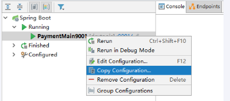
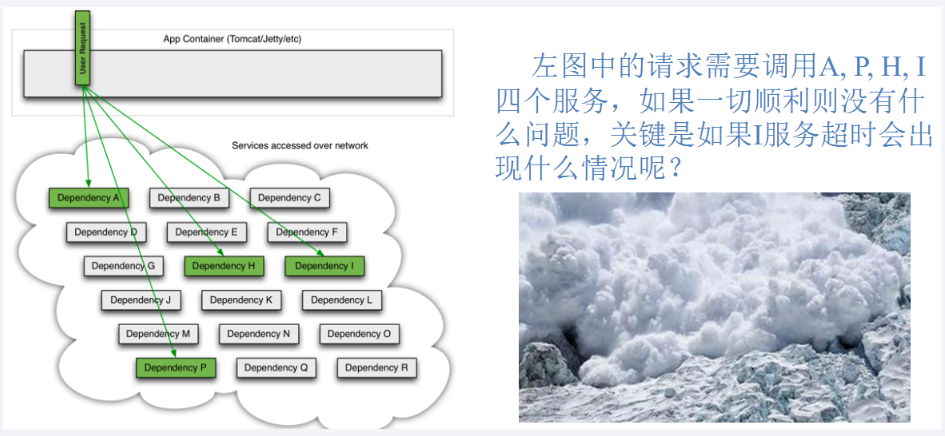
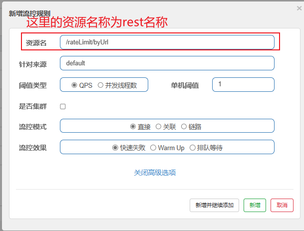

# SpringCloud-Alibaba

[SpringCloudAlibaba官方网站](https://sca.aliyun.com/zh-cn/)
[Spring Cloud AlibabaSpring网站](https://spring.io/projects/spring-cloud-alibaba)


<span style="color:red">什么是SpringCloud-Alibaba?
</span>
[官网解释](https://sca.aliyun.com/zh-cn/docs/2022.0.0.0/overview/what-is-sca)

开发手册以及版本选择：


## 1.Nacos服务注册配置中心

### 1.是什么？

[Nacos](https://nacos.io/zh-cn/) /nɑ:kəʊs/ 是 Dynamic Naming and Configuration Service 的首字母简称，一个更易于构建云原生应用的动态服务发现、配置管理和服务管理平台。

Nacos 致力于帮助您发现、配置和管理微服务。Nacos 提供了一组简单易用的特性集，帮助您快速实现动态服务发现、服务配置、服务元数据及流量管理。

Nacos 帮助您更敏捷和容易地构建、交付和管理微服务平台。Nacos 是构建以“服务”为中心的现代应用架构 (例如微服务范式、云原生范式) 的服务基础设施。


**Alibaba开发的一款更易于构建云原生应用的动态服务发现、配置管理和服务管理平台。类似于 Consul(Spring-cloud开发)**

### 2.有什么用？

-  **服务注册与发现**
- **配置管理**

### 3.怎么玩？

- **Nacos下载：**[Releases · alibaba/nacos (github.com)](https://github.com/alibaba/nacos/releases)

  

- **Nacos启动/关闭：** 
  启动：到nacos文件的bin目录：cmd中运行 **startup.cmd -m standalone(单节点)**
  关闭：shutdown.cmd
  默认账号密码都是：nacos
  默认端口号访问：http://localhost:8848/nacos/

  
  
- **<span style="color:pink">核心之一：服务注册与发现</span>**

  一、RestTemplate + LoadBalance 

  **① 创建基于Nacos的服务提供者9001**

  1. **改POM**

     ``` xml
      <dependencies>
             <!--nacos-discovery(这个是重点：服务注册与发现)-->
             <dependency>
                 <groupId>com.alibaba.cloud</groupId>
                 <artifactId>spring-cloud-starter-alibaba-nacos-discovery</artifactId>
             </dependency>
             <!-- 引入自己定义的api通用包 -->
             <dependency>
                 <groupId>com.iron.cloud</groupId>
                 <artifactId>cloud_api_commons</artifactId>
                 <version>1.0-SNAPSHOT</version>
             </dependency>
             <!--SpringBoot通用依赖模块-->
             <dependency>
                 <groupId>org.springframework.boot</groupId>
                 <artifactId>spring-boot-starter-web</artifactId>
             </dependency>
             <dependency>
                 <groupId>org.springframework.boot</groupId>
                 <artifactId>spring-boot-starter-actuator</artifactId>
             </dependency>
             <!--hutool-->
             <dependency>
                 <groupId>cn.hutool</groupId>
                 <artifactId>hutool-all</artifactId>
             </dependency>
             <!--lombok-->
             <dependency>
                 <groupId>org.projectlombok</groupId>
                 <artifactId>lombok</artifactId>
                 <version>1.18.28</version>
                 <scope>provided</scope>
             </dependency>
             <!--test-->
             <dependency>
                 <groupId>org.springframework.boot</groupId>
                 <artifactId>spring-boot-starter-test</artifactId>
                 <scope>test</scope>
             </dependency>
         </dependencies>
     ```

  2. **改YML**

     ``` yaml
     server:
       port: 9001
     
     spring:
       application:
         name: nacos-payment-provider
       cloud:
         nacos:
           discovery:
             server-addr: localhost:8848 #配置Nacos地址
     ```

  3. **主启动**

     ``` java
     @SpringBootApplication
     @EnableDiscoveryClient
     public class Main9001 {
     
         public static void main(String[] args) {
     
             SpringApplication.run(Main9001.class, args);
         }
     }
     ```

  4. **测试**

     **成功加入Nacos**
     

  **② 创建基于Nacos的服务消费者**

  1. **改POM**
     **重点是前两个包：服务注册与发现 + loadbalance(配合RestTmplate使用)**

     ``` xml
        <dependencies>
             <!--nacos-discovery-->
             <dependency>
                 <groupId>com.alibaba.cloud</groupId>
                 <artifactId>spring-cloud-starter-alibaba-nacos-discovery</artifactId>
             </dependency>
             <!--loadbalancer-->
             <dependency>
                 <groupId>org.springframework.cloud</groupId>
                 <artifactId>spring-cloud-starter-loadbalancer</artifactId>
             </dependency>
             <!--web + actuator-->
             <dependency>
                 <groupId>org.springframework.boot</groupId>
                 <artifactId>spring-boot-starter-web</artifactId>
             </dependency>
             <dependency>
                 <groupId>org.springframework.boot</groupId>
                 <artifactId>spring-boot-starter-actuator</artifactId>
             </dependency>
             <!--lombok-->
             <dependency>
                 <groupId>org.projectlombok</groupId>
                 <artifactId>lombok</artifactId>
                 <optional>true</optional>
             </dependency>
         </dependencies>
     ```

  2. **改YML**

     ``` yaml
     server:
       port: 83
     
     spring:
       application:
         name: nacos-order-consumer
       cloud:
         nacos:
           discovery:
             server-addr: localhost:8848
     #消费者将要去访问的微服务名称(nacos微服务提供者叫什么你写什么)
     service-url:
       nacos-user-service: http://nacos-payment-provider
     ```

  3. **主启动**

     ``` java
     @SpringBootApplication
     @EnableDiscoveryClient
     public class Main83 {
     
         public static void main(String[] args) {
     
             SpringApplication.run(Main83.class, args);
         }
     }
     ```

  4. **RestTmplateConfig**
     **负载均衡**

     ``` java
     @Configuration
     @RefreshScope   // 支持配置动态刷新
     public class RestyTemplateConfig {
     
         @Bean
         @LoadBalanced   // 负载平衡
         public RestTemplate restTemplate() {
     
             return new RestTemplate();
         }
     }
     ```

  5. **Controller调用提供者**
     **通过nacos服务名调用**

     ``` java
     @RestController
     public class OrderNacosController
     {
         @Resource
         private RestTemplate restTemplate;
     
         @Value("${service-url.nacos-user-service}") // http://nacos-payment-provider
         private String serverURL;
     
         @GetMapping("/consumer/pay/nacos/{id}")
         public String paymentInfo(@PathVariable("id") Integer id)
         {
             String result = restTemplate.getForObject(serverURL + "/pay/nacos/" + id, String.class);
             return result+"\t"+"    我是OrderNacosController83调用者。。。。。。";
         }
     }
     ```

  6. **测试**

     通过83调用9001：[localhost:83/consumer/pay/nacos/1](http://localhost:83/consumer/pay/nacos/1)

  **③ 创建9001的克隆并测试负载均衡**

  - 创建9001克隆
    1. 第一步：
       
    2. 第二步：这里注意要修改一下端口号
       
  - 测试Loadebalancer
    访问：[localhost:83/consumer/pay/nacos/1](http://localhost:83/consumer/pay/nacos/1)观察打印端口号变化。


  **二、OpenFeign实例**

  **1. 服务提供者（Provider Service）**

  **创建 Spring Boot 项目**

  使用 Spring Initializr 创建一个新的 Spring Boot 项目，并添加以下依赖：

  - Spring Web
  - Nacos Discovery

  **配置 `pom.xml`**

  ```java
  <!-- provider-service/pom.xml -->
  <project xmlns="http://maven.apache.org/POM/4.0.0"
           xmlns:xsi="http://www.w3.org/2001/XMLSchema-instance"
           xsi:schemaLocation="http://maven.apache.org/POM/4.0.0 http://maven.apache.org/xsd/maven-4.0.0.xsd">
      <modelVersion>4.0.0</modelVersion>
  
      <groupId>com.example</groupId>
      <artifactId>provider-service</artifactId>
      <version>0.0.1-SNAPSHOT</version>
      <name>Provider Service</name>
  
      <dependencies>
          <!-- Spring Web -->
          <dependency>
              <groupId>org.springframework.boot</groupId>
              <artifactId>spring-boot-starter-web</artifactId>
          </dependency>
  
          <!-- Nacos Discovery -->
          <dependency>
              <groupId>com.alibaba.cloud</groupId>
              <artifactId>spring-cloud-starter-alibaba-nacos-discovery</artifactId>
              <version>2023.0.1.0</version>
          </dependency>
      </dependencies>
  
      <properties>
          <java.version>17</java.version>
      </properties>
  
      <dependencyManagement>
          <dependencies>
              <dependency>
                  <groupId>com.alibaba.cloud</groupId>
                  <artifactId>spring-cloud-alibaba-dependencies</artifactId>
                  <version>2023.0.1.0</version>
                  <type>pom</type>
                  <scope>import</scope>
              </dependency>
          </dependencies>
      </dependencyManagement>
  </project>
  ```

  **配置 `application.yml`**

  ```java
  # provider-service/src/main/resources/application.yml
  spring:
    application:
      name: provider-service
  
    cloud:
      nacos:
        discovery:
          server-addr: 127.0.0.1:8848  # Nacos 服务器地址
  
  server:
    port: 8081  # 服务提供者的端口
  ```

  **创建主应用类**

  ```java
  // provider-service/src/main/java/com/example/provider/ProviderApplication.java
  package com.example.provider;
  
  import org.springframework.boot.SpringApplication;
  import org.springframework.boot.autoconfigure.SpringBootApplication;
  
  @SpringBootApplication
  public class ProviderApplication {
      public static void main(String[] args) {
          SpringApplication.run(ProviderApplication.class, args);
      }
  }
  ```

  **创建 Controller**

  ```java
  // provider-service/src/main/java/com/example/provider/controller/HelloController.java
  package com.example.provider.controller;
  
  import org.springframework.web.bind.annotation.GetMapping;
  import org.springframework.web.bind.annotation.RestController;
  
  @RestController
  public class HelloController {
  
      @GetMapping("/hello")
      public String hello() {
          return "Hello from Provider Service!";
      }
  }
  ```

  **2. 服务消费者（Consumer Service）**

  **创建 Spring Boot 项目**

  使用 Spring Initializr 创建一个新的 Spring Boot 项目，并添加以下依赖：

  - Spring Web
  - OpenFeign
  - Nacos Discovery

  **配置 `pom.xml`**

  ```java
  <!-- consumer-service/pom.xml -->
  <project xmlns="http://maven.apache.org/POM/4.0.0"
           xmlns:xsi="http://www.w3.org/2001/XMLSchema-instance"
           xsi:schemaLocation="http://maven.apache.org/POM/4.0.0 http://maven.apache.org/xsd/maven-4.0.0.xsd">
      <modelVersion>4.0.0</modelVersion>
  
      <groupId>com.example</groupId>
      <artifactId>consumer-service</artifactId>
      <version>0.0.1-SNAPSHOT</version>
      <name>Consumer Service</name>
  
      <dependencies>
          <!-- Spring Web -->
          <dependency>
              <groupId>org.springframework.boot</groupId>
              <artifactId>spring-boot-starter-web</artifactId>
          </dependency>
  
          <!-- OpenFeign -->
          <dependency>
              <groupId>org.springframework.cloud</groupId>
              <artifactId>spring-cloud-starter-openfeign</artifactId>
          </dependency>
  
          <!-- Nacos Discovery -->
          <dependency>
              <groupId>com.alibaba.cloud</groupId>
              <artifactId>spring-cloud-starter-alibaba-nacos-discovery</artifactId>
              <version>2023.0.1.0</version>
          </dependency>
      </dependencies>
  
      <properties>
          <java.version>17</java.version>
      </properties>
  
      <dependencyManagement>
          <dependencies>
              <dependency>
                  <groupId>com.alibaba.cloud</groupId>
                  <artifactId>spring-cloud-alibaba-dependencies</artifactId>
                  <version>2023.0.1.0</version>
                  <type>pom</type>
                  <scope>import</scope>
              </dependency>
          </dependencies>
      </dependencyManagement>
  </project>
  ```

  **配置 `application.yml`**

  ```java
  # consumer-service/src/main/resources/application.yml
  spring:
    application:
      name: consumer-service
  
    cloud:
      nacos:
        discovery:
          server-addr: 127.0.0.1:8848  # Nacos 服务器地址
  
  feign:
    client:
      config:
        default:
          connectTimeout: 5000
          readTimeout: 5000
  
  server:
    port: 8082  # 服务消费者的端口
  ```

  **创建主应用类**

  ```java
  // consumer-service/src/main/java/com/example/consumer/ConsumerApplication.java
  package com.example.consumer;
  
  import org.springframework.boot.SpringApplication;
  import org.springframework.boot.autoconfigure.SpringBootApplication;
  import org.springframework.cloud.openfeign.EnableFeignClients;
  
  @SpringBootApplication
  @EnableFeignClients  // 启用 OpenFeign
  public class ConsumerApplication {
      public static void main(String[] args) {
          SpringApplication.run(ConsumerApplication.class, args);
      }
  }
  ```

  **创建 Feign 客户端接口**

  ```java
  // consumer-service/src/main/java/com/example/consumer/client/ProviderClient.java
  package com.example.consumer.client;
  
  import org.springframework.cloud.openfeign.FeignClient;
  import org.springframework.web.bind.annotation.GetMapping;
  
  // 使用 Nacos 的服务名称 "provider-service" 作为 FeignClient 的 name
  @FeignClient(name = "provider-service")
  public interface ProviderClient {
  
      @GetMapping("/hello")
      String hello();
  }
  ```

  **创建 Controller**

  ```java
  // consumer-service/src/main/java/com/example/consumer/controller/ConsumerController.java
  package com.example.consumer.controller;
  
  import com.example.consumer.client.ProviderClient;
  import org.springframework.beans.factory.annotation.Autowired;
  import org.springframework.web.bind.annotation.GetMapping;
  import org.springframework.web.bind.annotation.RestController;
  
  @RestController
  public class ConsumerController {
  
      @Autowired
      private ProviderClient providerClient;
  
      @GetMapping("/consume")
      public String consume() {
          return providerClient.hello();
      }
  }
  ```


- **<span style="color:pink">核心之二：全局服务配置</span>**
  **创建 cloudalibaba-config-nacos-client3377**

  1. **改POM**

     ``` xml
         <dependencies>
             <!--bootstrap-->
             <dependency>
                 <groupId>org.springframework.cloud</groupId>
                 <artifactId>spring-cloud-starter-bootstrap</artifactId>
             </dependency>
             <!--nacos-config-->
             <dependency>
                 <groupId>com.alibaba.cloud</groupId>
                 <artifactId>spring-cloud-starter-alibaba-nacos-config</artifactId>
             </dependency>
             <!--nacos-discovery-->
             <dependency>
                 <groupId>com.alibaba.cloud</groupId>
                 <artifactId>spring-cloud-starter-alibaba-nacos-discovery</artifactId>
             </dependency>
             <!--web + actuator-->
             <dependency>
                 <groupId>org.springframework.boot</groupId>
                 <artifactId>spring-boot-starter-web</artifactId>
             </dependency>
             <dependency>
                 <groupId>org.springframework.boot</groupId>
                 <artifactId>spring-boot-starter-actuator</artifactId>
             </dependency>
             <!--lombok-->
             <dependency>
                 <groupId>org.projectlombok</groupId>
                 <artifactId>lombok</artifactId>
                 <optional>true</optional>
             </dependency>
         </dependencies>
     
         <build>
             <plugins>
                 <plugin>
                     <groupId>org.springframework.boot</groupId>
                     <artifactId>spring-boot-maven-plugin</artifactId>
                 </plugin>
             </plugins>
         </build>
     ```

  2. **改YML**
     **为什么要两个？**
     Nacos同Consul一样，在项目初始化时，要保证先从配置中心进行配置拉取，

     拉取配置之后，才能保证项目的正常启动，为了满足动态刷新和全局广播通知

     **springboot中配置文件的加载是存在优先级顺序的，bootstrap优先级高于application**

     - bootstrap.yml
       ``` xml
       # nacos配置
       spring:
         application:
           name: nacos-config-client
         cloud:
           nacos:
             discovery:
               server-addr: localhost:8848 #Nacos服务注册中心地址
             config:
               server-addr: localhost:8848 #Nacos作为配置中心地址
               file-extension: yaml #指定yaml格式的配置
       
       # nacos端配置文件DataId的命名规则是：
       # ${spring.application.name}-${spring.profile.active}.${spring.cloud.nacos.config.file-extension}
       # 本案例的DataID是:nacos-config-client-dev.yaml
       ```

     - application.yml
       ``` xml
       server:
         port: 3377
       
       spring:
         profiles:
           active: dev # 表示开发环境
              #active: prod # 表示生产环境
              #active: test # 表示测试环境
       ```

     - **启动类**

       ``` java
       @SpringBootApplication
       @EnableDiscoveryClient
       public class Main3377 {
       
           public static void main(String[] args) {
       
               SpringApplication.run(Main3377.class, args);
           }
       }
       ```

     - **controller类**

       ``` java
       @RestController
       @RefreshScope //在控制器类加入@RefreshScope注解使当前类下的配置支持Nacos的动态刷新功能。
       public class NacosConfigClientController
       {
           @Value("${config.info}")
           private String configInfo;
       
           @GetMapping("/config/info")
           public String getConfigInfo() {
               return configInfo;
           }
       }
       ```

     - <span style="color:red">========== 重点：设置全局服务配置 =======</span>

       1. **Nacos中 DataId 配置规则**
          **公式：** ${spring.application.name}-${spring.profile.active}.${spring.cloud.nacos.config.file-extension}
          本案例的DataID是:nacos-config-client-dev.yaml

          

       2. **根据DataId创建Config**
          **本案例DataId: nacos-config-client-dev.yaml**

          - **① nacos服务注册中心创建**
            
          - **② 设置值**
            
          - **③ 测试动态刷新**
            启动cloudalibaba-config-nacos-client3377
            访问 [localhost:3377/config/info](http://localhost:3377/config/info) 拿到值
          - **④ 允许配置回滚**
            


- **<span style="color:pink">Nacos数据模型之Namespace-Group-DataId</span>**

  **有什么用？**
  <span style="color:red">解决多环境多项目管理问题
  </span>

  实际开发中，通常一个系统会准备dev开发环境test测试环境prod生产环境。如何保证指定环境启动时服务能正确读取到Nacos上相应环境的配置文件呢？

  一个大型分布式微服务系统会有很多微服务子项目，每个微服务项目又都会有相应的开发环境、测试环境、预发环境、正式环境......那怎么对这些微服务配置进行分组和命名空间管理呢？

   **之间的关系**

  

  <span style="color:red">==========重点：三种方案进行加载配置=============</span>

  - **① DataID方案**
    **默认名public+默认分组DEFAULT_GROUP+新建DataID**

    1. 根据公式计算出DataID值

       公式：${spring.application.name}-${spring.profile.active}.${spring.cloud.nacos.config.file-extension}
       例如：nacos-config-client-dev.yaml(开发时的配置)

    2. 修改

       **第一步修改：application.yml**
       修改对应${spring.profile.active}的值
       例如：(生产时的配置)

       ``` yaml
       server:
         port: 3377
       
       spring:
         profiles:
           #active: dev # 表示开发环境
           active: prod # 表示生产环境
           #active: test # 表示测试环境
       ```

       **第二步：根据DataID(nacos-config-client-prod.yaml)在Nacos配置中心新建一个配置文件**

  - **② Group方案**
    **默认空间public+新建PROD_GROUP+新建的DataID**

    1. **第一步：创建group+DataID**
       

    2. **第二步：修改bootstrap.yml**

       ``` yaml
       spring:
         application:
           name: nacos-config-client
         cloud:
           nacos:
             discovery:
               server-addr: localhost:8848 
             config:
               server-addr: localhost:8848 
               file-extension: yaml 
               group: PROD_GROUP	# 这里代表配置对应的GROUP
       ```

    3. **第三步：修改application.yml**

       ```yaml
       server:
         port: 3377
       
       spring:
         profiles:
           #active: dev # 表示开发环境
           active: prod # 表示生产环境
           #active: test # 表示测试环境
       ```

  - **③ NameSpace方案**
    **自定义Namespace(Prod_Namespace) + 自定义GROUP(PROD_GROUP) + DataId(nacos-config-client-prod.yaml)**

    1. **第一步：新建命名空间**
       

    2. **第二步：根据三者创建一个配置**
       

    3. **第三步：配置bootstrap.yml**

       ``` yaml
       # nacos配置 第3种:新建空间+新建分组+新建DataID
       spring:
         application:
           name: nacos-config-client
         cloud:
           nacos:
             discovery:
               server-addr: localhost:8848 
             config:
               server-addr: localhost:8848
               file-extension: yaml 
               group: PROD_GROUP	# 指定GROUP
               namespace: Prod_Namespace # 指定NameSpace	
       ```

    4. **第四步：配置application.yml**

       ``` yaml
       server:
         port: 3377
       
       spring:
         profiles:
           #active: dev # 表示开发环境
           #active: test # 表示测试环境
           active: prod # 表示生产环境
       ```


## 2. Setntinel 服务熔断降级限流

### 1.是什么？

**面向分布式、多语言异构化服务架构的流量治理组件**
随着分布式系统日益普及，服务之间的可靠性变得前所未有的重要，[哨兵](https://sentinelguard.io/)是以“流”为切入点，涵盖**流量控制**、**并发限制**、断路、**自适应系统过载保护**等多个领域的强大**流量控制组件**，以保证微服务的可靠性。

[Sentinel官网](https://sentinelguard.io/zh-cn/)

[详细参考GitHubWiki开发文档](https://github.com/alibaba/Sentinel/wiki)

###  2.有什么用？

**功能类似于Resilience4J**

**功能总览(参考GitHubWiki和Sentinel服务中心)**


<span style="color:red">主要功能:</span> **流量控制**， **熔断降级**， **热点参数限流**， **黑白名单控制**， **网关流控**， **结合OpenFeign流控**

### 3. 相关重要概念

- **① 服务雪崩**

  ``` tex
  多个微服务之间调用的时候，假设微服务A调用微服务B和微服务C，微服务B和微服务C又调用其它的微服务，这就是所谓的“扇出”。如果扇出的链路上某个微服务的调用响应时间过长或者不可用，对微服务A的调用就会占用越来越多的系统资源，进而引起系统崩溃，所谓的“雪崩效应”。对于高流量的应用来说，单一的后端依赖可能会导致所有服务器上的所有资源都在几秒钟内饱和。比失败更糟糕的是，这些应用程序还可能导致服务之间的延迟增加，备份队列，线程和其他系统资源紧张，导致整个系统发生更多的级联故障。这些都表示需要对故障和延迟进行隔离和管理，以便单个依赖关系的失败，不能取消整个应用程序或系统。
  
  所以，通常当你发现一个模块下的某个实例失败后，这时候这个模块依然还会接收流量，然后这个有问题的模块还调用了其他的模块，这样就会发生“级联故障”，或者叫“雪崩”。复杂分布式体系结构中的应用程序有数十个依赖关系，每个依赖关系在某些时候将不可避免地失败。
  ```

  

- **② 服务降级**

  ``` tex
  服务降级，说白了就是一种服务托底方案，如果服务无法完成正常的调用流程，就使用默认的托底方案来返回数据。
  
  例如，在商品详情页一般都会展示商品的介绍信息，一旦商品详情页系统出现故障无法调用时，会直接获取缓存中的商品介绍信息返回给前端页面。
  ```

- **③ 服务熔断**

  ``` tex
  在分布式与微服务系统中，如果下游服务因为访问压力过大导致响应很慢或者一直调用失败时，上游服务为了保证系统的整体可用性，会暂时断开与下游服务的调用连接。这种方式就是熔断。类比保险丝达到最大服务访问后，直接拒绝访问，拉闸限电，然后调用服务降级的方法并返回友好提示。
  
  服务熔断一般情况下会有三种状态：闭合、开启和半熔断;
  
  闭合状态(保险丝闭合通电OK)：服务一切正常，没有故障时，上游服务调用下游服务时，不会有任何限制。
  
  开启状态(保险丝断开通电Error)：上游服务不再调用下游服务的接口，会直接返回上游服务中预定的方法。
  
  半熔断状态：处于开启状态时，上游服务会根据一定的规则，尝试恢复对下游服务的调用。此时，上游服务会以有限的流量来调用下游服务，同时，会监控调用的成功率。如果成功率达到预期，则进入关闭状态。如果未达到预期，会重新进入开启状态。
  ```

- **③ 服务限流**

  ``` tex
  服务限流就是限制进入系统的流量，以防止进入系统的流量过大而压垮系统。其主要的作用就是保护服务节点或者集群后面的数据节点，防止瞬时流量过大使服务和数据崩溃（如前端缓存大量实效），造成不可用；还可用于平滑请求，类似秒杀高并发等操作，严禁一窝蜂的过来拥挤，大家排队，一秒钟N个，有序进行。
  
  限流算法有两种，一种就是简单的请求总量计数，一种就是时间窗口限流（一般为1s），如令牌桶算法和漏牌桶算法就是时间窗口的限流算法。
  ```

  **令牌桶算法和漏牌桶算法等等在上篇Spring-cloud(Resilience4J)已经讲过**

- **④ 服务隔离**

  ``` tex
  有点类似于系统的垂直拆分，就按照一定的规则将系统划分成多个服务模块，并且每个服务模块之间是互相独立的，不会存在强依赖的关系。如果某个拆分后的服务发生故障后，能够将故障产生的影响限制在某个具体的服务内，不会向其他服务扩散，自然也就不会对整体服务产生致命的影响。
  
  互联网行业常用的服务隔离方式有：线程池隔离和信号量隔离。
  ```

- **⑤ 服务超时**

  ``` tex
  整个系统采用分布式和微服务架构后，系统被拆分成一个个小服务，就会存在服务与服务之间互相调用的现象，从而形成一个个调用链。
  
  形成调用链关系的两个服务中，主动调用其他服务接口的服务处于调用链的上游，提供接口供其他服务调用的服务处于调用链的下游。服务超时就是在上游服务调用下游服务时，设置一个最大响应时间，如果超过这个最大响应时间下游服务还未返回结果，则断开上游服务与下游服务之间的请求连接，释放资源。
  ```

- **⑥ 讲讲什么是缓存穿透？击穿？雪崩？如何解决？**
  **相关Redis去看B栈Redis相关的课程**

### 4.怎么玩？

- **① Sentinel下载与启动**

  1. [Releases · alibaba/Sentinel (github.com)](https://github.com/alibaba/Sentinel/releases) 此处下载jar包
  2. 启动：**java -jar sentinel-dashboard-1.8.7.jar**
  3. 登录：默认账号密码：sentinel sentinel
  4. 默认有两个端口(后面YML得配置)：
     - ① 前台端口：8080
     - ② 后台端口：8719

- **② 入门相关配置**
  **新建 Model cloudalibaba-sentinel-8401 测试模块**

  1. **改POM**
     **重要的是第一个Sentinel核心依赖和第二个Nacos服务注册和发现**

     ```xml
        <dependencies>
             <!--SpringCloud alibaba sentinel -->
             <dependency>
                 <groupId>com.alibaba.cloud</groupId>
                 <artifactId>spring-cloud-starter-alibaba-sentinel</artifactId>
             </dependency>
             <!--nacos-discovery-->
             <dependency>
                 <groupId>com.alibaba.cloud</groupId>
                 <artifactId>spring-cloud-starter-alibaba-nacos-discovery</artifactId>
             </dependency>
             <!-- 引入自己定义的api通用包 -->
             <dependency>
                 <groupId>com.atguigu.cloud</groupId>
                 <artifactId>cloud-api-commons</artifactId>
                 <version>1.0-SNAPSHOT</version>
             </dependency>
             <!--SpringBoot通用依赖模块-->
             <dependency>
                 <groupId>org.springframework.boot</groupId>
                 <artifactId>spring-boot-starter-web</artifactId>
             </dependency>
             <dependency>
                 <groupId>org.springframework.boot</groupId>
                 <artifactId>spring-boot-starter-actuator</artifactId>
             </dependency>
             <!--hutool-->
             <dependency>
                 <groupId>cn.hutool</groupId>
                 <artifactId>hutool-all</artifactId>
             </dependency>
             <!--lombok-->
             <dependency>
                 <groupId>org.projectlombok</groupId>
                 <artifactId>lombok</artifactId>
                 <version>1.18.28</version>
                 <scope>provided</scope>
             </dependency>
             <!--test-->
             <dependency>
                 <groupId>org.springframework.boot</groupId>
                 <artifactId>spring-boot-starter-test</artifactId>
                 <scope>test</scope>
             </dependency>
         </dependencies>
     ```

     

  2. **改YML**
     **配置Sentinel前后台端口 和 配置Nacos注册与发现**

     ``` yaml
     server:
       port: 8401
     
     spring:
       application:
         name: cloudalibaba-sentinel-service
     
       cloud:
         nacos:
           discovery:
             server-addr: localhost:8848   #Nacos服务注册中心
         sentinel:
           transport:
             dashboard: localhost:8080 #配置Sentinel dashboard控制台服务地址
             port: 8719 #默认8719端口，假如被占用会自动从8719开始依次+1扫描,直至找到未被占用的端口
     ```

     

  3. **主启动**

     ``` java
     @SpringBootApplication
     @EnableDiscoveryClient
     public class Main8401 {
     
         public static void main(String[] args) {
     
             SpringApplication.run(Main8401.class, args);
         }
     }
     ```

  4. **服务类**

     ``` java
     @RestController
     public class FlowLimitController
     {
     
         @GetMapping("/testA")
         public String testA()
         {
             return "------testA";
         }
     
         @GetMapping("/testB")
         public String testB()
         {
             return "------testB";
         }
     }
     ```

  5. **测试**
     

- **<span style="color:pink">③ 核心功能一：流量控制</span>**

  1. **是什么？**
     Sentinel能够对流量进行控制，主要是监控应用的QPS流量或者并发线程数等指标，如果达到指定的阈值时，就会被流量进行控制，以避免服务被瞬时的高并发流量击垮，保证服务的高可靠性。参数见最下方：

  2. **具体玩法**
     <span style="color:red">即对照上图的不同功能</span>

     - **① 核心一流控规则之：流控模式**

       1. **直接**

          **当接口到达限流条件是，直接开启限流功能**
          配置：设置阈值为一秒一次，不然返回 **Block By Sentinel(flow limiting)**
          
          结果：
          

       2. **关联**
          **当关联的资源达到阈值时，就限流自己**(<span style="color:red">张三感冒，李四吃药</span>)
          配置：
          
          结果：
          

          其中B的访问需要用到JMeter：

          [JMeter负载调试下载](https://jmeter.apache.org/download_jmeter.cgi)
          

       3. **链路**

          **来自不同链路的请求对通过一个目标访问时，实施针对性的不同限流措施，比如C请求来访问就先流，D请求来访问就是OK**

          YAML：

          ```
          server:
            port: 8401
          
          spring:
            application:
              name: cloudalibaba-sentinel-service
          
            cloud:
              nacos:
                discovery:
                  server-addr: localhost:8848  
              sentinel:
                transport:
                  dashboard: localhost:8080 
                  port: 8719 
                web-context-unify: false  # controller层的方法对service层调用不认为是同一个链路
          ```

          新增service类+@SentinelResource

          ``` java
          @Service
          public class FlowLimitService
          {
              @SentinelResource(value = "common")	# 这里声明了资源名
              public void common()
              {
                  System.out.println("------FlowLimitService come in");
              }
          }
          ```

          新增TestC TestD接口：

          ```java
              @GetMapping("/testC")
              public String testC()
              {
                  flowLimitService.common();
                  return "------testC";
              }
              @GetMapping("/testD")
              public String testD()
              {
                  flowLimitService.common();
                  return "------testD";
              }
          ```

          配置：

          链路只限制TestC,不限制TestD
          
          结果：
          
          
          
     
     - **<span style="color:pink">② 核心一流控规则之：流控效果</span>**
       [流量控制](https://github.com/alibaba/Sentinel/wiki/流量控制)
     
       1. **快速失败**
          **直接拒绝**（`RuleConstant.CONTROL_BEHAVIOR_DEFAULT`）方式是默认的流量控制方式，当QPS超过任意规则的阈值后，新的请求就会被立即拒绝，拒绝方式为抛出`FlowException`。
          这种方式适用于对系统处理能力确切已知的情况下，比如通过压测确定了系统的准确水位时
     
       2. **warmUp(预热)**
          **Warm Up**（`RuleConstant.CONTROL_BEHAVIOR_WARM_UP`）方式，即预热/冷启动方式。当系统长期处于低水位的情况下，当流量突然增加时，直接把系统拉升到高水位可能瞬间把系统压垮。通过"冷启动"，让通过的流量缓慢增加，在一定时间内逐渐增加到阈值上限，给冷系统一个预热的时间，避免冷系统被压垮。
          
          默认 `coldFactor` 为 3，即请求 QPS 从 `threshold / 3` 开始，经预热时长逐渐升至设定的 QPS 阈值。
     
          **配置：**
          
          **这里为3：刚开始一秒为3然后慢慢升到10**
          **结果：**
          五秒之前的阈值为3(10/3)， 五秒之后的阈值为10。
     
          所以刚开始会触发阈值，到五秒之后不会触发(没那么快的手速)
          **运用场景：**秒杀系统在开启的瞬间，会有很多流量上来，很有可能把系统打死，预热方式就是把为了保护系统，可慢慢的把流量放进来，慢慢的把阈值增长到设置的阈值。
     
       3. **排队等待**
          **匀速排队**（`RuleConstant.CONTROL_BEHAVIOR_RATE_LIMITER`）方式会严格控制请求通过的间隔时间，也即是让请求以均匀的速度通过，对应的是漏桶算法。
          
          **配置：**
     
          **一秒钟进来一个，持续十秒，十秒后的进行抛弃。**
          
          **结果：**
     
          一秒钟打20个到TestE接口
          
          结果只能接受十一个(一秒一个)
          
          
          
     
     
     
     - **<span style="color:pink">③ 核心一流控规则之：并发线程数流控效果</span>**
       **配置：**
       
     
       
       **结果：**
       只有在JEmeter空闲的时候才能进行访问，不然报错Blocked by Sentinel (flow limiting)。
     
       
     
     - **<span style="color:pink">④ 核心二：熔断规则</span>**
     
       [熔断降级 · alibaba/Sentinel Wiki (github.com)](https://github.com/alibaba/Sentinel/wiki/熔断降级)
     
       **介绍：**
       除了流量控制以外，对调用链路中不稳定的资源进行熔断降级也是保障高可用的重要措施之一。一个服务常常会调用别的模块，可能是另外的一个远程服务、数据库，或者第三方 API 等。例如，支付的时候，可能需要远程调用银联提供的 API；查询某个商品的价格，可能需要进行数据库查询。然而，这个被依赖服务的稳定性是不能保证的。如果依赖的服务出现了不稳定的情况，请求的响应时间变长，那么调用服务的方法的响应时间也会变长，线程会产生堆积，最终可能耗尽业务自身的线程池，服务本身也变得不可用。
     
       **熔断策略：**
     
       - **慢调用比例**
     
         **介绍：**
         慢调用比例 (`SLOW_REQUEST_RATIO`)：选择以慢调用比例作为阈值，需要设置允许的慢调用 RT（即最大的响应时间），请求的响应时间大于该值则统计为慢调用。**当单位统计时长（`statIntervalMs`）内请求数目大于设置的最小请求数目(条件一)**，并且**慢调用的比例大于阈值(条件二)**，则接下来的熔断时长内请求会自动被熔断。经过熔断时长后熔断器会进入探测恢复状态（HALF-OPEN 状态），若接下来的一个请求响应时间小于设置的慢调用 RT 则结束熔断，若大于设置的慢调用 RT 则会再次被熔断。
     
         **代码：**
         新增testF：每次访问都大于一秒
     
         ``` java
             @GetMapping("/testF")
             public String testF()
             {
                 //暂停几秒钟线程
                 try { TimeUnit.SECONDS.sleep(1); } catch (InterruptedException e) { e.printStackTrace(); }
                 System.out.println("----测试:新增熔断规则-慢调用比例 ");
                 return "------testF 新增熔断规则-慢调用比例";
             }
         ```
     
         **配置：**
         
     
         1.调用：发送到服务器，服务器给与响应，一个响应就是一个调用。
     
         2.最大RT：即最大的响应时间，指系统对请求作出响应的业务处理时间。
     
         3.慢调用：处理业务逻辑的实际时间>设置的最大RT时间，这个调用叫做慢调用。
     
         4.慢调用比例：在所以调用中，慢调用占有实际的比例＝慢调用次数➗总调用次数
     
         5.比例阈值：自己设定的 ， 比例阈值＝慢调用次数➗调用次数
     
         6.统计时长：时间的判断依据
     
         7.最小请求数：设置的调用最小请求数，上图比如1秒钟打进来10个线程（大于我们配置的5个了）调用被触发
         
         
       **结果：**
         
         
         **小结：**按照上述配置，熔断触发：
         
          **多次循环，一秒钟打进来10个线程(大于5个了)调用/testF，我们希望200毫秒处理完一次调用，和谐系统；^_^**
         
          **假如在统计时长内，实际请求数目＞最小请求数 且 慢调用比例＞比例阈值 ，断路器打开(保险丝跳闸)微服务不可用(Blocked by Sentinel (flow limiting))，进入熔断状态5秒；**后续我停止jmeter，没有这么大的访问量了，单独用浏览器访问rest地址，断路器关闭(保险丝恢复，合上闸口)，
     
          微服务恢复OK
     
       - **异常比例**
     
         **介绍：**
         异常比例 (`ERROR_RATIO`)：当单位统计时长（`statIntervalMs`）内请求数目大于设置的最小请求数目，并且异常的比例大于阈值，则接下来的熔断时长内请求会自动被熔断。经过熔断时长后熔断器会进入探测恢复状态（HALF-OPEN 状态），若接下来的一个请求成功完成（没有错误）则结束熔断，否则会再次被熔断。异常比率的阈值范围是 `[0.0, 1.0]`，代表 0% - 100%。
     
         **代码：**故意造成错误
     
         ``` java
             @GetMapping("/testG")
             public String testG()
             {
                 System.out.println("----测试:新增熔断规则-异常比例 ");
                 int age = 10/0;
                 return "------testG,新增熔断规则-异常比例 ";
             }
         ```
     
         **配置：**
         
         **结果：**
         
     
         **结论：**
         **五次请求内有百分之50异常则进行报错**
     
          - **异常数**
            **介绍：**
     
            异常数 (`ERROR_COUNT`)：当单位统计时长内的异常数目超过阈值之后会自动进行熔断。经过熔断时长后熔断器会进入探测恢复状态（HALF-OPEN 状态），若接下来的一个请求成功完成（没有错误）则结束熔断，否则会再次被熔断。
            **代码：**
     
            ``` java
            @GetMapping("/testH")
            public String testH()
            {
                System.out.println("----测试:新增熔断规则-异常数 ");
                int age = 10/0;
                return "------testH,新增熔断规则-异常数 ";
            }
            ```
     
            **配置：**
            
     
            **结果：**
     
            
            **结论：**
            **两个里面有一个错误，就进行熔断降级。**
     
     - **<span style="color:pink">⑤ @SentinelResource注解 和 自定义限流返回</span>**
     
       **是什么？**
       **@SentinelResource 是一个流量防卫防护组件注解，用于指定防护资源，对配置的资源进行流量控制，熔断降级功能。**
     
       **源代码解析：**
     
       ``` java
       @Target({ElementType.METHOD, ElementType.TYPE})
       @Retention(RetentionPolicy.RUNTIME)
       @Inherited
       public @interface SentinelResource {
       
           //资源名称
           String value() default "";
       
           //entry类型，标记流量的方向，取值IN/OUT，默认是OUT
           EntryType entryType() default EntryType.OUT;
           //资源分类
           int resourceType() default 0;
       
           //处理BlockException的函数名称,函数要求：
           //1. 必须是 public
           //2.返回类型 参数与原方法一致
           //3. 默认需和原方法在同一个类中。若希望使用其他类的函数，可配置blockHandlerClass ，并指定blockHandlerClass里面的方法。
           String blockHandler() default "";
       
           //存放blockHandler的类,对应的处理函数必须static修饰。
           Class<?>[] blockHandlerClass() default {};
       
           //用于在抛出异常的时候提供fallback处理逻辑。 fallback函数可以针对所
           //有类型的异常（除了 exceptionsToIgnore 里面排除掉的异常类型）进行处理。函数要求：
           //1. 返回类型与原方法一致
           //2. 参数类型需要和原方法相匹配
           //3. 默认需和原方法在同一个类中。若希望使用其他类的函数，可配置fallbackClass ，并指定fallbackClass里面的方法。
           String fallback() default "";
       
           //存放fallback的类。对应的处理函数必须static修饰。
           String defaultFallback() default "";
       
           //用于通用的 fallback 逻辑。默认fallback函数可以针对所有类型的异常进
           //行处理。若同时配置了 fallback 和 defaultFallback，以fallback为准。函数要求：
           //1. 返回类型与原方法一致
           //2. 方法参数列表为空，或者有一个 Throwable 类型的参数。
           //3. 默认需要和原方法在同一个类中。若希望使用其他类的函数，可配置fallbackClass ，并指定 fallbackClass 里面的方法。
           Class<?>[] fallbackClass() default {};
        
       
           //需要trace的异常
           Class<? extends Throwable>[] exceptionsToTrace() default {Throwable.class};
       
           //指定排除忽略掉哪些异常。排除的异常不会计入异常统计，也不会进入fallback逻辑，而是原样抛出。
           Class<? extends Throwable>[] exceptionsToIgnore() default {};
       }
       ```
     
       
     
       <span style="color:red">Sentinel三种限流方式和返回</span>
       **涉及8401RateLimitController类**
     
       **限流返回(blockHandler)：主要针对违背在Sentinel中心配置的参数触发返回的兜底函数**
       **熔断返回(fallback)：程序异常了JVM抛出的兜底返回函数**
     
       1. **按照rest地址限流+默认限流返回**
          **配置：**
          
          **限流返回：**
          
     
       2. **按照SentinelResource资源名称限流+自定义限流返回**
     
          **配置@SentinelResource注解**
     
          ``` java
             
          	@GetMapping("/rateLimit/byResource")
              @SentinelResource(value = "byResourceSentinelResource",blockHandler = "handleException")	// 这里声明了资源名，和自定义的限流返回
              public String byResource()
              {
                  return "按资源名称SentinelResource限流测试OK";
              }
          	
          	// 定义限流返回
              public String handleException(BlockException exception)
              {
                  return "服务不可用@SentinelResource启动"+"\t"+"o(╥﹏╥)o";
              }
          ```
     
          注意这里的限流返回函数里面必须带一个 BlockException exception
     
          **配置：**
          
     
          **限流返回：**
          
     
       3. **按SentinelResource资源名称限流+自定义限流返回+服务降级处理**
     
          **配置@SentinelResource注解**
     
          ``` java
              @GetMapping("/rateLimit/doAction/{p1}")
              @SentinelResource(value = "doActionSentinelResource",
                      blockHandler = "doActionBlockHandler", fallback = "doActionFallback")
              public String doAction(@PathVariable("p1") Integer p1) {
                  if (p1 == 0){
                      throw new RuntimeException("p1等于零直接异常");
                  }
                  return "doAction";
              }
          	
          	// 限流返回
              public String doActionBlockHandler(@PathVariable("p1") Integer p1,BlockException e){
                  log.error("sentinel配置自定义限流了:{}", e);
                  return "sentinel配置自定义限流了";
              }
          	
          	// 熔断返回
              public String doActionFallback(@PathVariable("p1") Integer p1,Throwable e){
                  log.error("程序逻辑异常了:{}", e);
                  return "程序逻辑异常了"+"\t"+e.getMessage();
              }
          ```
          
          **配置：**
          
          
          **限流返回：**
          
          
          **熔断返回：**
          
     
     
     
     - **<span style="color:pink">⑥ 热点规则(针对热点接口参数进行限流)</span>**
       **是什么？**
       [热点参数限流 · alibaba/Sentinel Wiki (github.com)](https://github.com/alibaba/Sentinel/wiki/热点参数限流)
     
       **配置SentinelResource**
     
       ``` java
           @GetMapping("/testHotKey")
           @SentinelResource(value = "testHotKey",blockHandler = "dealHandler_testHotKey")
           public String testHotKey(@RequestParam(value = "p1",required = false) String p1,
       
                                    @RequestParam(value = "p2",required = false) String p2){
               return "------testHotKey";
           }
       	
       	// 限流返回
           public String dealHandler_testHotKey(String p1, String p2, BlockException exception)
           {
               return "-----dealHandler_testHotKey";
           }
       ```
     
       **配置：**
       
     
       **测试：**
       
     
     
       
     
     
       
     
       **额外配置：**
       **配置：**
       
     
       **一定要点击：**
       
     
       **结果：**
       
     
     
     
     - **<span style="color:pink">⑦ 授权规则(黑白名单)</span>**
     
       - **是什么？**
         授权规则即黑白名单
         [黑白名单控制 · alibaba/Sentinel Wiki (github.com)](https://github.com/alibaba/Sentinel/wiki/黑白名单控制)
     
         **创建测试类：**
     
         ``` java
         @RestController
         @Slf4j
         public class EmpowerController //Empower授权规则，用来处理请求的来源
         {
             @GetMapping(value = "/empower")
             public String requestSentinel4(){
                 log.info("测试Sentinel授权规则empower");
                 return "Sentinel授权规则";
             }
         }
         ```
     
         ``` java
         @Component
         public class MyRequestOriginParser implements RequestOriginParser
         {
             @Override
             public String parseOrigin(HttpServletRequest httpServletRequest) {
                 return httpServletRequest.getParameter("serverName");
             }
         }
         ```
     
         **配置：**
         
     
         **结果：**
         
     
         
         **注意：** 这里可以通过配置  @SentinelResource(value = "byResourceSentinelResource",blockHandler = "handleException") 实现自定义限流返回。
     
     - **<span style="color:pink">⑧ 规则持久化(将图形话配置配置到Nacos的配置中心)</span>**
       **是什么？**
       一旦我们重启微服务应用，sentinel规则小时，生产环境需要重新配置。
       **解决方法：**将配置配置到Nacos里面，只要Nacos配置不删除就会持久化。
     
       **操作的是8401**
       **改POM**
       
       ```yaml
       server:
         port: 8401
       
       spring:
         application:
           name: cloudalibaba-sentinel-service
       
         cloud:
           nacos:
             discovery:
               server-addr: localhost:8848  
           sentinel:
             transport:
               dashboard: localhost:8080 
               port: 8719
             web-context-unify: false  # controller
             datasource:	# 此处是增加的配置
               ds1:
                 nacos:
                   server-addr: localhost:8848
                   dataId: ${spring.application.name}
                   groupId: DEFAULT_GROUP
                   data-type: json
                   rule-type: flow # com.alibaba.cloud.sentinel.datasource.RuleType
       
       ```
       
       **Nacos进行配置Sentinel配置：**
       
       
       ``` json
       [
       
           {
       
               "resource": "/rateLimit/byUrl",
       
               "limitApp": "default",
       
               "grade": 1,
       
               "count": 1,
       
               "strategy": 0,
       
               "controlBehavior": 0,
       
               "clusterMode": false
       
           }
       
       ]
       resource：资源名称；
       limitApp：来源应用；
       grade：阈值类型，0表示线程数，1表示QPS；
       count：单机阈值；
       strategy：流控模式，0表示直接，1表示关联，2表示链路；
       controlBehavior：流控效果，0表示快速失败，1表示Warm Up，2表示排队等待；
       clusterMode：是否集群。
       ```
       
       **结果：**
       
       
       
     
     - **<span style="color:pink">⑨ OpenFeign 结合 Sentinel 实现服务降级</span>**
       **需求说明：**
     
       ``` tex
       cloudalibaba-consumer-nacos-order83   通过OpenFeign调用    cloudalibaba-provider-payment9001
       
       1 83   通过OpenFeign调用  9001微服务，正常访问OK
       
       2 83   通过OpenFeign调用  9001微服务，异常访问error
       
         访问者要有fallback服务降级的情况，不要持续访问9001加大微服务负担，但是通过feign接口调用的又方法各自不同， 如果每个不同方法都加一个fallback配对方法，会导致代码膨胀不好管理，工程埋雷....../(ㄒoㄒ)/~~
       
       3  public @interface FeignClient
       
          通过fallback属性进行统一配置，feign接口里面定义的全部方法都走统一的服务降级，一个搞定即可。
       
        
       4 9001微服务自身还带着sentinel内部配置的流控规则，如果满足也会被触发，也即本例有2个Case
       
         4.1 OpenFeign接口的统一fallback服务降级处理
       
         4.2 Sentinel访问触发了自定义的限流配置,在注解@SentinelResource里面配置的blockHandler方法。
       ```
     
       
     
     
     **实操**
     <span style="color:red">**主要修改三个大部分:**</span>
     
     1. <span style="color:pink">修改服务提供端：cloudapibaba-provider-payment9001</span>
     
        - **修改POM：加入OpenFeign依赖 和 Sentinel依赖**
     
          ``` xml
              <dependencies>
                  <!--openfeign-->
                  <dependency>
                      <groupId>org.springframework.cloud</groupId>
                      <artifactId>spring-cloud-starter-openfeign</artifactId>
                  </dependency>
                  <!--alibaba-sentinel-->
                  <dependency>
                      <groupId>com.alibaba.cloud</groupId>
                      <artifactId>spring-cloud-starter-alibaba-sentinel</artifactId>
                  </dependency>
                  <!--nacos-discovery-->
                  <dependency>
                      <groupId>com.alibaba.cloud</groupId>
                      <artifactId>spring-cloud-starter-alibaba-nacos-discovery</artifactId>
                  </dependency>
                  <!-- 引入自己定义的api通用包 -->
                  <dependency>
                      <groupId>com.atguigu.cloud</groupId>
                      <artifactId>cloud-api-commons</artifactId>
                      <version>1.0-SNAPSHOT</version>
                  </dependency>
                  <!--SpringBoot通用依赖模块-->
                  <dependency>
                      <groupId>org.springframework.boot</groupId>
                      <artifactId>spring-boot-starter-web</artifactId>
                  </dependency>
                  <dependency>
                      <groupId>org.springframework.boot</groupId>
                      <artifactId>spring-boot-starter-actuator</artifactId>
                  </dependency>
                  <!--hutool-->
                  <dependency>
                      <groupId>cn.hutool</groupId>
                      <artifactId>hutool-all</artifactId>
                  </dependency>
                  <!--lombok-->
                  <dependency>
                      <groupId>org.projectlombok</groupId>
                      <artifactId>lombok</artifactId>
                      <version>1.18.28</version>
                      <scope>provided</scope>
                  </dependency>
                  <!--test-->
                  <dependency>
                      <groupId>org.springframework.boot</groupId>
                      <artifactId>spring-boot-starter-test</artifactId>
                      <scope>test</scope>
                  </dependency>
              </dependencies>
          ```
     
        - **改YML：将9001加入到Nacos和Sentinel当中**
     
          ``` yaml
          server:
            port: 9001
          
          spring:
            application:
              name: nacos-payment-provider
            cloud:
              nacos:
                discovery:
                  server-addr: localhost:8848 #配置Nacos地址
              sentinel:
                transport:
                  dashboard: localhost:8080 #配置Sentinel dashboard控制台服务地址
                  port: 8719 #默认8719端口，假如被占用会自动从8719开始依次+1扫描,直至找到未被占用的端口
          ```
     
        - **主启动**
     
          ``` java
          @SpringBootApplication
          @EnableDiscoveryClient
          public class Main9001
          {
              public static void main(String[] args)
              {
                  SpringApplication.run(Main9001.class,args);
              }
          }
          ```
     
        - **业务类：创建一个Controller测试类，并配置Sentinel相关的的 流控返回 和 熔断返回**
     
          ``` java
          @RestController
          public class PayAlibabaController
          {
              @Value("${server.port}")
              private String serverPort;
          
              @GetMapping(value = "/pay/nacos/{id}")
              public String getPayInfo(@PathVariable("id") Integer id)
              {
                  return "nacos registry, serverPort: "+ serverPort+"\t id"+id;
              }
          
              @GetMapping("/pay/nacos/get/{orderNo}")
              @SentinelResource(value = "getPayByOrderNo",blockHandler = "handlerBlockHandler")
              public ResultData getPayByOrderNo(@PathVariable("orderNo") String orderNo)
              {
                  //模拟从数据库查询出数据并赋值给DTO
                  PayDTO payDTO = new PayDTO();
          
                  payDTO.setId(1024);
                  payDTO.setOrderNo(orderNo);
                  payDTO.setAmount(BigDecimal.valueOf(9.9));
                  payDTO.setPayNo("pay:"+IdUtil.fastUUID());
                  payDTO.setUserId(1);
          
                  return ResultData.success("查询返回值："+payDTO);
              }
              
              public ResultData handlerBlockHandler(@PathVariable("orderNo") String orderNo,BlockException exception)
              {
                  return ResultData.fail(ReturnCodeEnum.RC500.getCode(),"getPayByOrderNo服务不可用，" +
                          "触发sentinel流控配置规则"+"\t"+"o(╥﹏╥)o");
              }
              /*
              fallback服务降级方法纳入到Feign接口统一处理，全局一个
              public ResultData myFallBack(@PathVariable("orderNo") String orderNo,Throwable throwable)
              {
                  return ResultData.fail(ReturnCodeEnum.RC500.getCode(),"异常情况："+throwable.getMessage());
              }
              */
          }
          ```
     
        - **测试接口**
          
     
     2. <span style="color:pink">修改OpenFeignApi提供者：cloud_api_commons</span>
     
        - **改POM：Sentinel 和 Openfeign 依赖**
     
          ``` xml
             <dependencies>
                  <!--openfeign-->
                  <dependency>
                      <groupId>org.springframework.cloud</groupId>
                      <artifactId>spring-cloud-starter-openfeign</artifactId>
                  </dependency>
                  <!--alibaba-sentinel-->
                  <dependency>
                      <groupId>com.alibaba.cloud</groupId>
                      <artifactId>spring-cloud-starter-alibaba-sentinel</artifactId>
                  </dependency>
                  <!--web + actuator-->
                  <dependency>
                      <groupId>org.springframework.boot</groupId>
                      <artifactId>spring-boot-starter-web</artifactId>
                  </dependency>
                  <dependency>
                      <groupId>org.springframework.boot</groupId>
                      <artifactId>spring-boot-starter-actuator</artifactId>
                  </dependency>
                  <dependency>
                      <groupId>org.projectlombok</groupId>
                      <artifactId>lombok</artifactId>
                      <optional>true</optional>
                  </dependency>
                  <!--hutool-->
                  <dependency>
                      <groupId>cn.hutool</groupId>
                      <artifactId>hutool-all</artifactId>
                  </dependency>
          
                  <dependency>
                      <groupId>tk.mybatis</groupId>
                      <artifactId>mapper</artifactId>
                  </dependency>
              </dependencies>
          ```
     
        - **创建全局统一服务降级类：配合接下来的OpenFeign接口调用**
     
          ``` java
          @Component
          public class PayFeignSentinelApiFallBack implements PayFeignSentinelApi
          {
              @Override
              public ResultData getPayByOrderNo(String orderNo)
              {
                  return ResultData.fail(ReturnCodeEnum.RC500.getCode(),"对方服务宕机或不可用，FallBack服务降级o(╥﹏╥)o");
              }
          }
          ```
     
        - **新增OpenFeign接口：配置对应的资源nacons服务名称 和 全局熔断降级返回(fallBack)**
     
          ``` java
          @FeignClient(value = "nacos-payment-provider",fallback = PayFeignSentinelApiFallBack.class)
          public interface PayFeignSentinelApi
          {
              @GetMapping("/pay/nacos/get/{orderNo}")
              public ResultData getPayByOrderNo(@PathVariable("orderNo") String orderNo);
          }
          ```
     
     3. <span style="color:pink">修改服务调用者cloudalibaba-consumer-nacos-order83</span>
     
        - **改POM：主要是Nacos OpenFeign Sentinel**
     
          ``` xml
           <dependencies>
                  <!-- 引入自己定义的api通用包 -->
                  <dependency>
                      <groupId>com.atguigu.cloud</groupId>
                      <artifactId>cloud-api-commons</artifactId>
                      <version>1.0-SNAPSHOT</version>
                  </dependency>
                  <!--openfeign-->
                  <dependency>
                      <groupId>org.springframework.cloud</groupId>
                      <artifactId>spring-cloud-starter-openfeign</artifactId>
                  </dependency>
                  <!--alibaba-sentinel-->
                  <dependency>
                      <groupId>com.alibaba.cloud</groupId>
                      <artifactId>spring-cloud-starter-alibaba-sentinel</artifactId>
                  </dependency>
                  <!--nacos-discovery-->
                  <dependency>
                      <groupId>com.alibaba.cloud</groupId>
                      <artifactId>spring-cloud-starter-alibaba-nacos-discovery</artifactId>
                  </dependency>
                  <!--loadbalancer-->
                  <dependency>
                      <groupId>org.springframework.cloud</groupId>
                      <artifactId>spring-cloud-starter-loadbalancer</artifactId>
                  </dependency>
                  <!--web + actuator-->
                  <dependency>
                      <groupId>org.springframework.boot</groupId>
                      <artifactId>spring-boot-starter-web</artifactId>
                  </dependency>
                  <dependency>
                      <groupId>org.springframework.boot</groupId>
                      <artifactId>spring-boot-starter-actuator</artifactId>
                  </dependency>
                  <!--lombok-->
                  <dependency>
                      <groupId>org.projectlombok</groupId>
                      <artifactId>lombok</artifactId>
                      <optional>true</optional>
                  </dependency>
              </dependencies>
          ```
     
        - **改YML：注册进入nacons 和 激活Sentinel对Feign的支持**
     
          ``` yml
          server:
            port: 83
          
          spring:
            application:
              name: nacos-order-consumer
            cloud:
              nacos:
                discovery:
                  server-addr: localhost:8848
          #消费者将要去访问的微服务名称(nacos微服务提供者叫什么你写什么)
          service-url:
            nacos-user-service: http://nacos-payment-provider
          
          # 激活Sentinel对Feign的支持
          feign:
            sentinel:
              enabled: true
          ```
     
        - **主启动：增加@EnableFeignClients注解**
     
          ``` java
          @SpringBootApplication
          @EnableDiscoveryClient
          @EnableFeignClients
          public class Main83 {
          
              public static void main(String[] args) {
          
                  SpringApplication.run(Main83.class, args);
              }
          }
          ```
     
          
     
     4. **<span style="color:pink">总体测试</span>**
        **配置：**
        
     
        **结果：限流返回**
        
     
        **结果：熔断降级(关闭9001)**
        
     
     5. **总结**
     
        - 服务提供者 融合Sentinel+Nacos：
          相关API配置Sentinel**限流返回**(熔断降级在服务在OpenFeign接口里面进行全局配置)
     
        - OpenFeign接口 融合Sentinel（此处可以配置全局的**熔断返回**)
     
          配置OpenFeign接口+Sentinel熔断降级返回方法
          ``` java
          @FeignClient(value = "nacos-payment-provider",fallback = PayFeignSentinelApiFallBack.class)
          ```
     
        - 服务调用者 融合Sentinel+OpenFeign+Nacos
          激活OpenFeign对Nacos支持
          
          
  
- **<span style="color:pink">⑩ GateWay 结合 Sentinel  实现服务限流</span>**
  **需求说明：**
  
  ``` tex
  cloudalibaba-sentinel-gateway9528     保护     cloudalibaba-provider-payment9001
  ```
  
  1. **<span style="color:pink">新建modelcloudalibaba-sentinel-gateway9528</span>**
  
     - **改POM：导入gateWay网关依赖**
  
       ``` xml
           <dependencies>
               <dependency>
                   <groupId>org.springframework.cloud</groupId>
                   <artifactId>spring-cloud-starter-gateway</artifactId>
               </dependency>
               <dependency>
                   <groupId>com.alibaba.csp</groupId>
                   <artifactId>sentinel-transport-simple-http</artifactId>
                   <version>1.8.6</version>
               </dependency>
               <dependency>
                   <groupId>com.alibaba.csp</groupId>
                   <artifactId>sentinel-spring-cloud-gateway-adapter</artifactId>
                   <version>1.8.6</version>
               </dependency>
               <dependency>
                   <groupId>javax.annotation</groupId>
                   <artifactId>javax.annotation-api</artifactId>
                   <version>1.3.2</version>
                   <scope>compile</scope>
               </dependency>
           </dependencies>
       ```

     - **改YML：配置网关服务 + 注册nacos**
  
       ``` yaml
       server:
         port: 9528
       
       spring:
         application:
           name: cloudalibaba-sentinel-gateway     # sentinel+gataway整合Case
         cloud:
           nacos:
             discovery:
               server-addr: localhost:8848
           gateway:
             routes:
               - id: pay_routh1 #pay_routh1                #路由的ID(类似mysql主键ID)，没有固定规则但要求唯一，建议配合服务名
                 uri: http://localhost:9001                #匹配后提供服务的路由地址
                 predicates:
                   - Path=/pay/**                      # 断言，路径相匹配的进行路由
       ```

     - **配置GateWayConfiguration**
  
       ``` java
       @Configuration
       public class GatewayConfiguration {
       
           private final List<ViewResolver> viewResolvers;
           private final ServerCodecConfigurer serverCodecConfigurer;
       
           public GatewayConfiguration(ObjectProvider<List<ViewResolver>> viewResolversProvider, ServerCodecConfigurer serverCodecConfigurer)
           {
               this.viewResolvers = viewResolversProvider.getIfAvailable(Collections::emptyList);
               this.serverCodecConfigurer = serverCodecConfigurer;
           }
       
           @Bean
           @Order(Ordered.HIGHEST_PRECEDENCE)
           public SentinelGatewayBlockExceptionHandler sentinelGatewayBlockExceptionHandler() {
               // Register the block exception handler for Spring Cloud Gateway.
               return new SentinelGatewayBlockExceptionHandler(viewResolvers, serverCodecConfigurer);
           }
       
           @Bean
           @Order(-1)
           public GlobalFilter sentinelGatewayFilter() {
               return new SentinelGatewayFilter();
           }
       
           @PostConstruct //javax.annotation.PostConstruct
           public void doInit() {
               initBlockHandler();
           }
       
       
           //处理/自定义返回的例外信息
           private void initBlockHandler() {
               Set<GatewayFlowRule> rules = new HashSet<>();
               rules.add(new GatewayFlowRule("pay_routh1").setCount(2).setIntervalSec(1));
       
               GatewayRuleManager.loadRules(rules);
               BlockRequestHandler handler = new BlockRequestHandler() {
                   @Override
                   public Mono<ServerResponse> handleRequest(ServerWebExchange exchange, Throwable t) {
                       Map<String,String> map = new HashMap<>();
       
                       map.put("errorCode", HttpStatus.TOO_MANY_REQUESTS.getReasonPhrase());
                       map.put("errorMessage", "请求太过频繁，系统忙不过来，触发限流(sentinel+gataway整合Case)");
       
                       return ServerResponse.status(HttpStatus.TOO_MANY_REQUESTS)
                               .contentType(MediaType.APPLICATION_JSON)
                               .body(BodyInserters.fromValue(map));
                   }
               };
               GatewayCallbackManager.setBlockHandler(handler);
           }
       
       }
       ```
  
  2. **<span style="color:pink">测试：</span>**
  
     - **网关访问(太快会进行限流)**
       
     - **提供者访问(不会进行限流)**
       

  3. **<span style="color:pink">总结</span>**
     **限流不需要对Sentinel进行设置，而是对网关配置(gateConfiguration)进行设置。**


## 3. Seata分布式事务管理

### 1. 是什么？

**Seata:Simple extension autonomous transaction architecture**
**Seta是一款开源的分布式事务解决方案，致力于在微服务框架下提高性能和简单易用的分布式事务服务。**
[Seata 是什么？ | Apache Seata](https://seata.apache.org/zh-cn/docs/overview/what-is-seata)
[GIT官网](https://github.com/apache/incubator-seata)

### 2.有什么用？

**解决问题：**

 一次业务操作需要跨多个数据源或需要跨多个系统进行远程调用，就会产生分布式事务问题。但是

关系型数据库提供的能力是基于单机事务的，一旦遇到分布式事务场景，就需要通过更多其他技术手段来解决问题。
<span style="color:red">解决微服务框架下分布式事务(只需要一个@GlobalTransactional注解)</span>

### 3.怎么玩？

- <span style="color:pink">**相关重要概念**</span>
  **<span style="color:red">总结来说就是：一 加 三</span>"**

  1. **一个XID: 全局事务唯一标识，它可以在服务调用的链路中传递，绑定到服务的上下文中。**

  2. **三个概念：**

     - **官网解析：**
       
       **关系图解：**
       

     - **阳哥理解版本：**

       **关系图：**
       

       **解释：**

       - #### TC (Transaction Coordinator) - 事务协调者维护全局和分支事务的状态，驱动全局事务提交或回滚。

         <span style="color:red">说到底就是Seata</span>

       - #### TM (Transaction Manager) - 事务管理器定义全局事务的范围：开始全局事务、提交或回滚全局事务。

         <span style="color:red">标注全局@GlobalTransactional启动入口动作的服务模块(也即是多个微服务的调用者)</span>

       - #### RM (Resource Manager) - 资源管理器管理分支事务处理的资源，与TC交谈以注册分支事务和报告分支事务的状态，并驱动分支事务提交或回滚。

         <span style="color:red">就是Mysql数据库本身，可以有多个</span>

- **<span style="color:pink">主要流程</span>**
  
  ① TM 向 TC 申请开启一个全局事务，全局事务创建成功并生成一个全局唯一的 XID；
  ② XID 在微服务调用链路的上下文中传播；
  ③ RM 向 TC 注册分支事务，将其纳入 XID 对应全局事务的管辖；
  ④ TM 向 TC 发起针对 XID 的全局提交或回滚决议；
  ⑤ TC 调度 XID 下管辖的全部分支事务完成提交或回滚请求。

- **<span style="color:pink">下载与配置</span>**

  1. 下载地址：[GIT官网](https://github.com/apache/incubator-seata)

  2. **配置数据库：**
     [GitHub-Server端配置](https://github.com/apache/incubator-seata/blob/develop/script/server/db/mysql.sql)|

     ``` sql
     -- -------------------------------- The script used when storeMode is 'db' --------------------------------
     -- the table to store GlobalSession data
     CREATE DATABASE seata;
     USE seata;
     CREATE TABLE IF NOT EXISTS `global_table`
     (
         `xid`                       VARCHAR(128) NOT NULL,
         `transaction_id`            BIGINT,
         `status`                    TINYINT      NOT NULL,
         `application_id`            VARCHAR(32),
         `transaction_service_group` VARCHAR(32),
         `transaction_name`          VARCHAR(128),
         `timeout`                   INT,
         `begin_time`                BIGINT,
         `application_data`          VARCHAR(2000),
         `gmt_create`                DATETIME,
         `gmt_modified`              DATETIME,
         PRIMARY KEY (`xid`),
         KEY `idx_status_gmt_modified` (`status` , `gmt_modified`),
         KEY `idx_transaction_id` (`transaction_id`)
     ) ENGINE = InnoDB
       DEFAULT CHARSET = utf8mb4;
     
     -- the table to store BranchSession data
     CREATE TABLE IF NOT EXISTS `branch_table`
     (
         `branch_id`         BIGINT       NOT NULL,
         `xid`               VARCHAR(128) NOT NULL,
         `transaction_id`    BIGINT,
         `resource_group_id` VARCHAR(32),
         `resource_id`       VARCHAR(256),
         `branch_type`       VARCHAR(8),
         `status`            TINYINT,
         `client_id`         VARCHAR(64),
         `application_data`  VARCHAR(2000),
         `gmt_create`        DATETIME(6),
         `gmt_modified`      DATETIME(6),
         PRIMARY KEY (`branch_id`),
         KEY `idx_xid` (`xid`)
     ) ENGINE = InnoDB
       DEFAULT CHARSET = utf8mb4;
     
     -- the table to store lock data
     CREATE TABLE IF NOT EXISTS `lock_table`
     (
         `row_key`        VARCHAR(128) NOT NULL,
         `xid`            VARCHAR(128),
         `transaction_id` BIGINT,
         `branch_id`      BIGINT       NOT NULL,
         `resource_id`    VARCHAR(256),
         `table_name`     VARCHAR(32),
         `pk`             VARCHAR(36),
         `status`         TINYINT      NOT NULL DEFAULT '0' COMMENT '0:locked ,1:rollbacking',
         `gmt_create`     DATETIME,
         `gmt_modified`   DATETIME,
         PRIMARY KEY (`row_key`),
         KEY `idx_status` (`status`),
         KEY `idx_branch_id` (`branch_id`),
         KEY `idx_xid` (`xid`)
     ) ENGINE = InnoDB
       DEFAULT CHARSET = utf8mb4;
     
     CREATE TABLE IF NOT EXISTS `distributed_lock`
     (
         `lock_key`       CHAR(20) NOT NULL,
         `lock_value`     VARCHAR(20) NOT NULL,
         `expire`         BIGINT,
         primary key (`lock_key`)
     ) ENGINE = InnoDB
       DEFAULT CHARSET = utf8mb4;
     
     INSERT INTO `distributed_lock` (lock_key, lock_value, expire) VALUES ('AsyncCommitting', ' ', 0);
     INSERT INTO `distributed_lock` (lock_key, lock_value, expire) VALUES ('RetryCommitting', ' ', 0);
     INSERT INTO `distributed_lock` (lock_key, lock_value, expire) VALUES ('RetryRollbacking', ' ', 0);
     INSERT INTO `distributed_lock` (lock_key, lock_value, expire) VALUES ('TxTimeoutCheck', ' ', 0);
     ```

     结果：
     

  3. **更改配置：**

     根据模板配置进行修改：
     

     **只需要根据模板填入：config，registry，store**

  4. **启动与登录**

     - 启动
       ① 先启动 nacos
       ② 再启动 bin/seata-server.bat
       ③ 访问端口：localhost:7091
     - 登录：账号密码都是 seata

     
     

- **<span style="color:pink">项目实战</span>**

  1. <span style="color:red">数据库和表的准备
     </span>
  
     - 简述
       业务：订单 + 库存 + 账户
  
     - 对应创建三个数据库DATABASE
  
       ``` sql
       CREATE DATABASE seata_order;
       
       CREATE DATABASE seata_storage;
       
       CREATE DATABASE seata_account;
       ```
  
     - 为三个数据库创建对应的undo_log回滚日志表(AT模式下独有)
       [GitHub-Client数据库配置](https://github.com/apache/incubator-seata/blob/2.x/script/client/at/db/mysql.sql)
  
       ``` sql
       CREATE TABLE IF NOT EXISTS `undo_log`
       (
           `branch_id`     BIGINT       NOT NULL COMMENT 'branch transaction id',
           `xid`           VARCHAR(128) NOT NULL COMMENT 'global transaction id',
           `context`       VARCHAR(128) NOT NULL COMMENT 'undo_log context,such as serialization',
           `rollback_info` LONGBLOB     NOT NULL COMMENT 'rollback info',
           `log_status`    INT(11)      NOT NULL COMMENT '0:normal status,1:defense status',
           `log_created`   DATETIME(6)  NOT NULL COMMENT 'create datetime',
           `log_modified`  DATETIME(6)  NOT NULL COMMENT 'modify datetime',
           UNIQUE KEY `ux_undo_log` (`xid`, `branch_id`)
       ) ENGINE = InnoDB AUTO_INCREMENT = 1 DEFAULT CHARSET = utf8mb4 COMMENT ='AT transaction mode undo table';
       ALTER TABLE `undo_log` ADD INDEX `ix_log_created` (`log_created`);
       ```
  
     - 为三个数据库创建table
       ``` sql
       CREATE TABLE t_order(
       
       `id` BIGINT(11) NOT NULL AUTO_INCREMENT PRIMARY KEY,
       
       `user_id` BIGINT(11) DEFAULT NULL COMMENT '用户id',
       
       `product_id` BIGINT(11)DEFAULT NULL COMMENT '产品id',
       
       `count` INT(11) DEFAULT NULL COMMENT '数量',
       
       `money` DECIMAL(11,0) DEFAULT NULL COMMENT '金额',
       
       `status` INT(1) DEFAULT NULL COMMENT '订单状态: 0:创建中; 1:已完结'
       
       )ENGINE=INNODB AUTO_INCREMENT=1 DEFAULT CHARSET=utf8;
       
       SELECT * FROM t_order;
       ```
  
       ``` sql
       CREATE TABLE t_account(
       
       `id` BIGINT(11) NOT NULL AUTO_INCREMENT PRIMARY KEY COMMENT 'id',
       
       `user_id` BIGINT(11) DEFAULT NULL COMMENT '用户id',
       
       `total` DECIMAL(10,0) DEFAULT NULL COMMENT '总额度',
       
       `used` DECIMAL(10,0) DEFAULT NULL COMMENT '已用账户余额',
       
       `residue` DECIMAL(10,0) DEFAULT '0' COMMENT '剩余可用额度'
       
       )ENGINE=INNODB AUTO_INCREMENT=2 DEFAULT CHARSET=utf8;
       
        
       
       INSERT INTO t_account(`id`,`user_id`,`total`,`used`,`residue`)VALUES('1','1','1000','0','1000');
       
       SELECT * FROM t_account;
       ```
  
       ``` sql
       CREATE TABLE t_storage(
       
       `id` BIGINT(11) NOT NULL AUTO_INCREMENT PRIMARY KEY,
       
       `product_id` BIGINT(11) DEFAULT NULL COMMENT '产品id',
       
       `total` INT(11) DEFAULT NULL COMMENT '总库存',
       
       `used` INT(11) DEFAULT NULL COMMENT '已用库存',
       
       `residue` INT(11) DEFAULT NULL COMMENT '剩余库存'
       
       )ENGINE=INNODB AUTO_INCREMENT=1 DEFAULT CHARSET=utf8;
       
        
       INSERT INTO t_storage(`id`,`product_id`,`total`,`used`,`residue`)VALUES('1','1','100','0','100');
       
       SELECT * FROM t_storage;
       ```
  
  2. <span style="color:red">编写对应的OpenFeign接口</span>
     **修改的是cloud_api_commons模块**
  
     - acount OpenFeign接口
       ``` java
       @FeignClient(value = "seata-account-service")
       public interface AccountFeignApi
       {
           //扣减账户余额
           @PostMapping("/account/decrease")
           ResultData decrease(@RequestParam("userId") Long userId, @RequestParam("money") Long money);
       }
       ```
  
     - storage OpenFeign接口
       ``` java
       @FeignClient(value = "seata-storage-service")
       public interface StorageFeignApi {
       
           /**
            * 扣减库存
            */
           @PostMapping(value = "/storage/decrease")
           ResultData decrease(@RequestParam("productId") Long productId, @RequestParam("count") Integer count);
       }
       ```
  
  3. <span style="color:red">三大模块的代码编写</span>
  
     - **Order订单模块**
       **seata-order-service2001**
  
       1. **POM**
  
          ``` xml
              <dependencies>
                  <!-- nacos -->
                  <dependency>
                      <groupId>com.alibaba.cloud</groupId>
                      <artifactId>spring-cloud-starter-alibaba-nacos-discovery</artifactId>
                  </dependency>
                  <!--alibaba-seata-->
                  <dependency>
                      <groupId>com.alibaba.cloud</groupId>
                      <artifactId>spring-cloud-starter-alibaba-seata</artifactId>
                  </dependency>
                  <!--openfeign-->
                  <dependency>
                      <groupId>org.springframework.cloud</groupId>
                      <artifactId>spring-cloud-starter-openfeign</artifactId>
                  </dependency>
                  <!--loadbalancer-->
                  <dependency>
                      <groupId>org.springframework.cloud</groupId>
                      <artifactId>spring-cloud-starter-loadbalancer</artifactId>
                  </dependency>
                  <!--cloud-api-commons-->
                  <dependency>
                      <groupId>com.atguigu.cloud</groupId>
                      <artifactId>cloud-api-commons</artifactId>
                      <version>1.0-SNAPSHOT</version>
                  </dependency>
                  <!--web + actuator-->
                  <dependency>
                      <groupId>org.springframework.boot</groupId>
                      <artifactId>spring-boot-starter-web</artifactId>
                  </dependency>
                  <dependency>
                      <groupId>org.springframework.boot</groupId>
                      <artifactId>spring-boot-starter-actuator</artifactId>
                  </dependency>
                  <!--SpringBoot集成druid连接池-->
                  <dependency>
                      <groupId>com.alibaba</groupId>
                      <artifactId>druid-spring-boot-starter</artifactId>
                  </dependency>
                  <!-- Swagger3 调用方式 http://你的主机IP地址:5555/swagger-ui/index.html -->
                  <dependency>
                      <groupId>org.springdoc</groupId>
                      <artifactId>springdoc-openapi-starter-webmvc-ui</artifactId>
                  </dependency>
                  <!--mybatis和springboot整合-->
                  <dependency>
                      <groupId>org.mybatis.spring.boot</groupId>
                      <artifactId>mybatis-spring-boot-starter</artifactId>
                  </dependency>
                  <!--Mysql数据库驱动8 -->
                  <dependency>
                      <groupId>mysql</groupId>
                      <artifactId>mysql-connector-java</artifactId>
                  </dependency>
                  <!--persistence-->
                  <dependency>
                      <groupId>javax.persistence</groupId>
                      <artifactId>persistence-api</artifactId>
                  </dependency>
                  <!--通用Mapper4-->
                  <dependency>
                      <groupId>tk.mybatis</groupId>
                      <artifactId>mapper</artifactId>
                  </dependency>
                  <!--hutool-->
                  <dependency>
                      <groupId>cn.hutool</groupId>
                      <artifactId>hutool-all</artifactId>
                  </dependency>
                  <!-- fastjson2 -->
                  <dependency>
                      <groupId>com.alibaba.fastjson2</groupId>
                      <artifactId>fastjson2</artifactId>
                  </dependency>
                  <!--lombok-->
                  <dependency>
                      <groupId>org.projectlombok</groupId>
                      <artifactId>lombok</artifactId>
                      <version>1.18.28</version>
                      <scope>provided</scope>
                  </dependency>
                  <!--test-->
                  <dependency>
                      <groupId>org.springframework.boot</groupId>
                      <artifactId>spring-boot-starter-test</artifactId>
                      <scope>test</scope>
                  </dependency>
              </dependencies>
          
              <build>
              <plugins>
                  <plugin>
                      <groupId>org.springframework.boot</groupId>
                      <artifactId>spring-boot-maven-plugin</artifactId>
                  </plugin>
              </plugins>
              </build>
          ```
  
       2. **YML**
  
          ``` yaml
          server:
            port: 2001
          
          spring:
            application:
              name: seata-order-service
            cloud:
              nacos:
                discovery:
                  server-addr: localhost:8848         #Nacos服务注册中心地址
          # ==========applicationName + druid-mysql8 driver===================
            datasource:
              type: com.alibaba.druid.pool.DruidDataSource
              driver-class-name: com.mysql.cj.jdbc.Driver
              url: jdbc:mysql://localhost:3306/seata_order?characterEncoding=utf8&useSSL=false&serverTimezone=GMT%2B8&rewriteBatchedStatements=true&allowPublicKeyRetrieval=true
              username: root
              password: 123456
          # ========================mybatis===================
          mybatis:
            mapper-locations: classpath:mapper/*.xml
            type-aliases-package: com.atguigu.cloud.entities
            configuration:
              map-underscore-to-camel-case: true
          
          # ========================seata===================
          seata:
            registry:
              type: nacos
              nacos:
                server-addr: 127.0.0.1:8848
                namespace: ""
                group: SEATA_GROUP
                application: seata-server
            tx-service-group: default_tx_group # 事务组，由它获得TC服务的集群名称
            service:
              vgroup-mapping: # 点击源码分析
                default_tx_group: default # 事务组与TC服务集群的映射关系
            data-source-proxy-mode: AT
          
          logging:
            level:
              io:
                seata: info
          ```
  
       3. **启动类**
  
          ``` java
          @SpringBootApplication
          @EnableDiscoveryClient  // 服务注册与发现
          @EnableFeignClients // Sentinel 结合 OpenFeign
          public class Main2001 {
          
              public static void main(String[] args) {
          
                  SpringApplication.run(Main2001.class, args);
              }
          }
          ```
  
       4. **业务类**
  
          - OrderService：
            ``` java
            public interface OrderService {
            
                void create(Order order);
            }
            ```
  
          - <span style="color:red">OrderServiceImpl(核心)</span>
            **这里调用其他两个模块的OpenFeign接口**|
            **同样是是TM(事务管理器)，意味着@GlobalTransactional注解卸载此处**
  
            ``` java
            @Service
            @Slf4j
            public class OrderServiceImpl implements OrderService {
            
                @Resource
                private OrderMapper orderMapper;
                @Resource//订单微服务通过OpenFeign去调用库存微服务
                private StorageFeignApi storageFeignApi;
                @Resource//订单微服务通过OpenFeign去调用账户微服务
                private AccountFeignApi accountFeignApi;
            
            
                //@GlobalTransactional(name = "zzyy-create-order",rollbackFor = Exception.class) //AT
                //@GlobalTransactional @Transactional(rollbackFor = Exception.class) //XA
                public void create(Order order) {
            
                    //xid检查
                    String xid = RootContext.getXID();
            
                    //1. 新建订单
                    log.info("==================>开始新建订单"+"\t"+"xid_order:" +xid);
                    //订单状态status：0：创建中；1：已完结
                    order.setStatus(0);
                    int result = orderMapper.insertSelective(order);
            
                    //插入订单成功后获得插入mysql的实体对象
                    Order orderFromDB = null;
                    if(result > 0)
                    {
                        orderFromDB = orderMapper.selectOne(order);
                        //orderFromDB = orderMapper.selectByPrimaryKey(order.getId());
                        log.info("-------> 新建订单成功，orderFromDB info: "+orderFromDB);
                        System.out.println();
                        //2. 扣减库存
                        log.info("-------> 订单微服务开始调用Storage库存，做扣减count");
                        storageFeignApi.decrease(orderFromDB.getProductId(), orderFromDB.getCount());
                        log.info("-------> 订单微服务结束调用Storage库存，做扣减完成");
                        System.out.println();
                        //3. 扣减账号余额
                        log.info("-------> 订单微服务开始调用Account账号，做扣减money");
                        accountFeignApi.decrease(orderFromDB.getUserId(), orderFromDB.getMoney());
                        log.info("-------> 订单微服务结束调用Account账号，做扣减完成");
                        System.out.println();
                        //4. 修改订单状态
                        //订单状态status：0：创建中；1：已完结
                        log.info("-------> 修改订单状态");
                        orderFromDB.setStatus(1);
            
                        // 这里类似与 MybatisPlus里面的 Wrapper
                        Example whereCondition=new Example(Order.class);
                        Example.Criteria criteria=whereCondition.createCriteria();
                        criteria.andEqualTo("userId",orderFromDB.getUserId());
                        criteria.andEqualTo("status",0);
            
                        // 选择性的批量修改
                        int updateResult = orderMapper.updateByExampleSelective(orderFromDB, whereCondition);
            
                        log.info("-------> 修改订单状态完成"+"\t"+updateResult);
                        log.info("-------> orderFromDB info: "+orderFromDB);
                    }
                    System.out.println();
                    log.info("==================>结束新建订单"+"\t"+"xid_order:" +xid);
            
                }
            }
            ```
  
          - controller
            ``` java
                @Autowired
                OrderService orderService;
            
                @PostMapping("/order/create")
                public void insertOrder(@RequestBody Order order) {
            
                    orderService.create(order);
                }
            ```
  
     - **Storage模块**
       **因为编码的方法和上面差不多，此处进行省略。**
  
     - **Account模块**
       **同上，不再进行编码**
  
  4. <span style="color:red"> "重点=================配置Seta事务管理================"</span>
  
     **上述核心错误：当某个服务 <span style="color:red">报错</span> 或 <span style="color:red">超时</span> 不会进行回退从而导致事务错误**
  
     <span style="color:pink">解决方法：</span>
     **在TM(事务管理器)加注解代表开启了Seata事务管理：@GlobalTransactional(name = "iron-create-order",rollbackFor = Exception.class)**
  
     **此处的TM为OrderServiceImpl**
  
     ``` java
       @GlobalTransactional(name = "iron-create-order",rollbackFor = Exception.class) //AT
         //@GlobalTransactional @Transactional(rollbackFor = Exception.class) //XA
         public void create(Order order) {
     
             //xid检查
             String xid = RootContext.getXID();
     
             //1. 新建订单
             log.info("==================>开始新建订单"+"\t"+"xid_order:" +xid);
             //订单状态status：0：创建中；1：已完结
             order.setStatus(0);
             int result = orderMapper.insertSelective(order);
     
             //插入订单成功后获得插入mysql的实体对象
             Order orderFromDB = null;
             if(result > 0)
             {
     
                 orderFromDB = orderMapper.selectOne(order);
     
                 //orderFromDB = orderMapper.selectByPrimaryKey(order.getId());
                 log.info("-------> 新建订单成功，orderFromDB info: "+orderFromDB);
                 System.out.println();
                 //2. 扣减库存
                 log.info("-------> 订单微服务开始调用Storage库存，做扣减count");
                 storageFeignApi.decrease(orderFromDB.getProductId(), orderFromDB.getCount());
                 log.info("-------> 订单微服务结束调用Storage库存，做扣减完成");
                 System.out.println();
                 //3. 扣减账号余额
                 log.info("-------> 订单微服务开始调用Account账号，做扣减money");
                 accountFeignApi.decrease(orderFromDB.getUserId(), orderFromDB.getMoney());
                 log.info("-------> 订单微服务结束调用Account账号，做扣减完成");
                 System.out.println();
                 //4. 修改订单状态
                 //订单状态status：0：创建中；1：已完结
                 log.info("-------> 修改订单状态");
                 orderFromDB.setStatus(1);
     
                 // 这里类似与 MybatisPlus里面的 Wrapper
                 Example whereCondition=new Example(Order.class);
                 Example.Criteria criteria=whereCondition.createCriteria();
                 criteria.andEqualTo("userId",orderFromDB.getUserId());
                 criteria.andEqualTo("status",0);
     
                 // 选择性的批量修改
                 int updateResult = orderMapper.updateByExampleSelective(orderFromDB, whereCondition);
     
                 log.info("-------> 修改订单状态完成"+"\t"+updateResult);
                 log.info("-------> orderFromDB info: "+orderFromDB);
             }
             System.out.println();
             log.info("==================>结束新建订单"+"\t"+"xid_order:" +xid);
     
         }
     ```
  
     **结果：**
  
     - Seata中的效果: 
       
     - user_log表：
       
     - 第二阶段回滚控制台输出：
       
  
  5. **面试题：如何做到对业务的无侵入？**
  
     <span style="color:red">通过Seata-AT模式实现</span>
     [Seata AT 模式 官网](https://seata.apache.org/zh-cn/docs/user/mode/at)
  
     
  
     1. **工作机制的两个阶段：**
  
        - **第一阶段：**
  
          
  
          过程：
  
          1. 解析 SQL：得到 SQL 的类型（UPDATE），表（product），条件（where name = 'TXC'）等相关的信息。
          2. 查询前镜像：根据解析得到的条件信息，生成查询语句，定位数据。
  
          ```sql
          select id, name, since from product where name = 'TXC';
          ```
  
          
  
          得到前镜像：
  
          | id   | name | since |
          | ---- | ---- | ----- |
          | 1    | TXC  | 2014  |
  
          1. 执行业务 SQL：更新这条记录的 name 为 'GTS'。
          2. 查询后镜像：根据前镜像的结果，通过 **主键** 定位数据。
  
          ```sql
          select id, name, since from product where id = 1;
          ```
  
          
  
          得到后镜像：
  
          | id   | name | since |
          | ---- | ---- | ----- |
          | 1    | GTS  | 2014  |
  
          1. 插入回滚日志：把前后镜像数据以及业务 SQL 相关的信息组成一条回滚日志记录，插入到 `UNDO_LOG` 表中。
  
          ```json
          {
          	"branchId": 641789253,
          	"undoItems": [{
          		"afterImage": {
          			"rows": [{
          				"fields": [{
          					"name": "id",
          					"type": 4,
          					"value": 1
          				}, {
          					"name": "name",
          					"type": 12,
          					"value": "GTS"
          				}, {
          					"name": "since",
          					"type": 12,
          					"value": "2014"
          				}]
          			}],
          			"tableName": "product"
          		},
          		"beforeImage": {
          			"rows": [{
          				"fields": [{
          					"name": "id",
          					"type": 4,
          					"value": 1
          				}, {
          					"name": "name",
          					"type": 12,
          					"value": "TXC"
          				}, {
          					"name": "since",
          					"type": 12,
          					"value": "2014"
          				}]
          			}],
          			"tableName": "product"
          		},
          		"sqlType": "UPDATE"
          	}],
          	"xid": "xid:xxx"
          }
          ```
  
          
  
          1. 提交前，向 TC 注册分支：申请 `product` 表中，主键值等于 1 的记录的 **全局锁** 。
          2. 本地事务提交：业务数据的更新和前面步骤中生成的 UNDO LOG 一并提交。
          3. 将本地事务提交的结果上报给 TC。
  
        - **第二阶段**
  
          **二阶段：回滚**
          
  
          1. 收到 TC 的分支回滚请求，开启一个本地事务，执行如下操作。
          2. 通过 XID 和 Branch ID 查找到相应的 UNDO LOG 记录。
          3. 数据校验：拿 UNDO LOG 中的后镜与当前数据进行比较，如果有不同，说明数据被当前全局事务之外的动作做了修改。这种情况，需要根据配置策略来做处理，详细的说明在另外的文档中介绍。
          4. 根据 UNDO LOG 中的前镜像和业务 SQL 的相关信息生成并执行回滚的语句：
  
          ```sql
          update product set name = 'TXC' where id = 1;
          ```
  
          1. 提交本地事务。并把本地事务的执行结果（即分支事务回滚的结果）上报给 TC。
  
          **二阶段：提交**
          
  
          1. 收到 TC 的分支提交请求，把请求放入一个异步任务的队列中，马上返回提交成功的结果给 TC。
          2. 异步任务阶段的分支提交请求将异步和批量地删除相应 UNDO LOG 记录。
  
  6. **Seata是如何解决读和写的问题？**
  
      <span style="color:red">**读和写机制：通过一个全局锁避免了脏读和脏写问题,每次在读和写之前都要请求拿到全局锁**</span>
  
     ​	**写隔离：**
  
     - 一阶段本地事务提交前，需要确保先拿到 **全局锁** 。
     - 拿不到 **全局锁** ，不能提交本地事务。
     - 拿 **全局锁** 的尝试被限制在一定范围内，超出范围将放弃，并回滚本地事务，释放本地锁。
  
     ​    **读隔离：**
  
     ​	在数据库本地事务隔离级别 **读已提交（Read Committed）** 或以上的基础上，Seata（AT 模	式）的默认全局隔离级别是 **读未提交（Read Uncommitted）** 。如果应用在特定场景下，必	需要求全局的 **读已提交** ，目前 Seata 的方式是通过 SELECT FOR UPDATE 语句的代理。	        	SELECT FOR UPDATE 语句的执行会申请 **全局锁** ，如果 **全局锁** 被其他事务持有，则释放本	地锁（回滚 SELECT FOR UPDATE 语句的本地执行）并重试。这个过程中，查询是被 block 	住的，直到 **全局锁** 拿到，即读取的相关数据是 **已提交** 的，才返回。
  
     ​	出于总体性能上的考虑，Seata 目前的方案并没有对所有 SELECT 语句都进行代理，仅针对 	FOR UPDATE 的 SELECT 语句。
