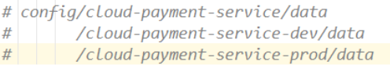
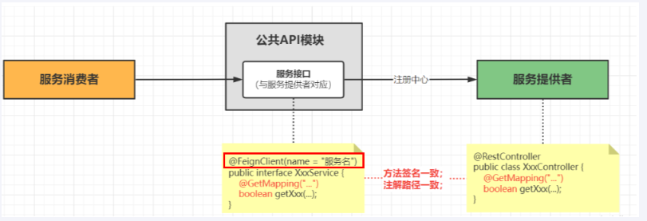

# Spring-cloud 相关技术


## 一. RestTemplate

### 1.是什么？

RestTemplate提供了多种便捷访问远程Http服务的方法， 是一种简单便捷的访问restful服务模板类，是Spring提供的用于访问Rest服务的客户端模板工具集

<a href="https://docs.spring.io/spring-framework/docs/6.0.11/javadoc-api/org/springframework/web/client/RestTemplate.html">RestTemplate官网</a>

### 2.能做什么？

使用restTemplate访问restful接口，即帮助本模块调用其他模块的接口。

### 3.怎么玩？

1. config 类注册
   ``` java
   @Configuration
   @LoadBalancerClient(
   
   public class RestTemplateConfig {
   
       @Bean
       @LoadBalanced   // 因为默认是集群设置，所以加上此注解(负载均衡)
       public RestTemplate restTemplate() {
   
           return new RestTemplate();
       }
   }
   ```

2. API 调用

   - PostForObject：三个参数 url + 发布对象(可能为null) + 返回值类型(其他的看官网)
     ``` java
     public static final String PaymentSrv_URL = "http://cloud-payment-service";//服务注册中心上的微服务名称
     @PostMapping("/consumer/add")
     @Operation(summary = "支付订单", description = "订单进行支付")
     public ResultData addOrder(@RequestBody Pay pay){
     
         System.out.println(pay);
         return restTemplate.postForObject(PaymentSrv_URL + "/pay/add",pay,ResultData.class);
     }
     ```
     
   - GetForObject：三个参数 url + 返回值类型 + 参数(其他的看官网)
     ``` java
     @GetMapping("/consumer/get/{id}")
     @Operation(summary = "得到订单信息", description = "用户获得订单信息")
     public ResultData getPayInfo(@PathVariable("id") Integer id){
     
         return restTemplate.getForObject(PaymentSrv_URL + "/pay/get/"+id, ResultData.class, id);
     }
     ```
   
   - Delete：一个参数 url(其他的看官网)
     ``` java
         @DeleteMapping("/consumer/del/{id}")
         @Operation(summary = "删除订单", description = "用户删除订单信息")
         public ResultData deletePay(@PathVariable("id") Integer id) {
     
             restTemplate.delete(PaymentSrv_URL + "/pay/del/" + id);
             return ResultData.success("删除成功");
         }
     
     ```
   
   - Put：两个参数 url + put值(其他看官网)
     ``` java
     @PutMapping("/consumer/update")
     @Operation(summary = "更新订单", description = "用户更新订单信息")
     public ResultData updatePay(@RequestBody Pay pay) {
     
         restTemplate.put(PaymentSrv_URL + "/pay/update", pay);
         return ResultData.success("更新成功！");
     }
     ```

### 4.遇到的问题

**此处的URL是写死的，怎么才能实现动态调用？**
这就要用到 **分布式服务服务注册与发现 和 配置管理** 的 <span style="color:red">Consul </span>技术

## 二. Consul

### 1.是什么？

Consul 是一套开源的**分布式服务发现**和**配置管理**系统，由 **HashiCorp** 公司用 Go 语言开发。

提供了微服务系统中的服务治理、配置中心、控制总线等功能。这些功能中的每一个都可以根据需要单独使用，也可以一起使用以构建全方位的服务网格，总之Consul提供了一种完整的服务网格解决方案。它具有很多优点。包括： 基于 raft 协议，比较简洁； 支持健康检查, 同时支持 HTTP 和 DNS 协议 支持跨数据中心的 WAN 集群 提供图形界面 跨平台，支持 Linux、Mac、Windows

<a href="https://www.consul.io">Consul官网</a>
<a href="https://spring.io/projects/spring-cloud-consul">Spring-Colud-Consul</a>

### 2.能做什么？

两大核心功能：<span style="color:red">分布式服务注册与发现</span> 和 <span style="color:red">服务配置管理</span> 

### 3.怎么玩？

1. 下载并启动：

   - <a href="https://developer.hashicorp.com/consul/install?product_intent=consul">下载地址</a> 
   - **启动**并且持久化代码：consul agent -server -ui -bind=127.0.0.1 -client=0.0.0.0 -bootstrap-expect  1  -data-dir D:\soft\consul_1.17.0_windows_386\mydata

2. <span style="color:pink">核心功能一：分布式服务注册与发现</span>

   - 第一步：加依赖
     ``` POM
     <!--SpringCloud consul discovery -->
     <dependency>
     <groupId>org.springframework.cloud</groupId>
     <artifactId>spring-cloud-starter-consul-discovery</artifactId>
     </dependency>
     ```

   - 第二步：改yml
     ``` yaml
     spring:
       application:
         name: cloud-payment-service
       ####Spring Cloud Consul for Service Discovery
       cloud:
         consul:
           host: localhost
           port: 8500
           discovery:
             service-name: ${spring.application.name}
     ```

   - 第三步：主启动(增加@EnableDiscoveryClient注解)
     ``` java
     @SpringBootApplication
     @MapperScan("com.iron.cloud.mapper")
     @EnableDiscoveryClient	// 此行是后加上去的
     public class Main8001
     {
         public static void main(String[] args)
         {
             SpringApplication.run(Main8001.class,args);
         }
     }
     ```

   - 第四步：如果是消费模块，即有restTmplate使用的模块(进行如下修改)
     ① 修改 restTemplate 配置文件(增加loadbalance注解)

     ``` java
     @Configuration
     public class RestTemplateConfig
     {
         @Bean
         @LoadBalanced	// 此行是增加的
         public RestTemplate restTemplate()
         {
             return new RestTemplate();
         }
     }
     ```

     ② 修改对应的restTemplate调用(可以通过服务名称调用已经注册到 Consul 的相关服务API)
     ``` java
     @RestController
     public class OrderController
     {
         //public static final String PaymentSrv_URL = "http://localhost:8001";//先写死，硬编码(之前)
         public static final String PaymentSrv_URL = "http://cloud-payment-service";//服务注册中心上的微服务名称(现在)
     
         @Autowired
         private RestTemplate restTemplate;
     
         @GetMapping("/consumer/pay/add")
         public ResultData addOrder(PayDTO payDTO)
         {
             return restTemplate.postForObject(PaymentSrv_URL + "/pay/add",payDTO,ResultData.class);
         }
     }
      
     ```

3. <span style="color:pink">核心功能二：服务配置管理</span>

   实现需求：通用全局配置信息，直接注册进Consul服务器，从Consul获取。(即将一部分配置信息存入到Consul服务器中)

   - 第一步：加依赖

     ``` POM
     <!--SpringCloud consul config-->
     <dependency>
         <groupId>org.springframework.cloud</groupId>
         <artifactId>spring-cloud-starter-consul-config</artifactId>
     </dependency>
     <dependency>
         <groupId>org.springframework.cloud</groupId>
         <artifactId>spring-cloud-starter-bootstrap</artifactId>
     </dependency>
     ```

   - 第二步：改yml

     新增 bootstrap.yml 配置文件(applicaiton.yml是用户级的资源配置项,bootstrap.yml是系统级的，优先级更加高)
     将 Consul 配置都移入到 bootstrap.yml 中
     **bootstratp.yml:**

     ``` yaml
     spring:
       application:
         name: cloud-payment-service
         ####Spring Cloud Consul for Service Discovery
       cloud:
         consul:
           host: localhost
           port: 8500
           discovery:
             service-name: ${spring.application.name}
           config:
             profile-separator: '-' # default value is ","，we update '-'
             format: YAML
     ```

     **application.ylml:**

     ``` yaml
     spring:
       profiles:
         active: prod # 多环境配置加载内容dev/prod,不写就是默认default配置(即决定加载consul里面的配置文件)
     # --------------- 其他配置省略 ----------------------
     ```

     

   - 第三步：<span style="color:red">consul服务器key/value配置填写</span>

     ① 参考规则：
     

     ② 根据规则进行添加配置
     

     ③ 测试（@Value("${iron.info}")获取）
     ``` java
         @Value("${server.port}")
         String port;
         @GetMapping(value = "/pay/get/info")
         @Operation(summary = "获得consul里面信息", description = "测试获得consul里面信息")
         public ResultData getInfo(@Value("${iron.info}") String info) {
     
             return ResultData.success("端口号：" + port + " info：" + info);
         }
     ```

   - 第四步(可选)：设置动态刷新
     ① 改yml

     ``` yml
     spring:
       application:
         name: cloud-payment-service
         ####Spring Cloud Consul for Service Discovery
       cloud:
         consul:
           host: localhost
           port: 8500
           discovery:
             service-name: ${spring.application.name}
           config:
             profile-separator: '-'
             format: YAML
             watch:
               wait-time: 1	#此处修改为 1 秒监控刷新
     ```

     ② 启动类增加 @RefreshScope *//* *动态刷新*
     ``` java
     @SpringBootApplication
     @MapperScan("com.iron.cloud.mapper") 
     @EnableDiscoveryClient //服务注册和发现
     @RefreshScope // 动态刷新
     public class Main8001
     {
         public static void main(String[] args)
         {
             SpringApplication.run(Main8001.class,args);
         }
     }
     ```

### 4.三个服务注册中心的特点

1. 首先了解CAP
   
2. 三个服务注册中心对比
   - **Eureka-AP架构**
     
   - **Consul 和 Zookeeper - CP架构** 
     

## 三. LoadBalancer

### 1. 是什么？

**LB负载均衡(Load Balance)是什么**

简单的说就是将用户的请求平摊的分配到多个服务上，从而达到系统的HA（高可用），常见的负载均衡有软件Nginx，LVS，硬件 F5等

**spring-cloud-starter-loadbalancer组件是什么**

Spring Cloud LoadBalancer是由SpringCloud官方提供的一个开源的、简单易用的**客户端负载均衡器**，它包含在SpringCloud-commons中用它来替换了以前的Ribbon组件。相比较于Ribbon，SpringCloud LoadBalancer不仅能够支持RestTemplate，还支持WebClient（WeClient是Spring Web Flux中提供的功能，可以实现响应式异步请求）

<a href="https://docs.spring.io/spring-cloud-commons/reference/spring-cloud-commons/loadbalancer.html">官网</a>

### 2.能做什么？

<span style="color:red">将用户的请求平摊的分配到多个服务上，从而达到系统的HA</span>

### 3.怎么玩?


- **第一步**，先选择ConsulServer从服务端查询并拉取服务列表，知道了它有多个服务(上图3个服务)，这3个实现是完全一样的，**相同的服务名称** 但 **不同的ip地址**
  默认轮询调用谁都可以正常执行。类似生活中求医挂号，某个科室今日出诊的全部医生，客户端你自己选一个。
  
- **第二步**，按照指定的负载均衡策略从server取到的服务注册列表中由客户端自己选择一个地址，所以LoadBalancer是一个**客户端的**负载均衡器。

  

1. 改POM（消费端，即redisTemplate 调用端）
   ``` POM
   <!--loadbalancer-->
   <dependency>
       <groupId>org.springframework.cloud</groupId>
       <artifactId>spring-cloud-starter-loadbalancer</artifactId>
   </dependency>
   ```
   
2. 改 RestTemplate 配置类（增加 @LoadBalance 注解 和 修改负载均衡算法(可选)）
   ```java
   @Configuration
   @LoadBalancerClient(
           //下面的value值大小写一定要和consul里面的名字一样，必须一样(如果修改负载均衡算法一定要加上)
           value = "cloud-payment-service",configuration = RestTemplateConfig.class)
   public class RestTemplateConfig {
   
       @Bean
       @LoadBalanced   // 因为默认是集群设置，所以加上此注解(负载均衡)
       public RestTemplate restTemplate() {
   
           return new RestTemplate();
       }
   
       // 修改 RedisTemplate 的 轮询负载均衡算法(默认) 为 随机负载均衡算法(现在修改的)
       @Bean
       ReactorLoadBalancer<ServiceInstance> randomLoadBalancer(Environment environment, LoadBalancerClientFactory loadBalancerClientFactory) {
   
           String name = environment.getProperty(LoadBalancerClientFactory.PROPERTY_NAME);
   
           return new RandomLoadBalancer(loadBalancerClientFactory.getLazyProvider(name, ServiceInstanceListSupplier.class), name);
       }
   }
   ```

### 4. 和 Ribbon 对比

loadbalancer本地负载均衡客户端 VS Nginx服务端负载均衡区别

Nginx是服务器负载均衡，客户端所有请求都会交给nginx，然后由nginx实现转发请求，即负载均衡是由服务端实现的。

loadbalancer本地负载均衡，在调用微服务接口时候，会在注册中心上获取注册信息服务列表之后缓存到JVM本地，从而在本地实现RPC远程服务调用技术。


##  四. OpenFeign(替代了RestTemplate + LoadBalance)

### 1.有LoandBalance还学OpenFeign？

前面在使用**SpringCloud LoadBalancer**+**RestTemplate**时，利用RestTemplate对http请求的封装处理形成了一套模版化的调用方法。
但由于对服务依赖的调用可能不止一处，往往一个接口会被多处调用，所以通常都会针对每个微服务自行封装一些客户端类来包装这些依赖服务的调用。所以，OpenFeign在此基础上做了进一步封装，由他来帮助我们定义和实现依赖服务接口的定义。在OpenFeign的实现下，我们只需**创建一个接口**并使用注解的方式来配置它(在一个微服务接口上面标注一个**@FeignClient\**注解即可)，即可完成对服务提供方的接口绑定，统一对外暴露可以被调用的接口方法，大大简化和降低了调用客户端的开发量，也即由服务提供者给出调用接口清单，消费者直接通过OpenFeign调用即可

OpenFeign同时还集成SpringCloud LoadBalancer可以在使用OpenFeign时提供Http客户端的负载均衡，也可以集成阿里巴巴Sentinel来提供熔断、降级等功能。而与SpringCloud LoadBalancer不同的是，通过OpenFeign只需要定义服务绑定接口且以声明式的方法，优雅而简单的实现了服务调用。

**一句话总结**：<span style="color:red">不可能每一个服务模块都配置一个 LoadBalancer + RestTemplate,所以OpenFeign将而正进一步封装,以后那个服务模块进行调用某个模块功能就直接调用OpenFeign就行了，简化了调用客户端的开发量。</span>

### 2.是什么？

Feign是一个**声明性web服务客户端**。它使编写web服务客户端变得更容易。使用Feign创建一个接口并对其进行注释。它具有可插入的注释支持，包括Feign注释和JAX-RS注释。Feign还支持可插拔编码器和解码器。Spring Cloud添加了对Spring MVC注释的支持，以及对使用Spring Web中默认使用的HttpMessageConverter的支持。Spring Cloud集成了Eureka、Spring Cloud CircuitBreaker以及**Spring Cloud LoadBalancer**，以便在使用Feign时提供负载平衡的http客户端。

**一句话：**<span style="color:red">只需要在创建的Rest接口上加上 @FeignClient 即可</span>,OpenFeign基本上就是当前微服务之间调用的事实标准(内部集成了Loadbalance，修改默认的负载均衡可以根据上面Loanbalance进行)


### 3.能做什么？

- 可插拔注解支持，包括Feign注解和JAX-RS注解
- 支持可插拔的HTTP编码器和解码器
- 支持Sentinel和它的Fallback
- 支持SpringCloud LoadBalancer的负载均衡
- 支持HTTP请求和相应压缩

### 4.怎么玩？

基本流程图：通过 创建一个 **OpenFeign服务接口** 调用服务提供者相关的接口



- <span style="color:pink">服务消费者端</span>

  1. 第一步：加POM

     ``` 
     <!--openfeign-->
     <dependency>
         <groupId>org.springframework.cloud</groupId>
         <artifactId>spring-cloud-starter-openfeign</artifactId>
     </dependency>
     ```

  2. 第二步：改YML(此处较上面没有变动，就是加入到consul里面的配置)

     ``` yaml
     server:
       port: 80
     
     spring:
       application:
         name: cloud-consumer-openfeign-order
       ####Spring Cloud Consul for Service Discovery
       cloud:
         consul:
           host: localhost
           port: 8500
           discovery:
             prefer-ip-address: true #优先使用服务ip进行注册
             service-name: ${spring.application.name}
     ```

  3. 主启动：加上@EnableFeignClients注解

     ``` java
     @SpringBootApplication
     @EnableDiscoveryClient  // consul 配置
     @EnableFeignClients     // 激活OpenFeign功能
     public class Main_feign80 {
     
         public static void main(String[] args) {
     
             SpringApplication.run(Main_feign80.class, args);
         }
     }
     ```

- <span style="color:pink">公共API模块端</span>

  **Tips**: 最好是将 公共 API 模块集合在一个 Commons工具模块中(此处集合在Commons中)

  1. 加POM
     ``` POM
     <!--openfeign-->
     <dependency>
         <groupId>org.springframework.cloud</groupId>
         <artifactId>spring-cloud-starter-openfeign</artifactId>
     </dependency>
     ```

  2. 建服务接口：**加@FeignClient注解**
     Tip：根据对应 模块Controller 里面的API方法进行书写。
              这里的cloud-payment-service有两个服务，测试负载均衡
     
     ``` java
     @FeignClient(value = "cloud-payment-service")
     public interface PayFeignApi {
     
         @PostMapping(value = "/pay/add")
         public ResultData addPay(@RequestBody Pay pay);
         @DeleteMapping(value = "/pay/del/{id}")
         public ResultData deletePay(@PathVariable("id") Integer id);
         @PutMapping(value = "/pay/update")
         public ResultData updatePay(@RequestBody Pay pay);
     
         @GetMapping(value = "/pay/get/{id}")
         public ResultData<Pay> getById(@PathVariable("id") Integer id);
     
         @GetMapping(value = "/pay/getAll")
         public ResultData<List<Pay>> getAll();
     
         @GetMapping(value = "/pay/get/info")
         public ResultData getInfo();
     }
     ```
  
- <span style="color:pink">服务消费者端的调用
  </span>
  Tip：LoadBalancer 是通过调用 RedisTmplate 进行实现，此处是调用 OpenFegin服务接口

  ``` java
  @Tag(name="用户订单模块", description = "用户操作模块")
  @RestController
  public class OrderController {
  
      @Autowired
      PayFeignApi payFeignApi;	// 将对应的服务接口进行注入，调用标准API
  
      @PostMapping("/consumer/add")
      @Operation(summary = "支付订单", description = "订单进行支付")
      public ResultData addOrder(@RequestBody Pay pay){
  
  
          return payFeignApi.addPay(pay);
      }
  
      @GetMapping("/consumer/get/{id}")
      @Operation(summary = "得到订单信息", description = "用户获得订单信息")
      public ResultData getPayInfo(@PathVariable("id") Integer id){
  
          return payFeignApi.getById(id);
      }
  
      @DeleteMapping("/consumer/del/{id}")
      @Operation(summary = "删除订单", description = "用户删除订单信息")
      public ResultData deletePay(@PathVariable("id") Integer id) {
  
          return payFeignApi.deletePay(id);
      }
  
      @PutMapping("/consumer/update")
      @Operation(summary = "更新订单", description = "用户更新订单信息")
      public ResultData updatePay(@RequestBody Pay pay) {
  
          return payFeignApi.updatePay(pay);
      }
  
      @GetMapping("/consumer/pay/get/info")
      @Operation(summary = "获得info", description = "获得consul键值对信息测试负载平衡")
      private ResultData getInfoByConsul() {
  
          return payFeignApi.getInfo();
      }
  
      @Resource
      private DiscoveryClient discoveryClient;
      @GetMapping("/consumer/discovery")
      @Operation(summary = "获得当前第一个service信息", description = "测试consul获得所有的service Instance 信息")
      public ResultData<String> discovery()
      {
          List<String> services = discoveryClient.getServices();
          for (String element : services) {
              System.out.println(element);
          }
  
          System.out.println("===================================");
  
          List<ServiceInstance> instances = discoveryClient.getInstances("cloud-payment-service");
          for (ServiceInstance element : instances) {
              System.out.println(element.getServiceId()+"\t"+element.getHost()+"\t"+element.getPort()+"\t"+element.getUri());
          }
  
          return ResultData.success(instances.get(0).getServiceId()+":"+instances.get(0).getPort());
      }
  }
  ```

### 5.OpenFeign 的高级特性

1. <span style="color:pink">OpenFeign超时控制</span>

   - 测试代码(注意在测试的时候启动一个服务提供端口实例，不然超时会自动请求别的实例)
     ``` java
     // 修改服务提供者的API
     @GetMapping(value = "/pay/get/{id}")
     @Operation(summary = "获得单个流水", description = "获得单个流水")
     public ResultData<Pay> getById(@PathVariable("id") Integer id){
     
         try {
             // 测试 OpenFeign 默认超时时间
             TimeUnit.SECONDS.sleep(62);
         } catch (InterruptedException e) {
     
             throw new RuntimeException(e);
         }
     
         return ResultData.success(payService.getById(id));
     }
     // 修改服务调用者端口
     @GetMapping("/consumer/get/{id}")
     @Operation(summary = "得到订单信息", description = "用户获得订单信息")
     public ResultData getPayInfo(@PathVariable("id") Integer id){
     
         try{
     
             System.out.println("调用开始时间：" + DateUtil.now());
             final ResultData<Pay> result = payFeignApi.getById(id);
             return result;
         } catch (Exception e) {
     
             e.printStackTrace();
             System.out.println("调用结束时间：" + DateUtil.now());
             return ResultData.fail(ReturnCodeEnum.RC500.getCode(), e.getMessage());
         }
     
         //        return payFeignApi.getById(id);
     }
     ```

   - 结果：
     

   - 结论：**默认的超时时间为：60秒**

   **<span style="color:red">重点===========修改超时控制时间=============</span>**
   **服务调用段进行修改**

   修改YML文件：
   ``` yaml
   server:
     port: 80
   
   spring:
     application:
       name: cloud-consumer-openfeign-order
     ####Spring Cloud Consul for Service Discovery
     cloud:
       consul:
         host: localhost
         port: 8500
         discovery:
           prefer-ip-address: true #优先使用服务ip进行注册
           service-name: ${spring.application.name}
       openfeign:
         client:
           config:
   
             # default 设置的全局超时时间，指定服务名称可以设置单个服务的超时时间
             default:
               #连接超时时间
               connectTimeout: 4000
               #读取超时时间
               readTimeout: 4000
   
             # 为cloud-payment-service这个服务单独配置超时时间，单个配置的超时时间将会覆盖全局配置
             cloud-payment-service:
               #连接超时时间
               connectTimeout: 2000
               #读取超时时间
               readTimeout: 2000
   ```

   

2. <span style="color:pink">OpenFeign重试机制</span>

   **默认重试是关闭的,从上面超时测试只调用一次也可以看出**

   <span style="color:red">重点：============开启Retryer功能===========</span>
   **在 服务调用端 新增 FeignConfig配置：**

   ``` java
   @Configuration
   public class FeignConfig
   {
       @Bean
       public Retryer myRetryer()
       {
           //return Retryer.NEVER_RETRY; //Feign默认配置是不走重试策略的
   
           //最大请求次数为3(1+2)，初始间隔时间为100ms，重试间最大间隔时间为1s
           return new Retryer.Default(100,1,3);
       }
   }
   ```

   **结果：**此时超时时间从原来设置的 3秒 变成了 6秒
   

3.  <span style="color:pink">OepnFeign默认HttpClient修改</span>

   - OpenFeign中http client是什么？

     如果不做特殊配置，OpenFeign默认使用JDK自带的HttpURLConnection发送HTTP请求

   - 为什么要修改？
     由于默认HttpURLConnection没有连接池、性能和效率比较低，如果采用默认，性能上不是最牛B的，所以加到最大。

   - <span style="color:red">重点：===========进行修改============
     </span>
     **服务调用端进行修改**

     1. **添加POM**

        ``` POM
        <!-- httpclient5-->
        <dependency>
            <groupId>org.apache.httpcomponents.client5</groupId>
            <artifactId>httpclient5</artifactId>
            <version>5.3</version>
        </dependency>
        <!-- feign-hc5-->
        <dependency>
            <groupId>io.github.openfeign</groupId>
            <artifactId>feign-hc5</artifactId>
            <version>13.1</version>
        </dependency>
        ```

     2. **改YAML**

        ``` yaml
        #  Apache HttpClient5 配置开启
        spring:
          cloud:
            openfeign:
              httpclient:
                hc5:
                  enabled: true
        ```

     3. 结果
        修改前：
        

        修改后：
        

4. <span style="color:pink">OpenFeign请求/相应压缩</span>

   - **是什么？**
     Spring Cloud OpenFeign支持对请求和响应进行GZIP压缩，以减少通信过程中的性能损耗。

   - <span style="color:red">重点：============设置压缩==============</span>

     1. 改YML
        ``` yaml
        spring:
            openfeign:
              compression:
                request:
                  enabled: true
                  min-request-size: 2048 #最小触发压缩的大小
                  mime-types: text/xml,application/xml,application/json #触发压缩数据类型
                response:
                  enabled: true
        ```

5. <span style="color:pink">OpenFeign日志打印功能</span>

   - **是什么？**

     Feign 提供了日志打印功能，我们可以通过配置来调整日志级别，

     从而了解 Feign 中 Http 请求的细节，

     **说白了就是对Feign接口的调用情况进行监控和输出**

   - **日志级别**

     1. NONE：默认的，不显示任何日志；
     2. BASIC：仅记录请求方法、URL、响应状态码及执行时间；
     3. HEADERS：除了 BASIC 中定义的信息之外，还有请求和响应的头信息；
     4. FULL：除了 HEADERS 中定义的信息之外，还有请求和响应的正文及元数据。

   - <span style="color:red">重点：===========配置日志打印==============</span>
     **服务调用端进行修改**

     1. **修改OpenFeign配置类**

        ```java
        @Configuration
        public class FeignConfig
        {
            @Bean
            public Retryer myRetryer() // 配置重传
            {
                return Retryer.NEVER_RETRY; //默认
            }
        
            @Bean
            Logger.Level feignLoggerLevel() { // 配置日志和等级
                return Logger.Level.FULL;
            }
        }
        ```

     2. **修改YML**
        公式(三段)：**logging.level** + 含有@FeignClient注解的完整带包名的接口名 + debug

        ``` yaml
        # feign日志以什么级别监控哪个接口,此处的接口为设置的模块接口
        logging:
          level:
            com:
              iron:
                cloud:
                  apis:
                    PayFeignApi: debug 
        ```

        
   
6. <span style="color:pink">OpenFeign负载均衡
   </span>
   OpenFeign内部自带了 LoadBalance ,如果想要改写，参考上面的 LoadBalance 配置。

   1. 改POM（消费端，即redisTemplate 调用端）

      ``` POM
      <!--loadbalancer-->
      <dependency>
          <groupId>org.springframework.cloud</groupId>
          <artifactId>spring-cloud-starter-loadbalancer</artifactId>
      </dependency>
      ```

   2. 改 RestTemplate 配置类（增加 @LoadBalance 注解 和 修改负载均衡算法(可选)）

      - 配置类进行配置
        ``` java
        @Configuration
        public class LoadBalanceConfig {
        
            // 修改 RedisTemplate 的 轮询负载均衡算法(默认) 为 随机负载均衡算法(现在修改的)
            @Bean
            ReactorLoadBalancer<ServiceInstance> randomLoadBalancer(Environment environment, LoadBalancerClientFactory loadBalancerClientFactory) {
        
                String name = environment.getProperty(LoadBalancerClientFactory.PROPERTY_NAME);
        
                return new RandomLoadBalancer(loadBalancerClientFactory.getLazyProvider(name, ServiceInstanceListSupplier.class), name);
            }
        }
        ```

      - yml文件进行配置
        ``` yaml
        spring:
          cloud:
            loadbalancer:
              clients:
                your-service-name:
                  loadBalancer:
                    hint: random
        ```

      - 配置单个服务的负载均衡算法
        ``` java
        @Configuration
        @LoadBalancerClient(name = "your-service-name", configuration = CustomLoadBalancerConfig.class)
        public class CustomLoadBalancerConfig {
        
            @Bean
            public ReactorLoadBalancer<ServiceInstance> randomLoadBalancer(Environment environment, LoadBalancerClientFactory loadBalancerClientFactory) {
                String name = environment.getProperty(LoadBalancerClientFactory.PROPERTY_NAME);
                return new RandomLoadBalancer(loadBalancerClientFactory.getLazyProvider(name, ServiceInstanceListSupplier.class), name);
            }
        }
        ```

      ### 常用负载均衡算法

      - **RoundRobinLoadBalancer**: 轮询算法，默认使用。
      - **RandomLoadBalancer**: 随机算法。
      - **WeightedResponseTimeRule**: 根据响应时间加权的负载均衡策略。

      


### 6.总结

主要在 **服务消费端** 和 **公共模块接口(加上@FeignClient 和 依赖)** 进行配置

主要还是 **服务消费端**

最终YML：

``` yaml
server:
  port: 80

spring:
  application:
    name: cloud-consumer-openfeign-order

  cloud:

    consul:	 				# consul的服务注册与发现					
      host: localhost
      port: 8500
      discovery:
        prefer-ip-address: true #优先使用服务ip进行注册
        service-name: ${spring.application.name}
        
    loadbalancer:			# 修改OpenFeign的负载均衡算法
      clients:
        your-service-name:
          loadBalancer:
            hint: random	
	
    openfeign:
      client:
        config:
          # default 设置的全局超时时间，指定服务名称可以设置单个服务的超时时间
          default:
            connectTimeout: 4000            #连接超时时间
            readTimeout: 4000            #读取超时时间
          # 为cloud-payment-service这个服务单独配置超时时间，单个配置的超时时间将会覆盖全局配置
          cloud-payment-service:
            connectTimeout: 2000            #连接超时时间
            readTimeout: 2000            #读取超时时间
      httpclient: # 修改默认的HttpClient为HttpClient5
        hc5:
          enabled: true
      compression:  # 设置压缩
        request:
          enabled: true
          min-request-size: 2048 #最小触发压缩的大小
          mime-types: text/xml,application/xml,application/json #触发压缩数据类型
        response:
          enabled: true
          
          

# feign日志以什么级别监控哪个接口,此处的接口为设置的模块接口
logging:
  level:
    com:
      iron:
        cloud:
          apis:
            PayFeignApi: debug
```

最终Config配置类：
``` java
package com.iron.cloud.config;

import feign.Logger;
import feign.Retryer;
import org.springframework.context.annotation.Bean;
import org.springframework.context.annotation.Configuration;

@Configuration
public class FeignConfig
{
    @Bean
    public Retryer myRetryer()
    {
        //return Retryer.NEVER_RETRY; //Feign默认配置是不走重试策略的

        //最大请求次数为3(1+2)，初始间隔时间为100ms，重试间最大间隔时间为1s
        return new Retryer.Default(100,1,3);
    }

    @Bean
    Logger.Level feignLoggerLevel() { // 配置日志和等级

        return Logger.Level.FULL;
    }
}
```


## 五. CircuitBreaker(Resilience4J)

### 1. CirCuitBreaker是什么？

<span style="color:pink">CircuitBreaker的目的是保护分布式系统免受故障和异常，提高系统的**可用性**和**健壮性**。</span>
当一个组件或服务出现故障时，CircuitBreaker会迅速切换到开放OPEN状态(保险丝跳闸断电)，阻止请求发送到该组件或服务从而避免更多的请求发送到该组件或服务。这可以减少对该组件或服务的负载，防止该组件或服务进一步崩溃，并使整个系统能够继续正常运行。同时，CircuitBreaker还可以提高系统的可用性和健壮性，因为它可以在分布式系统的各个组件之间自动切换，从而避免单点故障的问题。

<span style="color:red">CircuitBreaker 只是一套规范接口，落地实现是 Resilience4J</span>

<a href="https://spring.io/projects/spring-cloud-circuitbreaker">SpringCloud-CircuitBreaker官网</a>

### 2. Resilience4J是什么？

### 

<span style="color:red">注意：</span>**Resilience4J是继Hystrix官宣停更进维后官方推荐使用的一个技术!**

<a href="https://resilience4j.readme.io/docs/circuitbreaker">官网网站</a>
<a href="https://github.com/lmhmhl/Resilience4j-Guides-Chinese/blob/main/index.md">GitHub中文手册</a>

### 3.Resilience4J能做什么？

### 

**说白了就是三个功能：** ① 熔断降级(Circuitbreaker) ② 限流(ratelimiter) ③ 限制并发(bulkhead)

**Tip:** 只需要关注框起来的三个主要技术，其他的技术都是凑数。

### 4.Resilience4J怎么玩？

<a href="https://resilience4j.readme.io/docs/circuitbreaker">官网网站</a>
<a href="https://github.com/lmhmhl/Resilience4j-Guides-Chinese/blob/main/index.md">GitHub中文手册</a>

<span style="color:yellow">**主要分为三大功能进行讲解**</span>

1. <span style="color:pink">熔断(CircuitBreaker)(服务熔断 + 服务降级)</span>

   当系统功能出现问题时，模块自动处于断开状态(熔断)，并返回一个默认返回值(服务降级)
   **熔断三大状态**
   
   **三大状态转换**
   

   **操作手册**

   默认配置类：CircuitBreakerConfig.java
   
   
   
   **简略版本：**
   

   <span style="color:red">重点：==============具体操作方法
   ：</span>
   修改的还是 **请求调用端**：形象比喻 保险丝 是放在自己家里，还是国家电网？

   - **改POM**

     ``` pom
     <!--resilience4j-circuitbreaker-->
     <dependency>
         <groupId>org.springframework.cloud</groupId>
         <artifactId>spring-cloud-starter-circuitbreaker-resilience4j</artifactId>
     </dependency>
     <!-- 由于断路保护等需要AOP实现，所以必须导入AOP包 -->
     <dependency>
         <groupId>org.springframework.boot</groupId>
         <artifactId>spring-boot-starter-aop</artifactId>
     </dependency>
     ```

   - **改YAML**
     <span style="color:red">此时分为两种情况</span>

     1. <span style="color:yellow">按照COUNT_BASED(计数的滑动窗口)</span>
        

        ``` yaml
        spring:
          application:
            name: cloud-consumer-openfeign-order
        
          cloud:  #Spring Cloud Consul for Service Discovery
            consul:
              host: localhost
              port: 8500
              discovery:
                prefer-ip-address: true #优先使用服务ip进行注册
                service-name: ${spring.application.name}
            openfeign:
              circuitbreaker:	# ========== 新增① =======
                enabled: true
                group:
                  enabled: true #没开分组永远不用分组的配置。精确优先、分组次之(开了分组)、默认最后
                  
        resilience4j:	# ========== 新增② =======
          circuit breaker:
            configs:
              default:
                failureRateThreshold: 50 #设置50%的调用失败时打开断路器，超过失败请求百分⽐CircuitBreaker变为OPEN状态。
                slidingWindowType: COUNT_BASED # 滑动窗口的类型
                slidingWindowSize: 6 #滑动窗⼝的⼤⼩配置COUNT_BASED表示6个请求，配置TIME_BASED表示6秒
                minimumNumberOfCalls: 6 #断路器计算失败率或慢调用率之前所需的最小样本(每个滑动窗口周期)。如果minimumNumberOfCalls为10，则必须最少记录10个样本，然后才能计算失败率。如果只记录了9次调用，即使所有9次调用都失败，断路器也不会开启。
                automaticTransitionFromOpenToHalfOpenEnabled: true # 是否启用自动从开启状态过渡到半开状态，默认值为true。如果启用，CircuitBreaker将自动从开启状态过渡到半开状态，并允许一些请求通过以测试服务是否恢复正常
                waitDurationInOpenState: 5s #从OPEN到HALF_OPEN状态需要等待的时间
                permittedNumberOfCallsInHalfOpenState: 2 #半开状态允许的最大请求数，默认值为10。在半开状态下，CircuitBreaker将允许最多permittedNumberOfCallsInHalfOpenState个请求通过，如果其中有任何一个请求失败，CircuitBreaker将重新进入开启状态。
                recordExceptions:
                - java.lang.Exception
            instances:
              cloud-payment-service:
                baseConfig: default
        ```

         **此配置代表如果6次里面有次3失败就开启 熔断 ，即使访问正确也不会返回正确答案**

     2. <span style="color:yellow">按照TIME_BASED(计数的滑动窗口)</span>
        

        ``` yaml
        spring:
          application:
            name: cloud-consumer-openfeign-order
          ####Spring Cloud Consul for Service Discovery
          cloud:
            consul:
              host: localhost
              port: 8500
              discovery:
                prefer-ip-address: true #优先使用服务ip进行注册
                service-name: ${spring.application.name}
            openfeign:
              circuitbreaker:	# ========== 新增① =======
                enabled: true
                group:
                  enabled: true #没开分组永远不用分组的配置。精确优先、分组次之(开了分组)、默认最后
                  
        resilience4j:	# ========== 新增② =======
          timelimiter:
            configs:
              default:
                timeout-duration: 10s #神坑的位置，timelimiter 默认限制远程1s，超于1s就超时异常，配置了降级，就走降级逻辑
          circuitbreaker:
            configs:
              default:
                failureRateThreshold: 50 #设置50%的调用失败时打开断路器，超过失败请求百分⽐CircuitBreaker变为OPEN状态。
                slowCallDurationThreshold: 2s #慢调用时间阈值，高于这个阈值的视为慢调用并增加慢调用比例。
                slowCallRateThreshold: 30 #慢调用百分比峰值，断路器把调用时间⼤于slowCallDurationThreshold，视为慢调用，当慢调用比例高于阈值，断路器打开，并开启服务降级
                slidingWindowType: TIME_BASED # 滑动窗口的类型
                slidingWindowSize: 2 #滑动窗口的大小配置，配置TIME_BASED表示2秒
                minimumNumberOfCalls: 2 #断路器计算失败率或慢调用率之前所需的最小样本(每个滑动窗口周期)。
                permittedNumberOfCallsInHalfOpenState: 2 #半开状态允许的最大请求数，默认值为10。
                waitDurationInOpenState: 5s #从OPEN到HALF_OPEN状态需要等待的时间
                recordExceptions:
                  - java.lang.Exception
            instances:
              cloud-payment-service:
                baseConfig: default
        ```

        **超过2s请求为慢调用，慢调用超过 30% 进行熔断**

   - **在相关的API上加注解(即调用OpenFeign的注解上)**

     熔断：这里 cloud-payment-service 就是yaml配置文件中的实例熔断配置
     降级：fallbackMethod

     ``` java
         @GetMapping(value = "/feign/pay/circuit/{id}")
         @CircuitBreaker(name = "cloud-payment-service", fallbackMethod = "myCircuitFallback")
         public String myCircuitBreaker(@PathVariable("id") Integer id) {
     
             return payFeignApi.myCircuit(id);
         }
         
         //myCircuitFallback就是服务降级后的兜底处理方法
         public String myCircuitFallback(Integer id,Throwable t) {
             // 这里是容错处理逻辑，返回备用结果
             return "myCircuitFallback，系统繁忙，请稍后再试-----/(ㄒoㄒ)/~~";
         }
     ```

   <span style="color:red">总结:</span>

   

2. <span style="color:pink">隔离(BulkHead,限制并发)
   </span>
   **是什么？**

   限制并发
   
   
   **能干嘛？**
   
   - 依赖隔离
   - 负载保护：用来限制对下游服务的最大并发数量的限制
   
   <span style="color:red">重点=========具体的实现方式===============</span>
   **提供了两种实现方式：**
   
   1. **SemaphoreBulkhead**
      **工作原理(基本上就是我们JUC信号灯内容的同样思想)：**
   
      信号量舱壁（SemaphoreBulkhead）原理
   
      当信号量有空闲时，进入系统的请求会直接获取信号量并开始业务处理。
   
      当信号量全被占用时，接下来的请求将会进入阻塞状态，SemaphoreBulkhead提供了一个阻塞计时器，
   
      如果阻塞状态的请求在阻塞计时内无法获取到信号量则系统会拒绝这些请求。
   
      若请求在阻塞计时内获取到了信号量，那将直接获取信号量并执行相应的业务处理。
   
      - **改POM**
   
        ``` java
        <!--resilience4j-bulkhead-->
        <dependency>
            <groupId>io.github.resilience4j</groupId>
            <artifactId>resilience4j-bulkhead</artifactId>
        </dependency>
        ```
      
      - **改YML**
   
        ``` yaml
        spring:
          application:
            name: cloud-consumer-openfeign-order
          ####Spring Cloud Consul for Service Discovery
          cloud:
            consul:
              host: localhost
              port: 8500
              discovery:
                prefer-ip-address: true #优先使用服务ip进行注册
                service-name: ${spring.application.name}
            openfeign:
              circuitbreaker:	# ========== 新增① =======
                enabled: true
                group:
                  enabled: true #没开分组永远不用分组的配置。精确优先、分组次之(开了分组)、默认最后
                  
        resilience4j:	# ========== 新增② =======
          bulkhead:
            configs:
              default:
                maxConcurrentCalls: 2 # 隔离允许并发线程执行的最大数量
                maxWaitDuration: 0 # 当达到并发调用数量时，新的线程的阻塞时间，我只愿意等待1秒，过时不候进舱壁兜底fallback
            instances:
              baseA:
                baseConfig: default
          time limiter:
            configs:
              default:
                timeout-duration: 20s
        
        ```
      
        **允许最多两个一起并发，超过两个时候直接被舱壁限制隔离了**
   
      - **添加@Bulkhead()注解**
   
        ``` java
        @GetMapping(value = "/feign/pay/bulkhead/{id}")
        @Bulkhead(name = "cloud-payment-service",fallbackMethod = "myBulkheadFallback",type = Bulkhead.Type.SEMAPHORE) // 此行是注解
        public String myBulkhead(@PathVariable("id") Integer id)
        {
            return payFeignApi.myBulkhead(id);
        }
        public String myBulkheadFallback(Throwable t)
        {
            return "myBulkheadFallback，隔板超出最大数量限制，系统繁忙，请稍后再试-----/(ㄒoㄒ)/~~";
        }
        ```
      
      - **结果：**
        当超过两个进程同时进行并发的时候，此时触发舱壁隔离。
        ① 访问两个慢进程
        
        
        ② 访问一个正常的进程(此时前两个进程还在访问，触发舱壁隔离机制)
        
      
   2. **FixedThreadPoolBukhead**
   
      固定线程池舱壁（FixedThreadPoolBulkhead）
   
      FixedThreadPoolBulkhead的功能与SemaphoreBulkhead一样也是**用于限制并发执行的次数**的，但是二者的实现原理存在差别而且表现效果也存在细微的差别。FixedThreadPoolBulkhead使用**一个固定线程池和一个等待队列**来实现舱壁。
   
      当线程池中存在空闲时，则此时进入系统的请求将直接进入线程池开启新线程或使用空闲线程来处理请求。
   
      当线程池中无空闲时时，接下来的请求将进入等待队列，若等待队列仍然无剩余空间时接下来的请求将直接被拒绝，在队列中的请求等待线程池出现空闲时，将进入线程池进行业务处理。
   
      另外：ThreadPoolBulkhead只对CompletableFuture方法有效，所以我们必创建返回**CompletableFuture**类型的方法
   
      - **改POM**
   
        ``` java
        便笺
        <!--resilience4j-bulkhead-->
        <dependency>
            <groupId>io.github.resilience4j</groupId>
            <artifactId>resilience4j-bulkhead</artifactId>
        </dependency>
        ```
   
      - **改YML**
   
        ``` yaml
        spring:
          application:
            name: cloud-consumer-openfeign-order
          ####Spring Cloud Consul for Service Discovery
          cloud:
            consul:
              host: localhost
              port: 8500
              discovery:
                prefer-ip-address: true #优先使用服务ip进行注册
                service-name: ${spring.application.name}
            openfeign:
              circuitbreaker:	# ========== 新增① =======
                enabled: true
                group:
                  enabled: true #没开分组永远不用分组的配置。精确优先、分组次之(开了分组)、默认最后
                  
        resilience4j: # ========== 新增① =======
          timelimiter:
            configs:
              default:
                timeout-duration: 10s #timelimiter默认限制远程1s，超过报错不好演示效果所以加上10秒
          thread-pool-bulkhead:
            configs:
              default:
                core-thread-pool-size: 1	# 核心线程池数
                max-thread-pool-size: 1		# 最大线程池数
                queue-capacity: 1		    # 队列
            instances:
              cloud-payment-service:
                baseConfig: default
        ```
   
        **最大线程池数 = 核心线程池数 + 其他线程池数**
   
        **最大容量 = 最大线程池数 + 队列容量**
        **上述配置最大容纳两个并发池**
   
      - **增加@Buklhead注解**
   
        ``` java
        @GetMapping(value = "/feign/pay/bulkhead/{id}")
        @Bulkhead(name = "cloud-payment-service",fallbackMethod = "myBulkheadPoolFallback",type = Bulkhead.Type.THREADPOOL)
        public CompletableFuture<String> myBulkheadTHREADPOOL(@PathVariable("id") Integer id)
        {
            System.out.println(Thread.currentThread().getName()+"\t"+"enter the method!!!");
            try { TimeUnit.SECONDS.sleep(3); } catch (InterruptedException e) { e.printStackTrace(); }
            System.out.println(Thread.currentThread().getName()+"\t"+"exist the method!!!");
        
            return CompletableFuture.supplyAsync(() -> payFeignApi.myBulkhead(id) + "\t" + " Bulkhead.Type.THREADPOOL");
        }
        public CompletableFuture<String> myBulkheadPoolFallback(Integer id,Throwable t)
        {
            return CompletableFuture.supplyAsync(() -> "Bulkhead.Type.THREADPOOL，系统繁忙，请稍后再试-----/(ㄒoㄒ)/~~");
        }
        ```
   
      - **结果**
        同样只能允许两个一起并发：一个在MAX + 一个在队列
   
3. <span style="color:pink">限流RateLimiter
   </span>

   **是什么？**

   限流 就是**限制最大访问流量**。系统能提供的最大并发是有限的，同时来的请求又太多，就需要限流。 
   

   比如商城秒杀业务，瞬时大量请求涌入，服务器忙不过就只好排队限流了，和去景点排队买票和去医院办理业务排队等号道理相同。

   

   所谓限流，就是通过对并发访问/请求进行限速，或者对一个时间窗口内的请求进行限速，以保护应用系统，一旦达到限制速率则可以拒绝服务、排队或等待、降级等处理。

   **常见的限流算法：**

   - 漏斗算法：

     一个固定容量的漏桶，按照设定常量固定速率流出水滴，类似医院打吊针，不管你源头流量多大，我设定匀速流出。 

     如果流入水滴超出了桶的容量，则流入的水滴将会溢出了(被丢弃)，而漏桶容量是不变的

     **缺点：漏桶算法对于存在突发特性的流量来说缺乏效率(漏出口只有那么大)。**
     

   - **令牌桶算法(Spring-cloud默认算法)**
     

   - 滚动时间窗

     允许固定数量的请求进入(比如1秒取4个数据相加，超过25值就over)超过数量就拒绝或者排队，等下一个时间段进入。

     由于是在一个时间间隔内进行限制，如果用户在上个时间间隔结束前请求（但没有超过限制），同时在当前时间间隔刚开始请求（同样没超过限制），在各自的时间间隔内，这些请求都是正常的，形成了**临界点问题**。下图统计了3次，but......
      

   - 滑动时间窗

     顾名思义，该时间窗口是滑动的。所以，从概念上讲，这里有两个方面的概念需要理解： 

     \- 窗口：需要定义窗口的大小

     \- 滑动：需要定义在窗口中滑动的大小，但理论上讲滑动的大小不能超过窗口大小

     滑动窗口算法是把固定时间片进行划分并且随着时间移动，移动方式为开始时间点变为时间列表中的第2个时间点，结束时间点增加一个时间点，

     不断重复，通过这种方式可以巧妙的**避开计数器的临界点的问题**。下图统计了5次
     

   <span style="color:red">重点=========具体的实现方式===============</span>

   1. **改POM**

      ``` POM
      <!--resilience4j-ratelimiter-->
      <dependency>
          <groupId>io.github.resilience4j</groupId>
          <artifactId>resilience4j-ratelimiter</artifactId>
      </dependency>
      ```

   2. **改YML**

      ``` yaml
      ####resilience4j ratelimiter 限流的例子
      resilience4j:
        rate-limiter:
          configs:
            default:
              limitForPeriod: 2 #在一次刷新周期内，允许执行的最大请求数
              limitRefreshPeriod: 1s # 限流器每隔limitRefreshPeriod刷新一次，将允许处理的最大请求数量重置为limitForPeriod
              timeout-duration: 1 # 线程等待权限的默认等待时间
          instances:
            cloud-payment-service:
              baseConfig: default
      ```

      **一秒内访问两次以上就会被限流**

   3. **加上@RateLimiter注解**

      ``` java
      @GetMapping(value = "/feign/pay/ratelimit/{id}")
      @RateLimiter(name = "cloud-payment-service",fallbackMethod = "myRatelimitFallback")
      public String myBulkhead(@PathVariable("id") Integer id)
      {
          return payFeignApi.myRatelimit(id);
      }
      public String myRatelimitFallback(Integer id,Throwable t)
      {
          return "你被限流了，禁止访问/(ㄒoㄒ)/~~";
      }
      ```

   4. **结果：**
      **一秒访问两次以上就会被限流**

## 六. Sleuth(Micrometer)+ZipKin

### 1.是什么？

- **Sleuth/Micrometer**：提供了一套完整的链路追踪方案。
  但是现在 Sleuth 核心功能都移动到了 Micrometer 中。
  Sleuth只支持2.x版本的SpringBoot
  **Micrometer支持现在最新版本3.x**

  
  <a herf="https://spring.io/projects/spring-cloud-sleuth#overview">Sleuth-Spring-cloud官网</a>
  <a href="https://docs.micrometer.io/micrometer/reference/overview.html">Micrometer官网</a>

- **ZipKin**:由Twitter共公司开源，开放源代码分布式跟踪系统，**用于收集服务的定时数据，以解决微服务框架中的延迟问题**。包括：数据的收集，存储，查找和展现。结合Spirng-cloud-sleuth使用较为简单，集成方便。
  

  下载：
  

  运行：java -jar zipkin-server-3.0.0-rc0-exec.jar

  端口：localhost:9411/zipkin
  <a href="https://zipkin.io/">ZipKin官网</a>

### 2.能做什么？

**Sleuth/Micrometer：将一次分布式请求还原成调用链路，进行日志记录和性能监控，并将一次分布式请求调用情况集中Web展示**（数据采样）

**ZipKin：能够收集微服务运行过程中的实时调用链路信息，并能够将这些调用链路信息展示到Web图形化界面上供开发人员分析，开发人员能够从ZipKin中分析出调用链路中的性能瓶颈，识别出存在问题的应用程序，进而定位问题和解决问题。**(图形展示)

### 3.怎么玩？

- ZipKin
  1. **启动：java -jar java -jar zipkin-server-3.1.1-exec.jar**
  2. **访问：localhost:9411/zipkin**

- <span style="color:pink">Micrometer</span>

  **服务提供者cloud-provider-payment8001**

  1. **改POM**

     ```POM
             <!--micrometer-tracing指标追踪  1-->
             <dependency>
                 <groupId>io.micrometer</groupId>
                 <artifactId>micrometer-tracing</artifactId>
             </dependency>
             <!--micrometer-tracing-bridge-brave适配zipkin的桥接包 2-->
             <dependency>
                 <groupId>io.micrometer</groupId>
                 <artifactId>micrometer-tracing-bridge-brave</artifactId>
             </dependency>
             <!--micrometer-observation 3-->
             <dependency>
                 <groupId>io.micrometer</groupId>
                 <artifactId>micrometer-observation</artifactId>
             </dependency>
             <!--feign-micrometer 4-->
             <dependency>
                 <groupId>io.github.openfeign</groupId>
                 <artifactId>feign-micrometer</artifactId>
             </dependency>
             <!--zipkin-reporter-brave 5-->
             <dependency>
                 <groupId>io.zipkin.reporter2</groupId>
                 <artifactId>zipkin-reporter-brave</artifactId>
             </dependency>
     ```

  2. **改YML**

     ``` yaml
     # ========================zipkin===================
     management:
       zipkin:
         tracing:
           endpoint: http://localhost:9411/api/v2/spans
       tracing:
         sampling:
           probability: 1.0 #采样率默认为0.1(0.1就是10次只能有一次被记录下来)，值越大收集越及时。
     ```

  3. **测试类+加加入PayOpenFeign**

     ```java
     @RestController
     public class PayMicrometerController
     {
         /**
          * Micrometer(Sleuth)进行链路监控的例子
          * @param id
          * @return
          */
         @GetMapping(value = "/pay/micrometer/{id}")
         public String myMicrometer(@PathVariable("id") Integer id)
         {
             return "Hello, 欢迎到来myMicrometer inputId:  "+id+" \t    服务返回:" + IdUtil.simpleUUID();
         }
     }
     ```

     ``` java
     @GetMapping(value = "/pay/micrometer/{id}")
     public String myMicrometer(@PathVariable("id") Integer id);
     ```
     
      **服务调用者：cloud-consumer-feign-order80**
     
      1. **改POM**
     
         ``` POM
         
             <!--micrometer-tracing指标追踪  1-->
             <dependency>
                 <groupId>io.micrometer</groupId>
                 <artifactId>micrometer-tracing</artifactId>
             </dependency>
             <!--micrometer-tracing-bridge-brave适配zipkin的桥接包 2-->
             <dependency>
                 <groupId>io.micrometer</groupId>
                 <artifactId>micrometer-tracing-bridge-brave</artifactId>
             </dependency>
             <!--micrometer-observation 3-->
             <dependency>
                 <groupId>io.micrometer</groupId>
                 <artifactId>micrometer-observation</artifactId>
             </dependency>
             <!--feign-micrometer 4-->
             <dependency>
                 <groupId>io.github.openfeign</groupId>
                 <artifactId>feign-micrometer</artifactId>
             </dependency>
             <!--zipkin-reporter-brave 5-->
             <dependency>
                 <groupId>io.zipkin.reporter2</groupId>
                 <artifactId>zipkin-reporter-brave</artifactId>
             </dependency>
         ```
     
      2. **改YML**
     
         ``` yaml
         # zipkin图形展现地址和采样率设置
         management:
           zipkin:
             tracing:
               endpoint: http://localhost:9411/api/v2/spans
           tracing:
             sampling:
               probability: 1.0 #采样率默认为0.1(0.1就是10次只能有一次被记录下来)，值越大收集越及时。
         ```
     
      3. **调用服务提供者cloud-provider-payment8001**
     
         ``` java
             @Resource
             private PayFeignApi payFeignApi;
         
             @GetMapping(value = "/feign/micrometer/{id}")
             public String myMicrometer(@PathVariable("id") Integer id) {
         
                 return payFeignApi.myMicrometer(id);
             }
         ```
     
      4. **测试结果**
         
         


## 七. Gateway新一代网关

### 1. 是什么？

Gateway是在Spring生态系统之上构建的API网关服务，基于Spring6，Spring Boot 3和Project Reactor等技术。它旨在为微服务架构提供一种简单有效的<span style="color:red">统一的 API 路由管理方式</span>，并为它们提供跨领域的关注点，例如：安全性、监控/度量和恢复能力。
<span style="color:pink">用自己的总结：就是挡在服务提供端口前的一个技术，并且提供路由(Router)，断言(Predicate)，过滤(Firter)等服务</span>

<span style="color:yellow">了解:</span>
Cloud全家桶中有个很重要的组件就是网关，在1.x版本中都是采用的Zuul网关；但在2.x版本中，zuul的升级一直跳票，SpringCloud最后自己研发了一个网关SpringCloud Gateway替代Zuul，那就是SpringCloud Gateway一句话：gateway是原zuul1.x版的替代

<a sric="https://spring.io/projects/spring-cloud-gatewa">spring-cloud-Gateway官网</a>

### 2. 能做什么？

- 反向代理
- 鉴权
- 流量控制
- 熔断
- 日志控制

在服务中的位置：


- **Spring Cloud Gateway组件的核心是一系列的过滤器，通过这些过滤器可以将客户端发送的请求转发(路由)到对应的微服务。** 
- **Spring Cloud Gateway是加在整个微服务最前沿的防火墙和代理器，隐藏微服务结点IP端口信息，从而加强安全保护。**
- **Spring Cloud Gateway本身也是一个微服务，需要注册进服务注册中心**

### 3. 三大特性

- Route(路由)：网关的基本构建块。它由ID、目标URI、谓词集合和过滤器集合定义。如果聚合谓词为真，则匹配路由。
- Predicate(断言)：这是一个[java.util.function.Predicate](https://docs.oracle.com/javase/8/docs/api/java/util/function/Predicate.html)。输入类型是[Spring Framework`ServerWebExchange`](https://docs.spring.io/spring/docs/5.0.x/javadoc-api/org/springframework/web/server/ServerWebExchange.html),<span style="color:red">如果请求与断言相匹配则进行路由</span>
- **过滤器**：这些是使用特定工厂构建的[`GatewayFilter`](https://github.com/spring-cloud/spring-cloud-gateway/blob/main/spring-cloud-gateway-server/src/main/java/org/springframework/cloud/gateway/filter/GatewayFilter.java)实例。 在这里，您可以在发送下游请求之前或之后修改请求和响应。

### 4. 工作流程


客户端向 Spring Cloud Gateway 发出请求。然后在 Gateway Handler Mapping 中找到与请求相匹配的路由，将其发送到 Gateway Web Handler。Handler 再通过指定的过滤器链来将请求发送到我们实际的服务执行业务逻辑，然后返回。

过滤器之间用虚线分开是因为过滤器可能会在发送代理请求之前(Pre)或之后(Post)执行业务逻辑。

在“pre”类型的过滤器可以做参数校验、权限校验、流量监控、日志输出、协议转换等;

在“post”类型的过滤器中可以做响应内容、响应头的修改，日志的输出，流量监控等有着非常重要的作用。

**核心逻辑：** <span style="color:red">路由转发 + 断言判断 + 执行过滤器链</span>

### 5. 怎么玩？

1. <span style="color:pink">**新建一个 cloud-gateway9527 模块(进行路由映射，断言判断，执行过滤器链)**</span>

   - **改POM**

     ``` pom
     <?xml version="1.0" encoding="UTF-8"?>
     <project xmlns="http://maven.apache.org/POM/4.0.0"
              xmlns:xsi="http://www.w3.org/2001/XMLSchema-instance"
              xsi:schemaLocation="http://maven.apache.org/POM/4.0.0 http://maven.apache.org/xsd/maven-4.0.0.xsd">
         <modelVersion>4.0.0</modelVersion>
         <parent>
             <groupId>com.atguigu.cloud</groupId>
             <artifactId>mscloudV5</artifactId>
             <version>1.0-SNAPSHOT</version>
         </parent>
     
         <artifactId>cloud-gateway9527</artifactId>
     
         <properties>
             <maven.compiler.source>17</maven.compiler.source>
             <maven.compiler.target>17</maven.compiler.target>
             <project.build.sourceEncoding>UTF-8</project.build.sourceEncoding>
         </properties>
     
     
         <dependencies>
             <!--gateway-->
             <dependency>
                 <groupId>org.springframework.cloud</groupId>
                 <artifactId>spring-cloud-starter-gateway</artifactId>
             </dependency>
             <!--服务注册发现consul discovery,网关也要注册进服务注册中心统一管控-->
             <dependency>
                 <groupId>org.springframework.cloud</groupId>
                 <artifactId>spring-cloud-starter-consul-discovery</artifactId>
             </dependency>
             <!-- 指标监控健康检查的actuator,网关是响应式编程删除掉spring-boot-starter-web dependency-->
             <dependency>
                 <groupId>org.springframework.boot</groupId>
                 <artifactId>spring-boot-starter-actuator</artifactId>
             </dependency>
         </dependencies>
     
         <build>
             <plugins>
                 <plugin>
                     <groupId>org.springframework.boot</groupId>
                     <artifactId>spring-boot-maven-plugin</artifactId>
                 </plugin>
             </plugins>
         </build>
     </project>
     ```

   - 改YML
     ``` yaml
     server:
       port: 9527
     
     spring:
       application:
         name: cloud-gateway #以微服务注册进consul或nacos服务列表内
       cloud:
         consul: #配置consul地址
           host: localhost
           port: 8500
           discovery:
             prefer-ip-address: true
             service-name: ${spring.application.name}
     ```

   - **启动类**

     ``` java
     @SpringBootApplication
     public class Main9527 {
     
         public static void main(String[] args) {
     
             SpringApplication.run(Main9527.class, args);
         }
     }
     ```

   - 业务类：不需要业务类，网关和业务无关。

2. <span style="color:pink">**三大功能之一：Route(路由映射)**</span>
   <span style="color:red">功能：</span>我们不想暴露其它端口(8001),希望在真正端口(8001)外面套上一层网关(9527)

   在此处映射的是8001的两个端口：

   1. localhost:8001/pay/gateway/get/{id} -------映射路由后------> localhost:9527/pay/gateway/get{id}
   2. localhost:8001/pay/gateway/info      --------映射路由后------> localhost:9527/pay/gateway/info

   - **改YML(网关端口9527)**

     ``` yaml
     server:
       port: 9527
     
     spring:
       application:
         name: cloud-gateway #以微服务注册进consul或nacos服务列表内
       cloud:
     #=================== consul服务注册 =======================
         consul: #配置consul地址
           host: localhost
           port: 8500
           discovery:
             prefer-ip-address: true
             service-name: ${spring.application.name}
     
     
     #================== GateWay网关配置 =====================
         gateway:
           routes:
             - id: pay_routh1 #pay_routh1                #路由的ID(类似mysql主键ID)，没有固定规则但要求唯一，建议配合服务名
               uri: http://localhost:8001                #匹配后提供服务的路由地址
               predicates:
                 - Path=/pay/gateway/get/**              # 断言，路径相匹配的进行路由
     
     
             - id: pay_routh2 #pay_routh2                #路由的ID(类似mysql主键ID)，没有固定规则但要求唯一，建议配合服务名
               uri: http://localhost:8001                #匹配后提供服务的路由地址
               predicates:
                 - Path=/pay/gateway/info/**              # 断言，路径相匹配的进行路由
     ```

   - **Route以微服务名-动态获取服务URL**
     <span style="color:red">为什么：因为存在匹配的路由地址写死问题!</span>
     **解决方法：写入Counsel注册中心中的服务名称**

     ``` yaml
     server:
       port: 9527
     
     spring:
       application:
         name: cloud-gateway #以微服务注册进consul或nacos服务列表内
       cloud:
         consul: #配置consul地址
           host: localhost
           port: 8500
           discovery:
             prefer-ip-address: true
             service-name: ${spring.application.name}
         gateway:
           routes:
             - id: pay_routh1 #pay_routh1                #路由的ID(类似mysql主键ID)，没有固定规则但要求唯一，建议配合服务名
               #uri: http://localhost:8001                #匹配后提供服务的路由地址
               uri: lb://cloud-payment-service          #匹配后提供服务的路由地址，并配置了负载均衡
               predicates:
                 - Path=/pay/gateway/get/**              # 断言，路径相匹配的进行路由
     
             - id: pay_routh2 #pay_routh2                #路由的ID(类似mysql主键ID)，没有固定规则但要求唯一，建议配合服务名
               #uri: http://localhost:8001                #匹配后提供服务的路由地址
               uri: lb://cloud-payment-service                #匹配后提供服务的路由地址
               predicates:
                 - Path=/pay/gateway/info/**              # 断言，路径相匹配的进行路由
     ```

3. <span style="color:pink">**三大功能之一：predicate(断言判断)**</span>

   **RoutepredicteFactory是什么？**
    Spring Cloud Gateway 创建Route对象时，使用RoutePredicateFactory创建Predicate对象可以复制给Route。Spring Colud Gateway 包含许多内置的的Route Predicate Factories。所有这些Predicate都匹配HTTP请求的不同属性。多种·Predicate Factory 可以组合，并通过逻辑and。
   **predicate有什么用？**
   <span style="color:red">Predicate就是为了实现一组匹配规则让请求过来找到对应的Route进行处理</span>

   整体架构：
   

   <span style="color:red">两种配置语法:
   </span>
   以配置Cookie为例(Cookie里面包含mycookie的值为myhcookievalue键值对)：
   
   1. **Shortcut Configuration**

      简短配置：
      mycookie 相当于下面全配置的 name 
   
      mycookievalue 相当于 regexp正则匹配的值
      

   2. **Fully Expanded Arguments**
      
   
   3. 第三种写法
      ``` yaml
      #其它省略
      predicates:
      - Cookie=mycookie=mycookievalue
      ```
   
      
   
   <span style="color:red">Predicate 整体分为两大部分:</span>
   
   1. **内置Predicate(断言)**
      观察输9827端口输出可知有以下的内置Predicate：
      
   
      - **① After Route Predicate Factory**
   
        **下面案例代表只响应： 2017一月二十号之后触发(ZonedDateTimeg各式)**
   
        
   
        获得ZoneDateTime格式代码：
        ``` java
        public class ZonedDateTimeDemo
        {
            public static void main(String[] args)
            {
                ZonedDateTime zbj = ZonedDateTime.now(); // 默认时区
                      System.out.println(zbj);
            }
        }
        ```
   
        修改YML(9527)
        ``` yaml
         搜索
        
        便笺
        server:
          port: 9527
        
        spring:
          application:
            name: cloud-gateway 
          cloud:
            consul: 
              host: localhost
              port: 8500
              discovery:
                prefer-ip-address: true
                service-name: ${spring.application.name}
            gateway:
              routes:
                - id: pay_routh1        
                  uri: lb://cloud-payment-service          
                  predicates:
                    - Path=/pay/gateway/get/**      
                    - After=2023-11-20T17:38:13.586918800+08:00[Asia/Shanghai] # 此处
                - id: pay_routh2           
                  uri: lb://cloud-payment-service             
                  predicates:
                    - Path=/pay/gateway/info/**              
        ```
   
      - **② Before Route Predicate Factory**
      
        **在固定事件之后触发**
        改YML：
      
        ``` yaml
        server:
          port: 9527
        
        spring:
          application:
            name: cloud-gateway 
          cloud:
            consul: 
              host: localhost
              port: 8500
              discovery:
                prefer-ip-address: true
                service-name: ${spring.application.name}
            gateway:
              routes:
                - id: pay_routh1        
                  uri: lb://cloud-payment-service          
                  predicates:
                    - Path=/pay/gateway/get/**      
                    - Before=2024-04-12T21:32:25.768510100+08:00[Asia/Shanghai] # 此处
                - id: pay_routh2           
                  uri: lb://cloud-payment-service             
                  predicates:
                    - Path=/pay/gateway/info/**              
        ```
      
      - **③ Between Route Predicate Factory**
      
        **在某一个时间范围内触发**
        改YML：
      
        ``` yaml
        #其他代码省略
        - Between=2023-11-21T17:38:13.586918800+08:00[Asia/Shanghai],2023-11-22T17:38:13.586918800+08:00[Asia/Shanghai]
        ```
      
      - **④ Cookie Route Predicate Factory** 
        Cookie Route Predicate需要两个参数，一个是 <span style="color:red">Cookie name </span>, 一个是<span style="color:red">正则表达式</span>。
        路由规则会通过获取对应的 Cookie name 值和正则表达式去匹配，如果匹配上就会执行路由，如果没有匹配上则不执行
        YML:
      
        ``` yaml
        # 其他代码省略
        - Cookie=username,zzyy 
        ```
      
        **三种带Cookie的访问方式：**
      
        1. 原生方式：
           cmd中跑：
      
           ``` java
           curl http://localhost:9527/pay/gateway/get/1 --cookie "username=zzyy"
           ```
      
        2. postman方式：
           
      
        3. Chorm浏览器开发者模式
           
      
      - **⑤ Header Route Predicate Factory** 
        **两个参数：一个是属性名称和一个正则表达式，这个属性值和正则表达式匹配则执行。**
      
        YML：
      
        ``` yaml
        # 其它代码省略
        - Header=X-Request-Id, \d+  # 请求头要有X-Request-Id属性并且值为整数的正则表达式
        ```
      
        测试：
      
        1. cmd原生：curl http://localhost:9527/pay/gateway/get/1 -H "X-Request-Id:123456"
        2. PostMan测试：
           
      
      - **⑥ Host Route Predicate Factory**
        **Host Route Predicate 接收一组参数，一组匹配的域名列表，这个模板是一个 ant 分隔的模板，用.号作为分隔符。它通过参数中的主机地址作为匹配规则。**
        YML:
      
        ``` yaml
        # 其他省略
        - Host=**.iron.com
        ```
      
        测试：
      
        1. 成功：
           ``` java
           curl http://localhost:9527/pay/gateway/get/3 -H  "Host:www.iron.com"
           ```
      
        2. 失败：
           ``` java
           curl http://localhost:9527/pay/gateway/get/3 -H  "Host:www.test.com"
           ```
      
           
      
      - **⑦ Path Route Predicate Factory**
        **只有匹配响应的path路径才进行触发**
        YML:
      
        ``` yaml
        # 其它省略
        - Path=/pay/gateway/get/**              # 断言，路径相匹配的进行路由
        ```
      
        测试：前面的都使用了这个API这里就不进行演示了
      
      - **⑧ Query Route Predicate Factory**
        **路径传参：支持传入两个参数，一个是属性名，一个为属性值，属性值可以是正则表达式。**
        YML:
      
        ``` yaml
        # 其它省略
        - Query=username, \d+  # 要有参数名username并且值还要是整数才能路由
        ```
      
        测试：
      
        1. 成功
           ``` java
           curl http://localhost:9527/pay/gateway/get/3?username=123
           ```
      
        2. 失败：
           ``` java
           curl http://localhost:9527/pay/gateway/get/3
           ```
      
      - **⑨ RemoteAddr Route Predicate Factory**
        **远程地址匹配，匹配则激活**
        YML:
        **24：表示前24不变**
      
        ``` yaml
        # 其他代码省略
        - RemoteAddr=192.168.124.1/24 # 外部访问我的IP限制，最大跨度不超过32，目前是1~24它们是 CIDR 表示法。
        ```
      
        测试：
      
        1. 成功
           ``` java
           curl http://192.168.11.1:9527/pay/gateway/get/3
           ```
      
        2. 失败
           ``` java
           curl http://192.170.11.1:9527/pay/gateway/get/3
           ```
      
      - **⑩ Methos Route Predicate Factory**
        **表示请求的方式 是 POS 或 GET**
        YML:
      
        ``` yaml
        # 其它的省略
        - Method=GET
        ```
      
        测试：
      
        
      
   2. **自定义Predicate(断言)**
   
      **要么继承AbstractRoutePredicateFactory抽象类**
      **要么实现RoutePredicateFactory接口**
   
      可以通过查看 **AfterRoutePredicateFactory** 源码进行参考
   
      <span style="color:red">创建自己送Predicate总共分为以下步骤：</span>
   
      - **① 新建类名遵循 XXX + RoutePredicateFactory(这是固定的) 并 继承 AbstractRoutePredicateFactory 类**
   
        ``` java
        @Component
        public class MyRoutePredicateFactory extends AbstractRoutePredicateFactory<MyRoutePredicateFactory.Config>{
        }
        ```
   
      - **② 重写apply方法**
   
        ``` java
            @Override
            public Predicate<ServerWebExchange> apply(MyRoutePredicateFactory.Config config){
                return null;
            }
        ```
   
      - **③ 新建apply方法所需要的静态内部类MyRoutePredicateFactory.Config**
   
        <span style="color:red">这个类就是我们predicate断言的判断规则</span>
   
        ``` java
            @Validated
            public static class Config{
                @Setter
                @Getter
                @NotEmpty
                private String userType; //钻、金、银等用户等级
            }
        ```
   
      - **④ 空参构造函数调用Super**
   
        ``` java
            public MyRoutePredicateFactory(Class<Config> configClass) {
        
                super(MyRoutePredicateFactory.Config.class);
            }
        ```
   
      - **⑤ 重写apply方法第二版**
   
        ``` java
        @Override
        public Predicate<ServerWebExchange> apply(MyRoutePredicateFactory.Config config)
        {
            return new Predicate<ServerWebExchange>()
            {
                @Override
                public boolean test(ServerWebExchange serverWebExchange)
                {
                    //检查request的参数里面，userType是否为指定的值，符合配置就通过
                    String userType = serverWebExchange.getRequest().getQueryParams().getFirst("userType");
        
                    if (userType == null) return false;
        
                    //如果说参数存在，就和config的数据进行比较
                    if(userType.equals(config.getUserType())) {
                        return true;
                    }
        
                    return false;
                }
            };
        }
        ```
   
      - **⑥ 设置支持ShotConfiguration**
   
        ``` java
        @Override
        public List<String> shortcutFieldOrder() {
          return Collections.singletonList("userType");
        }
        ```
   
        完整代码：
        ``` java
        @Component
        public class MyRoutePredicateFactory extends AbstractRoutePredicateFactory<MyRoutePredicateFactory.Config>
        {
            public MyRoutePredicateFactory()
            {
                super(MyRoutePredicateFactory.Config.class);
            }
        
            @Validated
            public static class Config{
                @Setter
                @Getter
                @NotEmpty
                private String userType; //钻、金、银等用户等级
            }
        
            @Override
            public Predicate<ServerWebExchange> apply(MyRoutePredicateFactory.Config config)
            {
                return new Predicate<ServerWebExchange>()
                {
                    @Override
                    public boolean test(ServerWebExchange serverWebExchange)
                    {
                        //检查request的参数里面，userType是否为指定的值，符合配置就通过
                        String userType = serverWebExchange.getRequest().getQueryParams().getFirst("userType");
        
                        if (userType == null) return false;
        
                        //如果说参数存在，就和config的数据进行比较
                        if(userType.equals(config.getUserType())) {  // - MyRoutePredicateFactory=userType, gold 和参数传递的 userType 进行比较
                            return true;
                        }
        
                        return false;
                    }
                };
            }
        
        @Override
        public List<String> shortcutFieldOrder() {
          return Collections.singletonList("userType");
        }
        
        
        }
        ```
   
      <span style="color:red">YML进行调用：
      </span>
   
      ``` yaml
      - MyRoutePredicate=userType=gold             # 写法一
      - MyRoutePredicate=userType, gold			# 写法二
      ```
      
      ``` java
      http://localhost:8080/some-path?userType=gold // 调用成功
      ```
      
      ``` java
      http://localhost:8080/some-path?userType=silver	// 调用失败
      ```
      
      
      
      **这里的gold是传递到上述代码里面的Config类和参数传递userType进行比较判断,如果相等就进行激活，没有或者不相等就不会进行激活。**
   
4. <span style="color:pink">**三大功能之一：Filter过滤器**</span>

   **是什么：**
   类似SpringMVC里面的拦截器Interceptor，Servlet的过滤器。

   pre和post分别会在请求执行前调用和被执行后调用,<span style="color:red">用来修改请求和相应信息</span>

   

   **能干吗：**
   
   - 请求鉴权
   - 异常处理

   <span style="color:red">**主要分为三大类型：**</span>
   
   1. **全局默认过滤器(Global Filters)**
      [全局过滤器官网](https://docs.spring.io/spring-cloud-gateway/reference/spring-cloud-gateway/global-filters.html)
   
      gateWay 出厂默认自带(就像上免得Predicate断言一样)，可以直接调用，**作用于整个路由。**
      **不需要再配置文件中配置**，作用在所有路由上，实现GlobalFilter接口即可。
   
   2. **单一内置过滤器(GatewayFilter)**
      [单一内置过滤器官网](https://docs.spring.io/spring-cloud-gateway/reference/spring-cloud-gateway/gatewayfilter-factories.html)

      网关过滤器，这种过滤器主要作用于**单一路由**或者某个**路由分组**
   
      <span style="color:yellow">**总共分为五大组：**</span>
      Tip：因为总共太多，只学习重要部分。

      - **请求头(RequestHeader)相关组**
   
        1. **`AddRequestHeader` `GatewayFilter` Factory**
           **采用`name`和`value`参数，将KV键值对加入到请求头中**
   
           ``` yaml
           #其它代码省略
           - id: pay_routh3 #pay_routh3
           uri: lb://cloud-payment-service                #匹配后提供服务的路由地址
           predicates:
           - Path=/pay/gateway/filter/**              # 断言，路径相匹配的进行路由
           filters:
           - AddRequestHeader=X-Request-Iron1,IronVlue1  # 请求头kv，若一头含有多参则重写一行设置
           - AddRequestHeader=X-Request-Iron2,IronVlue2
           ```
   
           测试：
           相关的Controller：
   
           ``` java
               @GetMapping(value = "/pay/gateway/filter")
               public ResultData<String> getGatewayFilter(HttpServletRequest request)
               {
                   String result = "";
                   Enumeration<String> headers = request.getHeaderNames();
                   while(headers.hasMoreElements())
                   {
                       String headName = headers.nextElement();
                       String headValue = request.getHeader(headName);
                       System.out.println("请求头名: " + headName +"\t\t\t"+"请求头值: " + headValue);
                       if(headName.equalsIgnoreCase("X-Request-Iron1")
                               || headName.equalsIgnoreCase("X-Request-Iron2")) {
                           result = result+headName + " = " + headValue +" ";
                       }
                   }
                   return ResultData.success("getGatewayFilter 过滤器 test： "+result+"  "+ DateUtil.now());
               }
           ```
   
           结果：
           ``` java
           {
               "code": "200",
               "message": "success",
               "data": "getGatewayFilter 过滤器 test： x-request-iron1 = IronVlue1 x-request-iron2 = IronVlue2   2024-04-12 10:54:12",
               "timestamp": 1712890452357
           }
           ```

           
   
        2. **`RemoveRequestHeader` GatewayFilter Factory**
           **一个`name`参数。 它是要删除的标头的名称。**
           YML(此处删除一个请求头kv):
   
           ``` yaml
           # 其他代码省略
           - AddRequestHeader=X-Request-Iron1,IronVlue1  
           - AddRequestHeader=X-Request-Iron2,IronVlue2
           - RemoveRequestHeader=X-Request-Iron2
           ```
   
           测试：
           ``` java
           {
               "code": "200",
               "message": "success",
               "data": "getGatewayFilter 过滤器 test： x-request-iron1 = IronVlue1   2024-04-12 10:53:05",
               "timestamp": 1712890385525
           }
           ```
   
        3. **`SetRequestHeader` `GatewayFilter` Factory**
           **采用`name`和`value`参数，将对应name响应头更新为vlue**
           YML:
   
           ``` yaml
           filters:
           - AddRequestHeader=X-Request-Iron1,IronVlue1  # 请求头kv，若一头含有多参则重写一行设置
           - AddRequestHeader=X-Request-Iron2,IronVlue2
           #- RemoveRequestHeader=X-Request-Iron2
           - SetRequestHeader=X-Request-Iron1, IronVlue3
           ```
   
           测试：
           ``` json
           {
               "code": "200",
               "message": "success",
               "data": "getGatewayFilter 过滤器 test： x-request-iron2 = IronVlue2 x-request-iron1 = IronVlue3   2024-04-12 10:58:06",
               "timestamp": 1712890686928
           }
           ```

      - **请求参数(RequestParameter)相关组**
   
        1. **`AddRequestParameter` `GatewayFilter` Factory**
           **采用`name`和`value`参数，将KV键值对加入到请求参数中**
           YML:
   
           ```yaml
           - AddRequestParameter=customerId, 2021213370
           - AddRequestParameter=customerName, Iron
           ```
   
           测试：
           修改Controller打印Param
   
           ``` java
               @GetMapping(value = "/pay/gateway/filter")
               public ResultData<String> getGatewayFilter(HttpServletRequest request)
               {
                   String result = "";
                   Enumeration<String> headers = request.getHeaderNames();
                   while(headers.hasMoreElements())
                   {
                       String headName = headers.nextElement();
                       String headValue = request.getHeader(headName);
                       System.out.println("请求头名: " + headName +"\t\t\t"+"请求头值: " + headValue);
                       if(headName.equalsIgnoreCase("X-Request-Iron1")
                               || headName.equalsIgnoreCase("X-Request-Iron2")) {
                           result = result+headName + " = " + headValue +" ";
                       }
                   }
           
                   System.out.println("=============================================");
                   String customerId = request.getParameter("customerId");
                   System.out.println("request Parameter customerId: "+customerId);
           
                   String customerName = request.getParameter("customerName");
                   System.out.println("request Parameter customerName: "+customerName);
                   System.out.println("=============================================");
           
                   return ResultData.success("getGatewayFilter 过滤器 test： "+result+"  "+ DateUtil.now());
               }
           ```
   
           结果：
           ``` tex
           =============================================
           request Parameter customerId: 2021213370
           request Parameter customerName: Iron
           =============================================
           ```
   
        2. **`RemoveRequestParameter` `GatewayFilter` Factory**
           **一个name参数，根据name删除请求参数**
           YML:
           这里删除一个增加的customerName参数
   
           ```yaml
           - AddRequestParameter=customerId, 2021213370
           - AddRequestParameter=customerName, Iron
           - RemoveRequestParameter=customerName
           ```
   
           测试：
           ``` tex
           =============================================
           request Parameter customerId: 2021213370
           request Parameter customerName: null	      // 注意此处为null
           =============================================
           ```

      - **回应头(ResponseHeader)相关组**
   
        1. **`AddResponseHeader` `GatewayFilter` Factory**
           **采用`name`和`value`参数，根据KV值加入到回应头中**
           YML:
   
           ``` yaml
           # 之前的代码省略
           - AddResponseHeader=X-Response-color, Blue
           ```

           测试：
   
           ``` tex
           Content-Type:application/json
           Date:Fri, 12 Apr 2024 03:15:59 GMT
           Transfer-Encoding:chunked
           X-Response-Color:Blue		注意此处加入
           ```
   
        2. **`SetResponseHeader` `GatewayFilter` Factory**
           **采用`name`和`value`参数，根据name修改回应头参数**
           YML:
   
           ``` yaml
           # 其它代码省略
           - SetResponseHeader=Date,2099-11-11
           ```
   
           测试：
           ``` tex
           HTTP/1.1 200 OK
           transfer-encoding: chunked
           Content-Type: application/json
           Date: 2099-11-11				注意此行
           X-Response-color: Blue
           ```
   
        3. **`RemoveResponseHeader` `GatewayFilter` Factory**
           **一个name，根据name删除回应头**
           YML:
   
           ``` yaml
           - RemoveResponseHeader=Content-Type # 将默认自带Content-Type回应属性删除
           ```
   
           测试：
           ``` tex
           HTTP/1.1 200 OK
           transfer-encoding: chunked
           Date: 2099-11-11
           X-Response-color: Blue
           ```

           <span style="color:red">删除，修改不了自己设置的Response</span>

      - **前缀和路径相关组**
   
        1. **`PrefixPath` `GatewayFilter` Factory**
           **采用单个prefix参数，将一部分路径交给Filter进行管理，访问时会自动将管理的prefix添加到路径最前面**
           YML:
   
           ``` yaml
           - id: pay_routh3 
           uri: lb://cloud-payment-service               
           predicates:
           - Path=/pay/gateway/filter/**         
           filters:
           - PrefixPath=/pay # 此行
           ```
   
           
           之前访问地址：http://localhost:9527/pay/gateway/filter
           现在访问地址：http://localhost:9527/gateway/filter（pay交给Filter进行管理了)
   
        2. **`SetPath` `GatewayFilter` Factory**
           **采用路径`template`参数。 它提供了一种通过允许路径的模板化段来操作请求路径的简单方法。 这使得Spring Framework中的URI模板。 允许多个匹配段。**
           **同时还能起到隐藏地址作用：“隐真示假”**
           YML:
   
           ``` yaml
           - id: pay_routh3 
           uri: lb://cloud-payment-service          
           predicates:
           - Path=/aaa/bbb/{segment}           
           filters:
           - SetPath=/pay/gateway/{segment}
           ```

           测试：
   
           SetPath的值才是真正访问的地址，但浏览器得用Path=/aaa/bbb/{segment} 地址访问，并且此处的{segment}为占位符，所以可以进行多匹配。
           
   
        3. **`RedirectTo` `GatewayFilter`**
           **三个参数，`status`，`url`，和可选的`includeRequestParams`。 该`status`参数应该是300系列重定向HTTP代码，例如301。**
           YML:
   
           ```yaml
                   - id: pay_routh3 #pay_routh3
                     uri: lb://cloud-payment-service                #匹配后提供服务的路由地址
                     predicates:
                       - Path=/pay/gateway/filter/**         
                     filters:
                       - RedirectTo=302, http://www.baidu.com/ # 访问
           ```
   
           测试：访问：loclahost:9527/pay/gateway/filter ---> 跳转www.baidu.com
           

      - **其它**
   
        1. **Default Filters**
           **默认过滤器，作用域整个路由(route)。配置在此处自定义过滤器秒变全局过滤器**
           YML：
   
           ``` yaml
           spring:
             cloud:
               gateway:
                 default-filters:
           		- AddRequestHeader=X-Request-Iron2,IronVlue2
           ```
   
           测试：
           ``` json
           {
               "code": "200",
               "message": "success",
               "data": "getGatewayFilter 过滤器 test： x-request-iron2 = IronVlue2   2024-04-12 12:52:32",
               "timestamp": 1712897552514
           }
           ```

   3. **自定义过滤器**

      <span style="color:red">自定义过滤器分为两大类：</span>
   
      1. **自定义条件Filter**
         <span style="color:red">实现自定义条件Filter基本步骤:
         </span>

         可以参考 AddRequestHeaderGatewayFilterFactory 类

         - **① 新建类名XXX必须以GatewayFilterFactory结尾并继承AbstractNameValueGatewayFilterFactory**

         - **② 新建XXXGatewayFilterFactory.Config内部类**

         - **③ 重写Apply 方法**

         - **④ 重写shortcutFieldOrder方法**

         - **⑤ 空参构造方法调用Super**

         - **⑥ 完整代码**
   
           ``` java
           @Component
           public class MyGatewayFilterFactory extends AbstractGatewayFilterFactory<MyGatewayFilterFactory.Config>
           {
           
               public MyGatewayFilterFactory() {
           
                   super(MyGatewayFilterFactory.Config.class);
               }
           
               public static class Config {
                   @Setter
                   @Getter
                   private String status;
               }
           
               @Override
               public GatewayFilter apply(MyGatewayFilterFactory.Config config)
               {
                   return new GatewayFilter() {
                       @Override
                       public Mono<Void> filter(ServerWebExchange exchange, GatewayFilterChain chain) {
                           ServerHttpRequest request =  exchange.getRequest();
                           System.out.println("进入自定义网关过滤器MyGatewayFilterFactory，status===="+config.getStatus());
                           if(request.getQueryParams().containsKey("iron")) {
                               return chain.filter(exchange);
                           }else {
                               exchange.getResponse().setStatusCode(HttpStatus.BAD_REQUEST);
                               return exchange.getResponse().setComplete();
                           }
                       }
                   };
               }
           
               @Override
               public List<String> shortcutFieldOrder() {
                   List<String> list = new ArrayList<String>();
                   list.add("status");
                   return list;
               }
           
           }
           ```

            判断请求参数里面是否有 iron 这个参数没有就报错

         YML：
   
         ```yaml
         spring:
           cloud:
             gateway:
               routes:
                 - id: my_route
                   uri: http://example.org
                   predicates:
                     - Path=/somepath/**
                   filters:
                     - name: MyGatewayFilterFactory	# 自定义的过滤器
                       args:
                         status: active	# config定义
         ```
         
         测试：
         成功：[localhost:9527/pay/gateway/filter?iron=zqt](http://localhost:9527/pay/gateway/filter?iron=zqt)
         失败：[localhost:9527/pay/gateway/filter](http://localhost:9527/pay/gateway/filter)
         
      2. **自定义全局Filter**
      
         实例要求：**统计接口调用耗时情况，如何落地谈谈思路。**
         ① AOP
      
         ② 通过自定义全局过滤器搞定上述需求
      
         <span style="color:red">实现全局Filer的基本步骤：
         </span>
      
         1. **新建MyGlobalFilter类,并实现GlobalFilter，Ordered**
      
            ``` java
            public class MyGlobalFilter implements GlobalFilter, Ordered
            {
                @Override
                public Mono<Void> filter(ServerWebExchange exchange, GatewayFilterChain chain)
                {
                    return null;
                }
            
                @Override
                public int getOrder()
                {
                    return 0;
                }
            }
            ```
      
         2. **YML不要进行配置，因为全局Filter默认生效**
      
         3. **MyGlobalFilter中编辑相应的功能要求**
      
            ``` java
            public class MyGlobalFilter implements GlobalFilter, Ordered
            {
            
                /**
                 * 数字越小优先级越高
                 * @return
                 */
                @Override
                public int getOrder()
                {
                    return 0;
                }
            
                private static final String BEGIN_VISIT_TIME = "begin_visit_time";//开始访问时间
                /**
                 *第2版，各种统计
                 * @param exchange
                 * @param chain
                 * @return
                 */
                @Override
                public Mono<Void> filter(ServerWebExchange exchange, GatewayFilterChain chain) {
                    //先记录下访问接口的开始时间
                    exchange.getAttributes().put(BEGIN_VISIT_TIME, System.currentTimeMillis());
            
                    return chain.filter(exchange).then(Mono.fromRunnable(()->{
                        Long beginVisitTime = exchange.getAttribute(BEGIN_VISIT_TIME);
                        if (beginVisitTime != null){
                            log.info("访问接口主机: " + exchange.getRequest().getURI().getHost());
                            log.info("访问接口端口: " + exchange.getRequest().getURI().getPort());
                            log.info("访问接口URL: " + exchange.getRequest().getURI().getPath());
                            log.info("访问接口URL参数: " + exchange.getRequest().getURI().getRawQuery());
                            log.info("访问接口时长: " + (System.currentTimeMillis() - beginVisitTime) + "ms");
                            log.info("我是美丽分割线: ###################################################");
                            System.out.println();
                        }
                    }));
                }
            
            }
            ```
      
         4. **测试：**
            访问：[localhost:9527/pay/gateway/filter](http://localhost:9527/pay/gateway/filter)
            
            至此功能已经实现，已经能够打印每次执行所需要的时间.
