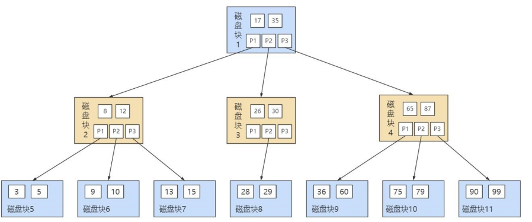

# Mysql 高级篇

# 索引

## 前提基本知识

1. **Mysql存储是以页为单位的**
   - InnoDB存储引擎，默认的页大小是**16KB**。这意味着InnoDB存储引擎在一次I/O操作中可以读取或写入16KB的数据。
   - MyISAM存储引擎，默认的页大小是**1KB**。这意味着MyISAM存储引擎在一次I/O操作中可以读取或写入1KB的数据。

## 1. 什么是索引？

- 索引是一种数据结构，用于提高查询效率。
- 索引可以按照**升序**或**降序**排列存储的数据，这样可以加快查询的速度。(Hash索引无序，B和B+树索引有序)

例子：
索引就像是书的目录，可以快速找到对应的内容。不需要逐项的去查找，提高了查找的效率。

## 2. 索引的优缺点？

1. 优点
   - 提高数据检索效率，降低数据IO成本：因为索引有序排列存储数据，通过类二分查找可以降低数据IO成本。
   - 保证数据唯一性：通过创建唯一索引可以保证数据为唯一性(主键默认创建)。
   - 加速表和表之间的连接：通过创建外键字段索引。
   - 加快排序和分组操作：通过创建经常用于排序和分组的字段索引。
2. 缺点
   - 占用存储空间：索引需要占用额外的存储空间，特别是对于大型表来说，索引可能会占用大量的存储空间。
   - 增加写操作的时间：当对表进行插入、更新和删除操作时，索引也需要进行相应的更新，这会增加写操作的时间。
   - 维护成本高：随着数据的增加和变化，索引需要不断地进行维护和优化，这会增加数据库的维护成本。

## 3. InnoDB中索引的存储方案？B+Tree

**基本结构：**

**注意：**一般不会超过三层，降低IO，三层能存储的数据页接近亿级别。

**每一列的结构：**

- record_type: 

  记录头信息的一项属性，表示记录的类型，0表示普通记录、2表示最小记录、3表示最大记录、1目录项记录。

-  next_record：
  记录头信息的一项属性，表示下一条地址相对于本条记录的地址偏移量，我们用箭头来表明下一条记录是谁。

- c1，c2，c3：表示每个column属性。

**这种索引存储的数量计算**
如果每个叶子节点存放100条记录，每个香炉记录能存放1000条目录记录
三层能存放的数据：100 * 1000 * 1000 = 1000,0000,0000(一亿)

## 4. InnoDB中常见的索引类型？

1. **聚簇索引**
   表的数据是按照主键顺序进行物理存储，主键索引实际上就是聚簇索引。
   注意事项：

   - InnoDB默认会以主键创建聚簇索引。

   - B+树的`叶子节点`存储的是完整的用户记录：所谓完整的用户记录，就是指这个记录中存储了所有列的值(完整行)。

   - 优点：

     1. `数据访问更快`，因为聚簇索引将索引和数据保存在同一个B+树中，因此从聚簇索引中获取数据比非聚簇索引更快(非聚簇索引会先找到主键，然后**回表**到聚簇索引中查找其它值)
     2. 聚簇索引对于主键的`排序查找`和`范围查找`速度非常快
     3. 按照聚簇索引排列顺序，查询显示一定范围数据的时候，由于数据都是紧密相连，数据库不用从多个数据块中提取数据，所以`节省了大量的io操作`。

   - 缺点：

     1. 插入性能弱
        	由于聚簇索引会按照索引的顺序进行物理存储，当插入新数据时，如果插入位置不在索引的末尾，可能需要进行数据的移动和重排序，这会影响插入性能。

     2. 更新性能弱
             当更新聚簇索引列的值时，如果更新后的值改变了索引的顺序，可能需要进行数据的移动和重排序，这会影响更新性能。

     3. 索引大小比较大
               由于聚簇索引存储了整个行的数据，因此索引的大小会比较大。这会占用更多的存储空间，对于内存有限的系统可能会影响性能。

     4. 索引碎片

        ​	由于插入和更新操作可能导致数据的移动和重排序，聚簇索引容易产生索引碎片。索引碎片会增加磁盘I/O操作的次数，降低查询性能。

2. **二级索引(非聚簇索引)**

   

   

   假设按照c2(非主键)顺序进行物理存储，B+树的叶子节点只有 **c2, c1(主键)**。如果此时查询c1和主键之外的数据分为以下两步骤：
   ① 根据c1顺序的索引查询到主键值
   ② 根据主键回表到聚簇索引中去查询需要的列值。

   为什么二级索引不直接存储当前行的所有列值呢？
   节省空间，如果表的数据量比较大那么会占用很大空间。

3.  **联合索引**

   我们也可以同时以多个列的大小作为排序规则，也就是同时为多个列建立索引，比方说我们想让B+树按照`c2和c3列`的大小进行排序，这个包含两层含义：

   - 先把各个记录和页按照c2列进行排序。

   - 在记录的c2列相同的情况下，采用c3列进行排序

## 5. MyIsam中索引的存储方案？B+Tree

不同于InnoDB里面的B+Tree，MyIsam存储引擎B+Tree叶子节点存储的是**索引列值， 和地址**

**注意：**
InnoDB里面没有聚簇索引，即全都是二级索引(普通索引)

## 6. MyISAM 和 InnoDB 对比

**MyISAM**的索引方式都是**非聚簇**的，与InnoDB包含**1个聚簇索引**是不同的。小结两种引擎中索引的区别：

① 在InnoDB存储引擎中，我们只需要根据主键值对聚簇索引进行一次查找就能找到对应的记录，而在

MyISAM中却需要进行一次回表操作，意味着MyISAM中建立的索引相当于全部都是二级索引。

② InnoDB的数据文件本身就是索引文件，而MyISAM索引文件和数据文件是分离的，索引文件仅保存数据记录的地址。

③ InnoDB的非聚簇索引data域存储相应记录主键的值，而MyISAM索引记录的是地址。换句话说，

InnoDB的所有非聚簇索引都引用主键作为data域。

④ MyISAM的回表操作是十分快速的，因为是拿着地址偏移量直接到文件中取数据的，反观InnoDB是通过获取主键之后再去聚簇索引里找记录，虽然说也不慢，但还是比不上直接用地址去访问。

⑤ InnoDB要求表必须有主键（MyISAM可以没有）。如果没有显式指定，则MySQL系统会自动选择一个可以非空且唯一标识数据记录的列作为主键。如果不存在这种列，则MySQL自动为InnoDB表生成一个隐含字段作为主键，这个字段长度为6个字节，类型为长整型。

## 7. 除了B+Tree还有其它的数据结构么？

1. Hash索引：Hash索引使用哈希表来存储索引，通过哈希函数将索引列的值映射到哈希表中的位置。Hash索引适用于等值查找，查找速度非常快，但**不支持范围查询**和**排序操作**。

   - hash数据被散列到不同的存储桶中(通过hash函数计算出数据项所在的位置)，不能保证连续性。所以范围查找比较慢
   - 同时hash数据不保证顺序性所以范围查找时候需要额外操作进行排序。

   这是因为在哈希索引中，数据项被散列到不同的存储桶中，这样可以通过哈希函数直接计算出数据项所在的位置，从而实现快速的等值查找。但是，由于哈希函数是将数据映射到不同的存储桶，所以对于范围查询来说，并不容易找到连续的数据项，因此效率较低。

   另外，哈希索引不保证数据的顺序性，因此在进行排序操作时，需要额外的操作来对数据进行排序，这也会导致性能下降。

2. BTree

   B树的结构如下：
   

   **特点：**

   - 目录项也存储数据
   - **自平衡性：** 在插入或删除操作后，B树会自动进行平衡，以保持树的高度较小，从而维持搜索的效率。
   - **多路搜索：** 每个节点可以拥有多个子节点，这使得B树能够存储更多的数据项，并且在搜索时，可以在每个节点上进行更多的比较，减少搜索路径的长度。
   - **节点存储：** B树中的每个节点通常存储有序的键值对，并且键值对之间按照键的大小进行排序。

   **优点：**

   - **高效的范围查询和排序操作：** B树具有多路搜索的特性，使得它在范围查询和排序操作方面非常高效，能够快速定位到指定范围内的数据项。
   - **适应大型数据集：** 由于B树的节点可以存储多个键值对，并且树的高度相对较小，因此它非常适合存储大型数据集，能够有效地管理大量数据。
   - **平衡性：** B树在插入和删除操作后会自动进行平衡，保持树的平衡状态，从而保持检索效率。
   - **适用于随机访问：** 由于B树具有平衡性，因此在进行随机访问时，平均情况下的时间复杂度为O(log n)，使得它非常适合于高效的随机访问场景。

   **缺点：**

   - **复杂性：** B树的实现相对复杂，需要处理节点的分裂和合并操作，以及平衡树的过程，因此实现起来可能比较困难。
   - **不适合小型数据集：** 对于小型数据集，B树可能会因为节点的开销而变得不太划算，因为B树的节点通常比较大，而且树的高度相对较小。
   - **不适合频繁的插入和删除操作：** 虽然B树具有自平衡性，但是频繁的插入和删除操作可能会导致频繁的节点分裂和合并，从而影响性能。

3. B+Tree

   **B+树是B树的一种变体，通过优化叶子节点的结构和连接方式，使得它更适合范围查询和顺序访问操作，具有更好的性能特点。**
   B+树结构如下：
   

   **优点：**

   - **范围查询和顺序访问效率高：** B+树的叶子节点通过指针连接成链表，使得范围查询和顺序访问操作非常高效，可以快速定位到指定范围内的数据记录，并且支持顺序遍历。
   - **高效的数据检索：** B+树的节点通常较大，可以存储更多的键值对，同时树的高度相对较小，使得数据检索效率很高，尤其适合大型数据集的管理。
   - **平衡性和自调整性：** B+树具有平衡性，插入和删除操作后会自动进行平衡，保持树的平衡状态，从而保持检索效率。它能够自动调整节点大小，适应数据量的变化。
   - **适应磁盘存储：** B+树的叶子节点之间通过指针连接成链表，有利于磁盘存储，可以减少磁盘IO的次数，提高存取效率。
   - **简化非叶子节点的操作（只有叶子节点存储数据）：** 由于B+树的非叶子节点只存储键值，不存储数据记录，使得非叶子节点的操作更加简化，提高了性能。

   **缺点：**

   - **复杂性：** B+树的实现相对复杂，需要处理叶子节点之间的连接、节点的分裂和合并等操作，因此实现起来可能比较困难。
   - **插入和删除操作的代价较高：** 虽然B+树具有自平衡性，但频繁的插入和删除操作可能会导致频繁的节点分裂和合并，从而影响性能。
   - **不适合随机访问：** 虽然B+树适合范围查询和顺序访问，但在随机访问场景下，其性能可能不如其他数据结构，如哈希表。

4. R树（R-tree）：R树是一种多维索引结构，常用于地理空间数据的存储和查询。R树能够高效地支持范围查询和空间查询操作。